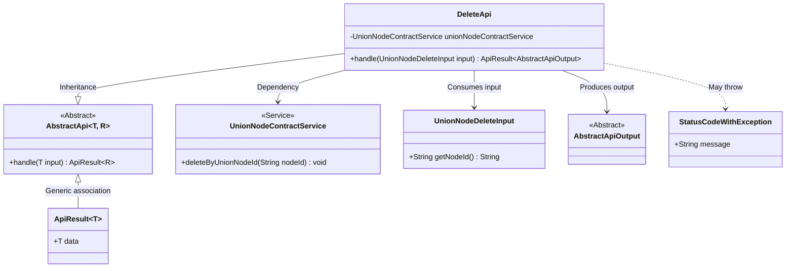
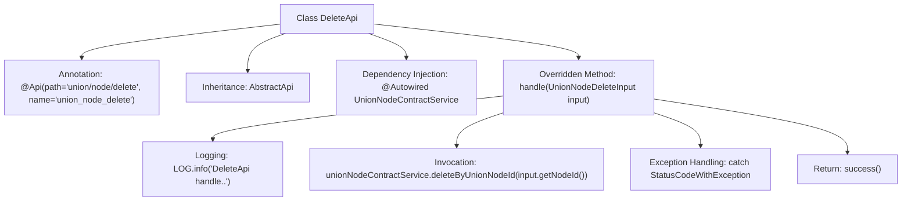

# Basic Information

|      |      |
|------|------|
| Name | DeleteApi |
| Language | .java |
| Code Path | WeFe/manager/manager-service/src/main/java/com/welab/wefe/manager/service/api/union/DeleteApi.java |
| Package Name | com.welab.wefe.manager.service.api.union |
| Dependencies | ['com.welab.wefe.common.StatusCode', 'com.welab.wefe.common.exception.StatusCodeWithException', 'com.welab.wefe.common.web.api.base.AbstractApi', 'com.welab.wefe.common.web.api.base.Api', 'com.welab.wefe.common.web.dto.AbstractApiOutput', 'com.welab.wefe.common.web.dto.ApiResult', 'com.welab.wefe.manager.service.dto.union.UnionNodeDeleteInput', 'com.welab.wefe.manager.service.service.UnionNodeContractService', 'org.springframework.beans.factory.annotation.Autowired'] |
| Brief Description | This is an API class for deleting union nodes, with the path `union/node/delete`. It deletes data for the specified node ID by invoking the `deleteByUnionNodeId` method of `unionNodeContractService`, handles exceptions, and returns a successful result. |

# Description

This is a Java class named DeleteApi, designed to handle API requests for deleting union nodes. The class extends AbstractApi, accepts UnionNodeDeleteInput as an input parameter, and returns a result of type AbstractApiOutput. It injects the UnionNodeContractService, which implements the node deletion functionality by calling its deleteByUnionNodeId method. The process logs operations and catches potential StatusCodeWithException exceptions, converting them into system error codes before rethrowing. Upon successful execution, it returns a success response.

# Class Summary

| Name   | Type  | Description |
|-------|------|-------------|
| DeleteApi | class | Delete API class, path is union/node/delete, handles node deletion requests, calls UnionNodeContractService to delete the specified node, catches exceptions and returns system error status codes. |

## Class DeleteApi

|      |      |
|------|------|
| Access Modifier | @Api(path = "union/node/delete", name = "union_node_delete");public |
| Type | class |
| Name | DeleteApi |
| Description | Delete API class, path is union/node/delete, handles node deletion requests, calls UnionNodeContractService to delete the specified node, catches exceptions and returns system error status codes. |

### UML Class Diagram

This code demonstrates the implementation class DeleteApi for a deletion API, which inherits from the generic abstract class AbstractApi, processes UnionNodeDeleteInput-type inputs, and returns AbstractApiOutput-type results. The class diagram clearly illustrates inheritance relationships, service dependencies, and exception handling mechanisms, where UnionNodeContractService provides core deletion functionality and StatusCodeWithException encapsulates system errors. The entire structure reflects a typical API layer implementation pattern in Spring Boot, reducing repetitive code through generic abstract classes while maintaining type safety.

### Internal Method Call Graph

This code represents a Spring framework-based API class for handling node deletion requests. The flowchart illustrates the class structure, dependency injection, core method call chain, and exception handling flow. The main logic involves deleting data with the specified node ID through UnionNodeContractService, encapsulating exception handling and successful response return logic. The annotation defines the API path and name, while the inherited generic class standardizes input/output types.

### Field List

| Name  | Type  | Description |
|-------|-------|------|
| unionNodeContractService | UnionNodeContractService | Automatically inject the UnionNodeContractService service instance. |

### Method List

| Name  | Type  | Description |
|-------|-------|------|
| handle | ApiResult<AbstractApiOutput> | This method handles the deletion request for a federated node by invoking the service to remove the specified node ID, catching exceptions, and returning either a system error or a successful result. |

