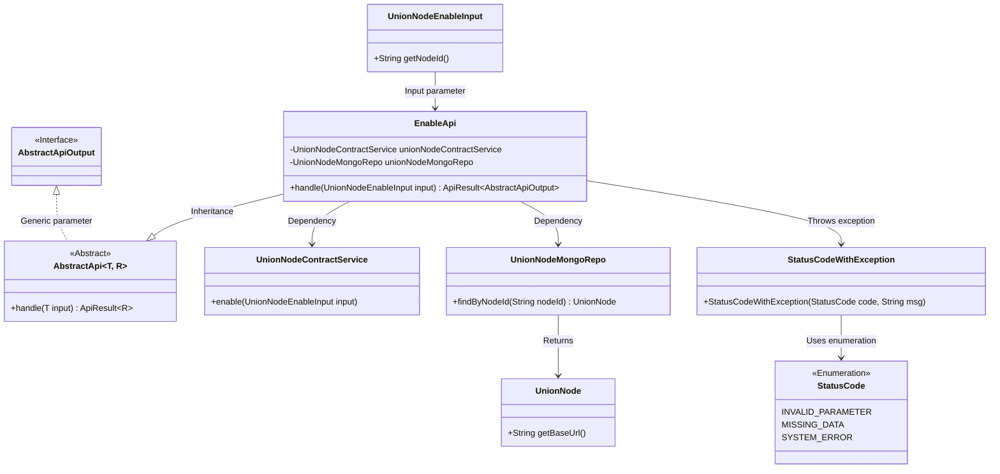
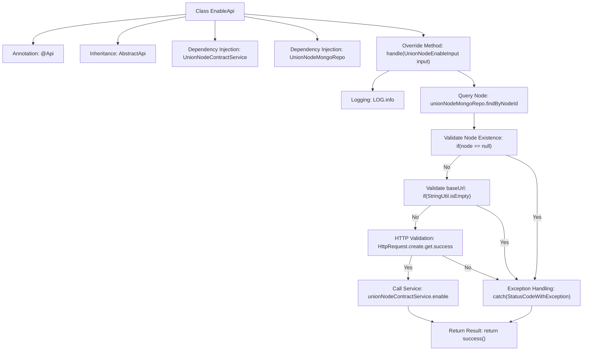

# Basic Information

|      |      |
|------|------|
| Name | EnableApi |
| Language | .java |
| Code Path | WeFe/manager/manager-service/src/main/java/com/welab/wefe/manager/service/api/union/EnableApi.java |
| Package Name | com.welab.wefe.manager.service.api.union |
| Dependencies | ['com.welab.wefe.common.StatusCode', 'com.welab.wefe.common.data.mongodb.entity.union.UnionNode', 'com.welab.wefe.common.data.mongodb.repo.UnionNodeMongoRepo', 'com.welab.wefe.common.exception.StatusCodeWithException', 'com.welab.wefe.common.http.HttpRequest', 'com.welab.wefe.common.util.StringUtil', 'com.welab.wefe.common.web.api.base.AbstractApi', 'com.welab.wefe.common.web.api.base.Api', 'com.welab.wefe.common.web.dto.AbstractApiOutput', 'com.welab.wefe.common.web.dto.ApiResult', 'com.welab.wefe.manager.service.dto.union.UnionNodeEnableInput', 'com.welab.wefe.manager.service.service.UnionNodeContractService', 'org.springframework.beans.factory.annotation.Autowired'] |
| Brief Description | EnableApi processes node activation requests, checks node existence and baseUrl validity, and invokes the service to activate the node. Returns error status codes in case of exceptions. |

# Description

The `EnableApi` class is an API that handles node enable requests, with the path `union/node/enable`. It inherits from `AbstractApi`, accepts `UnionNodeEnableInput` as input, and returns `AbstractApiOutput`. The class injects the services `UnionNodeContractService` and `UnionNodeMongoRepo`. The `handle` method first retrieves the node from MongoDB using `nodeId`. If the node does not exist or its `baseUrl` is empty, an exception is thrown. It then validates the `baseUrl`; if invalid, an exception is thrown. Finally, it calls the `unionNodeContractService.enable` method to enable the node. Any exceptions caught during processing are converted into system errors and returned.

# Class Summary

| Name   | Type  | Description |
|-------|------|-------------|
| EnableApi | class | The EnableApi class handles node activation requests, validates the node ID and baseUrl, invokes the service to activate the node, captures exceptions, and returns the result. |

## Class EnableApi

|      |      |
|------|------|
| Access Modifier | @Api(path = "union/node/enable", name = "union_node_enable");public |
| Type | class |
| Name | EnableApi |
| Description | The EnableApi class handles node activation requests, validates the node ID and baseUrl, invokes the service to activate the node, captures exceptions, and returns the result. |

### UML Class Diagram

This class diagram illustrates the structure and relationships of EnableApi. EnableApi inherits from the generic abstract class AbstractApi, processes UnionNodeEnableInput input, and returns ApiResult~AbstractApiOutput~. It depends on UnionNodeContractService and UnionNodeMongoRepo for business operations, with MongoRepo returning the UnionNode entity. The process may throw a StatusCodeWithException, which uses the StatusCode enumeration to indicate error types. Overall, it implements the business logic for node activation, including key steps such as parameter validation, data verification, and remote invocation.

### Internal Method Call Graph

This flowchart describes the processing flow of the EnableApi class, starting from receiving input parameters, querying node information via MongoDB, sequentially validating node existence, baseUrl validity, and HTTP accessibility. Any validation failure will throw an exception. After all validations pass, it calls the contract service to enable the node and finally returns a success result. The flow includes complete exception handling paths and main success paths, embodying defensive programming principles.

### Field List

| Name  | Type  | Description |
|-------|-------|------|
| unionNodeMongoRepo | UnionNodeMongoRepo | Using @Autowired to automatically inject the UnionNodeMongoRepo instance. |
| unionNodeContractService | UnionNodeContractService | Automatically inject the UnionNodeContractService service instance. |

### Method List

| Name  | Type  | Description |
|-------|-------|------|
| handle | ApiResult<AbstractApiOutput> | Processing alliance node activation requests, verifying the validity of node ID and base URL, invoking the service to activate the node, capturing exceptions, and returning the result. |

