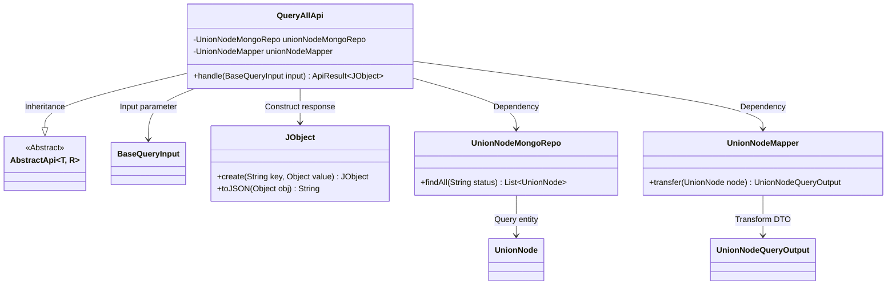
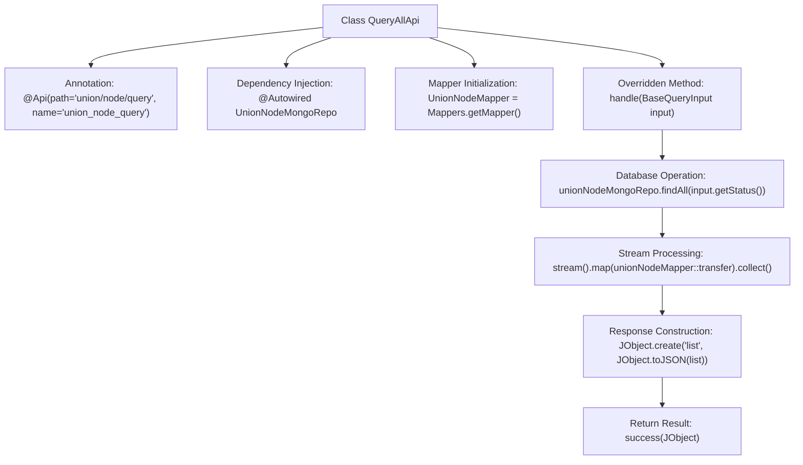

# Basic Information

|      |      |
|------|------|
| Name | QueryAllApi |
| Language | .java |
| Code Path | WeFe/manager/manager-service/src/main/java/com/welab/wefe/manager/service/api/union/QueryAllApi.java |
| Package Name | com.welab.wefe.manager.service.api.union |
| Dependencies | ['com.welab.wefe.common.data.mongodb.repo.UnionNodeMongoRepo', 'com.welab.wefe.common.util.JObject', 'com.welab.wefe.common.web.api.base.AbstractApi', 'com.welab.wefe.common.web.api.base.Api', 'com.welab.wefe.common.web.dto.ApiResult', 'com.welab.wefe.manager.service.dto.base.BaseQueryInput', 'com.welab.wefe.manager.service.dto.union.UnionNodeQueryOutput', 'com.welab.wefe.manager.service.mapper.UnionNodeMapper', 'org.mapstruct.factory.Mappers', 'org.springframework.beans.factory.annotation.Autowired', 'java.util.List', 'java.util.stream.Collectors'] |
| Brief Description | Defined a query API class QueryAllApi, which retrieves data through the MongoDB repository unionNodeMongoRepo, converts it using Mapper, and returns the result in JSON format. The path is union/node/query. |

# Description

This is a Java class named QueryAllApi, which extends AbstractApi and is used to handle API requests with the path union/node/query. The class injects UnionNodeMongoRepo for database operations and utilizes UnionNodeMapper for object conversion. Its primary function is to query UnionNode data of a specified status via the findAll method, convert it into a list of UnionNodeQueryOutput objects, and then encapsulate the result into JSON format for return. The input parameter is BaseQueryInput, and the output is ApiResult<JObject> containing the list data.

# Class Summary

| Name   | Type  | Description |
|-------|------|-------------|
| QueryAllApi | class | Query API class, path is union/node/query, inherits AbstractApi, uses MongoDB to query UnionNode data, returns JSON list after converting results via Mapper. |

## Class QueryAllApi

|      |      |
|------|------|
| Access Modifier | @Api(path = "union/node/query", name = "union_node_query");public |
| Type | class |
| Name | QueryAllApi |
| Description | Query API class, path is union/node/query, inherits AbstractApi, uses MongoDB to query UnionNode data, returns JSON list after converting results via Mapper. |

### UML Class Diagram

This code implements a query API that inherits from the generic abstract class AbstractApi. It retrieves data through a MongoDB repository, converts it to an output object using Mapper, and finally packages it into JSON format for response. The class diagram illustrates core dependencies including data access layer, object mapping layer, and input/output types, reflecting a layered architecture and dependency injection design pattern. QueryAllApi serves as the entry class, coordinating components to complete the full workflow of query-conversion-response.

### Internal Method Call Graph

This code represents a Spring-style API class inheriting from AbstractApi, designed to handle union node query requests. The main workflow includes: querying node data with specified status via MongoDB repository, transforming entities into DTO objects using MapStruct mapper, and finally encapsulating the result list into JSON format for response. The annotation defines the API path and name, the dependency-injected MongoRepo handles data access, stream processing performs data transformation, and the standardized response structure is ultimately built through JObject.

### Field List

| Name  | Type  | Description |
|-------|-------|------|
| unionNodeMapper = Mappers.getMapper(UnionNodeMapper.class) | UnionNodeMapper | Declare a protected UnionNodeMapper instance, initialized via the Mappers.getMapper method. |
| unionNodeMongoRepo | UnionNodeMongoRepo | Using @Autowired to automatically inject the UnionNodeMongoRepo dependency. |

### Method List

| Name  | Type  | Description |
|-------|-------|------|
| handle | ApiResult<JObject> | Process the query request, retrieve UnionNode data with the specified status from MongoDB, convert it to JSON format, and return the successful result. |

