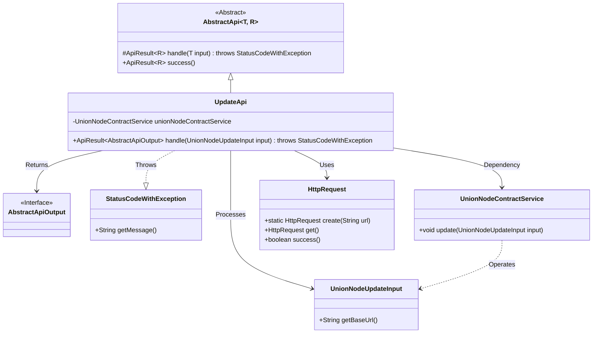
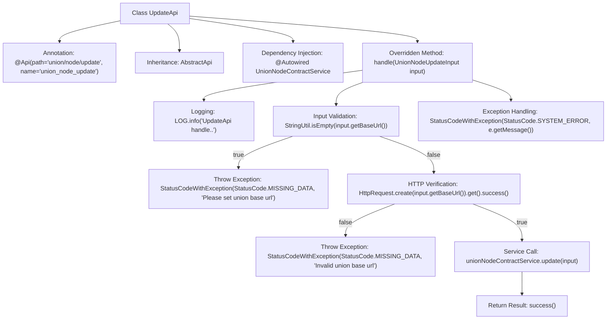

# Basic Information

|      |      |
|------|------|
| Name | UpdateApi |
| Language | .java |
| Code Path | WeFe/manager/manager-service/src/main/java/com/welab/wefe/manager/service/api/union/UpdateApi.java |
| Package Name | com.welab.wefe.manager.service.api.union |
| Dependencies | ['com.welab.wefe.common.StatusCode', 'com.welab.wefe.common.exception.StatusCodeWithException', 'com.welab.wefe.common.http.HttpRequest', 'com.welab.wefe.common.util.StringUtil', 'com.welab.wefe.common.web.api.base.AbstractApi', 'com.welab.wefe.common.web.api.base.Api', 'com.welab.wefe.common.web.dto.AbstractApiOutput', 'com.welab.wefe.common.web.dto.ApiResult', 'com.welab.wefe.manager.service.dto.union.UnionNodeUpdateInput', 'com.welab.wefe.manager.service.service.UnionNodeContractService', 'org.springframework.beans.factory.annotation.Autowired'] |
| Brief Description | The UpdateApi processes node update requests, verifies the validity of the baseUrl, and then calls the service to update the data, returning a system error in case of exceptions. |

# Description

This is a Java class named UpdateApi, designed to handle node update requests. It extends the AbstractApi class, with generic parameters specifying the input type UnionNodeUpdateInput and the output type AbstractApiOutput. The class is annotated with API path and name. The main logic resides in the handle method: first, it checks whether the input parameter baseUrl is null, throwing an exception if it is; then, it validates the baseUrl's effectiveness, throwing an exception if invalid; finally, it invokes the update method of unionNodeContractService to complete the update operation. Exceptions are caught and rethrown as system errors during the process. Upon success, it returns a successful result. The class injects the UnionNodeContractService service.

# Class Summary

| Name   | Type  | Description |
|-------|------|-------------|
| UpdateApi | class | This is an API class for updating union nodes, with the path `union/node/update`. It accepts `UnionNodeUpdateInput` as input and invokes `UnionNodeContractService` to perform the update operation. It validates whether the input `baseUrl` is empty and valid, handles exceptions, and returns the result. |

## Class UpdateApi

|      |      |
|------|------|
| Access Modifier | @Api(path = "union/node/update", name = "union_node_update");public |
| Type | class |
| Name | UpdateApi |
| Description | This is an API class for updating union nodes, with the path `union/node/update`. It accepts `UnionNodeUpdateInput` as input and invokes `UnionNodeContractService` to perform the update operation. It validates whether the input `baseUrl` is empty and valid, handles exceptions, and returns the result. |

### UML Class Diagram

This class diagram illustrates that UpdateApi inherits from the generic AbstractApi class, processes UnionNodeUpdateInput, and returns AbstractApiOutput. UpdateApi relies on UnionNodeContractService for business operations, utilizes HttpRequest to validate URL validity, and may throw StatusCodeWithException. The components are organized through clear dependency relationships, demonstrating a complete workflow of input validation, business processing, and exception handling.

### Internal Method Call Graph

This flowchart illustrates the core processing logic of the UpdateApi class. It begins with defining the API path via annotation, inheriting from an abstract base class, and injecting service dependencies. The main flow starts with the handle method, sequentially performing logging, input validation, HTTP service availability verification, and finally invoking the contract update service. Exception handling runs throughout the process, covering scenarios like null validation failure and HTTP verification failure, ultimately returning a standardized response format.

### Field List

| Name  | Type  | Description |
|-------|-------|------|
| unionNodeContractService | UnionNodeContractService | Automatically inject the UnionNodeContractService service instance. |

### Method List

| Name  | Type  | Description |
|-------|-------|------|
| handle | ApiResult<AbstractApiOutput> | Process the UnionNode update request, validate the baseUrl's effectiveness, then invoke the service to update the data, returning error messages in case of exceptions. |

