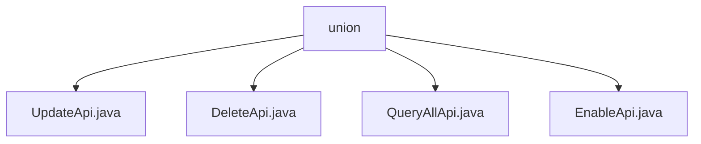

# Basic Information

|      |      |
|------|------|
| Name | union |
| Language | .java |
| Code Path | WeFe/manager/manager-service/src/main/java/com/welab/wefe/manager/service/api/union |
| Package Name | docs.manager.manager-service.src.main.java.com.welab.wefe.manager.service.api.union |
| Brief Description | The UpdateApi class handles node updates, calling the update method after validating the baseUrl. The DeleteApi class handles node deletion by invoking the deleteByUnionNodeId method. The QueryAllApi class queries node data and returns a list. The EnableApi class manages node enabling, calling the enable method after validation. |

# Description

## Overview  
The core responsibility of this module is to manage the lifecycle operations of federated nodes, including updating, deleting, querying, and enabling nodes, similar to a node management center. The interface specifications uniformly inherit from AbstractApi, with inputs and outputs using specific DTOs (e.g., UnionNodeUpdateInput/AbstractApiOutput). Key data structures include UnionNode (a MongoDB entity) and its transformed object UnionNodeQueryOutput. External dependencies include UnionNodeContractService (blockchain contract operations) and UnionNodeMongoRepo (data persistence). For example, UpdateApi validates the baseUrl before invoking the contract service, while QueryAllApi retrieves the node list via MongoRepo.

## Key Business Scenarios  
The module supports full lifecycle management of nodes: updating node information (UpdateApi), deleting nodes (DeleteApi), querying node lists (QueryAllApi), and enabling nodes (EnableApi). The interaction mode follows RESTful conventions, with underlying operations performed through injected services. A typical application is the consortium member management scenario, where node status must be queried before executing enable operations. API types cover CRUD operations, such as DeleteApi removing a node by nodeId, and EnableApi validating baseUrl effectiveness before invoking the contract service.

### Package Internal Structure View

This flowchart illustrates four API files under the union directory: UpdateApi, DeleteApi, QueryAllApi, and EnableApi. These files are directly subordinate to the union directory with no deeper nesting, presenting a simple single-layer file structure suitable for managing the implementation of joint operation interfaces in service management.

# File List

| Name   | Type  | Description |
|-------|------|-------------|
| [UpdateApi.java](UpdateApi.md) | file | The UpdateApi processes node update requests, verifies the validity of the baseUrl, and then calls the service to update the data, returning a system error in case of exceptions. |
| [DeleteApi.java](DeleteApi.md) | file | This is an API class for deleting union nodes, with the path `union/node/delete`. It invokes the `deleteByUnionNodeId` method of `unionNodeContractService` to remove data for the specified node ID, handles exceptions, and returns a success result. |
| [QueryAllApi.java](QueryAllApi.md) | file | Defined a query API class QueryAllApi, which retrieves data through the MongoDB repository unionNodeMongoRepo, converts it using Mapper, and returns the result in JSON format. The path is union/node/query. |
| [EnableApi.java](EnableApi.md) | file | EnableApi processes node activation requests, checks node existence and baseUrl validity, and invokes the service to activate the node. Returns error status codes in case of exceptions. |

