# Basic Information

|      |      |
|------|------|
| Name | BlockChainConfig |
| Language | .java |
| Code Path | WeFe/manager/manager-service/src/main/java/com/welab/wefe/manager/service/config/BlockChainConfig.java |
| Package Name | com.welab.wefe.manager.service.config |
| Dependencies | ['com.welab.wefe.common.StatusCode', 'com.welab.wefe.common.exception.StatusCodeWithException', 'com.welab.wefe.common.wefe.enums.ContractName', 'com.welab.wefe.manager.service.contract', 'io.netty.channel.ChannelHandlerContext', 'org.apache.commons.collections4.CollectionUtils', 'org.fisco.bcos.sdk.BcosSDK', 'org.fisco.bcos.sdk.client.Client', 'org.fisco.bcos.sdk.config.ConfigOption', 'org.fisco.bcos.sdk.config.model.ConfigProperty', 'org.fisco.bcos.sdk.contract.precompiled.cns.CnsInfo', 'org.fisco.bcos.sdk.contract.precompiled.cns.CnsService', 'org.fisco.bcos.sdk.crypto.CryptoSuite', 'org.fisco.bcos.sdk.crypto.keypair.CryptoKeyPair', 'org.fisco.bcos.sdk.model.Message', 'org.fisco.bcos.sdk.model.NodeVersion.ClientVersion', 'org.fisco.bcos.sdk.network.MsgHandler', 'org.slf4j.Logger', 'org.slf4j.LoggerFactory', 'org.springframework.boot.context.properties.ConfigurationProperties', 'org.springframework.context.annotation.Bean', 'org.springframework.context.annotation.Configuration', 'java.util.ArrayList', 'java.util.HashMap', 'java.util.List', 'java.util.Map'] |
| Brief Description | The BlockChainConfig class configures the blockchain SDK, including parameters such as certificate paths, thread pools, and node connections, and initializes multiple smart contract instances. |

# Description

The code defines a configuration class named `BlockChainConfig`, which is used to initialize blockchain-related configurations. The class includes attributes such as certificate paths, group IDs, thread pool parameters, IP addresses, and channel ports. Multiple beans are created via the `@Bean` annotation, including instances of `BcosSDK`, clients, cryptographic suites, key pairs, and several contract services. The inner class `BcosSDKChannelMsg` handles connection and disconnection events. The `getLatestContractAddressByName` method retrieves the latest contract address based on the contract name. The class provides getter and setter methods for each attribute, supporting property injection from configuration files. Overall, it implements the initialization of the blockchain SDK and the loading functionality of multiple contract services.

# Class Summary

| Name   | Type  | Description |
|-------|------|-------------|
| BlockChainConfig | class | The BlockChainConfig class configures the blockchain SDK, including parameters such as certificate paths, thread pools, and network nodes, and initializes various contract instances through multiple Bean methods. |

## Class BlockChainConfig

|      |      |
|------|------|
| Access Modifier | @Configuration;@ConfigurationProperties(prefix = "block.chain");public |
| Type | class |
| Name | BlockChainConfig |
| Description | The BlockChainConfig class configures the blockchain SDK, including parameters such as certificate paths, thread pools, and network nodes, and initializes various contract instances through multiple Bean methods. |

### UML Class Diagram

```mermaid
classDiagram
    class BlockChainConfig {
        -String certPath
        -int groupId
        -String corePoolSize
        -String maxPoolSize
        -String queueCapacity
        -String ip
        -String channelPort
        +boolean PEER_CONNECTED
        +String getCertPath()
        +void setCertPath(String certPath)
        +int getGroupId()
        +void setGroupId(int groupId)
        +String getCorePoolSize()
        +void setCorePoolSize(String corePoolSize)
        +String getMaxPoolSize()
        +void setMaxPoolSize(String maxPoolSize)
        +String getQueueCapacity()
        +void setQueueCapacity(String queueCapacity)
        +String getIp()
        +void setIp(String ip)
        +String getChannelPort()
        +void setChannelPort(String channelPort)
        +BcosSDK getBcosSDK() throws Exception
        +Client getClient(BcosSDK bcosSDK)
        +CryptoSuite getCryptoSuite(Client client)
        +CryptoKeyPair getCryptoKeyPair(CryptoSuite cryptoSuite)
        +CnsService getCnsService(Client client, CryptoKeyPair cryptoKeyPair)
        +String getCurrentBlockchainNodeId(Client client)
        +MemberContract getLatestVersionMemberContract(CnsService cnsService, Client client, CryptoKeyPair cryptoKeyPair) throws StatusCodeWithException
        +DataSetContract getLatestVersionDataSetContract(CnsService cnsService, Client client, CryptoKeyPair cryptoKeyPair) throws StatusCodeWithException
        +DataSetMemberPermissionContract getLatestVersionDataSetMemberPermissionContract(CnsService cnsService, Client client, CryptoKeyPair cryptoKeyPair) throws StatusCodeWithException
        +DataSetDefaultTagContract getLatestVersionDataSetDefaultTagContract(CnsService cnsService, Client client, CryptoKeyPair cryptoKeyPair) throws StatusCodeWithException
        +MemberAuthTypeContract getLatestVersionMemberAuthTypeContract(CnsService cnsService, Client client, CryptoKeyPair cryptoKeyPair) throws StatusCodeWithException
        +UnionNodeContract getLatestVersionUnionNodeContract(CnsService cnsService, Client client, CryptoKeyPair cryptoKeyPair) throws StatusCodeWithException
        +RealnameAuthAgreementTemplateContract getLatestVersionRealnameAuthAgreementTemplateContract(CnsService cnsService, Client client, CryptoKeyPair cryptoKeyPair) throws StatusCodeWithException
        +DataResourceContract getLatestVersionDataResourceContract(CnsService cnsService, Client client, CryptoKeyPair cryptoKeyPair) throws StatusCodeWithException
        +DataResourceDefaultTagContract getLatestVersionDataResourceDefaultTagContract(CnsService cnsService, Client client, CryptoKeyPair cryptoKeyPair) throws StatusCodeWithException
        +TrustCertsContract getLatestVersionTrustCertsContract(CnsService cnsService, Client client, CryptoKeyPair cryptoKeyPair) throws StatusCodeWithException
        +String getLatestContractAddressByName(CnsService cnsService, String contractName) throws StatusCodeWithException
    }

    class BcosSDKChannelMsg {
        <<MsgHandler>>
        +void onConnect(ChannelHandlerContext ctx)
        +void onMessage(ChannelHandlerContext ctx, Message msg)
        +void onDisconnect(ChannelHandlerContext ctx)
    }

    BlockChainConfig --> BcosSDKChannelMsg : contains
    BlockChainConfig --> ConfigProperty : creates
    BlockChainConfig --> ConfigOption : creates
    BlockChainConfig --> BcosSDK : creates
    BlockChainConfig --> Client : creates
    BlockChainConfig --> CryptoSuite : creates
    BlockChainConfig --> CryptoKeyPair : creates
    BlockChainConfig --> CnsService : creates
    BlockChainConfig --> MemberContract : creates
    BlockChainConfig --> DataSetContract : creates
    BlockChainConfig --> DataSetMemberPermissionContract : creates
    BlockChainConfig --> DataSetDefaultTagContract : creates
    BlockChainConfig --> MemberAuthTypeContract : creates
    BlockChainConfig --> UnionNodeContract : creates
    BlockChainConfig --> RealnameAuthAgreementTemplateContract : creates
    BlockChainConfig --> DataResourceContract : creates
    BlockChainConfig --> DataResourceDefaultTagContract : creates
    BlockChainConfig --> TrustCertsContract : creates
```

Class diagram description: BlockChainConfig is a configuration class used to initialize various blockchain-related services and contracts. It contains multiple private attributes for configuring blockchain connection parameters, as well as public methods for creating and obtaining blockchain service instances (such as BcosSDK, Client, CryptoSuite, etc.) and various smart contracts (such as MemberContract, DataSetContract, etc.). The inner class BcosSDKChannelMsg implements the MsgHandler interface for handling network connection events. This class relies on multiple external classes to achieve complete blockchain functionality.

### Internal Method Call Graph

```mermaid
graph TD
    A["Class BlockChainConfig"]
    B["Static Inner Class: BcosSDKChannelMsg"]
    C["Property: String certPath"]
    D["Property: int groupId"]
    E["Property: String corePoolSize"]
    F["Property: String maxPoolSize"]
    G["Property: String queueCapacity"]
    H["Property: String ip"]
    I["Property: String channelPort"]
    J["Static Property: boolean PEER_CONNECTED"]
    K["Method: getBcosSDK()"]
    L["Method: getClient(BcosSDK)"]
    M["Method: getCryptoSuite(Client)"]
    N["Method: getCryptoKeyPair(CryptoSuite)"]
    O["Method: getCnsService(Client, CryptoKeyPair)"]
    P["Method: getCurrentBlockchainNodeId(Client)"]
    Q["Method: getLatestContractAddressByName(CnsService, String)"]
    R["Method: Various getLatestVersion...Contract()"]
    S["Getter/Setter Methods"]

    A --> B
    A --> C
    A --> D
    A --> E
    A --> F
    A --> G
    A --> H
    A --> I
    A --> J
    A --> K
    A --> L
    A --> M
    A --> N
    A --> O
    A --> P
    A --> Q
    A --> R
    A --> S

    B --> B1["onConnect(ChannelHandlerContext)"]
    B --> B2["onMessage(ChannelHandlerContext, Message)"]
    B --> B3["onDisconnect(ChannelHandlerContext)"]

    K --> K1["Initialize cryptoMaterial"]
    K --> K2["Initialize network"]
    K --> K3["Initialize threadPool"]
    K --> K4["Create ConfigProperty"]
    K --> K5["Create ConfigOption"]
    K --> K6["Create BcosSDK instance"]
    K --> K7["Get Client version"]
    K --> K8["Add connect/disconnect handlers"]

    Q --> Q1["Query CNS list"]
    Q --> Q2["Handle exceptions"]
    Q --> Q3["Return latest contract address"]
```

This code represents a blockchain configuration class with key functionalities: 1) Loading blockchain parameters via @ConfigurationProperties; 2) Providing initialization logic for BcosSDK core components; 3) Implementing various smart contract loading features; 4) Containing an inner message handler for connection state management. The flowchart illustrates the class structure, property relationships, and method call chains, particularly highlighting the BcosSDK initialization process and contract loading dependencies. All smart contract loading methods rely on the core method getLatestContractAddressByName.

### Field List

| Name  | Type  | Description |
|-------|-------|------|
| queueCapacity | String | The private string variable queueCapacity is used to represent the queue capacity. |
| corePoolSize | String | Declare a private string variable corePoolSize. |
| PEER_CONNECTED = true | boolean | The static boolean variable PEER_CONNECTED, with a value of true, indicates that the peer connection has been established. |
| channelPort = "20200" | String | The private string variable channelPort is initialized to "20200". |
| ip = "127.0.0.1" | String | Define a private string variable ip with an initial value of the local loopback address 127.0.0.1. |
| groupId | int | The private integer variable groupId is used to identify the group. |
| certPath = "conf" | String | The code defines a public string variable certPath with an initial value of "conf". |
| maxPoolSize | String | Declare a private string variable maxPoolSize. |
| log =            LoggerFactory.getLogger(BlockChainConfig.class) | Logger | Define a private static logger instance for the BlockChainConfig class, created using LoggerFactory. |

### Method List

| Name  | Type  | Description |
|-------|-------|------|
| getCertPath | String | The method returns the certificate path string. |
| setIp | void | This is a Java method used to set the ip property value of a class. The method takes a string parameter ip and assigns it to the member variable ip of the class. |
| getChannelPort | String | Public method to obtain the channelPort value. |
| getLatestVersionDataSetContract | DataSetContract | This method retrieves the latest data set contract address via the CNS service and loads the contract instance using the client and key pair. |
| getLatestVersionUnionNodeContract | UnionNodeContract | Create a Bean method to fetch the latest UnionNode contract address via the CNS service and load the contract instance. |
| setGroupId | void | This is a Java method used to set the groupId property value of a class. The method takes an integer parameter groupId and assigns it to the class's member variable of the same name. |
| getLatestVersionDataResourceContract | DataResourceContract | The method retrieves the latest version of the data resource contract address via the CNS service and loads the contract instance using the client and key pair. |
| getLatestContractAddressByName | String | Retrieve the latest address for the specified contract name. Throws an exception and logs an error if the query fails or the result is empty. |
| setChannelPort | void | The method for setting the channel port assigns the input parameter to the class member variable channelPort. |
| getLatestVersionMemberAuthTypeContract | MemberAuthTypeContract | This method retrieves the latest version of the MemberAuthType contract address via the CNS service and loads the contract instance. It requires passing the CNS service, client, and key pair parameters, and may throw exceptions. |
| getCryptoKeyPair | CryptoKeyPair | This method obtains and returns a CryptoKeyPair instance through CryptoSuite. |
| getCorePoolSize | String | Methods to obtain the core thread count of a thread pool, returning a string-type value `corePoolSize`. |
| setCertPath | void | The method to set the certificate path assigns the input parameter certPath to the class member variable certPath. |
| setMaxPoolSize | void | The method to set the maximum connection pool size, with the parameter of string type maxPoolSize. |
| getCnsService | CnsService | Create a CnsService instance, which depends on the Client and CryptoKeyPair parameters. |
| getClient | Client | A Java method retrieves and returns the client instance of a specified group via BcosSDK. |
| getLatestVersionTrustCertsContract | TrustCertsContract | This method retrieves the latest TrustCerts contract address via the CNS service and loads the contract instance. It requires passing the CNS service, client, and key pair parameters, and may throw exceptions. |
| getGroupId | int | The method returns the value of the integer variable groupId. |
| getLatestVersionDataSetDefaultTagContract | DataSetDefaultTagContract | This method retrieves the latest dataset default label contract address via the CNS service and loads the contract instance using the client and key pair. |
| getCryptoSuite | CryptoSuite | This is a Spring Bean method that returns an instance of the client-configured encryption suite. |
| getLatestVersionDataResourceDefaultTagContract | DataResourceDefaultTagContract | Define a Bean method to load the latest version of the data resource default label contract, requiring CnsService, Client, and CryptoKeyPair parameters, and returning the contract instance. |
| getCurrentBlockchainNodeId | String | Get the first ID of the client blockchain node. The method returns the node ID string. |
| getMaxPoolSize | String | Methods to obtain the maximum thread pool size. |
| getLatestVersionRealnameAuthAgreementTemplateContract | RealnameAuthAgreementTemplateContract | This method retrieves the latest version of the real-name authentication protocol template contract address via the CNS service, loads the contract instance, and returns it. It requires passing in the CNS service, client, and key pair parameters, and may throw exceptions. |
| setCorePoolSize | void | Method to set the core thread count of the thread pool, with the parameter being of string type. |
| getQueueCapacity | String | Methods for obtaining queue capacity, returning the queue capacity value as a string type. |
| getLatestVersionMemberContract | MemberContract | This method retrieves the latest version of the MemberContract address via the CNS service and loads the contract instance. It requires passing the CNS service, client, and key pair parameters, and may throw exceptions. |
| getLatestVersionDataSetMemberPermissionContract | DataSetMemberPermissionContract | The code defines a Bean method for loading the latest version of the dataset member permission contract. The method retrieves the contract address via the CNS service and loads the contract instance using the client and key pair. |
| getBcosSDK | BcosSDK | Initialize a BcosSDK instance, configure cryptographic materials, network nodes, and thread pool parameters, create a ConfigOption and set up the connection handler, then return the SDK instance. |
| setQueueCapacity | void | The method for setting the queue capacity assigns the input parameter `queueCapacity` to the property of the same name in the current object. |
| getIp | String | The method returns an IP value of string type. |

