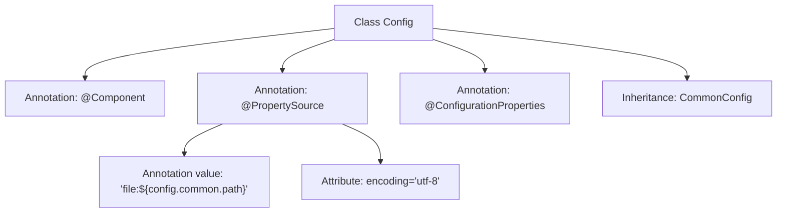

# Basic Information

|      |      |
|------|------|
| Name | Config |
| Language | .java |
| Code Path | WeFe/manager/manager-service/src/main/java/com/welab/wefe/manager/service/config/Config.java |
| Package Name | com.welab.wefe.manager.service.config |
| Dependencies | ['com.welab.wefe.common.web.config.CommonConfig', 'org.springframework.beans.factory.annotation.Value', 'org.springframework.boot.context.properties.ConfigurationProperties', 'org.springframework.context.annotation.PropertySource', 'org.springframework.stereotype.Component'] |
| Brief Description | Java configuration class, extending CommonConfig, loading external UTF-8 encoded configuration files. |

# Description

The content describes a Java class named Config, which is marked as a Spring component via the @Component annotation and inherits from the CommonConfig class. The @PropertySource annotation specifies the path to an external configuration file, dynamically obtained through ${config.common.path}, with UTF-8 encoding. The @ConfigurationProperties annotation indicates that this class is used to bind external configuration properties. The overall design is intended for centralized management of application configurations, supporting the loading of property files from specified locations.

# Class Summary

| Name   | Type  | Description |
|-------|------|-------------|
| Config | class | Spring component, loading external UTF-8 encoded configuration files, inheriting common configuration classes. |


## Class Config

|      |      |
|------|------|
| Access Modifier | @Component;@PropertySource(value = {"file:${config.common.path}"}, encoding = "utf-8");@ConfigurationProperties;public |
| Type | class |
| Name | Config |
| Description | Spring component, loading external UTF-8 encoded configuration files, inheriting common configuration classes. |


### UML Class Diagram

```mermaid
classDiagram
    class CommonConfig {
        <<abstract>>
    }
    
    class Config {
        +Config()
    }
    
    Config --|> CommonConfig : Inheritance
    Config ..> "@Component" : Annotation
    Config ..> "@PropertySource" : Annotation
    Config ..> "@ConfigurationProperties" : Annotation
```

This class diagram illustrates the inheritance relationship of a Spring Boot configuration class. The Config class inherits from the abstract base class CommonConfig, and is marked as a Spring component via the @Component annotation. The @PropertySource annotation specifies the path to external configuration files (supporting dynamic placeholders and encoding), while @ConfigurationProperties enables configuration property binding. This design achieves hierarchical reuse of configuration information, where the base class can define common configuration items, and subclasses integrate with the Spring environment through annotations.


### Internal Method Call Graph



This flowchart illustrates the structure of the Config class, which is a Spring component that loads external configuration files via the @PropertySource annotation and inherits from the CommonConfig base class. @PropertySource specifies the file path and encoding format, while @ConfigurationProperties is used to bind configuration properties. The overall design reflects Spring Boot's configuration management mechanism, achieving hierarchical configuration through inheritance while maintaining unified UTF-8 encoding handling capabilities.

### Field List

| Name  | Type  | Description |
|-------|-------|------|

### Method List

| Name  | Type  | Description |
|-------|-------|------|


