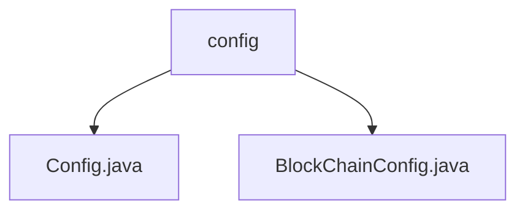

# Basic Information

|      |      |
|------|------|
| Name | config |
| Language | .java |
| Code Path | WeFe/manager/manager-service/src/main/java/com/welab/wefe/manager/service/config |
| Package Name | docs.manager.manager-service.src.main.java.com.welab.wefe.manager.service.config |
| Brief Description | The Config class is a Spring component that inherits from CommonConfig, loads external configuration files with UTF-8 encoding, and manages application configurations. The BlockChainConfig class initializes blockchain configurations, including attributes such as certificate paths and group IDs, creates BcosSDK instances and contract services, and supports configuration injection. |

# Description

## Overview  
The core responsibility of this module is centralized management of application configurations, including general configurations and blockchain-specific configurations. It leverages the Spring component mechanism to achieve configuration loading and binding, supporting dynamic path resolution and UTF-8 encoded file reading.  

The interface specifications include dynamic configuration loading via `@PropertySource`, property binding via `@ConfigurationProperties`, and initialization of blockchain SDK components via `@Bean` methods. Key data structures encompass blockchain configuration items such as certificate paths, group IDs, and thread pool parameters, resembling connection pool management in microservices.  

External dependencies include the Spring framework and the BcosSDK blockchain development kit. For example, the `Config` class inherits from the `CommonConfig` base class, while `BlockChainConfig` handles connection events via `BcosSDKChannelMsg`.  

## Primary Business Scenarios  
This module is suitable for applications requiring centralized management of multi-environment configurations, particularly systems involving blockchain interactions. Typical workflows include loading external configuration files, initializing SDK connection pools, and deploying smart contract services. For instance, `BlockChainConfig` dynamically retrieves contract addresses via `getLatestContractAddressByName`.  

The interaction model adopts a "configuration as a service" philosophy, similar to an event bus pattern, where components are auto-assembled through property injection. Full functionality ranges from basic property binding to complex blockchain network initialization, such as creating cryptographic suites and key pairs for security components. API types include configuration loading classes and runtime Bean factories as integration points.

### Package Internal Structure View

This flowchart illustrates the configuration module structure in the manager-service project. The root node is the config folder, which contains two configuration files: Config.java serves as the base configuration class, while BlockChainConfig.java specifically handles blockchain-related configurations. This hierarchical relationship clearly demonstrates the code organization of the configuration module, adhering to typical Java project directory conventions.

# File List

| Name   | Type  | Description |
|-------|------|-------------|
| [Config.java](Config.md) | file | Java configuration class, extending CommonConfig, loading external configuration files with UTF-8 encoding. |
| [BlockChainConfig.java](BlockChainConfig.md) | file | The BlockChainConfig class configures the blockchain SDK, including parameters such as certificate paths, thread pools, and node connections, and initializes multiple smart contract instances. |

