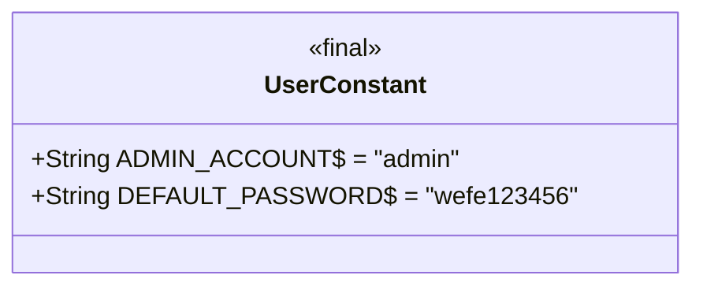
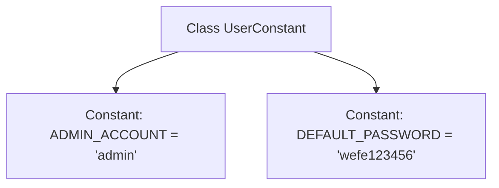

# Basic Information

|      |      |
|------|------|
| Name | UserConstant |
| Language | .java |
| Code Path | WeFe/manager/manager-service/src/main/java/com/welab/wefe/manager/service/constant/UserConstant.java |
| Package Name | com.welab.wefe.manager.service.constant |
| Dependencies | [] |
| Brief Description | The user constants class contains static constants for administrator accounts and default passwords. |

# Description

The UserConstant class defines two public static constant string fields. The ADMIN_ACCOUNT field has a value of "admin", representing the administrator account name. The DEFAULT_PASSWORD field has a value of "wefe123456", denoting the default password setting. These two constants are used to uniformly manage user-related fixed values within the system.

# Class Summary

| Name   | Type  | Description |
|-------|------|-------------|
| UserConstant | class | The user constant class defines the administrator account as "admin" with a default password of "wefe123456". |

## Class UserConstant

|      |      |
|------|------|
| Access Modifier | public |
| Type | class |
| Name | UserConstant |
| Description | The user constant class defines the administrator account as "admin" with a default password of "wefe123456". |

### UML Class Diagram

This code defines a `UserConstant` class containing two static constant fields: `ADMIN_ACCOUNT` and `DEFAULT_PASSWORD`, representing the administrator account name and default password respectively. The class has no instance methods or constructors, serving solely as a constant container. The `final` modifier ensures the fields are immutable, and all members are public static properties accessible directly via the class name. This design is commonly used for centralized management of global configuration parameters or fixed business values.

### Internal Method Call Graph

This code defines a class named UserConstant, which contains two static constant fields: ADMIN_ACCOUNT representing the administrator account name with the value "admin", and DEFAULT_PASSWORD representing the default password with the value "wefe123456". The purpose of this class is to centrally manage user-related constant values, facilitating unified reference and maintenance within the project. Since all fields are public static final, these constants can be directly accessed via the class name in other classes and are immutable.

### Field List

| Name  | Type  | Description |
|-------|-------|------|
| DEFAULT_PASSWORD = "wefe123456" | String | The default password is set to "wefe123456". |
| ADMIN_ACCOUNT = "admin" | String | Defined a public static constant string ADMIN_ACCOUNT with the value "admin". |

### Method List

| Name  | Type  | Description |
|-------|-------|------|

