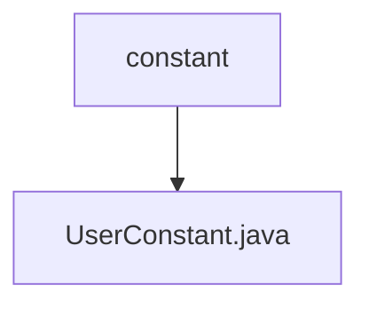

# Basic Information

|      |      |
|------|------|
| Name | constant |
| Language | .java |
| Code Path | WeFe/manager/manager-service/src/main/java/com/welab/wefe/manager/service/constant |
| Package Name | docs.manager.manager-service.src.main.java.com.welab.wefe.manager.service.constant |
| Brief Description | The user constants class contains static constants for administrator accounts and default passwords. |

# Description

The UserConstant class defines two public static constant string fields. The ADMIN_ACCOUNT field has a value of "admin", representing the administrator account name. The DEFAULT_PASSWORD field has a value of "wefe123456", representing the default password setting. These two constants are used to uniformly manage user-related fixed values in the system.

### Package Internal Structure View

This flowchart illustrates the constant package structure within the manager-service module of the WeFe project. The top-level node is the constant directory, which contains a specific constant class file, UserConstant.java, as its subordinate. This structure adheres to the standard Java project directory layout, where constant classes are centrally stored for unified management, reflecting modular design principles. The entire structure is concise and clear, consisting of only 2 nodes, accurately representing the given 2 path relationships.

# File List

| Name   | Type  | Description |
|-------|------|-------------|
| [UserConstant.java](UserConstant.md) | file | The user constants class contains static constants for administrator accounts and default passwords. |

