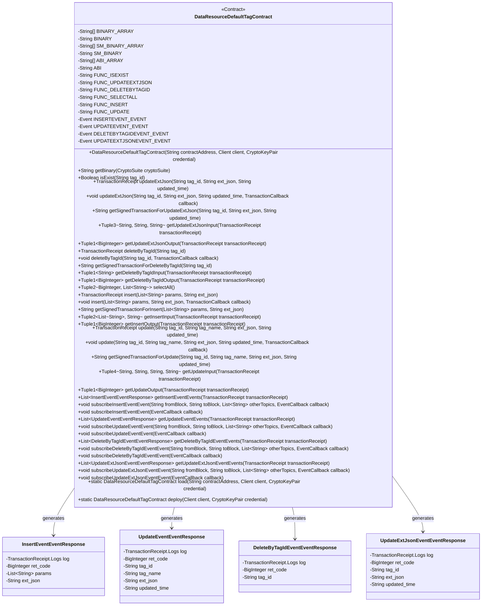
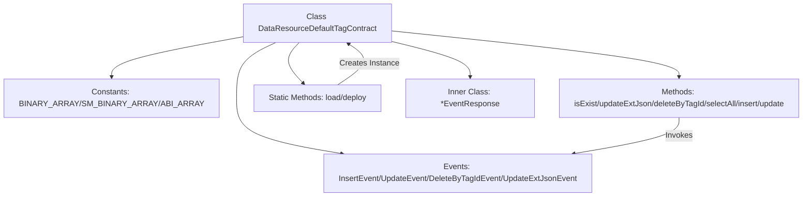
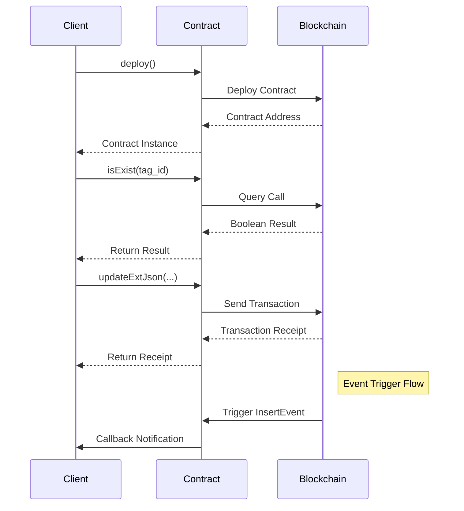

# Basic Information

|      |      |
|------|------|
| Name | DataResourceDefaultTagContract |
| Language | .java |
| Code Path | WeFe/manager/manager-service/src/main/java/com/welab/wefe/manager/service/contract/DataResourceDefaultTagContract.java |
| Package Name | com.welab.wefe.manager.service.contract |
| Dependencies | ['java.math.BigInteger', 'java.util.ArrayList', 'java.util.Arrays', 'java.util.Collections', 'java.util.List', 'org.fisco.bcos.sdk.abi.FunctionReturnDecoder', 'org.fisco.bcos.sdk.abi.TypeReference', 'org.fisco.bcos.sdk.abi.datatypes.Bool', 'org.fisco.bcos.sdk.abi.datatypes.DynamicArray', 'org.fisco.bcos.sdk.abi.datatypes.Event', 'org.fisco.bcos.sdk.abi.datatypes.Function', 'org.fisco.bcos.sdk.abi.datatypes.Type', 'org.fisco.bcos.sdk.abi.datatypes.Utf8String', 'org.fisco.bcos.sdk.abi.datatypes.generated.Int256', 'org.fisco.bcos.sdk.abi.datatypes.generated.tuples.generated.Tuple1', 'org.fisco.bcos.sdk.abi.datatypes.generated.tuples.generated.Tuple2', 'org.fisco.bcos.sdk.abi.datatypes.generated.tuples.generated.Tuple3', 'org.fisco.bcos.sdk.abi.datatypes.generated.tuples.generated.Tuple4', 'org.fisco.bcos.sdk.client.Client', 'org.fisco.bcos.sdk.contract.Contract', 'org.fisco.bcos.sdk.crypto.CryptoSuite', 'org.fisco.bcos.sdk.crypto.keypair.CryptoKeyPair', 'org.fisco.bcos.sdk.eventsub.EventCallback', 'org.fisco.bcos.sdk.model.CryptoType', 'org.fisco.bcos.sdk.model.TransactionReceipt', 'org.fisco.bcos.sdk.model.callback.TransactionCallback', 'org.fisco.bcos.sdk.transaction.model.exception.ContractException'] |
| Brief Description | The `DataResourceDefaultTagContract` is a smart contract class that provides management functionalities for default tags of data resources, including operations such as addition, deletion, modification, and query. Its main features include: checking whether a tag exists, updating the tag's extended JSON, deleting a tag, querying all tags, inserting a new tag, etc. The contract supports event listening, such as callbacks for events like insertion, update, and deletion. It is suitable for scenarios requiring management of data resource tags. |

# Description

This is a Java wrapper class named `DataResourceDefaultTagContract` for a smart contract, primarily designed to interact with its blockchain counterpart of the same name. Below is a comprehensive summary of the class:

1. **Basic Information**  
- Inherits from the base class `org.fisco.bcos.sdk.contract.Contract`  
- Includes the contract's binary code (both standard and SM national cryptographic versions) and ABI interface definition  
- Defines 6 contract functions and 4 events  

2. **Core Functionality**  
- Provides contract deployment method `deploy()` and loading method `load()`  
- Encapsulates all callable contract functions:  
   * `isExist()` - Checks whether a tag exists  
   * `updateExtJson()` - Updates extended JSON  
   * `deleteByTagId()` - Deletes a tag  
   * `selectAll()` - Queries all tags  
   * `insert()` - Inserts a new tag  
   * `update()` - Updates a tag  

3. **Event Handling**  
- Defines 4 event response classes:  
   * `InsertEventEventResponse` - Insert event  
   * `UpdateEventEventResponse` - Update event  
   * `DeleteByTagIdEventEventResponse` - Delete event  
   * `UpdateExtJsonEventEventResponse` - Update JSON event  
- Provides event subscription methods `subscribeXxxEvent()`  

4. **Auxiliary Features**  
- Supports synchronous/asynchronous transaction execution  
- Provides transaction input/output parsing methods  
- Supports generating signed transaction data  

5. **Technical Characteristics**  
- Uses FISCO BCOS Java SDK  
- Supports both national cryptographic and non-national cryptographic algorithms  
- Employs type-safe parameter encapsulation  
- Offers a complete event listening mechanism  

This class provides Java applications with a type-safe, user-friendly interface to interact with the `DataResourceDefaultTag` contract on the blockchain, encapsulating all underlying details and allowing developers to focus on business logic implementation.

# Class Summary

| Name   | Type  | Description |
|-------|------|-------------|
| DataResourceDefaultTagContract | class | This is a Java smart contract class designed for managing default tags of data resources. Its main functionalities include:1. Checking if a tag exists (isExist)  2. Updating the extended JSON of a tag (updateExtJson)  3. Deleting a tag (deleteByTagId)  4. Querying all tags (selectAll)  5. Inserting a new tag (insert)  6. Updating tag information (update)  The contract includes 4 events:  - insertEvent: Tag insertion event  - updateEvent: Tag update event  - deleteByTagIdEvent: Tag deletion event  - updateExtJsonEvent: Extended JSON update event  It supports both ECDSA and SM2 encryption algorithms, provides synchronous and asynchronous transaction execution methods, and includes event subscription functionality. |

## Class DataResourceDefaultTagContract

|      |      |
|------|------|
| Access Modifier | @SuppressWarnings("unchecked");public |
| Type | class |
| Name | DataResourceDefaultTagContract |
| Description | This is a Java smart contract class designed for managing default tags of data resources. Its main functionalities include:1. Checking if a tag exists (isExist)  2. Updating the extended JSON of a tag (updateExtJson)  3. Deleting a tag (deleteByTagId)  4. Querying all tags (selectAll)  5. Inserting a new tag (insert)  6. Updating tag information (update)  The contract includes 4 events:  - insertEvent: Tag insertion event  - updateEvent: Tag update event  - deleteByTagIdEvent: Tag deletion event  - updateExtJsonEvent: Extended JSON update event  It supports both ECDSA and SM2 encryption algorithms, provides synchronous and asynchronous transaction execution methods, and includes event subscription functionality. |

### UML Class Diagram

### Internal Method Call Graph

This code represents a complete Java wrapper class for a smart contract, primarily designed to interact with the DataResourceDefaultTag contract on the blockchain. The flowchart illustrates the class structure, including constant definitions, contract methods, event handling, and static factory methods. The sequence diagram demonstrates typical contract deployment, query, and update operation flows, along with the event listening mechanism. The contract provides CRUD operations for tag data (Create, Read, Update, Delete) and notifies callers of operation results through an event mechanism.

### Field List

| Name  | Type  | Description |
|-------|-------|------|
| FUNC_DELETEBYTAGID = "deleteByTagId" | String | Static constant FUNC_DELETEBYTAGID with the value "deleteByTagId". |
| FUNC_ISEXIST = "isExist" | String | Static constant string FUNC_ISEXIST with the value "isExist". |
| FUNC_INSERT = "insert" | String | This is a Java static constant named FUNC_INSERT, with the value "insert", representing the functional identifier for an insert operation. |
| SM_BINARY_ARRAY = {"60806040523480156200001157600080fd5b506110016000806101000a81548173ffffffffffffffffffffffffffffffffffffffff021916908373ffffffffffffffffffffffffffffffffffffffff1602179055506000809054906101000a900473ffffffffffffffffffffffffffffffffffffffff1673ffffffffffffffffffffffffffffffffffffffff1663c92a78016040805190810160405280601981526020017f646174615f7265736f757263655f64656661756c745f746167000000000000008152506040518263ffffffff167c010000000000000000000000000000000000000000000000000000000002815260040162000101919062000296565b602060405180830381600087803b1580156200011c57600080fd5b505af115801562000131573d6000803e3d6000fd5b505050506040513d601f19601f8201168201806040525062000157919081019062000174565b5062000340565b60006200016c8251620002ef565b905092915050565b6000602082840312156200018757600080fd5b600062000197848285016200015e565b91505092915050565b6000620001ad82620002e4565b808452620001c3816020860160208601620002f9565b620001ce816200032f565b602085010191505092915050565b6000604582527f7461675f69642c7461675f6e616d652c646174615f7265736f757263655f747960208301527f70652c637265617465645f74696d652c757064617465645f74696d652c65787460408301527f5f6a736f6e0000000000000000000000000000000000000000000000000000006060830152608082019050919050565b6000600682527f6669785f696400000000000000000000000000000000000000000000000000006020830152604082019050919050565b60006060820190508181036000830152620002b28184620001a0565b90508181036020830152620002c7816200025f565b90508181036040830152620002dc81620001dc565b905092915050565b600081519050919050565b6000819050919050565b60005b8381101562000319578082015181840152602081019050620002fc565b8381111562000329576000848401525b50505050565b6000601f19601f8301169050919050565b613a4b80620003506000396000f300608060405260043610610078576000357c0100000000000000000000000000000000000000000000000000000000900463ffffffff16806315d0d6251461007d578063568fe885146100ba5780639eb03ade146100f7578063abfe57f414610134578063ac7c89a914610171578063c181ca36146101ae575b600080fd5b34801561008957600080fd5b506100a4600480360361009f9190810190612f03565b6101da565b6040516100b1919061330f565b60405180910390f35b3480156100c657600080fd5b506100e160048036036100dc9190810190612e81565b610794565b6040516100ee91906132f4565b60405180910390f35b34801561010357600080fd5b5061011e60048036036101199190810190612d48565b610b58565b60405161012b919061330f565b60405180910390f35b34801561014057600080fd5b5061015b60048036036101569190810190612e81565b611349565b604051610168919061330f565b60405180910390f35b34801561017d57600080fd5b5061019860048036036101939190810190612f9a565b611748565b6040516101a5919061330f565b60405180910390f35b3480156101ba57600080fd5b506101c3611d8e565b6040516101d192919061332a565b60405180910390f35b600080600080600080600094506101f089610794565b151561025e577ffffffffffffffffffffffffffffffffffffffffffffffffffffffffffffffffd94507fb36a4960db7128c065f905021bc6b7ab38c8106c359c6ac8dcd55ed9356c994c858a8a8a60405161024e94939291906133cf565b60405180910390a1849550610788565b6000809054906101000a900473ffffffffffffffffffffffffffffffffffffffff1673ffffffffffffffffffffffffffffffffffffffff166359a48b656040805190810160405280601981526020017f646174615f7265736f757263655f64656661756c745f746167000000000000008152506040518263ffffffff167c01000000000000000000000000000000000000000000000000000000000281526004016103099190613498565b602060405180830381600087803b15801561032357600080fd5b505af1158015610337573d6000803e3d6000fd5b505050506040513d601f19601f8201168201806040525061035b9190810190612e2f565b93508373ffffffffffffffffffffffffffffffffffffffff1663c74f8caf6040518163ffffffff167c0100000000000000000000000000000000000000000000000000000000028152600401602060405180830381600087803b1580156103c157600080fd5b505af11580156103d5573d6000803e3d6000fd5b505050506040513d601f19601f820116820180604052506103f99190810190612db4565b92508273ffffffffffffffffffffffffffffffffffffffff1663ae763db58a6040518263ffffffff167c0100000000000000000000000000000000000000000000000000000000028152600401610450919061376b565b600060405180830381600087803b15801561046a57600080fd5b505af115801561047e573d6000803e3d6000fd5b505050508373ffffffffffffffffffffffffffffffffffffffff16635887ab246040518163ffffffff167c0100000000000000000000000000000000000000000000000000000000028152600401602060405180830381600087803b1580156104e657600080fd5b505af11580156104fa573d6000803e3d6000fd5b505050506040513d601f19601f8201168201806040525061051e9190810190612e06565b91508173ffffffffffffffffffffffffffffffffffffffff16631a391cb4896040518263ffffffff167c010000000000000000000000000000000000000000000000000000000002815260040161057591906137f5565b600060405180830381600087803b15801561058f57600080fd5b505af11580156105a3573d6000803e3d6000fd5b505050508173ffffffffffffffffffffffffffffffffffffffff16631a391cb4886040518263ffffffff167c01000000000000000000000000000000000000000000000000000000000281526004016105fc91906135ad565b600060405180830381600087803b15801561061657600080fd5b505af115801561062a573d6000803e3d6000fd5b505050508373ffffffffffffffffffffffffffffffffffffffff1663664b37d66040805190810160405280601981526020017f646174615f7265736f757263655f64656661756c745f7461670000000000000081525084866040518463ffffffff167c01000000000000000000000000000000000000000000000000000000000281526004016106bc9392919061351a565b602060405180830381600087803b1580156106d657600080fd5b505af11580156106ea573d6000803e3d6000fd5b505050506040513d601f19601f8201168201806040525061070e9190810190612e58565b90506001811215156107235760009450610747565b7ffffffffffffffffffffffffffffffffffffffffffffffffffffffffffffffffe94505b7fb36a4960db7128c065f905021bc6b7ab38c8106c359c6ac8dcd55ed9356c994c858a8a8a60405161077c94939291906133cf565b60405180910390a18495505b50505050509392505050565b6000806000806000809054906101000a900473ffffffffffffffffffffffffffffffffffffffff1673ffffffffffffffffffffffffffffffffffffffff166359a48b656040805190810160405280601981526020017f646174615f7265736f757263655f64656661756c745f746167000000000000008152506040518263ffffffff167c01000000000000000000000000000000000000000000000000000000000281526004016108459190613498565b602060405180830381600087803b15801561085f57600080fd5b505af1158015610873573d6000803e3d6000fd5b505050506040513d601f19601f820116820180604052506108979190810190612e2f565b92508273ffffffffffffffffffffffffffffffffffffffff1663c74f8caf6040518163ffffffff167c0100000000000000000000000000000000000000000000000000000000028152600401602060405180830381600087803b1580156108fd57600080fd5b505af1158015610911573d6000803e3d6000fd5b505050506040513d601f19601f820116820180604052506109359190810190612db4565b91508173ffffffffffffffffffffffffffffffffffffffff1663ae763db5866040518263ffffffff167c010000000000000000000000000000000000000000000000000000000002815260040161098c919061376b565b600060405180830381600087803b1580156109a657600080fd5b505af11580156109ba573d6000803e3d6000fd5b505050508273ffffffffffffffffffffffffffffffffffffffff1663d8ac59576040805190810160405280601981526020017f646174615f7265736f757263655f64656661756c745f74616700000000000000815250846040518363ffffffff167c0100000000000000000000000000000000000000000000000000000000028152600401610a4a9291906134ba565b602060405180830381600087803b158015610a6457600080fd5b505af1158015610a78573d6000803e3d6000fd5b505050506040513d601f19601f82011682018060405250610a9c9190810190612ddd565b905060008173ffffffffffffffffffffffffffffffffffffffff1663d3e9af5a6040518163ffffffff167c0100000000000000000000000000000000000000000000000000000000028152600401602060405180830381600087803b158015610b0457600080fd5b505af1158015610b18573d6000803e3d6000fd5b505050506040513d601f19601f82011682018060405250610b3c9190810190612e58565b1115610b4b5760019350610b50565b600093505b505050919050565b6000806000806000809350610b84876000815181101515610b7557fe5b90602001906020020151610794565b15610bef577fffffffffffffffffffffffffffffffffffffffffffffffffffffffffffffffff93507fcb263a23d186eec891d55f1e0ba96ec8290af8c893d32d644c22dbff0953e51f848888604051610bdf9392919061335a565b60405180910390a183945061133f565b6000809054906101000a900473ffffffffffffffffffffffffffffffffffffffff1673ffffffffffffffffffffffffffffffffffffffff166359a48b656040805190810160405280601981526020017f646174615f7265736f757263655f64656661756c745f746167000000000000008152506040518263ffffffff167c0100000000000000000000000000000000000000000000000000000000028152600401610c9a9190613498565b602060405180830381600087803b158015610cb457","600080fd5b505af1158015610cc8573d6000803e3d6000fd5b505050506040513d601f19601f82011682018060405250610cec9190810190612e2f565b92508273ffffffffffffffffffffffffffffffffffffffff16635887ab246040518163ffffffff167c0100000000000000000000000000000000000000000000000000000000028152600401602060405180830381600087803b158015610d5257600080fd5b505af1158015610d66573d6000803e3d6000fd5b505050506040513d601f19601f82011682018060405250610d8a9190810190612e06565b91508173ffffffffffffffffffffffffffffffffffffffff16631a391cb46040805190810160405280601981526020017f646174615f7265736f757263655f64656661756c745f746167000000000000008152506040518263ffffffff167c0100000000000000000000000000000000000000000000000000000000028152600401610e1691906137a0565b600060405180830381600087803b158015610e3057600080fd5b505af1158015610e44573d6000803e3d6000fd5b505050508173ffffffffffffffffffffffffffffffffffffffff16631a391cb4886000815181101515610e7357fe5b906020019060200201516040518263ffffffff167c0100000000000000000000000000000000000000000000000000000000028152600401610eb59190613736565b600060405180830381600087803b158015610ecf57600080fd5b505af1158015610ee3573d6000803e3d6000fd5b505050508173ffffffffffffffffffffffffffffffffffffffff16631a391cb4886001815181101515610f1257fe5b906020019060200201516040518263ffffffff167c0100000000000000000000000000000000000000000000000000000000028152600401610f549190613602565b600060405180830381600087803b158015610f6e57600080fd5b505af1158015610f82573d6000803e3d6000fd5b505050508173ffffffffffffffffffffffffffffffffffffffff16631a391cb4886002815181101515610fb157fe5b906020019060200201516040518263ffffffff167c0100000000000000000000000000000000000000000000000000000000028152600401610ff391906136e1565b600060405180830381600087803b15801561100d57600080fd5b505af1158015611021573d6000803e3d6000fd5b505050508173ffffffffffffffffffffffffffffffffffffffff16631a391cb488600381518110151561105057fe5b906020019060200201516040518263ffffffff167c0100000000000000000000000000000000000000000000000000000000028152600401611092919061368c565b600060405180830381600087803b1580156110ac57600080fd5b505af11580156110c0573d6000803e3d6000fd5b505050508173ffffffffffffffffffffffffffffffffffffffff16631a391cb48860048151811015156110ef57fe5b906020019060200201516040518263ffffffff167c01000000000000000000000000000000000000000000000000000000000281526004016111319190613578565b600060405180830381600087803b15801561114b57600080fd5b505af115801561115f573d6000803e3d6000fd5b505050508173ffffffffffffffffffffffffffffffffffffffff16631a391cb4876040518263ffffffff167c01000000000000000000000000000000000000000000000000000000000281526004016111b891906137f5565b600060405180830381600087803b1580156111d257600080fd5b505af11580156111e6573d6000803e3d6000fd5b505050508273ffffffffffffffffffffffffffffffffffffffff16634c6f30c06040805190810160405280601981526020017f646174615f7265736f757263655f64656661756c745f74616700000000000000815250846040518363ffffffff167c01000000000000000000000000000000000000000000000000000000000281526004016112769291906134ea565b602060405180830381600087803b15801561129057600080fd5b505af11580156112a4573d6000803e3d6000fd5b505050506040513d601f19601f820116820180604052506112c89190810190612e58565b905060018114156112dc5760009350611300565b7ffffffffffffffffffffffffffffffffffffffffffffffffffffffffffffffffe93505b7fcb263a23d186eec891d55f1e0ba96ec8290af8c893d32d644c22dbff0953e51f8488886040516113339392919061335a565b60405180910390a18394505b5050505092915050565b600080600080600080935061135d86610794565b15156113c7577ffffffffffffffffffffffffffffffffffffffffffffffffffffffffffffffffd93507f5d528ae6f2f8bddbfc139090621683e2eaefebbd3654e1db601848d2581a193b84876040516113b792919061339f565b60405180910390a183945061173f565b6000809054906101000a900473ffffffffffffffffffffffffffffffffffffffff1673ffffffffffffffffffffffffffffffffffffffff166359a48b656040805190810160405280601981526020017f646174615f7265736f757263655f64656661756c745f746167000000000000008152506040518263ffffffff167c01000000000000000000000000000000000000000000000000000000000281526004016114729190613498565b602060405180830381600087803b15801561148c57600080fd5b505af11580156114a0573d6000803e3d6000fd5b505050506040513d601f19601f820116820180604052506114c49190810190612e2f565b92508273ffffffffffffffffffffffffffffffffffffffff1663c74f8caf6040518163ffffffff167c0100000000000000000000000000000000000000000000000000000000028152600401602060405180830381600087803b15801561152a57600080fd5b505af115801561153e573d6000803e3d6000fd5b505050506040513d601f19601f820116820180604052506115629190810190612db4565b91508173ffffffffffffffffffffffffffffffffffffffff1663ae763db5876040518263ffffffff167c01000000000000000000000000000000000000000000000000000000000281526004016115b9919061376b565b600060405180830381600087803b1580156115d357600080fd5b505af11580156115e7573d6000803e3d6000fd5b505050508273ffffffffffffffffffffffffffffffffffffffff166309ff42f06040805190810160405280601981526020017f646174615f7265736f757263655f64656661756c745f74616700000000000000815250846040518363ffffffff167c01000000000000000000000000000000000000000000000000000000000281526004016116779291906134ba565b602060405180830381600087803b15801561169157600080fd5b505af11580156116a5573d6000803e3d6000fd5b505050506040513d601f19601f820116820180604052506116c99190810190612e58565b90506001811215156116de5760009350611702565b7ffffffffffffffffffffffffffffffffffffffffffffffffffffffffffffffffe93505b7f5d528ae6f2f8bddbfc139090621683e2eaefebbd3654e1db601848d2581a193b848760405161173392919061339f565b60405180910390a18394505b50505050919050565b6000806000806000806000945061175e8a610794565b15156117ce577ffffffffffffffffffffffffffffffffffffffffffffffffffffffffffffffffd94507fcec28b4baf7cc2a7ed2fc9d09086089702d907240b080f609acb60309a914084858b8b8b8b6040516117be959493929190613429565b60405180910390a1849550611d81565b6000809054906101000a900473ffffffffffffffffffffffffffffffffffffffff1673ffffffffffffffffffffffffffffffffffffffff166359a48b656040805190810160405280601981526020017f646174615f7265736f757263655f64656661756c745f746167000000000000008152506040518263ffffffff167c01000000000000000000000000000000000000000000000000000000000281526004016118799190613498565b602060405180830381600087803b15801561189357600080fd5b505af11580156118a7573d6000803e3d6000fd5b505050506040513d601f19601f820116820180604052506118cb9190810190612e2f565b93508373ffffffffffffffffffffffffffffffffffffffff1663c74f8caf6040518163ffffffff167c0100000000000000000000000000000000000000000000000000000000028152600401602060405180830381600087803b15801561193157600080fd5b505af1158015611945573d6000803e3d6000fd5b505050506040513d601f19601f820116820180604052506119699190810190612db4565b92508273ffffffffffffffffffffffffffffffffffffffff1663ae763db58b6040518263ffffffff167c01000000000000000000000000000000000000000000000000000000000281526004016119c0919061376b565b600060405180830381600087803b1580156119da57600080fd5b505af11580156119ee573d6000803e3d6000fd5b505050508373ffffffffffffffffffffffffffffffffffffffff16635887ab246040518163ffffffff167c0100000000000000000000000000000000000000000000000000000000028152600401602060405180830381600087803b158015611a5657600080fd5b505af1158015611a6a573d6000803e3d6000fd5b505050506040513d601f19601f82011682018060405250611a8e9190810190612e06565b91508173ffffffffffffffffffffffffffffffffffffffff16631a391cb48a6040518263ffffffff167c0100000000000000000000000000000000000000000000000000000000028152600401611ae59190613637565b600060405180830381600087803b158015611aff57600080fd5b505af1158015611b13573d6000803e3d6000fd5b505050508173ffffffffffffffffffffffffffffffffffffffff16631a391cb4886040518263ffffffff167c0100000000000000000000000000000000000000000000000000000000028152600401611b6c91906135ad565b600060405180830381600087803b158015611b8657600080fd5b505af1158015611b9a573d6000803e3d6000fd5b505050508173ffffffffffffffffffffffffffffffffffffffff16631a391cb4896040518263ffffffff167c0100000000000000000000000000000000000000000000000000000000028152600401611bf391906137f5565b600060405180830381600087803b158015611c0d57600080fd5b505af1158015611c21573d6000803e3d6000fd5b505050508373ffffffffffffffffffffffffffffffffffffffff1663664b37d66040805190810160405280601981526020017f646174615f7265736f757263655f64656661756c745f7461670000000000000081525084866040518463ffffffff167c0100000000000000000000000000000000000000000000000000000000028152600401611cb39392919061","351a565b602060405180830381600087803b158015611ccd57600080fd5b505af1158015611ce1573d6000803e3d6000fd5b505050506040513d601f19601f82011682018060405250611d059190810190612e58565b9050600181121515611d1a5760009450611d3e565b7ffffffffffffffffffffffffffffffffffffffffffffffffffffffffffffffffe94505b7fcec28b4baf7cc2a7ed2fc9d09086089702d907240b080f609acb60309a914084858b8b8b8b604051611d75959493929190613429565b60405180910390a18495505b5050505050949350505050565b600060606000806000809054906101000a900473ffffffffffffffffffffffffffffffffffffffff1673ffffffffffffffffffffffffffffffffffffffff166359a48b656040805190810160405280601981526020017f646174615f7265736f757263655f64656661756c745f746167000000000000008152506040518263ffffffff167c0100000000000000000000000000000000000000000000000000000000028152600401611e409190613498565b602060405180830381600087803b158015611e5a57600080fd5b505af1158015611e6e573d6000803e3d6000fd5b505050506040513d601f19601f82011682018060405250611e929190810190612e2f565b91508173ffffffffffffffffffffffffffffffffffffffff1663d8ac59576040805190810160405280601981526020017f646174615f7265736f757263655f64656661756c745f746167000000000000008152508473ffffffffffffffffffffffffffffffffffffffff1663c74f8caf6040518163ffffffff167c0100000000000000000000000000000000000000000000000000000000028152600401602060405180830381600087803b158015611f4a57600080fd5b505af1158015611f5e573d6000803e3d6000fd5b505050506040513d601f19601f82011682018060405250611f829190810190612db4565b6040518363ffffffff167c0100000000000000000000000000000000000000000000000000000000028152600401611fbb9291906134ba565b602060405180830381600087803b158015611fd557600080fd5b505af1158015611fe9573d6000803e3d6000fd5b505050506040513d601f19601f8201168201806040525061200d9190810190612ddd565b90508073ffffffffffffffffffffffffffffffffffffffff1663d3e9af5a6040518163ffffffff167c0100000000000000000000000000000000000000000000000000000000028152600401602060405180830381600087803b15801561207357600080fd5b505af1158015612087573d6000803e3d6000fd5b505050506040513d601f19601f820116820180604052506120ab9190810190612e58565b60001415612119577ffffffffffffffffffffffffffffffffffffffffffffffffffffffffffffffffd600060405190808252806020026020018201604052801561210957816020015b60608152602001906001900390816120f45790505b508191508090509350935061212c565b600061212482612132565b819150935093505b50509091565b60608060008060608573ffffffffffffffffffffffffffffffffffffffff1663d3e9af5a6040518163ffffffff167c0100000000000000000000000000000000000000000000000000000000028152600401602060405180830381600087803b15801561219e57600080fd5b505af11580156121b2573d6000803e3d6000fd5b505050506040513d601f19601f820116820180604052506121d69190810190612e58565b60405190808252806020026020018201604052801561220957816020015b60608152602001906001900390816121f45790505b509350600092505b8573ffffffffffffffffffffffffffffffffffffffff1663d3e9af5a6040518163ffffffff167c0100000000000000000000000000000000000000000000000000000000028152600401602060405180830381600087803b15801561227557600080fd5b505af1158015612289573d6000803e3d6000fd5b505050506040513d601f19601f820116820180604052506122ad9190810190612e58565b83121561292b578573ffffffffffffffffffffffffffffffffffffffff16633dd2b614846040518263ffffffff167c0100000000000000000000000000000000000000000000000000000000028152600401612309919061330f565b602060405180830381600087803b15801561232357600080fd5b505af1158015612337573d6000803e3d6000fd5b505050506040513d601f19601f8201168201806040525061235b9190810190612e06565b915061244d6124128373ffffffffffffffffffffffffffffffffffffffff16639bca41e86040518163ffffffff167c01000000000000000000000000000000000000000000000000000000000281526004016123b690613716565b600060405180830381600087803b1580156123d057600080fd5b505af11580156123e4573d6000803e3d6000fd5b505050506040513d6000823e3d601f19601f8201168201806040525061240d9190810190612ec2565b612937565b6040805190810160405280600181526020017f7c00000000000000000000000000000000000000000000000000000000000000815250612990565b905061250a816125058473ffffffffffffffffffffffffffffffffffffffff16639bca41e86040518163ffffffff167c01000000000000000000000000000000000000000000000000000000000281526004016124a9906135e2565b600060405180830381600087803b1580156124c357600080fd5b505af11580156124d7573d6000803e3d6000fd5b505050506040513d6000823e3d601f19601f820116820180604052506125009190810190612ec2565b612937565b612990565b905061254b816040805190810160405280600181526020017f7c00000000000000000000000000000000000000000000000000000000000000815250612990565b9050612608816126038473ffffffffffffffffffffffffffffffffffffffff16639bca41e86040518163ffffffff167c01000000000000000000000000000000000000000000000000000000000281526004016125a7906136c1565b600060405180830381600087803b1580156125c157600080fd5b505af11580156125d5573d6000803e3d6000fd5b505050506040513d6000823e3d601f19601f820116820180604052506125fe9190810190612ec2565b612937565b612990565b9050612649816040805190810160405280600181526020017f7c00000000000000000000000000000000000000000000000000000000000000815250612990565b9050612706816127018473ffffffffffffffffffffffffffffffffffffffff16639bca41e86040518163ffffffff167c01000000000000000000000000000000000000000000000000000000000281526004016126a59061366c565b600060405180830381600087803b1580156126bf57600080fd5b505af11580156126d3573d6000803e3d6000fd5b505050506040513d6000823e3d601f19601f820116820180604052506126fc9190810190612ec2565b612937565b612990565b9050612747816040805190810160405280600181526020017f7c00000000000000000000000000000000000000000000000000000000000000815250612990565b9050612804816127ff8473ffffffffffffffffffffffffffffffffffffffff16639bca41e86040518163ffffffff167c01000000000000000000000000000000000000000000000000000000000281526004016127a390613558565b600060405180830381600087803b1580156127bd57600080fd5b505af11580156127d1573d6000803e3d6000fd5b505050506040513d6000823e3d601f19601f820116820180604052506127fa9190810190612ec2565b612937565b612990565b9050612845816040805190810160405280600181526020017f7c00000000000000000000000000000000000000000000000000000000000000815250612990565b9050612902816128fd8473ffffffffffffffffffffffffffffffffffffffff16639bca41e86040518163ffffffff167c01000000000000000000000000000000000000000000000000000000000281526004016128a1906137d5565b600060405180830381600087803b1580156128bb57600080fd5b505af11580156128cf573d6000803e3d6000fd5b505050506040513d6000823e3d601f19601f820116820180604052506128f89190810190612ec2565b612937565b612990565b905080848481518110151561291357fe5b90602001906020020181905250826001019250612211565b83945050505050919050565b6060600061294483612b61565b1415612987576040805190810160405280600181526020017f2000000000000000000000000000000000000000000000000000000000000000815250905061298b565b8190505b919050565b606080606080606060008088955087945084518651016040519080825280601f01601f1916602001820160405280156129d85781602001602082028038833980820191505090505b50935083925060009150600090505b8551811015612a9a5785818151811015156129fe57fe5b9060200101517f010000000000000000000000000000000000000000000000000000000000000090047f0100000000000000000000000000000000000000000000000000000000000000028383806001019450815181101515612a5d57fe5b9060200101907effffffffffffffffffffffffffffffffffffffffffffffffffffffffffffff1916908160001a90535080806001019150506129e7565b600090505b8451811015612b52578481815181101515612ab657fe5b9060200101517f010000000000000000000000000000000000000000000000000000000000000090047f0100000000000000000000000000000000000000000000000000000000000000028383806001019450815181101515612b1557fe5b9060200101907effffffffffffffffffffffffffffffffffffffffffffffffffffffffffffff1916908160001a9053508080600101915050612a9f565b83965050505050505092915050565b600081519050919050565b600082601f8301121515612b7f57600080fd5b8135612b92612b8d82613857565b61382a565b9150818183526020840193506020810190508360005b83811015612bd85781358601612bbe8882612c46565b845260208401935060208301925050600181019050612ba8565b5050505092915050565b6000612bee8251613948565b905092915050565b6000612c02825161395a565b905092915050565b6000612c16825161396c565b905092915050565b6000612c2a825161397e565b905092915050565b6000612c3e8251613990565b905092915050565b600082601f8301121515612c5957600080fd5b8135612c6c612c678261387f565b61382a565b91508082526020830160208301858383011115612c8857600080fd5b612c938382846139be565b50505092915050565b600082601f8301121515612caf57600080fd5b","8135612cc2612cbd826138ab565b61382a565b91508082526020830160208301858383011115612cde57600080fd5b612ce98382846139be565b50505092915050565b600082601f8301121515612d0557600080fd5b8151612d18612d13826138ab565b61382a565b91508082526020830160208301858383011115612d3457600080fd5b612d3f8382846139cd565b50505092915050565b60008060408385031215612d5b57600080fd5b600083013567ffffffffffffffff811115612d7557600080fd5b612d8185828601612b6c565b925050602083013567ffffffffffffffff811115612d9e57600080fd5b612daa85828601612c9c565b9150509250929050565b600060208284031215612dc657600080fd5b6000612dd484828501612be2565b91505092915050565b600060208284031215612def57600080fd5b6000612dfd84828501612bf6565b91505092915050565b600060208284031215612e1857600080fd5b6000612e2684828501612c0a565b91505092915050565b600060208284031215612e4157600080fd5b6000612e4f84828501612c1e565b91505092915050565b600060208284031215612e6a57600080fd5b6000612e7884828501612c32565b91505092915050565b600060208284031215612e9357600080fd5b600082013567ffffffffffffffff811115612ead57600080fd5b612eb984828501612c9c565b91505092915050565b600060208284031215612ed457600080fd5b600082015167ffffffffffffffff811115612eee57600080fd5b612efa84828501612cf2565b91505092915050565b600080600060608486031215612f1857600080fd5b600084013567ffffffffffffffff811115612f3257600080fd5b612f3e86828701612c9c565b935050602084013567ffffffffffffffff811115612f5b57600080fd5b612f6786828701612c9c565b925050604084013567ffffffffffffffff811115612f8457600080fd5b612f9086828701612c9c565b9150509250925092565b60008060008060808587031215612fb057600080fd5b600085013567ffffffffffffffff811115612fca57600080fd5b612fd687828801612c9c565b945050602085013567ffffffffffffffff811115612ff357600080fd5b612fff87828801612c9c565b935050604085013567ffffffffffffffff81111561301c57600080fd5b61302887828801612c9c565b925050606085013567ffffffffffffffff81111561304557600080fd5b61305187828801612c9c565b91505092959194509250565b6000613068826138e4565b80845260208401935083602082028501613081856138d7565b60005b848110156130ba57838303885261309c83835161313d565b92506130a782613905565b9150602088019750600181019050613084565b508196508694505050505092915050565b6130d481613932565b82525050565b6130e38161399a565b82525050565b6130f2816139ac565b82525050565b6131018161393e565b82525050565b6000613112826138fa565b8084526131268160208601602086016139cd565b61312f81613a00565b602085010191505092915050565b6000613148826138ef565b80845261315c8160208601602086016139cd565b61316581613a00565b602085010191505092915050565b6000600c82527f757064617465645f74696d6500000000000000000000000000000000000000006020830152604082019050919050565b6000600882527f7461675f6e616d650000000000000000000000000000000000000000000000006020830152604082019050919050565b6000600c82527f637265617465645f74696d6500000000000000000000000000000000000000006020830152604082019050919050565b6000601282527f646174615f7265736f757263655f7479706500000000000000000000000000006020830152604082019050919050565b6000600682527f7461675f696400000000000000000000000000000000000000000000000000006020830152604082019050919050565b6000600682527f6669785f696400000000000000000000000000000000000000000000000000006020830152604082019050919050565b6000600882527f6578745f6a736f6e0000000000000000000000000000000000000000000000006020830152604082019050919050565b600060208201905061330960008301846130cb565b92915050565b600060208201905061332460008301846130f8565b92915050565b600060408201905061333f60008301856130f8565b8181036020830152613351818461305d565b90509392505050565b600060608201905061336f60008301866130f8565b8181036020830152613381818561305d565b905081810360408301526133958184613107565b9050949350505050565b60006040820190506133b460008301856130f8565b81810360208301526133c68184613107565b90509392505050565b60006080820190506133e460008301876130f8565b81810360208301526133f68186613107565b9050818103604083015261340a8185613107565b9050818103606083015261341e8184613107565b905095945050505050565b600060a08201905061343e60008301886130f8565b81810360208301526134508187613107565b905081810360408301526134648186613107565b905081810360608301526134788185613107565b9050818103608083015261348c8184613107565b90509695505050505050565b600060208201905081810360008301526134b2818461313d565b905092915050565b600060408201905081810360008301526134d4818561313d565b90506134e360208301846130da565b9392505050565b60006040820190508181036000830152613504818561313d565b905061351360208301846130e9565b9392505050565b60006060820190508181036000830152613534818661313d565b905061354360208301856130e9565b61355060408301846130da565b949350505050565b6000602082019050818103600083015261357181613173565b9050919050565b6000604082019050818103600083015261359181613173565b905081810360208301526135a5818461313d565b905092915050565b600060408201905081810360008301526135c681613173565b905081810360208301526135da8184613107565b905092915050565b600060208201905081810360008301526135fb816131aa565b9050919050565b6000604082019050818103600083015261361b816131aa565b9050818103602083015261362f818461313d565b905092915050565b60006040820190508181036000830152613650816131aa565b905081810360208301526136648184613107565b905092915050565b60006020820190508181036000830152613685816131e1565b9050919050565b600060408201905081810360008301526136a5816131e1565b905081810360208301526136b9818461313d565b905092915050565b600060208201905081810360008301526136da81613218565b9050919050565b600060408201905081810360008301526136fa81613218565b9050818103602083015261370e818461313d565b905092915050565b6000602082019050818103600083015261372f8161324f565b9050919050565b6000604082019050818103600083015261374f8161324f565b90508181036020830152613763818461313d565b905092915050565b600060408201905081810360008301526137848161324f565b905081810360208301526137988184613107565b905092915050565b600060408201905081810360008301526137b981613286565b905081810360208301526137cd818461313d565b905092915050565b600060208201905081810360008301526137ee816132bd565b9050919050565b6000604082019050818103600083015261380e816132bd565b905081810360208301526138228184613107565b905092915050565b6000604051905081810181811067ffffffffffffffff8211171561384d57600080fd5b8060405250919050565b600067ffffffffffffffff82111561386e57600080fd5b602082029050602081019050919050565b600067ffffffffffffffff82111561389657600080fd5b601f19601f8301169050602081019050919050565b600067ffffffffffffffff8211156138c257600080fd5b601f19601f8301169050602081019050919050565b6000602082019050919050565b600081519050919050565b600081519050919050565b600081519050919050565b6000602082019050919050565b600073ffffffffffffffffffffffffffffffffffffffff82169050919050565b60008115159050919050565b6000819050919050565b600061395382613912565b9050919050565b600061396582613912565b9050919050565b600061397782613912565b9050919050565b600061398982613912565b9050919050565b6000819050919050565b60006139a582613912565b9050919050565b60006139b782613912565b9050919050565b82818337600083830152505050565b60005b838110156139eb5780820151818401526020810190506139d0565b838111156139fa576000848401525b50505050565b6000601f19601f83011690509190505600a265627a7a723058205e7854ccefd45a470f3d578afcfeed2313b2b2262d93a9d9f8208664e8d0c2626c6578706572696d656e74616cf50037"} | String[] | This is a public static final String array named SM_BINARY_ARRAY, containing the hexadecimal bytecode of the smart contract. |
| ABI_ARRAY = {"[{\"constant\":true,\"inputs\":[{\"name\":\"tag_id\",\"type\":\"string\"}],\"name\":\"isExist\",\"outputs\":[{\"name\":\"\",\"type\":\"bool\"}],\"payable\":false,\"stateMutability\":\"view\",\"type\":\"function\"},{\"constant\":false,\"inputs\":[{\"name\":\"tag_id\",\"type\":\"string\"},{\"name\":\"ext_json\",\"type\":\"string\"},{\"name\":\"updated_time\",\"type\":\"string\"}],\"name\":\"updateExtJson\",\"outputs\":[{\"name\":\"\",\"type\":\"int256\"}],\"payable\":false,\"stateMutability\":\"nonpayable\",\"type\":\"function\"},{\"constant\":false,\"inputs\":[{\"name\":\"tag_id\",\"type\":\"string\"}],\"name\":\"deleteByTagId\",\"outputs\":[{\"name\":\"\",\"type\":\"int256\"}],\"payable\":false,\"stateMutability\":\"nonpayable\",\"type\":\"function\"},{\"constant\":true,\"inputs\":[],\"name\":\"selectAll\",\"outputs\":[{\"name\":\"\",\"type\":\"int256\"},{\"name\":\"\",\"type\":\"string[]\"}],\"payable\":false,\"stateMutability\":\"view\",\"type\":\"function\"},{\"constant\":false,\"inputs\":[{\"name\":\"params\",\"type\":\"string[]\"},{\"name\":\"ext_json\",\"type\":\"string\"}],\"name\":\"insert\",\"outputs\":[{\"name\":\"\",\"type\":\"int256\"}],\"payable\":false,\"stateMutability\":\"nonpayable\",\"type\":\"function\"},{\"constant\":false,\"inputs\":[{\"name\":\"tag_id\",\"type\":\"string\"},{\"name\":\"tag_name\",\"type\":\"string\"},{\"name\":\"ext_json\",\"type\":\"string\"},{\"name\":\"updated_time\",\"type\":\"string\"}],\"name\":\"update\",\"outputs\":[{\"name\":\"\",\"type\":\"int256\"}],\"payable\":false,\"stateMutability\":\"nonpayable\",\"type\":\"function\"},{\"inputs\":[],\"payable\":false,\"stateMutability\":\"nonpayable\",\"type\":\"constructor\"},{\"anonymous\":false,\"inputs\":[{\"indexed\":false,\"name\":\"ret_code\",\"type\":\"int256\"},{\"indexed\":false,\"name\":\"params\",\"type\":\"string[]\"},{\"indexed\":false,\"name\":\"ext_json\",\"type\":\"string\"}],\"name\":\"insertEvent\",\"type\":\"event\"},{\"anonymous\":false,\"inputs\":[{\"indexed\":false,\"name\":\"ret_code\",\"type\":\"int256\"},{\"indexed\":false,\"name\":\"tag_id\",\"type\":\"string\"},{\"indexed\":false,\"name\":\"tag_name\",\"type\":\"string\"},{\"indexed\":false,\"name\":\"ext_json\",\"type\":\"string\"},{\"indexed\":false,\"name\":\"updated_time\",\"type\":\"string\"}],\"name\":\"updateEvent\",\"type\":\"event\"},{\"anonymous\":false,\"inputs\":[{\"indexed\":false,\"name\":\"ret_code\",\"type\":\"int256\"},{\"indexed\":false,\"name\":\"tag_id\",\"type\":\"string\"}],\"name\":\"deleteByTagIdEvent\",\"type\":\"event\"},{\"anonymous\":false,\"inputs\":[{\"indexed\":false,\"name\":\"ret_code\",\"type\":\"int256\"},{\"indexed\":false,\"name\":\"tag_id\",\"type\":\"string\"},{\"indexed\":false,\"name\":\"ext_json\",\"type\":\"string\"},{\"indexed\":false,\"name\":\"updated_time\",\"type\":\"string\"}],\"name\":\"updateExtJsonEvent\",\"type\":\"event\"}]"} | String[] | The smart contract ABI includes query, CRUD functions, and events, such as operations like isExist, updateExtJson, deleteByTagId, selectAll, insert, etc. |
| FUNC_SELECTALL = "selectAll" | String | Define the public static constant FUNC_SELECTALL with the value "selectAll". |
| INSERTEVENT_EVENT = new Event("insertEvent",             Arrays.<TypeReference<?>>asList(new TypeReference<Int256>() {}, new TypeReference<DynamicArray<Utf8String>>() {}, new TypeReference<Utf8String>() {})) | Event | Define a static constant INSERTEVENT_EVENT of type Event, containing the event name "insertEvent" and three parameter types: Int256, DynamicArray<Utf8String>, and Utf8String. |
| UPDATEEVENT_EVENT = new Event("updateEvent",             Arrays.<TypeReference<?>>asList(new TypeReference<Int256>() {}, new TypeReference<Utf8String>() {}, new TypeReference<Utf8String>() {}, new TypeReference<Utf8String>() {}, new TypeReference<Utf8String>() {})) | Event | Defined a public static constant event named UPDATEEVENT_EVENT, containing five parameter types: Int256 and four Utf8String. |
| FUNC_UPDATE = "update" | String | The static constant string FUNC_UPDATE has a value of "update". |
| UPDATEEXTJSONEVENT_EVENT = new Event("updateExtJsonEvent",             Arrays.<TypeReference<?>>asList(new TypeReference<Int256>() {}, new TypeReference<Utf8String>() {}, new TypeReference<Utf8String>() {}, new TypeReference<Utf8String>() {})) | Event | Define a static constant UPDATEEXTJSONEVENT_EVENT of type Event, containing four parameters: Int256 and three Utf8String. |
| DELETEBYTAGIDEVENT_EVENT = new Event("deleteByTagIdEvent",             Arrays.<TypeReference<?>>asList(new TypeReference<Int256>() {}, new TypeReference<Utf8String>() {})) | Event | Define a static constant DELETEBYTAGIDEVENT_EVENT, of type Event, containing the event name "deleteByTagIdEvent" and two parameter types Int256 and Utf8String. |
| BINARY = String.join("", BINARY_ARRAY) | String | Concatenate the BINARY_ARRAY into a string and assign it to the constant BINARY. |
| FUNC_UPDATEEXTJSON = "updateExtJson" | String | Define a static constant string FUNC_UPDATEEXTJSON with the value "updateExtJson". |
| SM_BINARY = String.join("", SM_BINARY_ARRAY) | String | Define a static constant SM_BINARY, whose value is a string concatenated from the SM_BINARY_ARRAY array. |
| BINARY_ARRAY = {"60806040523480156200001157600080fd5b506110016000806101000a81548173ffffffffffffffffffffffffffffffffffffffff021916908373ffffffffffffffffffffffffffffffffffffffff1602179055506000809054906101000a900473ffffffffffffffffffffffffffffffffffffffff1673ffffffffffffffffffffffffffffffffffffffff166356004b6a6040805190810160405280601981526020017f646174615f7265736f757263655f64656661756c745f746167000000000000008152506040518263ffffffff167c010000000000000000000000000000000000000000000000000000000002815260040162000101919062000296565b602060405180830381600087803b1580156200011c57600080fd5b505af115801562000131573d6000803e3d6000fd5b505050506040513d601f19601f8201168201806040525062000157919081019062000174565b5062000340565b60006200016c8251620002ef565b905092915050565b6000602082840312156200018757600080fd5b600062000197848285016200015e565b91505092915050565b6000620001ad82620002e4565b808452620001c3816020860160208601620002f9565b620001ce816200032f565b602085010191505092915050565b6000600682527f6669785f696400000000000000000000000000000000000000000000000000006020830152604082019050919050565b6000604582527f7461675f69642c7461675f6e616d652c646174615f7265736f757263655f747960208301527f70652c637265617465645f74696d652c757064617465645f74696d652c65787460408301527f5f6a736f6e0000000000000000000000000000000000000000000000000000006060830152608082019050919050565b60006060820190508181036000830152620002b28184620001a0565b90508181036020830152620002c781620001dc565b90508181036040830152620002dc8162000213565b905092915050565b600081519050919050565b6000819050919050565b60005b8381101562000319578082015181840152602081019050620002fc565b8381111562000329576000848401525b50505050565b6000601f19601f8301169050919050565b613a4b80620003506000396000f300608060405260043610610078576000357c0100000000000000000000000000000000000000000000000000000000900463ffffffff1680634d3d096b1461007d57806363964aa3146100ba5780637bf358ed146100f7578063857cb0eb146101345780639729115014610160578063b99c40791461019d575b600080fd5b34801561008957600080fd5b506100a4600480360361009f9190810190612e81565b6101da565b6040516100b191906132f4565b60405180910390f35b3480156100c657600080fd5b506100e160048036036100dc9190810190612f03565b61059e565b6040516100ee919061330f565b60405180910390f35b34801561010357600080fd5b5061011e60048036036101199190810190612e81565b610b58565b60405161012b919061330f565b60405180910390f35b34801561014057600080fd5b50610149610f57565b60405161015792919061332a565b60405180910390f35b34801561016c57600080fd5b5061018760048036036101829190810190612d48565b6112fb565b604051610194919061330f565b60405180910390f35b3480156101a957600080fd5b506101c460048036036101bf9190810190612f9a565b611aec565b6040516101d1919061330f565b60405180910390f35b6000806000806000809054906101000a900473ffffffffffffffffffffffffffffffffffffffff1673ffffffffffffffffffffffffffffffffffffffff1663f23f63c96040805190810160405280601981526020017f646174615f7265736f757263655f64656661756c745f746167000000000000008152506040518263ffffffff167c010000000000000000000000000000000000000000000000000000000002815260040161028b9190613498565b602060405180830381600087803b1580156102a557600080fd5b505af11580156102b9573d6000803e3d6000fd5b505050506040513d601f19601f820116820180604052506102dd9190810190612e2f565b92508273ffffffffffffffffffffffffffffffffffffffff16637857d7c96040518163ffffffff167c0100000000000000000000000000000000000000000000000000000000028152600401602060405180830381600087803b15801561034357600080fd5b505af1158015610357573d6000803e3d6000fd5b505050506040513d601f19601f8201168201806040525061037b9190810190612db4565b91508173ffffffffffffffffffffffffffffffffffffffff1663cd30a1d1866040518263ffffffff167c01000000000000000000000000000000000000000000000000000000000281526004016103d291906137f5565b600060405180830381600087803b1580156103ec57600080fd5b505af1158015610400573d6000803e3d6000fd5b505050508273ffffffffffffffffffffffffffffffffffffffff1663e8434e396040805190810160405280601981526020017f646174615f7265736f757263655f64656661756c745f74616700000000000000815250846040518363ffffffff167c01000000000000000000000000000000000000000000000000000000000281526004016104909291906134ba565b602060405180830381600087803b1580156104aa57600080fd5b505af11580156104be573d6000803e3d6000fd5b505050506040513d601f19601f820116820180604052506104e29190810190612ddd565b905060008173ffffffffffffffffffffffffffffffffffffffff1663949d225d6040518163ffffffff167c0100000000000000000000000000000000000000000000000000000000028152600401602060405180830381600087803b15801561054a57600080fd5b505af115801561055e573d6000803e3d6000fd5b505050506040513d601f19601f820116820180604052506105829190810190612e58565b11156105915760019350610596565b600093505b505050919050565b600080600080600080600094506105b4896101da565b1515610622577ffffffffffffffffffffffffffffffffffffffffffffffffffffffffffffffffd94507f91fa9d6109b9b8b47733f98f4b6858346683ebdf73ba3c2f98b90c0d352f83e1858a8a8a60405161061294939291906133cf565b60405180910390a1849550610b4c565b6000809054906101000a900473ffffffffffffffffffffffffffffffffffffffff1673ffffffffffffffffffffffffffffffffffffffff1663f23f63c96040805190810160405280601981526020017f646174615f7265736f757263655f64656661756c745f746167000000000000008152506040518263ffffffff167c01000000000000000000000000000000000000000000000000000000000281526004016106cd9190613498565b602060405180830381600087803b1580156106e757600080fd5b505af11580156106fb573d6000803e3d6000fd5b505050506040513d601f19601f8201168201806040525061071f9190810190612e2f565b93508373ffffffffffffffffffffffffffffffffffffffff16637857d7c96040518163ffffffff167c0100000000000000000000000000000000000000000000000000000000028152600401602060405180830381600087803b15801561078557600080fd5b505af1158015610799573d6000803e3d6000fd5b505050506040513d601f19601f820116820180604052506107bd9190810190612db4565b92508273ffffffffffffffffffffffffffffffffffffffff1663cd30a1d18a6040518263ffffffff167c010000000000000000000000000000000000000000000000000000000002815260040161081491906137f5565b600060405180830381600087803b15801561082e57600080fd5b505af1158015610842573d6000803e3d6000fd5b505050508373ffffffffffffffffffffffffffffffffffffffff166313db93466040518163ffffffff167c0100000000000000000000000000000000000000000000000000000000028152600401602060405180830381600087803b1580156108aa57600080fd5b505af11580156108be573d6000803e3d6000fd5b505050506040513d601f19601f820116820180604052506108e29190810190612e06565b91508173ffffffffffffffffffffffffffffffffffffffff1663e942b516896040518263ffffffff167c01000000000000000000000000000000000000000000000000000000000281526004016109399190613578565b600060405180830381600087803b15801561095357600080fd5b505af1158015610967573d6000803e3d6000fd5b505050508173ffffffffffffffffffffffffffffffffffffffff1663e942b516886040518263ffffffff167c01000000000000000000000000000000000000000000000000000000000281526004016109c091906136c1565b600060405180830381600087803b1580156109da57600080fd5b505af11580156109ee573d6000803e3d6000fd5b505050508373ffffffffffffffffffffffffffffffffffffffff1663bf2b70a16040805190810160405280601981526020017f646174615f7265736f757263655f64656661756c745f7461670000000000000081525084866040518463ffffffff167c0100000000000000000000000000000000000000000000000000000000028152600401610a809392919061351a565b602060405180830381600087803b158015610a9a57600080fd5b505af1158015610aae573d6000803e3d6000fd5b505050506040513d601f19601f82011682018060405250610ad29190810190612e58565b9050600181121515610ae75760009450610b0b565b7ffffffffffffffffffffffffffffffffffffffffffffffffffffffffffffffffe94505b7f91fa9d6109b9b8b47733f98f4b6858346683ebdf73ba3c2f98b90c0d352f83e1858a8a8a604051610b4094939291906133cf565b60405180910390a18495505b50505050509392505050565b6000806000806000809350610b6c866101da565b1515610bd6577ffffffffffffffffffffffffffffffffffffffffffffffffffffffffffffffffd93507f5b67fcfc52bf8293823b40863b3cf1890e73d0eae2e12fd2eada0bcc37ce68f38487604051610bc692919061339f565b60405180910390a1839450610f4e565b6000809054906101000a900473ffffffffffffffffffffffffffffffffffffffff1673ffffffffffffffffffffffffffffffffffffffff1663f23f63c96040805190810160405280601981526020017f646174615f7265736f757263655f64656661756c745f746167000000000000008152506040518263ffffffff167c0100000000000000000000000000000000000000000000000000000000028152600401610c819190613498565b602060405180830381600087803b158015610c9b57600080fd5b505af1158015610caf573d6000803e3d6000fd5b","505050506040513d601f19601f82011682018060405250610cd39190810190612e2f565b92508273ffffffffffffffffffffffffffffffffffffffff16637857d7c96040518163ffffffff167c0100000000000000000000000000000000000000000000000000000000028152600401602060405180830381600087803b158015610d3957600080fd5b505af1158015610d4d573d6000803e3d6000fd5b505050506040513d601f19601f82011682018060405250610d719190810190612db4565b91508173ffffffffffffffffffffffffffffffffffffffff1663cd30a1d1876040518263ffffffff167c0100000000000000000000000000000000000000000000000000000000028152600401610dc891906137f5565b600060405180830381600087803b158015610de257600080fd5b505af1158015610df6573d6000803e3d6000fd5b505050508273ffffffffffffffffffffffffffffffffffffffff166328bb21176040805190810160405280601981526020017f646174615f7265736f757263655f64656661756c745f74616700000000000000815250846040518363ffffffff167c0100000000000000000000000000000000000000000000000000000000028152600401610e869291906134ba565b602060405180830381600087803b158015610ea057600080fd5b505af1158015610eb4573d6000803e3d6000fd5b505050506040513d601f19601f82011682018060405250610ed89190810190612e58565b9050600181121515610eed5760009350610f11565b7ffffffffffffffffffffffffffffffffffffffffffffffffffffffffffffffffe93505b7f5b67fcfc52bf8293823b40863b3cf1890e73d0eae2e12fd2eada0bcc37ce68f38487604051610f4292919061339f565b60405180910390a18394505b50505050919050565b600060606000806000809054906101000a900473ffffffffffffffffffffffffffffffffffffffff1673ffffffffffffffffffffffffffffffffffffffff1663f23f63c96040805190810160405280601981526020017f646174615f7265736f757263655f64656661756c745f746167000000000000008152506040518263ffffffff167c01000000000000000000000000000000000000000000000000000000000281526004016110099190613498565b602060405180830381600087803b15801561102357600080fd5b505af1158015611037573d6000803e3d6000fd5b505050506040513d601f19601f8201168201806040525061105b9190810190612e2f565b91508173ffffffffffffffffffffffffffffffffffffffff1663e8434e396040805190810160405280601981526020017f646174615f7265736f757263655f64656661756c745f746167000000000000008152508473ffffffffffffffffffffffffffffffffffffffff16637857d7c96040518163ffffffff167c0100000000000000000000000000000000000000000000000000000000028152600401602060405180830381600087803b15801561111357600080fd5b505af1158015611127573d6000803e3d6000fd5b505050506040513d601f19601f8201168201806040525061114b9190810190612db4565b6040518363ffffffff167c01000000000000000000000000000000000000000000000000000000000281526004016111849291906134ba565b602060405180830381600087803b15801561119e57600080fd5b505af11580156111b2573d6000803e3d6000fd5b505050506040513d601f19601f820116820180604052506111d69190810190612ddd565b90508073ffffffffffffffffffffffffffffffffffffffff1663949d225d6040518163ffffffff167c0100000000000000000000000000000000000000000000000000000000028152600401602060405180830381600087803b15801561123c57600080fd5b505af1158015611250573d6000803e3d6000fd5b505050506040513d601f19601f820116820180604052506112749190810190612e58565b600014156112e2577ffffffffffffffffffffffffffffffffffffffffffffffffffffffffffffffffd60006040519080825280602002602001820160405280156112d257816020015b60608152602001906001900390816112bd5790505b50819150809050935093506112f5565b60006112ed82612132565b819150935093505b50509091565b600080600080600080935061132787600081518110151561131857fe5b906020019060200201516101da565b15611392577fffffffffffffffffffffffffffffffffffffffffffffffffffffffffffffffff93507f5157dc1ab0b55c7621be94a34b2ae4228f7d16e8271628060cc027b1a513b12f8488886040516113829392919061335a565b60405180910390a1839450611ae2565b6000809054906101000a900473ffffffffffffffffffffffffffffffffffffffff1673ffffffffffffffffffffffffffffffffffffffff1663f23f63c96040805190810160405280601981526020017f646174615f7265736f757263655f64656661756c745f746167000000000000008152506040518263ffffffff167c010000000000000000000000000000000000000000000000000000000002815260040161143d9190613498565b602060405180830381600087803b15801561145757600080fd5b505af115801561146b573d6000803e3d6000fd5b505050506040513d601f19601f8201168201806040525061148f9190810190612e2f565b92508273ffffffffffffffffffffffffffffffffffffffff166313db93466040518163ffffffff167c0100000000000000000000000000000000000000000000000000000000028152600401602060405180830381600087803b1580156114f557600080fd5b505af1158015611509573d6000803e3d6000fd5b505050506040513d601f19601f8201168201806040525061152d9190810190612e06565b91508173ffffffffffffffffffffffffffffffffffffffff1663e942b5166040805190810160405280601981526020017f646174615f7265736f757263655f64656661756c745f746167000000000000008152506040518263ffffffff167c01000000000000000000000000000000000000000000000000000000000281526004016115b991906135ad565b600060405180830381600087803b1580156115d357600080fd5b505af11580156115e7573d6000803e3d6000fd5b505050508173ffffffffffffffffffffffffffffffffffffffff1663e942b51688600081518110151561161657fe5b906020019060200201516040518263ffffffff167c010000000000000000000000000000000000000000000000000000000002815260040161165891906137c0565b600060405180830381600087803b15801561167257600080fd5b505af1158015611686573d6000803e3d6000fd5b505050508173ffffffffffffffffffffffffffffffffffffffff1663e942b5168860018151811015156116b557fe5b906020019060200201516040518263ffffffff167c01000000000000000000000000000000000000000000000000000000000281526004016116f79190613602565b600060405180830381600087803b15801561171157600080fd5b505af1158015611725573d6000803e3d6000fd5b505050508173ffffffffffffffffffffffffffffffffffffffff1663e942b51688600281518110151561175457fe5b906020019060200201516040518263ffffffff167c0100000000000000000000000000000000000000000000000000000000028152600401611796919061376b565b600060405180830381600087803b1580156117b057600080fd5b505af11580156117c4573d6000803e3d6000fd5b505050508173ffffffffffffffffffffffffffffffffffffffff1663e942b5168860038151811015156117f357fe5b906020019060200201516040518263ffffffff167c01000000000000000000000000000000000000000000000000000000000281526004016118359190613716565b600060405180830381600087803b15801561184f57600080fd5b505af1158015611863573d6000803e3d6000fd5b505050508173ffffffffffffffffffffffffffffffffffffffff1663e942b51688600481518110151561189257fe5b906020019060200201516040518263ffffffff167c01000000000000000000000000000000000000000000000000000000000281526004016118d4919061368c565b600060405180830381600087803b1580156118ee57600080fd5b505af1158015611902573d6000803e3d6000fd5b505050508173ffffffffffffffffffffffffffffffffffffffff1663e942b516876040518263ffffffff167c010000000000000000000000000000000000000000000000000000000002815260040161195b9190613578565b600060405180830381600087803b15801561197557600080fd5b505af1158015611989573d6000803e3d6000fd5b505050508273ffffffffffffffffffffffffffffffffffffffff166331afac366040805190810160405280601981526020017f646174615f7265736f757263655f64656661756c745f74616700000000000000815250846040518363ffffffff167c0100000000000000000000000000000000000000000000000000000000028152600401611a199291906134ea565b602060405180830381600087803b158015611a3357600080fd5b505af1158015611a47573d6000803e3d6000fd5b505050506040513d601f19601f82011682018060405250611a6b9190810190612e58565b90506001811415611a7f5760009350611aa3565b7ffffffffffffffffffffffffffffffffffffffffffffffffffffffffffffffffe93505b7f5157dc1ab0b55c7621be94a34b2ae4228f7d16e8271628060cc027b1a513b12f848888604051611ad69392919061335a565b60405180910390a18394505b5050505092915050565b60008060008060008060009450611b028a6101da565b1515611b72577ffffffffffffffffffffffffffffffffffffffffffffffffffffffffffffffffd94507f8718faa5c5c2bb075c6af3f223c80ed4c4632bd62204f0cbfdfb360b366ee20c858b8b8b8b604051611b62959493929190613429565b60405180910390a1849550612125565b6000809054906101000a900473ffffffffffffffffffffffffffffffffffffffff1673ffffffffffffffffffffffffffffffffffffffff1663f23f63c96040805190810160405280601981526020017f646174615f7265736f757263655f64656661756c745f746167000000000000008152506040518263ffffffff167c0100000000000000000000000000000000000000000000000000000000028152600401611c1d9190613498565b602060405180830381600087803b158015611c3757600080fd5b505af1158015611c4b573d6000803e3d6000fd5b505050506040513d601f19601f82011682018060405250611c6f9190810190612e2f565b93508373ffffffffffffffffffffffffffffffffffffffff16637857d7c96040518163ffffffff167c0100000000000000000000000000000000000000000000","000000000000028152600401602060405180830381600087803b158015611cd557600080fd5b505af1158015611ce9573d6000803e3d6000fd5b505050506040513d601f19601f82011682018060405250611d0d9190810190612db4565b92508273ffffffffffffffffffffffffffffffffffffffff1663cd30a1d18b6040518263ffffffff167c0100000000000000000000000000000000000000000000000000000000028152600401611d6491906137f5565b600060405180830381600087803b158015611d7e57600080fd5b505af1158015611d92573d6000803e3d6000fd5b505050508373ffffffffffffffffffffffffffffffffffffffff166313db93466040518163ffffffff167c0100000000000000000000000000000000000000000000000000000000028152600401602060405180830381600087803b158015611dfa57600080fd5b505af1158015611e0e573d6000803e3d6000fd5b505050506040513d601f19601f82011682018060405250611e329190810190612e06565b91508173ffffffffffffffffffffffffffffffffffffffff1663e942b5168a6040518263ffffffff167c0100000000000000000000000000000000000000000000000000000000028152600401611e899190613637565b600060405180830381600087803b158015611ea357600080fd5b505af1158015611eb7573d6000803e3d6000fd5b505050508173ffffffffffffffffffffffffffffffffffffffff1663e942b516886040518263ffffffff167c0100000000000000000000000000000000000000000000000000000000028152600401611f1091906136c1565b600060405180830381600087803b158015611f2a57600080fd5b505af1158015611f3e573d6000803e3d6000fd5b505050508173ffffffffffffffffffffffffffffffffffffffff1663e942b516896040518263ffffffff167c0100000000000000000000000000000000000000000000000000000000028152600401611f979190613578565b600060405180830381600087803b158015611fb157600080fd5b505af1158015611fc5573d6000803e3d6000fd5b505050508373ffffffffffffffffffffffffffffffffffffffff1663bf2b70a16040805190810160405280601981526020017f646174615f7265736f757263655f64656661756c745f7461670000000000000081525084866040518463ffffffff167c01000000000000000000000000000000000000000000000000000000000281526004016120579392919061351a565b602060405180830381600087803b15801561207157600080fd5b505af1158015612085573d6000803e3d6000fd5b505050506040513d601f19601f820116820180604052506120a99190810190612e58565b90506001811215156120be57600094506120e2565b7ffffffffffffffffffffffffffffffffffffffffffffffffffffffffffffffffe94505b7f8718faa5c5c2bb075c6af3f223c80ed4c4632bd62204f0cbfdfb360b366ee20c858b8b8b8b604051612119959493929190613429565b60405180910390a18495505b5050505050949350505050565b60608060008060608573ffffffffffffffffffffffffffffffffffffffff1663949d225d6040518163ffffffff167c0100000000000000000000000000000000000000000000000000000000028152600401602060405180830381600087803b15801561219e57600080fd5b505af11580156121b2573d6000803e3d6000fd5b505050506040513d601f19601f820116820180604052506121d69190810190612e58565b60405190808252806020026020018201604052801561220957816020015b60608152602001906001900390816121f45790505b509350600092505b8573ffffffffffffffffffffffffffffffffffffffff1663949d225d6040518163ffffffff167c0100000000000000000000000000000000000000000000000000000000028152600401602060405180830381600087803b15801561227557600080fd5b505af1158015612289573d6000803e3d6000fd5b505050506040513d601f19601f820116820180604052506122ad9190810190612e58565b83121561292b578573ffffffffffffffffffffffffffffffffffffffff1663846719e0846040518263ffffffff167c0100000000000000000000000000000000000000000000000000000000028152600401612309919061330f565b602060405180830381600087803b15801561232357600080fd5b505af1158015612337573d6000803e3d6000fd5b505050506040513d601f19601f8201168201806040525061235b9190810190612e06565b915061244d6124128373ffffffffffffffffffffffffffffffffffffffff16639c981fcb6040518163ffffffff167c01000000000000000000000000000000000000000000000000000000000281526004016123b6906137a0565b600060405180830381600087803b1580156123d057600080fd5b505af11580156123e4573d6000803e3d6000fd5b505050506040513d6000823e3d601f19601f8201168201806040525061240d9190810190612ec2565b612937565b6040805190810160405280600181526020017f7c00000000000000000000000000000000000000000000000000000000000000815250612990565b905061250a816125058473ffffffffffffffffffffffffffffffffffffffff16639c981fcb6040518163ffffffff167c01000000000000000000000000000000000000000000000000000000000281526004016124a9906135e2565b600060405180830381600087803b1580156124c357600080fd5b505af11580156124d7573d6000803e3d6000fd5b505050506040513d6000823e3d601f19601f820116820180604052506125009190810190612ec2565b612937565b612990565b905061254b816040805190810160405280600181526020017f7c00000000000000000000000000000000000000000000000000000000000000815250612990565b9050612608816126038473ffffffffffffffffffffffffffffffffffffffff16639c981fcb6040518163ffffffff167c01000000000000000000000000000000000000000000000000000000000281526004016125a79061374b565b600060405180830381600087803b1580156125c157600080fd5b505af11580156125d5573d6000803e3d6000fd5b505050506040513d6000823e3d601f19601f820116820180604052506125fe9190810190612ec2565b612937565b612990565b9050612649816040805190810160405280600181526020017f7c00000000000000000000000000000000000000000000000000000000000000815250612990565b9050612706816127018473ffffffffffffffffffffffffffffffffffffffff16639c981fcb6040518163ffffffff167c01000000000000000000000000000000000000000000000000000000000281526004016126a5906136f6565b600060405180830381600087803b1580156126bf57600080fd5b505af11580156126d3573d6000803e3d6000fd5b505050506040513d6000823e3d601f19601f820116820180604052506126fc9190810190612ec2565b612937565b612990565b9050612747816040805190810160405280600181526020017f7c00000000000000000000000000000000000000000000000000000000000000815250612990565b9050612804816127ff8473ffffffffffffffffffffffffffffffffffffffff16639c981fcb6040518163ffffffff167c01000000000000000000000000000000000000000000000000000000000281526004016127a39061366c565b600060405180830381600087803b1580156127bd57600080fd5b505af11580156127d1573d6000803e3d6000fd5b505050506040513d6000823e3d601f19601f820116820180604052506127fa9190810190612ec2565b612937565b612990565b9050612845816040805190810160405280600181526020017f7c00000000000000000000000000000000000000000000000000000000000000815250612990565b9050612902816128fd8473ffffffffffffffffffffffffffffffffffffffff16639c981fcb6040518163ffffffff167c01000000000000000000000000000000000000000000000000000000000281526004016128a190613558565b600060405180830381600087803b1580156128bb57600080fd5b505af11580156128cf573d6000803e3d6000fd5b505050506040513d6000823e3d601f19601f820116820180604052506128f89190810190612ec2565b612937565b612990565b905080848481518110151561291357fe5b90602001906020020181905250826001019250612211565b83945050505050919050565b6060600061294483612b61565b1415612987576040805190810160405280600181526020017f2000000000000000000000000000000000000000000000000000000000000000815250905061298b565b8190505b919050565b606080606080606060008088955087945084518651016040519080825280601f01601f1916602001820160405280156129d85781602001602082028038833980820191505090505b50935083925060009150600090505b8551811015612a9a5785818151811015156129fe57fe5b9060200101517f010000000000000000000000000000000000000000000000000000000000000090047f0100000000000000000000000000000000000000000000000000000000000000028383806001019450815181101515612a5d57fe5b9060200101907effffffffffffffffffffffffffffffffffffffffffffffffffffffffffffff1916908160001a90535080806001019150506129e7565b600090505b8451811015612b52578481815181101515612ab657fe5b9060200101517f010000000000000000000000000000000000000000000000000000000000000090047f0100000000000000000000000000000000000000000000000000000000000000028383806001019450815181101515612b1557fe5b9060200101907effffffffffffffffffffffffffffffffffffffffffffffffffffffffffffff1916908160001a9053508080600101915050612a9f565b83965050505050505092915050565b600081519050919050565b600082601f8301121515612b7f57600080fd5b8135612b92612b8d82613857565b61382a565b9150818183526020840193506020810190508360005b83811015612bd85781358601612bbe8882612c46565b845260208401935060208301925050600181019050612ba8565b5050505092915050565b6000612bee8251613948565b905092915050565b6000612c02825161395a565b905092915050565b6000612c16825161396c565b905092915050565b6000612c2a825161397e565b905092915050565b6000612c3e8251613990565b905092915050565b600082601f8301121515612c5957600080fd5b8135612c6c612c678261387f565b61382a565b91508082526020830160208301858383011115612c8857600080fd5b612c938382846139be565b50505092915050565b600082601f8301121515612caf57600080fd5b","8135612cc2612cbd826138ab565b61382a565b91508082526020830160208301858383011115612cde57600080fd5b612ce98382846139be565b50505092915050565b600082601f8301121515612d0557600080fd5b8151612d18612d13826138ab565b61382a565b91508082526020830160208301858383011115612d3457600080fd5b612d3f8382846139cd565b50505092915050565b60008060408385031215612d5b57600080fd5b600083013567ffffffffffffffff811115612d7557600080fd5b612d8185828601612b6c565b925050602083013567ffffffffffffffff811115612d9e57600080fd5b612daa85828601612c9c565b9150509250929050565b600060208284031215612dc657600080fd5b6000612dd484828501612be2565b91505092915050565b600060208284031215612def57600080fd5b6000612dfd84828501612bf6565b91505092915050565b600060208284031215612e1857600080fd5b6000612e2684828501612c0a565b91505092915050565b600060208284031215612e4157600080fd5b6000612e4f84828501612c1e565b91505092915050565b600060208284031215612e6a57600080fd5b6000612e7884828501612c32565b91505092915050565b600060208284031215612e9357600080fd5b600082013567ffffffffffffffff811115612ead57600080fd5b612eb984828501612c9c565b91505092915050565b600060208284031215612ed457600080fd5b600082015167ffffffffffffffff811115612eee57600080fd5b612efa84828501612cf2565b91505092915050565b600080600060608486031215612f1857600080fd5b600084013567ffffffffffffffff811115612f3257600080fd5b612f3e86828701612c9c565b935050602084013567ffffffffffffffff811115612f5b57600080fd5b612f6786828701612c9c565b925050604084013567ffffffffffffffff811115612f8457600080fd5b612f9086828701612c9c565b9150509250925092565b60008060008060808587031215612fb057600080fd5b600085013567ffffffffffffffff811115612fca57600080fd5b612fd687828801612c9c565b945050602085013567ffffffffffffffff811115612ff357600080fd5b612fff87828801612c9c565b935050604085013567ffffffffffffffff81111561301c57600080fd5b61302887828801612c9c565b925050606085013567ffffffffffffffff81111561304557600080fd5b61305187828801612c9c565b91505092959194509250565b6000613068826138e4565b80845260208401935083602082028501613081856138d7565b60005b848110156130ba57838303885261309c83835161313d565b92506130a782613905565b9150602088019750600181019050613084565b508196508694505050505092915050565b6130d481613932565b82525050565b6130e38161399a565b82525050565b6130f2816139ac565b82525050565b6131018161393e565b82525050565b6000613112826138fa565b8084526131268160208601602086016139cd565b61312f81613a00565b602085010191505092915050565b6000613148826138ef565b80845261315c8160208601602086016139cd565b61316581613a00565b602085010191505092915050565b6000600882527f6578745f6a736f6e0000000000000000000000000000000000000000000000006020830152604082019050919050565b6000600682527f6669785f696400000000000000000000000000000000000000000000000000006020830152604082019050919050565b6000600882527f7461675f6e616d650000000000000000000000000000000000000000000000006020830152604082019050919050565b6000600c82527f757064617465645f74696d6500000000000000000000000000000000000000006020830152604082019050919050565b6000600c82527f637265617465645f74696d6500000000000000000000000000000000000000006020830152604082019050919050565b6000601282527f646174615f7265736f757263655f7479706500000000000000000000000000006020830152604082019050919050565b6000600682527f7461675f696400000000000000000000000000000000000000000000000000006020830152604082019050919050565b600060208201905061330960008301846130cb565b92915050565b600060208201905061332460008301846130f8565b92915050565b600060408201905061333f60008301856130f8565b8181036020830152613351818461305d565b90509392505050565b600060608201905061336f60008301866130f8565b8181036020830152613381818561305d565b905081810360408301526133958184613107565b9050949350505050565b60006040820190506133b460008301856130f8565b81810360208301526133c68184613107565b90509392505050565b60006080820190506133e460008301876130f8565b81810360208301526133f68186613107565b9050818103604083015261340a8185613107565b9050818103606083015261341e8184613107565b905095945050505050565b600060a08201905061343e60008301886130f8565b81810360208301526134508187613107565b905081810360408301526134648186613107565b905081810360608301526134788185613107565b9050818103608083015261348c8184613107565b90509695505050505050565b600060208201905081810360008301526134b2818461313d565b905092915050565b600060408201905081810360008301526134d4818561313d565b90506134e360208301846130da565b9392505050565b60006040820190508181036000830152613504818561313d565b905061351360208301846130e9565b9392505050565b60006060820190508181036000830152613534818661313d565b905061354360208301856130e9565b61355060408301846130da565b949350505050565b6000602082019050818103600083015261357181613173565b9050919050565b6000604082019050818103600083015261359181613173565b905081810360208301526135a58184613107565b905092915050565b600060408201905081810360008301526135c6816131aa565b905081810360208301526135da818461313d565b905092915050565b600060208201905081810360008301526135fb816131e1565b9050919050565b6000604082019050818103600083015261361b816131e1565b9050818103602083015261362f818461313d565b905092915050565b60006040820190508181036000830152613650816131e1565b905081810360208301526136648184613107565b905092915050565b6000602082019050818103600083015261368581613218565b9050919050565b600060408201905081810360008301526136a581613218565b905081810360208301526136b9818461313d565b905092915050565b600060408201905081810360008301526136da81613218565b905081810360208301526136ee8184613107565b905092915050565b6000602082019050818103600083015261370f8161324f565b9050919050565b6000604082019050818103600083015261372f8161324f565b90508181036020830152613743818461313d565b905092915050565b6000602082019050818103600083015261376481613286565b9050919050565b6000604082019050818103600083015261378481613286565b90508181036020830152613798818461313d565b905092915050565b600060208201905081810360008301526137b9816132bd565b9050919050565b600060408201905081810360008301526137d9816132bd565b905081810360208301526137ed818461313d565b905092915050565b6000604082019050818103600083015261380e816132bd565b905081810360208301526138228184613107565b905092915050565b6000604051905081810181811067ffffffffffffffff8211171561384d57600080fd5b8060405250919050565b600067ffffffffffffffff82111561386e57600080fd5b602082029050602081019050919050565b600067ffffffffffffffff82111561389657600080fd5b601f19601f8301169050602081019050919050565b600067ffffffffffffffff8211156138c257600080fd5b601f19601f8301169050602081019050919050565b6000602082019050919050565b600081519050919050565b600081519050919050565b600081519050919050565b6000602082019050919050565b600073ffffffffffffffffffffffffffffffffffffffff82169050919050565b60008115159050919050565b6000819050919050565b600061395382613912565b9050919050565b600061396582613912565b9050919050565b600061397782613912565b9050919050565b600061398982613912565b9050919050565b6000819050919050565b60006139a582613912565b9050919050565b60006139b782613912565b9050919050565b82818337600083830152505050565b60005b838110156139eb5780820151818401526020810190506139d0565b838111156139fa576000848401525b50505050565b6000601f19601f83011690509190505600a265627a7a7230582006b92710a146f6f123b95dfb550ab32b337f48779f15a7599f93406a0dea09236c6578706572696d656e74616cf50037"} | String[] | This is a public static final String array named BINARY_ARRAY, containing the hexadecimal bytecode of a smart contract. |
| ABI = String.join("", ABI_ARRAY) | String | Merge the ABI_ARRAY array into an ABI string constant. |

### Method List

| Name  | Type  | Description |
|-------|-------|------|
| subscribeInsertEventEvent | void | Subscribe to the insertion event method, registering event listeners by encoding the topic and callback function. |
| subscribeUpdateEventEvent | void | Subscription update event method, receives start block, end block, other topic lists, and callback function, calls internal subscription event method. |
| getSignedTransactionForDeleteByTagId | String | This method generates a signed transaction for deleting a specified tag ID by calling an internal function to create and return the signed transaction data. |
| getSignedTransactionForInsert | String | Method generates the signature for inserting a transaction, accepts a parameter list and JSON string, constructs a function object, and returns the signed transaction. |
| update | TransactionReceipt | This method is used to update tag information, receiving parameters such as tag ID, name, extended JSON, and update time. The constructor is called to execute the transaction, and the transaction receipt is returned. |
| deleteByTagId | void | Delete data with the specified tag ID and execute the callback function through an asynchronous transaction. |
| getUpdateExtJsonOutput | Tuple1<BigInteger> | The method `getUpdateExtJsonOutput` parses transaction receipt data, decodes it, and returns a result of type `BigInteger`. The input is a transaction receipt, and the output is a tuple containing the decoded result. |
| getInsertOutput | Tuple1<BigInteger> | This method decodes the output data from the transaction receipt, uses the FunctionReturnDecoder to parse the result, and returns a Tuple1 object containing a BigInteger value. |
| getUpdateExtJsonInput | Tuple3<String, String, String> | This method decodes input data from transaction receipts and returns a tuple containing three strings. It uses the FunctionReturnDecoder to decode the data, extracting three values of type Utf8String and encapsulating them into a Tuple3 for return. |
| update | void | This is a Java method designed to asynchronously update tag information. It accepts a tag ID, name, extension JSON, update time, and a callback function, constructs a transaction, and executes it asynchronously. |
| getUpdateInput | Tuple4<String, String, String, String> | This method decodes input data from transaction receipts and returns a tuple containing four strings. It uses the FunctionReturnDecoder to decode the data and extract four values of type Utf8String. |
| getSignedTransactionForUpdateExtJson | String | This method generates a signed transaction for updating the extended JSON, taking the tag ID, extended JSON, and update time as parameters. It returns the transaction string after invoking the smart contract function and signing. |
| deploy | DataResourceDefaultTagContract | To deploy the DataResourceDefaultTagContract statically, pass in the client and key pair parameters, which may throw a contract exception. Internally, it calls an overloaded method using default binary data and a parameterless constructor. |
| getUpdateEventEvents | List<UpdateEventEventResponse> | This method extracts the UpdateEvent parameters from the transaction receipt, creates a list of response objects, populates the logs, return codes, label IDs, names, extended JSON, and update timestamps, and finally returns the response list. |
| insert | TransactionReceipt | This method defines an insertion function that takes a list of strings and a JSON string as parameters, constructs a transaction request and executes it, then returns the transaction receipt. |
| deleteByTagId | TransactionReceipt | The method invokes the smart contract function by passing the tag ID to delete the corresponding data and returns the transaction receipt. |
| isExist | Boolean | Check if the specified tag exists, call the smart contract function, and return a boolean result. |
| subscribeInsertEventEvent | void | Methods for subscribing to insertion events, with parameters including start block, end block, a list of other topics, and a callback function, internally invoking the event subscription functionality. |
| getSignedTransactionForUpdate | String | Java method generates a signed transaction for updating tags, with parameters including tag ID, name, extended JSON, and update time. |
| getDeleteByTagIdInput | Tuple1<String> | The method `getDeleteByTagIdInput` extracts input data from the transaction receipt, decodes it, and returns a tuple containing a string. |
| getBinary | String | This method returns the corresponding binary string based on the encryption suite type: if it is of the ECDSA type, it returns BINARY; otherwise, it returns SM_BINARY. |
| insert | void | This method is used for asynchronous data insertion, accepting a parameter list, JSON string, and callback function. It constructs a Function object and then executes an asynchronous transaction. |
| getInsertEventEvents | List<InsertEventEventResponse> | The method extracts event parameters from transaction receipts and generates a list of response objects containing return codes, parameter lists, and extended JSON. |
| getUpdateOutput | Tuple1<BigInteger> | This method decodes the transaction receipt output data, extracts and returns the updated result of type BigInteger. |
| updateExtJson | void | This method is used to asynchronously update extended JSON data, accepting a tag ID, extended JSON, update time, and a callback function, executed via a transaction. |
| updateExtJson | TransactionReceipt | The method constructs a function call and executes a transaction by passing in the tag ID, extended JSON, and update time, then returns the transaction receipt. |
| selectAll | Tuple2<BigInteger, List<String>> | This method defines a function named selectAll, which returns a tuple containing a BigInteger and a list of strings. It obtains the result by calling the smart contract function FUNC_SELECTALL and converts the returned data into native types. |
| getDeleteByTagIdOutput | Tuple1<BigInteger> | This method parses the transaction receipt data, decodes and returns the result of the delete operation, output as a tuple of BigInteger type. |
| getInsertInput | Tuple2<List<String>, String> | The method `getInsertInput` parses transaction input data and returns a tuple of string lists and strings after decoding. The input parameter is `TransactionReceipt`, and the output is of type `Tuple2`. |
| subscribeUpdateEventEvent | void | The function for subscribing to update events, which calls the `subscribeEvent` method by encoding the topic, passing in the ABI, binary data, and a callback function. |
| getDeleteByTagIdEventEvents | List<DeleteByTagIdEventEventResponse> | The method extracts specific event parameters from transaction receipts and generates a response list containing return codes and tag IDs. |
| subscribeDeleteByTagIdEventEvent | void | Method for subscribing to tag ID deletion events, with parameters including start block, end block, other topics, and callback function, invoking the internal event subscription functionality. |
| subscribeDeleteByTagIdEventEvent | void | Subscribe to the tag ID deletion event by encoding the topic and invoking the subscription method. |
| getUpdateExtJsonEventEvents | List<UpdateExtJsonEventEventResponse> | This method extracts the UpdateExtJsonEvent parameters from the transaction receipt, constructs an event response list containing logs, return codes, tag IDs, extended JSON, and update timestamps, and returns it. |
| subscribeUpdateExtJsonEventEvent | void | Method for subscribing to external JSON event updates, with parameters including the start block, end block, a list of additional topics, and a callback function, which internally calls the event subscription functionality. |
| subscribeUpdateExtJsonEventEvent | void | The method for subscribing to JSON event updates, achieved by encoding the topic and invoking the subscription event function. |
| load | DataResourceDefaultTagContract | Load the default label contract for data resources by passing in the contract address, client, and key credentials, then return the contract instance. |

