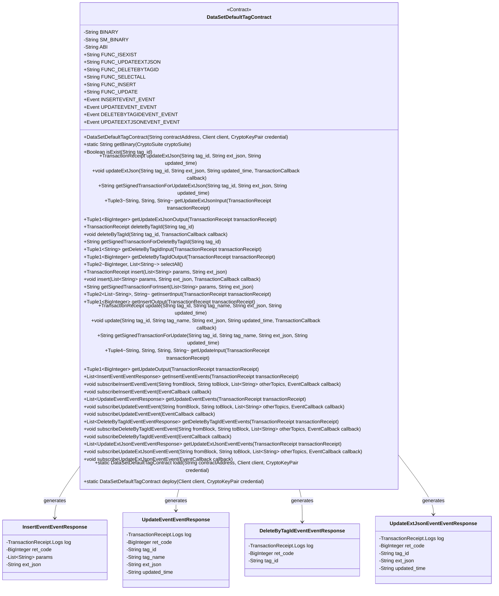
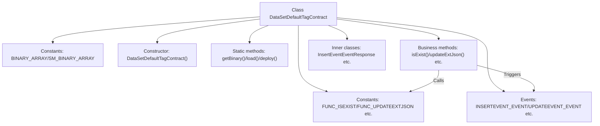
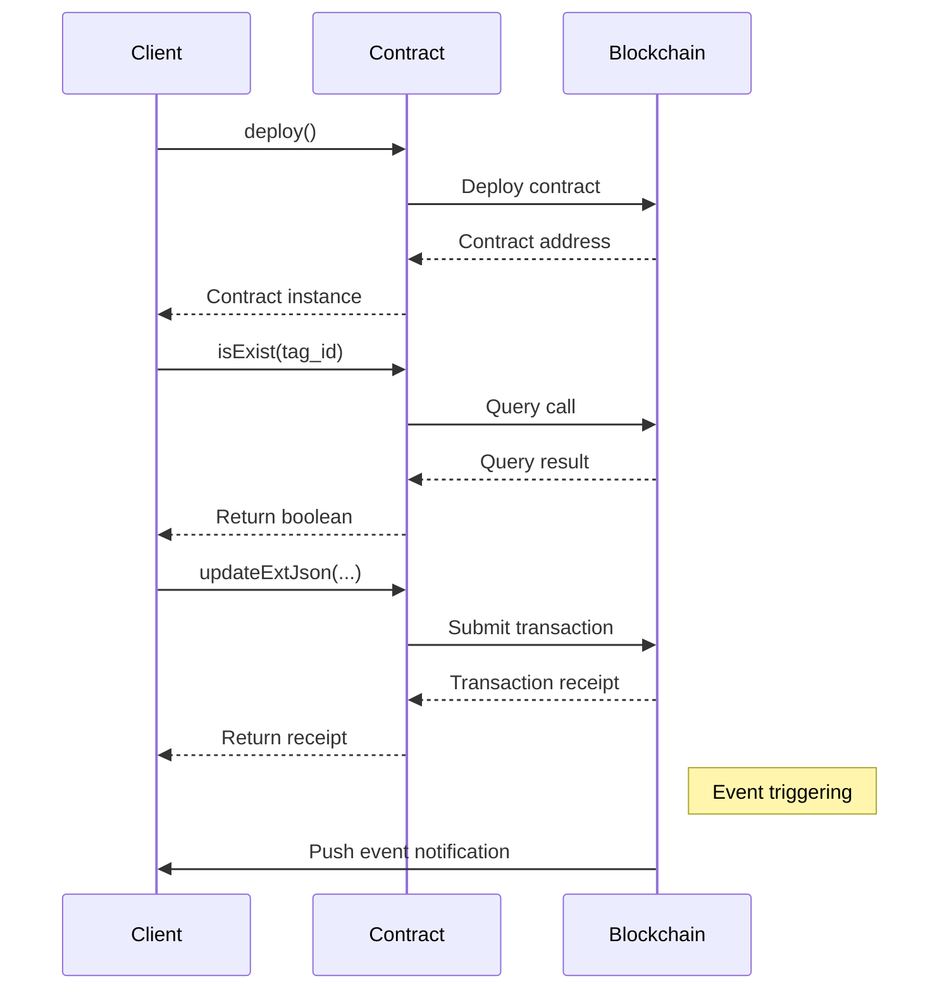

# Basic Information

|      |      |
|------|------|
| Name | DataSetDefaultTagContract |
| Language | .java |
| Code Path | WeFe/manager/manager-service/src/main/java/com/welab/wefe/manager/service/contract/DataSetDefaultTagContract.java |
| Package Name | com.welab.wefe.manager.service.contract |
| Dependencies | ['org.fisco.bcos.sdk.abi.FunctionReturnDecoder', 'org.fisco.bcos.sdk.abi.TypeReference', 'org.fisco.bcos.sdk.abi.datatypes', 'org.fisco.bcos.sdk.abi.datatypes.generated.Int256', 'org.fisco.bcos.sdk.abi.datatypes.generated.tuples.generated.Tuple1', 'org.fisco.bcos.sdk.abi.datatypes.generated.tuples.generated.Tuple2', 'org.fisco.bcos.sdk.abi.datatypes.generated.tuples.generated.Tuple3', 'org.fisco.bcos.sdk.abi.datatypes.generated.tuples.generated.Tuple4', 'org.fisco.bcos.sdk.client.Client', 'org.fisco.bcos.sdk.contract.Contract', 'org.fisco.bcos.sdk.crypto.CryptoSuite', 'org.fisco.bcos.sdk.crypto.keypair.CryptoKeyPair', 'org.fisco.bcos.sdk.eventsub.EventCallback', 'org.fisco.bcos.sdk.model.CryptoType', 'org.fisco.bcos.sdk.model.TransactionReceipt', 'org.fisco.bcos.sdk.model.callback.TransactionCallback', 'org.fisco.bcos.sdk.transaction.model.exception.ContractException', 'java.math.BigInteger', 'java.util.ArrayList', 'java.util.Arrays', 'java.util.Collections', 'java.util.List'] |
| Brief Description | DataSetDefaultTagContract is a smart contract class designed for managing default tags of datasets. Its primary functionalities include: checking the existence of tags, updating tag extension JSON, deleting tags, querying all tags, inserting new tags, and updating tag information. The contract supports event listening, such as event responses for insert, update, delete, and other operations. It is suitable for blockchain environments and utilizes ECDSA or SM encryption algorithms. |

# Description

This is a Java wrapper class for a smart contract named `DataSetDefaultTagContract`, primarily designed to interact with the dataset default tag contract on the blockchain. Below is a summary of key information:

1. **Basic Contract Information**  
- Includes contract binary code (BINARY/SM_BINARY) for both ECDSA and SM2 encryption algorithms  
- Provides a complete ABI interface definition  
- Defines 6 main functions and 4 events  

2. **Core Functional Methods**  
- Query methods: `isExist()` checks if a tag exists, `selectAll()` retrieves all tags  
- Update methods: `update()` modifies tag information, `updateExtJson()` updates extended JSON  
- Operation methods: `insert()` adds a new tag, `deleteByTagId()` removes a tag  

3. **Event Handling**  
- Provides response handler classes and methods for 4 events:  
  * `InsertEvent` for insertion events  
  * `UpdateEvent` for update events  
  * `DeleteByTagIdEvent` for deletion events  
  * `UpdateExtJsonEvent` for JSON update events  
- Supports event subscription and callback mechanisms  

4. **Auxiliary Features**  
- Parses input/output parameters of transaction receipts  
- Enables asynchronous transaction execution with callbacks  
- Generates signed transaction data  

5. **Technical Characteristics**  
- Inherits from the Contract base class, implementing standard contract interaction patterns  
- Uses generics and reflection to handle parameters of different types  
- Supports both ECDSA and the national SM2 encryption algorithms  
- Includes comprehensive JavaDoc-style documentation  

This class encapsulates all details of blockchain contract interaction, providing Java applications with a simple and user-friendly API while maintaining type safety and flexibility.

# Class Summary

| Name   | Type  | Description |
|-------|------|-------------|
| DataSetDefaultTagContract | class | DataSetDefaultTagContract is a smart contract class designed for managing default dataset tags. Its primary functionalities include:1. Checking tag existence (isExist)  2. Updating tag extension JSON (updateExtJson)  3. Deleting tags by ID (deleteByTagId)  4. Querying all tags (selectAll)  5. Inserting new tags (insert)  6. Updating tag information (update)  The contract features four events: Insert Event, Update Event, Delete Event, and Update JSON Event. It supports both ECDSA and SM2 encryption algorithms and offers synchronous and asynchronous transaction execution modes. |

## Class DataSetDefaultTagContract

|      |      |
|------|------|
| Access Modifier | @SuppressWarnings("unchecked");public |
| Type | class |
| Name | DataSetDefaultTagContract |
| Description | DataSetDefaultTagContract is a smart contract class designed for managing default dataset tags. Its primary functionalities include:1. Checking tag existence (isExist)  2. Updating tag extension JSON (updateExtJson)  3. Deleting tags by ID (deleteByTagId)  4. Querying all tags (selectAll)  5. Inserting new tags (insert)  6. Updating tag information (update)  The contract features four events: Insert Event, Update Event, Delete Event, and Update JSON Event. It supports both ECDSA and SM2 encryption algorithms and offers synchronous and asynchronous transaction execution modes. |

### UML Class Diagram

This code defines a smart contract class named DataSetDefaultTagContract, which inherits from the Contract base class. The contract provides CRUD operations for dataset default tags, including checking existence (isExist), updating extended JSON (updateExtJson), deleting by tag ID (deleteByTagId), querying all tags (selectAll), inserting new tags (insert), and updating tags (update). The contract also defines four event types for logging operations: InsertEvent, UpdateEvent, DeleteByTagIdEvent, and UpdateExtJsonEvent. Each functional method provides synchronous and asynchronous invocation methods, as well as methods for obtaining signed transactions and parsing transaction results.

### Internal Method Call Graph

This code is a Java wrapper class for smart contracts on the FISCO BCOS blockchain platform, with main functionalities including:

1. Encapsulating contract binary code and ABI definitions
2. Providing contract deployment (load/deploy) and basic query functions
3. Implementing 6 core business methods: tag existence check, extended JSON update, tag deletion, all tags query, new tag insertion, and tag update
4. Defining 4 event listener structures for handling contract event callbacks
5. Including complete transaction input/output parsing functionality
6. Supporting both regular and asynchronous transaction invocation methods

This wrapper class follows standard Java contract encapsulation specifications, ensuring method call safety through static type checking while providing complete transaction lifecycle management capabilities. The code structure is clear, separating blockchain underlying details from business interfaces, representing a typical blockchain middleware implementation pattern.

### Field List

| Name  | Type  | Description |
|-------|-------|------|
| UPDATEEXTJSONEVENT_EVENT = new Event("updateExtJsonEvent",             Arrays.<TypeReference<?>>asList(new TypeReference<Int256>() {}, new TypeReference<Utf8String>() {}, new TypeReference<Utf8String>() {}, new TypeReference<Utf8String>() {})) | Event | Define a static constant UPDATEEXTJSONEVENT_EVENT of type Event, containing the event name updateExtJsonEvent and four parameter types: Int256 and three Utf8String. |
| BINARY_ARRAY = {"60806040523480156200001157600080fd5b506110016000806101000a81548173ffffffffffffffffffffffffffffffffffffffff021916908373ffffffffffffffffffffffffffffffffffffffff1602179055506000809054906101000a900473ffffffffffffffffffffffffffffffffffffffff1673ffffffffffffffffffffffffffffffffffffffff166356004b6a6040805190810160405280601481526020017f646174615f7365745f64656661756c745f7461670000000000000000000000008152506040518263ffffffff167c010000000000000000000000000000000000000000000000000000000002815260040162000101919062000270565b602060405180830381600087803b1580156200011c57600080fd5b505af115801562000131573d6000803e3d6000fd5b505050506040513d601f19601f8201168201806040525062000157919081019062000174565b506200031a565b60006200016c8251620002c9565b905092915050565b6000602082840312156200018757600080fd5b600062000197848285016200015e565b91505092915050565b6000620001ad82620002be565b808452620001c3816020860160208601620002d3565b620001ce8162000309565b602085010191505092915050565b6000603282527f7461675f69642c7461675f6e616d652c637265617465645f74696d652c75706460208301527f617465645f74696d652c6578745f6a736f6e00000000000000000000000000006040830152606082019050919050565b6000600682527f6669785f696400000000000000000000000000000000000000000000000000006020830152604082019050919050565b600060608201905081810360008301526200028c8184620001a0565b90508181036020830152620002a18162000239565b90508181036040830152620002b681620001dc565b905092915050565b600081519050919050565b6000819050919050565b60005b83811015620002f3578082015181840152602081019050620002d6565b8381111562000303576000848401525b50505050565b6000601f19601f8301169050919050565b613756806200032a6000396000f300608060405260043610610078576000357c0100000000000000000000000000000000000000000000000000000000900463ffffffff1680634d3d096b1461007d57806363964aa3146100ba5780637bf358ed146100f7578063857cb0eb146101345780639729115014610160578063b99c40791461019d575b600080fd5b34801561008957600080fd5b506100a4600480360361009f9190810190612c18565b6101da565b6040516100b19190613054565b60405180910390f35b3480156100c657600080fd5b506100e160048036036100dc9190810190612c9a565b61059e565b6040516100ee919061306f565b60405180910390f35b34801561010357600080fd5b5061011e60048036036101199190810190612c18565b610ae0565b60405161012b919061306f565b60405180910390f35b34801561014057600080fd5b50610149610e6b565b60405161015792919061308a565b60405180910390f35b34801561016c57600080fd5b5061018760048036036101829190810190612adf565b61120f565b604051610194919061306f565b60405180910390f35b3480156101a957600080fd5b506101c460048036036101bf9190810190612d31565b611981565b6040516101d1919061306f565b60405180910390f35b6000806000806000809054906101000a900473ffffffffffffffffffffffffffffffffffffffff1673ffffffffffffffffffffffffffffffffffffffff1663f23f63c96040805190810160405280601481526020017f646174615f7365745f64656661756c745f7461670000000000000000000000008152506040518263ffffffff167c010000000000000000000000000000000000000000000000000000000002815260040161028b91906131f8565b602060405180830381600087803b1580156102a557600080fd5b505af11580156102b9573d6000803e3d6000fd5b505050506040513d601f19601f820116820180604052506102dd9190810190612bc6565b92508273ffffffffffffffffffffffffffffffffffffffff16637857d7c96040518163ffffffff167c0100000000000000000000000000000000000000000000000000000000028152600401602060405180830381600087803b15801561034357600080fd5b505af1158015610357573d6000803e3d6000fd5b505050506040513d601f19601f8201168201806040525061037b9190810190612b4b565b91508173ffffffffffffffffffffffffffffffffffffffff1663cd30a1d1866040518263ffffffff167c01000000000000000000000000000000000000000000000000000000000281526004016103d29190613500565b600060405180830381600087803b1580156103ec57600080fd5b505af1158015610400573d6000803e3d6000fd5b505050508273ffffffffffffffffffffffffffffffffffffffff1663e8434e396040805190810160405280600a81526020017f6669785f69645f30303400000000000000000000000000000000000000000000815250846040518363ffffffff167c010000000000000000000000000000000000000000000000000000000002815260040161049092919061321a565b602060405180830381600087803b1580156104aa57600080fd5b505af11580156104be573d6000803e3d6000fd5b505050506040513d601f19601f820116820180604052506104e29190810190612b74565b905060008173ffffffffffffffffffffffffffffffffffffffff1663949d225d6040518163ffffffff167c0100000000000000000000000000000000000000000000000000000000028152600401602060405180830381600087803b15801561054a57600080fd5b505af115801561055e573d6000803e3d6000fd5b505050506040513d601f19601f820116820180604052506105829190810190612bef565b11156105915760019350610596565b600093505b505050919050565b6000806000806000806000809054906101000a900473ffffffffffffffffffffffffffffffffffffffff1673ffffffffffffffffffffffffffffffffffffffff1663f23f63c96040805190810160405280601481526020017f646174615f7365745f64656661756c745f7461670000000000000000000000008152506040518263ffffffff167c010000000000000000000000000000000000000000000000000000000002815260040161065291906131f8565b602060405180830381600087803b15801561066c57600080fd5b505af1158015610680573d6000803e3d6000fd5b505050506040513d601f19601f820116820180604052506106a49190810190612bc6565b94508473ffffffffffffffffffffffffffffffffffffffff16637857d7c96040518163ffffffff167c0100000000000000000000000000000000000000000000000000000000028152600401602060405180830381600087803b15801561070a57600080fd5b505af115801561071e573d6000803e3d6000fd5b505050506040513d601f19601f820116820180604052506107429190810190612b4b565b93508373ffffffffffffffffffffffffffffffffffffffff1663cd30a1d18a6040518263ffffffff167c01000000000000000000000000000000000000000000000000000000000281526004016107999190613500565b600060405180830381600087803b1580156107b357600080fd5b505af11580156107c7573d6000803e3d6000fd5b505050508473ffffffffffffffffffffffffffffffffffffffff166313db93466040518163ffffffff167c0100000000000000000000000000000000000000000000000000000000028152600401602060405180830381600087803b15801561082f57600080fd5b505af1158015610843573d6000803e3d6000fd5b505050506040513d601f19601f820116820180604052506108679190810190612b9d565b92508273ffffffffffffffffffffffffffffffffffffffff1663e942b516896040518263ffffffff167c01000000000000000000000000000000000000000000000000000000000281526004016108be91906132d8565b600060405180830381600087803b1580156108d857600080fd5b505af11580156108ec573d6000803e3d6000fd5b505050508273ffffffffffffffffffffffffffffffffffffffff1663e942b516886040518263ffffffff167c01000000000000000000000000000000000000000000000000000000000281526004016109459190613421565b600060405180830381600087803b15801561095f57600080fd5b505af1158015610973573d6000803e3d6000fd5b505050508473ffffffffffffffffffffffffffffffffffffffff1663bf2b70a16040805190810160405280600a81526020017f6669785f69645f3030340000000000000000000000000000000000000000000081525085876040518463ffffffff167c0100000000000000000000000000000000000000000000000000000000028152600401610a059392919061327a565b602060405180830381600087803b158015610a1f57600080fd5b505af1158015610a33573d6000803e3d6000fd5b505050506040513d601f19601f82011682018060405250610a579190810190612bef565b915060009050600182121515610a705760009050610a94565b7ffffffffffffffffffffffffffffffffffffffffffffffffffffffffffffffffe90505b7f91fa9d6109b9b8b47733f98f4b6858346683ebdf73ba3c2f98b90c0d352f83e1818a8a8a604051610ac9949392919061312f565b60405180910390a180955050505050509392505050565b60008060008060008093506000809054906101000a900473ffffffffffffffffffffffffffffffffffffffff1673ffffffffffffffffffffffffffffffffffffffff1663f23f63c96040805190810160405280601481526020017f646174615f7365745f64656661756c745f7461670000000000000000000000008152506040518263ffffffff167c0100000000000000000000000000000000000000000000000000000000028152600401610b9691906131f8565b602060405180830381600087803b158015610bb057600080fd5b505af1158015610bc4573d6000803e3d6000fd5b505050506040513d601f19601f82011682018060405250610be89190810190612bc6565b92508273ffffffffffffffffffffffffffffffffffffffff16637857d7c96040518163ffffffff167c0100000000000000000000000000000000000000000000000000000000028152600401602060405180830381600087803b158015610c4e57600080fd5b505af1158015610c62573d6000803e3d6000fd5b505050506040513d601f19601f82011682018060405250610c869190810190612b4b565b91508173ffffffffffffffffffffffffffffffffffffffff1663cd30a1d1876040518263ffffffff167c0100000000000000000000000000000000000000000000000000000000028152600401610c", "dd9190613500565b600060405180830381600087803b158015610cf757600080fd5b505af1158015610d0b573d6000803e3d6000fd5b505050508273ffffffffffffffffffffffffffffffffffffffff166328bb21176040805190810160405280600a81526020017f6669785f69645f30303400000000000000000000000000000000000000000000815250846040518363ffffffff167c0100000000000000000000000000000000000000000000000000000000028152600401610d9b92919061321a565b602060405180830381600087803b158015610db557600080fd5b505af1158015610dc9573d6000803e3d6000fd5b505050506040513d601f19601f82011682018060405250610ded9190810190612bef565b9050600181121515610e025760009350610e26565b7ffffffffffffffffffffffffffffffffffffffffffffffffffffffffffffffffe93505b7f5b67fcfc52bf8293823b40863b3cf1890e73d0eae2e12fd2eada0bcc37ce68f38487604051610e579291906130ff565b60405180910390a180945050505050919050565b600060606000806000809054906101000a900473ffffffffffffffffffffffffffffffffffffffff1673ffffffffffffffffffffffffffffffffffffffff1663f23f63c96040805190810160405280601481526020017f646174615f7365745f64656661756c745f7461670000000000000000000000008152506040518263ffffffff167c0100000000000000000000000000000000000000000000000000000000028152600401610f1d91906131f8565b602060405180830381600087803b158015610f3757600080fd5b505af1158015610f4b573d6000803e3d6000fd5b505050506040513d601f19601f82011682018060405250610f6f9190810190612bc6565b91508173ffffffffffffffffffffffffffffffffffffffff1663e8434e396040805190810160405280600a81526020017f6669785f69645f303034000000000000000000000000000000000000000000008152508473ffffffffffffffffffffffffffffffffffffffff16637857d7c96040518163ffffffff167c0100000000000000000000000000000000000000000000000000000000028152600401602060405180830381600087803b15801561102757600080fd5b505af115801561103b573d6000803e3d6000fd5b505050506040513d601f19601f8201168201806040525061105f9190810190612b4b565b6040518363ffffffff167c010000000000000000000000000000000000000000000000000000000002815260040161109892919061321a565b602060405180830381600087803b1580156110b257600080fd5b505af11580156110c6573d6000803e3d6000fd5b505050506040513d601f19601f820116820180604052506110ea9190810190612b74565b90508073ffffffffffffffffffffffffffffffffffffffff1663949d225d6040518163ffffffff167c0100000000000000000000000000000000000000000000000000000000028152600401602060405180830381600087803b15801561115057600080fd5b505af1158015611164573d6000803e3d6000fd5b505050506040513d601f19601f820116820180604052506111889190810190612bef565b600014156111f6577ffffffffffffffffffffffffffffffffffffffffffffffffffffffffffffffffd60006040519080825280602002602001820160405280156111e657816020015b60608152602001906001900390816111d15790505b5081915080905093509350611209565b600061120182611fc7565b819150935093505b50509091565b600080600080600080935061123b87600081518110151561122c57fe5b906020019060200201516101da565b156112c6577fffffffffffffffffffffffffffffffffffffffffffffffffffffffffffffffff93507f5157dc1ab0b55c7621be94a34b2ae4228f7d16e8271628060cc027b1a513b12f848888604051611296939291906130ba565b60405180910390a17fffffffffffffffffffffffffffffffffffffffffffffffffffffffffffffffff9450611977565b6000809054906101000a900473ffffffffffffffffffffffffffffffffffffffff1673ffffffffffffffffffffffffffffffffffffffff1663f23f63c96040805190810160405280601481526020017f646174615f7365745f64656661756c745f7461670000000000000000000000008152506040518263ffffffff167c010000000000000000000000000000000000000000000000000000000002815260040161137191906131f8565b602060405180830381600087803b15801561138b57600080fd5b505af115801561139f573d6000803e3d6000fd5b505050506040513d601f19601f820116820180604052506113c39190810190612bc6565b92508273ffffffffffffffffffffffffffffffffffffffff166313db93466040518163ffffffff167c0100000000000000000000000000000000000000000000000000000000028152600401602060405180830381600087803b15801561142957600080fd5b505af115801561143d573d6000803e3d6000fd5b505050506040513d601f19601f820116820180604052506114619190810190612b9d565b91508173ffffffffffffffffffffffffffffffffffffffff1663e942b5166040805190810160405280600a81526020017f6669785f69645f303034000000000000000000000000000000000000000000008152506040518263ffffffff167c01000000000000000000000000000000000000000000000000000000000281526004016114ed919061330d565b600060405180830381600087803b15801561150757600080fd5b505af115801561151b573d6000803e3d6000fd5b505050508173ffffffffffffffffffffffffffffffffffffffff1663e942b51688600081518110151561154a57fe5b906020019060200201516040518263ffffffff167c010000000000000000000000000000000000000000000000000000000002815260040161158c91906134cb565b600060405180830381600087803b1580156115a657600080fd5b505af11580156115ba573d6000803e3d6000fd5b505050508173ffffffffffffffffffffffffffffffffffffffff1663e942b5168860018151811015156115e957fe5b906020019060200201516040518263ffffffff167c010000000000000000000000000000000000000000000000000000000002815260040161162b9190613362565b600060405180830381600087803b15801561164557600080fd5b505af1158015611659573d6000803e3d6000fd5b505050508173ffffffffffffffffffffffffffffffffffffffff1663e942b51688600281518110151561168857fe5b906020019060200201516040518263ffffffff167c01000000000000000000000000000000000000000000000000000000000281526004016116ca9190613476565b600060405180830381600087803b1580156116e457600080fd5b505af11580156116f8573d6000803e3d6000fd5b505050508173ffffffffffffffffffffffffffffffffffffffff1663e942b51688600381518110151561172757fe5b906020019060200201516040518263ffffffff167c010000000000000000000000000000000000000000000000000000000002815260040161176991906133ec565b600060405180830381600087803b15801561178357600080fd5b505af1158015611797573d6000803e3d6000fd5b505050508173ffffffffffffffffffffffffffffffffffffffff1663e942b516876040518263ffffffff167c01000000000000000000000000000000000000000000000000000000000281526004016117f091906132d8565b600060405180830381600087803b15801561180a57600080fd5b505af115801561181e573d6000803e3d6000fd5b505050508273ffffffffffffffffffffffffffffffffffffffff166331afac366040805190810160405280600a81526020017f6669785f69645f30303400000000000000000000000000000000000000000000815250846040518363ffffffff167c01000000000000000000000000000000000000000000000000000000000281526004016118ae92919061324a565b602060405180830381600087803b1580156118c857600080fd5b505af11580156118dc573d6000803e3d6000fd5b505050506040513d601f19601f820116820180604052506119009190810190612bef565b905060018114156119145760009350611938565b7ffffffffffffffffffffffffffffffffffffffffffffffffffffffffffffffffe93505b7f5157dc1ab0b55c7621be94a34b2ae4228f7d16e8271628060cc027b1a513b12f84888860405161196b939291906130ba565b60405180910390a18094505b5050505092915050565b600080600080600080600094506119978a6101da565b1515611a07577fffffffffffffffffffffffffffffffffffffffffffffffffffffffffffffffff94507f8718faa5c5c2bb075c6af3f223c80ed4c4632bd62204f0cbfdfb360b366ee20c858b8b8b8b6040516119f7959493929190613189565b60405180910390a1849550611fba565b6000809054906101000a900473ffffffffffffffffffffffffffffffffffffffff1673ffffffffffffffffffffffffffffffffffffffff1663f23f63c96040805190810160405280601481526020017f646174615f7365745f64656661756c745f7461670000000000000000000000008152506040518263ffffffff167c0100000000000000000000000000000000000000000000000000000000028152600401611ab291906131f8565b602060405180830381600087803b158015611acc57600080fd5b505af1158015611ae0573d6000803e3d6000fd5b505050506040513d601f19601f82011682018060405250611b049190810190612bc6565b93508373ffffffffffffffffffffffffffffffffffffffff16637857d7c96040518163ffffffff167c0100000000000000000000000000000000000000000000000000000000028152600401602060405180830381600087803b158015611b6a57600080fd5b505af1158015611b7e573d6000803e3d6000fd5b505050506040513d601f19601f82011682018060405250611ba29190810190612b4b565b92508273ffffffffffffffffffffffffffffffffffffffff1663cd30a1d18b6040518263ffffffff167c0100000000000000000000000000000000000000000000000000000000028152600401611bf99190613500565b600060405180830381600087803b158015611c1357600080fd5b505af1158015611c27573d6000803e3d6000fd5b505050508373ffffffffffffffffffffffffffffffffffffffff166313db93466040518163ffffffff167c0100000000000000000000000000000000000000000000000000000000028152600401602060405180830381600087803b158015611c8f57600080fd5b505af1158015611ca3573d6000803e3d6000fd5b505050506040513d601f19601f82011682018060405250611cc79190810190612b9d565b91508173ffffffffffffffffffff", "ffffffffffffffffffff1663e942b5168a6040518263ffffffff167c0100000000000000000000000000000000000000000000000000000000028152600401611d1e9190613397565b600060405180830381600087803b158015611d3857600080fd5b505af1158015611d4c573d6000803e3d6000fd5b505050508173ffffffffffffffffffffffffffffffffffffffff1663e942b516886040518263ffffffff167c0100000000000000000000000000000000000000000000000000000000028152600401611da59190613421565b600060405180830381600087803b158015611dbf57600080fd5b505af1158015611dd3573d6000803e3d6000fd5b505050508173ffffffffffffffffffffffffffffffffffffffff1663e942b516896040518263ffffffff167c0100000000000000000000000000000000000000000000000000000000028152600401611e2c91906132d8565b600060405180830381600087803b158015611e4657600080fd5b505af1158015611e5a573d6000803e3d6000fd5b505050508373ffffffffffffffffffffffffffffffffffffffff1663bf2b70a16040805190810160405280600a81526020017f6669785f69645f3030340000000000000000000000000000000000000000000081525084866040518463ffffffff167c0100000000000000000000000000000000000000000000000000000000028152600401611eec9392919061327a565b602060405180830381600087803b158015611f0657600080fd5b505af1158015611f1a573d6000803e3d6000fd5b505050506040513d601f19601f82011682018060405250611f3e9190810190612bef565b9050600181121515611f535760009450611f77565b7ffffffffffffffffffffffffffffffffffffffffffffffffffffffffffffffffe94505b7f8718faa5c5c2bb075c6af3f223c80ed4c4632bd62204f0cbfdfb360b366ee20c858b8b8b8b604051611fae959493929190613189565b60405180910390a18095505b5050505050949350505050565b60608060008060608573ffffffffffffffffffffffffffffffffffffffff1663949d225d6040518163ffffffff167c0100000000000000000000000000000000000000000000000000000000028152600401602060405180830381600087803b15801561203357600080fd5b505af1158015612047573d6000803e3d6000fd5b505050506040513d601f19601f8201168201806040525061206b9190810190612bef565b60405190808252806020026020018201604052801561209e57816020015b60608152602001906001900390816120895790505b509350600092505b8573ffffffffffffffffffffffffffffffffffffffff1663949d225d6040518163ffffffff167c0100000000000000000000000000000000000000000000000000000000028152600401602060405180830381600087803b15801561210a57600080fd5b505af115801561211e573d6000803e3d6000fd5b505050506040513d601f19601f820116820180604052506121429190810190612bef565b8312156126c2578573ffffffffffffffffffffffffffffffffffffffff1663846719e0846040518263ffffffff167c010000000000000000000000000000000000000000000000000000000002815260040161219e919061306f565b602060405180830381600087803b1580156121b857600080fd5b505af11580156121cc573d6000803e3d6000fd5b505050506040513d601f19601f820116820180604052506121f09190810190612b9d565b91506122e26122a78373ffffffffffffffffffffffffffffffffffffffff16639c981fcb6040518163ffffffff167c010000000000000000000000000000000000000000000000000000000002815260040161224b906134ab565b600060405180830381600087803b15801561226557600080fd5b505af1158015612279573d6000803e3d6000fd5b505050506040513d6000823e3d601f19601f820116820180604052506122a29190810190612c59565b6126ce565b6040805190810160405280600181526020017f7c00000000000000000000000000000000000000000000000000000000000000815250612727565b905061239f8161239a8473ffffffffffffffffffffffffffffffffffffffff16639c981fcb6040518163ffffffff167c010000000000000000000000000000000000000000000000000000000002815260040161233e90613342565b600060405180830381600087803b15801561235857600080fd5b505af115801561236c573d6000803e3d6000fd5b505050506040513d6000823e3d601f19601f820116820180604052506123959190810190612c59565b6126ce565b612727565b90506123e0816040805190810160405280600181526020017f7c00000000000000000000000000000000000000000000000000000000000000815250612727565b905061249d816124988473ffffffffffffffffffffffffffffffffffffffff16639c981fcb6040518163ffffffff167c010000000000000000000000000000000000000000000000000000000002815260040161243c90613456565b600060405180830381600087803b15801561245657600080fd5b505af115801561246a573d6000803e3d6000fd5b505050506040513d6000823e3d601f19601f820116820180604052506124939190810190612c59565b6126ce565b612727565b90506124de816040805190810160405280600181526020017f7c00000000000000000000000000000000000000000000000000000000000000815250612727565b905061259b816125968473ffffffffffffffffffffffffffffffffffffffff16639c981fcb6040518163ffffffff167c010000000000000000000000000000000000000000000000000000000002815260040161253a906133cc565b600060405180830381600087803b15801561255457600080fd5b505af1158015612568573d6000803e3d6000fd5b505050506040513d6000823e3d601f19601f820116820180604052506125919190810190612c59565b6126ce565b612727565b90506125dc816040805190810160405280600181526020017f7c00000000000000000000000000000000000000000000000000000000000000815250612727565b9050612699816126948473ffffffffffffffffffffffffffffffffffffffff16639c981fcb6040518163ffffffff167c0100000000000000000000000000000000000000000000000000000000028152600401612638906132b8565b600060405180830381600087803b15801561265257600080fd5b505af1158015612666573d6000803e3d6000fd5b505050506040513d6000823e3d601f19601f8201168201806040525061268f9190810190612c59565b6126ce565b612727565b90508084848151811015156126aa57fe5b906020019060200201819052508260010192506120a6565b83945050505050919050565b606060006126db836128f8565b141561271e576040805190810160405280600181526020017f20000000000000000000000000000000000000000000000000000000000000008152509050612722565b8190505b919050565b606080606080606060008088955087945084518651016040519080825280601f01601f19166020018201604052801561276f5781602001602082028038833980820191505090505b50935083925060009150600090505b855181101561283157858181518110151561279557fe5b9060200101517f010000000000000000000000000000000000000000000000000000000000000090047f01000000000000000000000000000000000000000000000000000000000000000283838060010194508151811015156127f457fe5b9060200101907effffffffffffffffffffffffffffffffffffffffffffffffffffffffffffff1916908160001a905350808060010191505061277e565b600090505b84518110156128e957848181518110151561284d57fe5b9060200101517f010000000000000000000000000000000000000000000000000000000000000090047f01000000000000000000000000000000000000000000000000000000000000000283838060010194508151811015156128ac57fe5b9060200101907effffffffffffffffffffffffffffffffffffffffffffffffffffffffffffff1916908160001a9053508080600101915050612836565b83965050505050505092915050565b600081519050919050565b600082601f830112151561291657600080fd5b813561292961292482613562565b613535565b9150818183526020840193506020810190508360005b8381101561296f578135860161295588826129dd565b84526020840193506020830192505060018101905061293f565b5050505092915050565b60006129858251613653565b905092915050565b60006129998251613665565b905092915050565b60006129ad8251613677565b905092915050565b60006129c18251613689565b905092915050565b60006129d5825161369b565b905092915050565b600082601f83011215156129f057600080fd5b8135612a036129fe8261358a565b613535565b91508082526020830160208301858383011115612a1f57600080fd5b612a2a8382846136c9565b50505092915050565b600082601f8301121515612a4657600080fd5b8135612a59612a54826135b6565b613535565b91508082526020830160208301858383011115612a7557600080fd5b612a808382846136c9565b50505092915050565b600082601f8301121515612a9c57600080fd5b8151612aaf612aaa826135b6565b613535565b91508082526020830160208301858383011115612acb57600080fd5b612ad68382846136d8565b50505092915050565b60008060408385031215612af257600080fd5b600083013567ffffffffffffffff811115612b0c57600080fd5b612b1885828601612903565b925050602083013567ffffffffffffffff811115612b3557600080fd5b612b4185828601612a33565b9150509250929050565b600060208284031215612b5d57600080fd5b6000612b6b84828501612979565b91505092915050565b600060208284031215612b8657600080fd5b6000612b948482850161298d565b91505092915050565b600060208284031215612baf57600080fd5b6000612bbd848285016129a1565b91505092915050565b600060208284031215612bd857600080fd5b6000612be6848285016129b5565b91505092915050565b600060208284031215612c0157600080fd5b6000612c0f848285016129c9565b91505092915050565b600060208284031215612c2a57600080fd5b600082013567ffffffffffffffff811115612c4457600080fd5b612c5084828501612a33565b91505092915050565b600060208284031215612c6b57600080fd5b600082015167ffffffffffffffff811115612c8557600080fd5b612c9184828501612a89565b91505092915050565b600080600060608486031215612caf57600080fd5b600084013567ffffffffffffffff811115612cc957600080fd5b612cd586828701612a33565b", "935050602084013567ffffffffffffffff811115612cf257600080fd5b612cfe86828701612a33565b925050604084013567ffffffffffffffff811115612d1b57600080fd5b612d2786828701612a33565b9150509250925092565b60008060008060808587031215612d4757600080fd5b600085013567ffffffffffffffff811115612d6157600080fd5b612d6d87828801612a33565b945050602085013567ffffffffffffffff811115612d8a57600080fd5b612d9687828801612a33565b935050604085013567ffffffffffffffff811115612db357600080fd5b612dbf87828801612a33565b925050606085013567ffffffffffffffff811115612ddc57600080fd5b612de887828801612a33565b91505092959194509250565b6000612dff826135ef565b80845260208401935083602082028501612e18856135e2565b60005b84811015612e51578383038852612e33838351612ed4565b9250612e3e82613610565b9150602088019750600181019050612e1b565b508196508694505050505092915050565b612e6b8161363d565b82525050565b612e7a816136a5565b82525050565b612e89816136b7565b82525050565b612e9881613649565b82525050565b6000612ea982613605565b808452612ebd8160208601602086016136d8565b612ec68161370b565b602085010191505092915050565b6000612edf826135fa565b808452612ef38160208601602086016136d8565b612efc8161370b565b602085010191505092915050565b6000600882527f6578745f6a736f6e0000000000000000000000000000000000000000000000006020830152604082019050919050565b6000600682527f6669785f696400000000000000000000000000000000000000000000000000006020830152604082019050919050565b6000600882527f7461675f6e616d650000000000000000000000000000000000000000000000006020830152604082019050919050565b6000600c82527f757064617465645f74696d6500000000000000000000000000000000000000006020830152604082019050919050565b6000600c82527f637265617465645f74696d6500000000000000000000000000000000000000006020830152604082019050919050565b6000600682527f7461675f696400000000000000000000000000000000000000000000000000006020830152604082019050919050565b60006020820190506130696000830184612e62565b92915050565b60006020820190506130846000830184612e8f565b92915050565b600060408201905061309f6000830185612e8f565b81810360208301526130b18184612df4565b90509392505050565b60006060820190506130cf6000830186612e8f565b81810360208301526130e18185612df4565b905081810360408301526130f58184612e9e565b9050949350505050565b60006040820190506131146000830185612e8f565b81810360208301526131268184612e9e565b90509392505050565b60006080820190506131446000830187612e8f565b81810360208301526131568186612e9e565b9050818103604083015261316a8185612e9e565b9050818103606083015261317e8184612e9e565b905095945050505050565b600060a08201905061319e6000830188612e8f565b81810360208301526131b08187612e9e565b905081810360408301526131c48186612e9e565b905081810360608301526131d88185612e9e565b905081810360808301526131ec8184612e9e565b90509695505050505050565b600060208201905081810360008301526132128184612ed4565b905092915050565b600060408201905081810360008301526132348185612ed4565b90506132436020830184612e71565b9392505050565b600060408201905081810360008301526132648185612ed4565b90506132736020830184612e80565b9392505050565b600060608201905081810360008301526132948186612ed4565b90506132a36020830185612e80565b6132b06040830184612e71565b949350505050565b600060208201905081810360008301526132d181612f0a565b9050919050565b600060408201905081810360008301526132f181612f0a565b905081810360208301526133058184612e9e565b905092915050565b6000604082019050818103600083015261332681612f41565b9050818103602083015261333a8184612ed4565b905092915050565b6000602082019050818103600083015261335b81612f78565b9050919050565b6000604082019050818103600083015261337b81612f78565b9050818103602083015261338f8184612ed4565b905092915050565b600060408201905081810360008301526133b081612f78565b905081810360208301526133c48184612e9e565b905092915050565b600060208201905081810360008301526133e581612faf565b9050919050565b6000604082019050818103600083015261340581612faf565b905081810360208301526134198184612ed4565b905092915050565b6000604082019050818103600083015261343a81612faf565b9050818103602083015261344e8184612e9e565b905092915050565b6000602082019050818103600083015261346f81612fe6565b9050919050565b6000604082019050818103600083015261348f81612fe6565b905081810360208301526134a38184612ed4565b905092915050565b600060208201905081810360008301526134c48161301d565b9050919050565b600060408201905081810360008301526134e48161301d565b905081810360208301526134f88184612ed4565b905092915050565b600060408201905081810360008301526135198161301d565b9050818103602083015261352d8184612e9e565b905092915050565b6000604051905081810181811067ffffffffffffffff8211171561355857600080fd5b8060405250919050565b600067ffffffffffffffff82111561357957600080fd5b602082029050602081019050919050565b600067ffffffffffffffff8211156135a157600080fd5b601f19601f8301169050602081019050919050565b600067ffffffffffffffff8211156135cd57600080fd5b601f19601f8301169050602081019050919050565b6000602082019050919050565b600081519050919050565b600081519050919050565b600081519050919050565b6000602082019050919050565b600073ffffffffffffffffffffffffffffffffffffffff82169050919050565b60008115159050919050565b6000819050919050565b600061365e8261361d565b9050919050565b60006136708261361d565b9050919050565b60006136828261361d565b9050919050565b60006136948261361d565b9050919050565b6000819050919050565b60006136b08261361d565b9050919050565b60006136c28261361d565b9050919050565b82818337600083830152505050565b60005b838110156136f65780820151818401526020810190506136db565b83811115613705576000848401525b50505050565b6000601f19601f83011690509190505600a265627a7a72305820ec412e7a93ab136d11ebcdf9068f86866ed15e3560e756c0e98f091d24c4aa7d6c6578706572696d656e74616cf50037"} | String[] | This is an array containing two hexadecimal strings, possibly representing the bytecode or binary data of a smart contract. |
| BINARY = String.join("", BINARY_ARRAY) | String | Concatenate the BINARY_ARRAY into a string and assign it to the constant BINARY. |
| INSERTEVENT_EVENT = new Event("insertEvent",             Arrays.<TypeReference<?>>asList(new TypeReference<Int256>() {}, new TypeReference<DynamicArray<Utf8String>>() {}, new TypeReference<Utf8String>() {})) | Event | Define a static constant INSERTEVENT_EVENT, of type Event, containing the event name "insertEvent" and three parameter types: Int256, DynamicArray<Utf8String>, and Utf8String. |
| FUNC_ISEXIST = "isExist" | String | The static constant string FUNC_ISEXIST has a value of "isExist". |
| UPDATEEVENT_EVENT = new Event("updateEvent",             Arrays.<TypeReference<?>>asList(new TypeReference<Int256>() {}, new TypeReference<Utf8String>() {}, new TypeReference<Utf8String>() {}, new TypeReference<Utf8String>() {}, new TypeReference<Utf8String>() {})) | Event | Define a public static constant event named UPDATEEVENT_EVENT, containing parameters of type Int256 and four Utf8String. |
| ABI = String.join("", ABI_ARRAY) | String | Concatenate the ABI_ARRAY into an ABI string constant. |
| ABI_ARRAY = {"[{\"constant\":true,\"inputs\":[{\"name\":\"tag_id\",\"type\":\"string\"}],\"name\":\"isExist\",\"outputs\":[{\"name\":\"\",\"type\":\"bool\"}],\"payable\":false,\"stateMutability\":\"view\",\"type\":\"function\"},{\"constant\":false,\"inputs\":[{\"name\":\"tag_id\",\"type\":\"string\"},{\"name\":\"ext_json\",\"type\":\"string\"},{\"name\":\"updated_time\",\"type\":\"string\"}],\"name\":\"updateExtJson\",\"outputs\":[{\"name\":\"\",\"type\":\"int256\"}],\"payable\":false,\"stateMutability\":\"nonpayable\",\"type\":\"function\"},{\"constant\":false,\"inputs\":[{\"name\":\"tag_id\",\"type\":\"string\"}],\"name\":\"deleteByTagId\",\"outputs\":[{\"name\":\"\",\"type\":\"int256\"}],\"payable\":false,\"stateMutability\":\"nonpayable\",\"type\":\"function\"},{\"constant\":true,\"inputs\":[],\"name\":\"selectAll\",\"outputs\":[{\"name\":\"\",\"type\":\"int256\"},{\"name\":\"\",\"type\":\"string[]\"}],\"payable\":false,\"stateMutability\":\"view\",\"type\":\"function\"},{\"constant\":false,\"inputs\":[{\"name\":\"params\",\"type\":\"string[]\"},{\"name\":\"ext_json\",\"type\":\"string\"}],\"name\":\"insert\",\"outputs\":[{\"name\":\"\",\"type\":\"int256\"}],\"payable\":false,\"stateMutability\":\"nonpayable\",\"type\":\"function\"},{\"constant\":false,\"inputs\":[{\"name\":\"tag_id\",\"type\":\"string\"},{\"name\":\"tag_name\",\"type\":\"string\"},{\"name\":\"ext_json\",\"type\":\"string\"},{\"name\":\"updated_time\",\"type\":\"string\"}],\"name\":\"update\",\"outputs\":[{\"name\":\"\",\"type\":\"int256\"}],\"payable\":false,\"stateMutability\":\"nonpayable\",\"type\":\"function\"},{\"inputs\":[],\"payable\":false,\"stateMutability\":\"nonpayable\",\"type\":\"constructor\"},{\"anonymous\":false,\"inputs\":[{\"indexed\":false,\"name\":\"ret_code\",\"type\":\"int256\"},{\"indexed\":false,\"name\":\"params\",\"type\":\"string[]\"},{\"indexed\":false,\"name\":\"ext_json\",\"type\":\"string\"}],\"name\":\"insertEvent\",\"type\":\"event\"},{\"anonymous\":false,\"inputs\":[{\"indexed\":false,\"name\":\"ret_code\",\"type\":\"int256\"},{\"indexed\":false,\"name\":\"tag_id\",\"type\":\"string\"},{\"indexed\":false,\"name\":\"tag_name\",\"type\":\"string\"},{\"indexed\":false,\"name\":\"ext_json\",\"type\":\"string\"},{\"indexed\":false,\"name\":\"updated_time\",\"type\":\"string\"}],\"name\":\"updateEvent\",\"type\":\"event\"},{\"anonymous\":false,\"inputs\":[{\"indexed\":false,\"name\":\"ret_code\",\"type\":\"int256\"},{\"indexed\":false,\"name\":\"tag_id\",\"type\":\"string\"}],\"name\":\"deleteByTagIdEvent\",\"type\":\"event\"},{\"anonymous\":false,\"inputs\":[{\"indexed\":false,\"name\":\"ret_code\",\"type\":\"int256\"},{\"indexed\":false,\"name\":\"tag_id\",\"type\":\"string\"},{\"indexed\":false,\"name\":\"ext_json\",\"type\":\"string\"},{\"indexed\":false,\"name\":\"updated_time\",\"type\":\"string\"}],\"name\":\"updateExtJsonEvent\",\"type\":\"event\"}]"} | String[] | The ABI array contains the function and event definitions of a smart contract, involving query, update, delete, and insert operations, as well as related events. |
| FUNC_INSERT = "insert" | String | The static constant FUNC_INSERT is defined as the string "insert". |
| DELETEBYTAGIDEVENT_EVENT = new Event("deleteByTagIdEvent",             Arrays.<TypeReference<?>>asList(new TypeReference<Int256>() {}, new TypeReference<Utf8String>() {})) | Event | Define a static constant DELETEBYTAGIDEVENT_EVENT of type Event, containing the event name "deleteByTagIdEvent" and two parameter types Int256 and Utf8String. |
| SM_BINARY_ARRAY = {"60806040523480156200001157600080fd5b506110016000806101000a81548173ffffffffffffffffffffffffffffffffffffffff021916908373ffffffffffffffffffffffffffffffffffffffff1602179055506000809054906101000a900473ffffffffffffffffffffffffffffffffffffffff1673ffffffffffffffffffffffffffffffffffffffff1663c92a78016040805190810160405280601481526020017f646174615f7365745f64656661756c745f7461670000000000000000000000008152506040518263ffffffff167c010000000000000000000000000000000000000000000000000000000002815260040162000101919062000270565b602060405180830381600087803b1580156200011c57600080fd5b505af115801562000131573d6000803e3d6000fd5b505050506040513d601f19601f8201168201806040525062000157919081019062000174565b506200031a565b60006200016c8251620002c9565b905092915050565b6000602082840312156200018757600080fd5b600062000197848285016200015e565b91505092915050565b6000620001ad82620002be565b808452620001c3816020860160208601620002d3565b620001ce8162000309565b602085010191505092915050565b6000600682527f6669785f696400000000000000000000000000000000000000000000000000006020830152604082019050919050565b6000603282527f7461675f69642c7461675f6e616d652c637265617465645f74696d652c75706460208301527f617465645f74696d652c6578745f6a736f6e00000000000000000000000000006040830152606082019050919050565b600060608201905081810360008301526200028c8184620001a0565b90508181036020830152620002a181620001dc565b90508181036040830152620002b68162000213565b905092915050565b600081519050919050565b6000819050919050565b60005b83811015620002f3578082015181840152602081019050620002d6565b8381111562000303576000848401525b50505050565b6000601f19601f8301169050919050565b613756806200032a6000396000f300608060405260043610610078576000357c0100000000000000000000000000000000000000000000000000000000900463ffffffff16806315d0d6251461007d578063568fe885146100ba5780639eb03ade146100f7578063abfe57f414610134578063ac7c89a914610171578063c181ca36146101ae575b600080fd5b34801561008957600080fd5b506100a4600480360361009f9190810190612c9a565b6101da565b6040516100b1919061306f565b60405180910390f35b3480156100c657600080fd5b506100e160048036036100dc9190810190612c18565b61071c565b6040516100ee9190613054565b60405180910390f35b34801561010357600080fd5b5061011e60048036036101199190810190612adf565b610ae0565b60405161012b919061306f565b60405180910390f35b34801561014057600080fd5b5061015b60048036036101569190810190612c18565b611252565b604051610168919061306f565b60405180910390f35b34801561017d57600080fd5b5061019860048036036101939190810190612d31565b6115dd565b6040516101a5919061306f565b60405180910390f35b3480156101ba57600080fd5b506101c3611c23565b6040516101d192919061308a565b60405180910390f35b6000806000806000806000809054906101000a900473ffffffffffffffffffffffffffffffffffffffff1673ffffffffffffffffffffffffffffffffffffffff166359a48b656040805190810160405280601481526020017f646174615f7365745f64656661756c745f7461670000000000000000000000008152506040518263ffffffff167c010000000000000000000000000000000000000000000000000000000002815260040161028e91906131f8565b602060405180830381600087803b1580156102a857600080fd5b505af11580156102bc573d6000803e3d6000fd5b505050506040513d601f19601f820116820180604052506102e09190810190612bc6565b94508473ffffffffffffffffffffffffffffffffffffffff1663c74f8caf6040518163ffffffff167c0100000000000000000000000000000000000000000000000000000000028152600401602060405180830381600087803b15801561034657600080fd5b505af115801561035a573d6000803e3d6000fd5b505050506040513d601f19601f8201168201806040525061037e9190810190612b4b565b93508373ffffffffffffffffffffffffffffffffffffffff1663ae763db58a6040518263ffffffff167c01000000000000000000000000000000000000000000000000000000000281526004016103d59190613476565b600060405180830381600087803b1580156103ef57600080fd5b505af1158015610403573d6000803e3d6000fd5b505050508473ffffffffffffffffffffffffffffffffffffffff16635887ab246040518163ffffffff167c0100000000000000000000000000000000000000000000000000000000028152600401602060405180830381600087803b15801561046b57600080fd5b505af115801561047f573d6000803e3d6000fd5b505050506040513d601f19601f820116820180604052506104a39190810190612b9d565b92508273ffffffffffffffffffffffffffffffffffffffff16631a391cb4896040518263ffffffff167c01000000000000000000000000000000000000000000000000000000000281526004016104fa9190613500565b600060405180830381600087803b15801561051457600080fd5b505af1158015610528573d6000803e3d6000fd5b505050508273ffffffffffffffffffffffffffffffffffffffff16631a391cb4886040518263ffffffff167c0100000000000000000000000000000000000000000000000000000000028152600401610581919061330d565b600060405180830381600087803b15801561059b57600080fd5b505af11580156105af573d6000803e3d6000fd5b505050508473ffffffffffffffffffffffffffffffffffffffff1663664b37d66040805190810160405280600a81526020017f6669785f69645f3030340000000000000000000000000000000000000000000081525085876040518463ffffffff167c01000000000000000000000000000000000000000000000000000000000281526004016106419392919061327a565b602060405180830381600087803b15801561065b57600080fd5b505af115801561066f573d6000803e3d6000fd5b505050506040513d601f19601f820116820180604052506106939190810190612bef565b9150600090506001821215156106ac57600090506106d0565b7ffffffffffffffffffffffffffffffffffffffffffffffffffffffffffffffffe90505b7fb36a4960db7128c065f905021bc6b7ab38c8106c359c6ac8dcd55ed9356c994c818a8a8a604051610705949392919061312f565b60405180910390a180955050505050509392505050565b6000806000806000809054906101000a900473ffffffffffffffffffffffffffffffffffffffff1673ffffffffffffffffffffffffffffffffffffffff166359a48b656040805190810160405280601481526020017f646174615f7365745f64656661756c745f7461670000000000000000000000008152506040518263ffffffff167c01000000000000000000000000000000000000000000000000000000000281526004016107cd91906131f8565b602060405180830381600087803b1580156107e757600080fd5b505af11580156107fb573d6000803e3d6000fd5b505050506040513d601f19601f8201168201806040525061081f9190810190612bc6565b92508273ffffffffffffffffffffffffffffffffffffffff1663c74f8caf6040518163ffffffff167c0100000000000000000000000000000000000000000000000000000000028152600401602060405180830381600087803b15801561088557600080fd5b505af1158015610899573d6000803e3d6000fd5b505050506040513d601f19601f820116820180604052506108bd9190810190612b4b565b91508173ffffffffffffffffffffffffffffffffffffffff1663ae763db5866040518263ffffffff167c01000000000000000000000000000000000000000000000000000000000281526004016109149190613476565b600060405180830381600087803b15801561092e57600080fd5b505af1158015610942573d6000803e3d6000fd5b505050508273ffffffffffffffffffffffffffffffffffffffff1663d8ac59576040805190810160405280600a81526020017f6669785f69645f30303400000000000000000000000000000000000000000000815250846040518363ffffffff167c01000000000000000000000000000000000000000000000000000000000281526004016109d292919061321a565b602060405180830381600087803b1580156109ec57600080fd5b505af1158015610a00573d6000803e3d6000fd5b505050506040513d601f19601f82011682018060405250610a249190810190612b74565b905060008173ffffffffffffffffffffffffffffffffffffffff1663d3e9af5a6040518163ffffffff167c0100000000000000000000000000000000000000000000000000000000028152600401602060405180830381600087803b158015610a8c57600080fd5b505af1158015610aa0573d6000803e3d6000fd5b505050506040513d601f19601f82011682018060405250610ac49190810190612bef565b1115610ad35760019350610ad8565b600093505b505050919050565b6000806000806000809350610b0c876000815181101515610afd57fe5b9060200190602002015161071c565b15610b97577fffffffffffffffffffffffffffffffffffffffffffffffffffffffffffffffff93507fcb263a23d186eec891d55f1e0ba96ec8290af8c893d32d644c22dbff0953e51f848888604051610b67939291906130ba565b60405180910390a17fffffffffffffffffffffffffffffffffffffffffffffffffffffffffffffffff9450611248565b6000809054906101000a900473ffffffffffffffffffffffffffffffffffffffff1673ffffffffffffffffffffffffffffffffffffffff166359a48b656040805190810160405280601481526020017f646174615f7365745f64656661756c745f7461670000000000000000000000008152506040518263ffffffff167c0100000000000000000000000000000000000000000000000000000000028152600401610c4291906131f8565b602060405180830381600087803b158015610c5c57600080fd5b505af1158015610c70573d6000803e3d6000fd5b505050506040513d601f19601f82011682018060405250610c949190810190612bc6565b92508273ffffffffffffffffffffffffffffffffffffffff16635887ab246040518163ffffffff167c010000000000000000000000000000000000000000000000", "0000000000028152600401602060405180830381600087803b158015610cfa57600080fd5b505af1158015610d0e573d6000803e3d6000fd5b505050506040513d601f19601f82011682018060405250610d329190810190612b9d565b91508173ffffffffffffffffffffffffffffffffffffffff16631a391cb46040805190810160405280600a81526020017f6669785f69645f303034000000000000000000000000000000000000000000008152506040518263ffffffff167c0100000000000000000000000000000000000000000000000000000000028152600401610dbe91906134ab565b600060405180830381600087803b158015610dd857600080fd5b505af1158015610dec573d6000803e3d6000fd5b505050508173ffffffffffffffffffffffffffffffffffffffff16631a391cb4886000815181101515610e1b57fe5b906020019060200201516040518263ffffffff167c0100000000000000000000000000000000000000000000000000000000028152600401610e5d9190613441565b600060405180830381600087803b158015610e7757600080fd5b505af1158015610e8b573d6000803e3d6000fd5b505050508173ffffffffffffffffffffffffffffffffffffffff16631a391cb4886001815181101515610eba57fe5b906020019060200201516040518263ffffffff167c0100000000000000000000000000000000000000000000000000000000028152600401610efc9190613362565b600060405180830381600087803b158015610f1657600080fd5b505af1158015610f2a573d6000803e3d6000fd5b505050508173ffffffffffffffffffffffffffffffffffffffff16631a391cb4886002815181101515610f5957fe5b906020019060200201516040518263ffffffff167c0100000000000000000000000000000000000000000000000000000000028152600401610f9b91906133ec565b600060405180830381600087803b158015610fb557600080fd5b505af1158015610fc9573d6000803e3d6000fd5b505050508173ffffffffffffffffffffffffffffffffffffffff16631a391cb4886003815181101515610ff857fe5b906020019060200201516040518263ffffffff167c010000000000000000000000000000000000000000000000000000000002815260040161103a91906132d8565b600060405180830381600087803b15801561105457600080fd5b505af1158015611068573d6000803e3d6000fd5b505050508173ffffffffffffffffffffffffffffffffffffffff16631a391cb4876040518263ffffffff167c01000000000000000000000000000000000000000000000000000000000281526004016110c19190613500565b600060405180830381600087803b1580156110db57600080fd5b505af11580156110ef573d6000803e3d6000fd5b505050508273ffffffffffffffffffffffffffffffffffffffff16634c6f30c06040805190810160405280600a81526020017f6669785f69645f30303400000000000000000000000000000000000000000000815250846040518363ffffffff167c010000000000000000000000000000000000000000000000000000000002815260040161117f92919061324a565b602060405180830381600087803b15801561119957600080fd5b505af11580156111ad573d6000803e3d6000fd5b505050506040513d601f19601f820116820180604052506111d19190810190612bef565b905060018114156111e55760009350611209565b7ffffffffffffffffffffffffffffffffffffffffffffffffffffffffffffffffe93505b7fcb263a23d186eec891d55f1e0ba96ec8290af8c893d32d644c22dbff0953e51f84888860405161123c939291906130ba565b60405180910390a18094505b5050505092915050565b60008060008060008093506000809054906101000a900473ffffffffffffffffffffffffffffffffffffffff1673ffffffffffffffffffffffffffffffffffffffff166359a48b656040805190810160405280601481526020017f646174615f7365745f64656661756c745f7461670000000000000000000000008152506040518263ffffffff167c010000000000000000000000000000000000000000000000000000000002815260040161130891906131f8565b602060405180830381600087803b15801561132257600080fd5b505af1158015611336573d6000803e3d6000fd5b505050506040513d601f19601f8201168201806040525061135a9190810190612bc6565b92508273ffffffffffffffffffffffffffffffffffffffff1663c74f8caf6040518163ffffffff167c0100000000000000000000000000000000000000000000000000000000028152600401602060405180830381600087803b1580156113c057600080fd5b505af11580156113d4573d6000803e3d6000fd5b505050506040513d601f19601f820116820180604052506113f89190810190612b4b565b91508173ffffffffffffffffffffffffffffffffffffffff1663ae763db5876040518263ffffffff167c010000000000000000000000000000000000000000000000000000000002815260040161144f9190613476565b600060405180830381600087803b15801561146957600080fd5b505af115801561147d573d6000803e3d6000fd5b505050508273ffffffffffffffffffffffffffffffffffffffff166309ff42f06040805190810160405280600a81526020017f6669785f69645f30303400000000000000000000000000000000000000000000815250846040518363ffffffff167c010000000000000000000000000000000000000000000000000000000002815260040161150d92919061321a565b602060405180830381600087803b15801561152757600080fd5b505af115801561153b573d6000803e3d6000fd5b505050506040513d601f19601f8201168201806040525061155f9190810190612bef565b90506001811215156115745760009350611598565b7ffffffffffffffffffffffffffffffffffffffffffffffffffffffffffffffffe93505b7f5d528ae6f2f8bddbfc139090621683e2eaefebbd3654e1db601848d2581a193b84876040516115c99291906130ff565b60405180910390a180945050505050919050565b600080600080600080600094506115f38a61071c565b1515611663577fffffffffffffffffffffffffffffffffffffffffffffffffffffffffffffffff94507fcec28b4baf7cc2a7ed2fc9d09086089702d907240b080f609acb60309a914084858b8b8b8b604051611653959493929190613189565b60405180910390a1849550611c16565b6000809054906101000a900473ffffffffffffffffffffffffffffffffffffffff1673ffffffffffffffffffffffffffffffffffffffff166359a48b656040805190810160405280601481526020017f646174615f7365745f64656661756c745f7461670000000000000000000000008152506040518263ffffffff167c010000000000000000000000000000000000000000000000000000000002815260040161170e91906131f8565b602060405180830381600087803b15801561172857600080fd5b505af115801561173c573d6000803e3d6000fd5b505050506040513d601f19601f820116820180604052506117609190810190612bc6565b93508373ffffffffffffffffffffffffffffffffffffffff1663c74f8caf6040518163ffffffff167c0100000000000000000000000000000000000000000000000000000000028152600401602060405180830381600087803b1580156117c657600080fd5b505af11580156117da573d6000803e3d6000fd5b505050506040513d601f19601f820116820180604052506117fe9190810190612b4b565b92508273ffffffffffffffffffffffffffffffffffffffff1663ae763db58b6040518263ffffffff167c01000000000000000000000000000000000000000000000000000000000281526004016118559190613476565b600060405180830381600087803b15801561186f57600080fd5b505af1158015611883573d6000803e3d6000fd5b505050508373ffffffffffffffffffffffffffffffffffffffff16635887ab246040518163ffffffff167c0100000000000000000000000000000000000000000000000000000000028152600401602060405180830381600087803b1580156118eb57600080fd5b505af11580156118ff573d6000803e3d6000fd5b505050506040513d601f19601f820116820180604052506119239190810190612b9d565b91508173ffffffffffffffffffffffffffffffffffffffff16631a391cb48a6040518263ffffffff167c010000000000000000000000000000000000000000000000000000000002815260040161197a9190613397565b600060405180830381600087803b15801561199457600080fd5b505af11580156119a8573d6000803e3d6000fd5b505050508173ffffffffffffffffffffffffffffffffffffffff16631a391cb4886040518263ffffffff167c0100000000000000000000000000000000000000000000000000000000028152600401611a01919061330d565b600060405180830381600087803b158015611a1b57600080fd5b505af1158015611a2f573d6000803e3d6000fd5b505050508173ffffffffffffffffffffffffffffffffffffffff16631a391cb4896040518263ffffffff167c0100000000000000000000000000000000000000000000000000000000028152600401611a889190613500565b600060405180830381600087803b158015611aa257600080fd5b505af1158015611ab6573d6000803e3d6000fd5b505050508373ffffffffffffffffffffffffffffffffffffffff1663664b37d66040805190810160405280600a81526020017f6669785f69645f3030340000000000000000000000000000000000000000000081525084866040518463ffffffff167c0100000000000000000000000000000000000000000000000000000000028152600401611b489392919061327a565b602060405180830381600087803b158015611b6257600080fd5b505af1158015611b76573d6000803e3d6000fd5b505050506040513d601f19601f82011682018060405250611b9a9190810190612bef565b9050600181121515611baf5760009450611bd3565b7ffffffffffffffffffffffffffffffffffffffffffffffffffffffffffffffffe94505b7fcec28b4baf7cc2a7ed2fc9d09086089702d907240b080f609acb60309a914084858b8b8b8b604051611c0a959493929190613189565b60405180910390a18095505b5050505050949350505050565b600060606000806000809054906101000a900473ffffffffffffffffffffffffffffffffffffffff1673ffffffffffffffffffffffffffffffffffffffff166359a48b656040805190810160405280601481526020017f646174615f7365745f64656661756c745f7461670000000000000000000000008152506040518263ffffffff167c0100000000000000000000000000000000000000000000000000000000028152600401611cd591906131f8565b", "602060405180830381600087803b158015611cef57600080fd5b505af1158015611d03573d6000803e3d6000fd5b505050506040513d601f19601f82011682018060405250611d279190810190612bc6565b91508173ffffffffffffffffffffffffffffffffffffffff1663d8ac59576040805190810160405280600a81526020017f6669785f69645f303034000000000000000000000000000000000000000000008152508473ffffffffffffffffffffffffffffffffffffffff1663c74f8caf6040518163ffffffff167c0100000000000000000000000000000000000000000000000000000000028152600401602060405180830381600087803b158015611ddf57600080fd5b505af1158015611df3573d6000803e3d6000fd5b505050506040513d601f19601f82011682018060405250611e179190810190612b4b565b6040518363ffffffff167c0100000000000000000000000000000000000000000000000000000000028152600401611e5092919061321a565b602060405180830381600087803b158015611e6a57600080fd5b505af1158015611e7e573d6000803e3d6000fd5b505050506040513d601f19601f82011682018060405250611ea29190810190612b74565b90508073ffffffffffffffffffffffffffffffffffffffff1663d3e9af5a6040518163ffffffff167c0100000000000000000000000000000000000000000000000000000000028152600401602060405180830381600087803b158015611f0857600080fd5b505af1158015611f1c573d6000803e3d6000fd5b505050506040513d601f19601f82011682018060405250611f409190810190612bef565b60001415611fae577ffffffffffffffffffffffffffffffffffffffffffffffffffffffffffffffffd6000604051908082528060200260200182016040528015611f9e57816020015b6060815260200190600190039081611f895790505b5081915080905093509350611fc1565b6000611fb982611fc7565b819150935093505b50509091565b60608060008060608573ffffffffffffffffffffffffffffffffffffffff1663d3e9af5a6040518163ffffffff167c0100000000000000000000000000000000000000000000000000000000028152600401602060405180830381600087803b15801561203357600080fd5b505af1158015612047573d6000803e3d6000fd5b505050506040513d601f19601f8201168201806040525061206b9190810190612bef565b60405190808252806020026020018201604052801561209e57816020015b60608152602001906001900390816120895790505b509350600092505b8573ffffffffffffffffffffffffffffffffffffffff1663d3e9af5a6040518163ffffffff167c0100000000000000000000000000000000000000000000000000000000028152600401602060405180830381600087803b15801561210a57600080fd5b505af115801561211e573d6000803e3d6000fd5b505050506040513d601f19601f820116820180604052506121429190810190612bef565b8312156126c2578573ffffffffffffffffffffffffffffffffffffffff16633dd2b614846040518263ffffffff167c010000000000000000000000000000000000000000000000000000000002815260040161219e919061306f565b602060405180830381600087803b1580156121b857600080fd5b505af11580156121cc573d6000803e3d6000fd5b505050506040513d601f19601f820116820180604052506121f09190810190612b9d565b91506122e26122a78373ffffffffffffffffffffffffffffffffffffffff16639bca41e86040518163ffffffff167c010000000000000000000000000000000000000000000000000000000002815260040161224b90613421565b600060405180830381600087803b15801561226557600080fd5b505af1158015612279573d6000803e3d6000fd5b505050506040513d6000823e3d601f19601f820116820180604052506122a29190810190612c59565b6126ce565b6040805190810160405280600181526020017f7c00000000000000000000000000000000000000000000000000000000000000815250612727565b905061239f8161239a8473ffffffffffffffffffffffffffffffffffffffff16639bca41e86040518163ffffffff167c010000000000000000000000000000000000000000000000000000000002815260040161233e90613342565b600060405180830381600087803b15801561235857600080fd5b505af115801561236c573d6000803e3d6000fd5b505050506040513d6000823e3d601f19601f820116820180604052506123959190810190612c59565b6126ce565b612727565b90506123e0816040805190810160405280600181526020017f7c00000000000000000000000000000000000000000000000000000000000000815250612727565b905061249d816124988473ffffffffffffffffffffffffffffffffffffffff16639bca41e86040518163ffffffff167c010000000000000000000000000000000000000000000000000000000002815260040161243c906133cc565b600060405180830381600087803b15801561245657600080fd5b505af115801561246a573d6000803e3d6000fd5b505050506040513d6000823e3d601f19601f820116820180604052506124939190810190612c59565b6126ce565b612727565b90506124de816040805190810160405280600181526020017f7c00000000000000000000000000000000000000000000000000000000000000815250612727565b905061259b816125968473ffffffffffffffffffffffffffffffffffffffff16639bca41e86040518163ffffffff167c010000000000000000000000000000000000000000000000000000000002815260040161253a906132b8565b600060405180830381600087803b15801561255457600080fd5b505af1158015612568573d6000803e3d6000fd5b505050506040513d6000823e3d601f19601f820116820180604052506125919190810190612c59565b6126ce565b612727565b90506125dc816040805190810160405280600181526020017f7c00000000000000000000000000000000000000000000000000000000000000815250612727565b9050612699816126948473ffffffffffffffffffffffffffffffffffffffff16639bca41e86040518163ffffffff167c0100000000000000000000000000000000000000000000000000000000028152600401612638906134e0565b600060405180830381600087803b15801561265257600080fd5b505af1158015612666573d6000803e3d6000fd5b505050506040513d6000823e3d601f19601f8201168201806040525061268f9190810190612c59565b6126ce565b612727565b90508084848151811015156126aa57fe5b906020019060200201819052508260010192506120a6565b83945050505050919050565b606060006126db836128f8565b141561271e576040805190810160405280600181526020017f20000000000000000000000000000000000000000000000000000000000000008152509050612722565b8190505b919050565b606080606080606060008088955087945084518651016040519080825280601f01601f19166020018201604052801561276f5781602001602082028038833980820191505090505b50935083925060009150600090505b855181101561283157858181518110151561279557fe5b9060200101517f010000000000000000000000000000000000000000000000000000000000000090047f01000000000000000000000000000000000000000000000000000000000000000283838060010194508151811015156127f457fe5b9060200101907effffffffffffffffffffffffffffffffffffffffffffffffffffffffffffff1916908160001a905350808060010191505061277e565b600090505b84518110156128e957848181518110151561284d57fe5b9060200101517f010000000000000000000000000000000000000000000000000000000000000090047f01000000000000000000000000000000000000000000000000000000000000000283838060010194508151811015156128ac57fe5b9060200101907effffffffffffffffffffffffffffffffffffffffffffffffffffffffffffff1916908160001a9053508080600101915050612836565b83965050505050505092915050565b600081519050919050565b600082601f830112151561291657600080fd5b813561292961292482613562565b613535565b9150818183526020840193506020810190508360005b8381101561296f578135860161295588826129dd565b84526020840193506020830192505060018101905061293f565b5050505092915050565b60006129858251613653565b905092915050565b60006129998251613665565b905092915050565b60006129ad8251613677565b905092915050565b60006129c18251613689565b905092915050565b60006129d5825161369b565b905092915050565b600082601f83011215156129f057600080fd5b8135612a036129fe8261358a565b613535565b91508082526020830160208301858383011115612a1f57600080fd5b612a2a8382846136c9565b50505092915050565b600082601f8301121515612a4657600080fd5b8135612a59612a54826135b6565b613535565b91508082526020830160208301858383011115612a7557600080fd5b612a808382846136c9565b50505092915050565b600082601f8301121515612a9c57600080fd5b8151612aaf612aaa826135b6565b613535565b91508082526020830160208301858383011115612acb57600080fd5b612ad68382846136d8565b50505092915050565b60008060408385031215612af257600080fd5b600083013567ffffffffffffffff811115612b0c57600080fd5b612b1885828601612903565b925050602083013567ffffffffffffffff811115612b3557600080fd5b612b4185828601612a33565b9150509250929050565b600060208284031215612b5d57600080fd5b6000612b6b84828501612979565b91505092915050565b600060208284031215612b8657600080fd5b6000612b948482850161298d565b91505092915050565b600060208284031215612baf57600080fd5b6000612bbd848285016129a1565b91505092915050565b600060208284031215612bd857600080fd5b6000612be6848285016129b5565b91505092915050565b600060208284031215612c0157600080fd5b6000612c0f848285016129c9565b91505092915050565b600060208284031215612c2a57600080fd5b600082013567ffffffffffffffff811115612c4457600080fd5b612c5084828501612a33565b91505092915050565b600060208284031215612c6b57600080fd5b600082015167ffffffffffffffff811115612c8557600080fd5b612c9184828501612a89565b91505092915050565b600080600060608486031215612caf57600080fd5b600084013567ffffffffffffffff811115612cc957600080fd5b612cd586828701612a33565b", "935050602084013567ffffffffffffffff811115612cf257600080fd5b612cfe86828701612a33565b925050604084013567ffffffffffffffff811115612d1b57600080fd5b612d2786828701612a33565b9150509250925092565b60008060008060808587031215612d4757600080fd5b600085013567ffffffffffffffff811115612d6157600080fd5b612d6d87828801612a33565b945050602085013567ffffffffffffffff811115612d8a57600080fd5b612d9687828801612a33565b935050604085013567ffffffffffffffff811115612db357600080fd5b612dbf87828801612a33565b925050606085013567ffffffffffffffff811115612ddc57600080fd5b612de887828801612a33565b91505092959194509250565b6000612dff826135ef565b80845260208401935083602082028501612e18856135e2565b60005b84811015612e51578383038852612e33838351612ed4565b9250612e3e82613610565b9150602088019750600181019050612e1b565b508196508694505050505092915050565b612e6b8161363d565b82525050565b612e7a816136a5565b82525050565b612e89816136b7565b82525050565b612e9881613649565b82525050565b6000612ea982613605565b808452612ebd8160208601602086016136d8565b612ec68161370b565b602085010191505092915050565b6000612edf826135fa565b808452612ef38160208601602086016136d8565b612efc8161370b565b602085010191505092915050565b6000600c82527f757064617465645f74696d6500000000000000000000000000000000000000006020830152604082019050919050565b6000600882527f7461675f6e616d650000000000000000000000000000000000000000000000006020830152604082019050919050565b6000600c82527f637265617465645f74696d6500000000000000000000000000000000000000006020830152604082019050919050565b6000600682527f7461675f696400000000000000000000000000000000000000000000000000006020830152604082019050919050565b6000600682527f6669785f696400000000000000000000000000000000000000000000000000006020830152604082019050919050565b6000600882527f6578745f6a736f6e0000000000000000000000000000000000000000000000006020830152604082019050919050565b60006020820190506130696000830184612e62565b92915050565b60006020820190506130846000830184612e8f565b92915050565b600060408201905061309f6000830185612e8f565b81810360208301526130b18184612df4565b90509392505050565b60006060820190506130cf6000830186612e8f565b81810360208301526130e18185612df4565b905081810360408301526130f58184612e9e565b9050949350505050565b60006040820190506131146000830185612e8f565b81810360208301526131268184612e9e565b90509392505050565b60006080820190506131446000830187612e8f565b81810360208301526131568186612e9e565b9050818103604083015261316a8185612e9e565b9050818103606083015261317e8184612e9e565b905095945050505050565b600060a08201905061319e6000830188612e8f565b81810360208301526131b08187612e9e565b905081810360408301526131c48186612e9e565b905081810360608301526131d88185612e9e565b905081810360808301526131ec8184612e9e565b90509695505050505050565b600060208201905081810360008301526132128184612ed4565b905092915050565b600060408201905081810360008301526132348185612ed4565b90506132436020830184612e71565b9392505050565b600060408201905081810360008301526132648185612ed4565b90506132736020830184612e80565b9392505050565b600060608201905081810360008301526132948186612ed4565b90506132a36020830185612e80565b6132b06040830184612e71565b949350505050565b600060208201905081810360008301526132d181612f0a565b9050919050565b600060408201905081810360008301526132f181612f0a565b905081810360208301526133058184612ed4565b905092915050565b6000604082019050818103600083015261332681612f0a565b9050818103602083015261333a8184612e9e565b905092915050565b6000602082019050818103600083015261335b81612f41565b9050919050565b6000604082019050818103600083015261337b81612f41565b9050818103602083015261338f8184612ed4565b905092915050565b600060408201905081810360008301526133b081612f41565b905081810360208301526133c48184612e9e565b905092915050565b600060208201905081810360008301526133e581612f78565b9050919050565b6000604082019050818103600083015261340581612f78565b905081810360208301526134198184612ed4565b905092915050565b6000602082019050818103600083015261343a81612faf565b9050919050565b6000604082019050818103600083015261345a81612faf565b9050818103602083015261346e8184612ed4565b905092915050565b6000604082019050818103600083015261348f81612faf565b905081810360208301526134a38184612e9e565b905092915050565b600060408201905081810360008301526134c481612fe6565b905081810360208301526134d88184612ed4565b905092915050565b600060208201905081810360008301526134f98161301d565b9050919050565b600060408201905081810360008301526135198161301d565b9050818103602083015261352d8184612e9e565b905092915050565b6000604051905081810181811067ffffffffffffffff8211171561355857600080fd5b8060405250919050565b600067ffffffffffffffff82111561357957600080fd5b602082029050602081019050919050565b600067ffffffffffffffff8211156135a157600080fd5b601f19601f8301169050602081019050919050565b600067ffffffffffffffff8211156135cd57600080fd5b601f19601f8301169050602081019050919050565b6000602082019050919050565b600081519050919050565b600081519050919050565b600081519050919050565b6000602082019050919050565b600073ffffffffffffffffffffffffffffffffffffffff82169050919050565b60008115159050919050565b6000819050919050565b600061365e8261361d565b9050919050565b60006136708261361d565b9050919050565b60006136828261361d565b9050919050565b60006136948261361d565b9050919050565b6000819050919050565b60006136b08261361d565b9050919050565b60006136c28261361d565b9050919050565b82818337600083830152505050565b60005b838110156136f65780820151818401526020810190506136db565b83811115613705576000848401525b50505050565b6000601f19601f83011690509190505600a265627a7a723058200b27d3212664270031df1d6e10b2ffab9eb52f4065d79f678ecd85ae4e2c5cdb6c6578706572696d656e74616cf50037"} | String[] | An array of strings containing smart contract bytecode and ABI, used for blockchain development. |
| SM_BINARY = String.join("", SM_BINARY_ARRAY) | String | Concatenate the string array SM_BINARY_ARRAY into a static constant string SM_BINARY. |
| FUNC_UPDATEEXTJSON = "updateExtJson" | String | This is a Java static constant string, defined as FUNC_UPDATEEXTJSON with the value "updateExtJson". |
| FUNC_UPDATE = "update" | String | The static constant FUNC_UPDATE is defined as the string "update". |
| FUNC_DELETEBYTAGID = "deleteByTagId" | String | Static constant FUNC_DELETEBYTAGID with the value "deleteByTagId". |
| FUNC_SELECTALL = "selectAll" | String | Define the static constant FUNC_SELECTALL with the value "selectAll". |

### Method List

| Name  | Type  | Description |
|-------|-------|------|
| load | DataSetDefaultTagContract | Load the default label contract of the dataset, requiring the contract address, client, and key credentials. |
| deploy | DataSetDefaultTagContract | To deploy the DataSetDefaultTagContract contract using a static method, you need to pass in the client and key pair, invoke the internal deployment logic, and return the contract instance. |
| getInsertInput | Tuple2<List<String>, String> | This method parses transaction receipt data, decodes it, and returns a dynamic string list along with a single string. The input parameter is the transaction receipt, and the output is a tuple containing a string list and a string. |
| getSignedTransactionForInsert | String | This method generates and returns a signed transaction for an insertion operation. It accepts a parameter list and a JSON string, constructs an object, and then invokes the method to create the signed transaction. |
| subscribeInsertEventEvent | void | Method to subscribe to insertion events by encoding the topic and calling the subscription event function, passing in the ABI, binary data, and callback function. |
| isExist | Boolean | Check if the label exists: By calling the smart contract function and passing the label ID, a boolean value is returned to indicate its existence. The method throws a ContractException. |
| getSignedTransactionForUpdate | String | This method generates a signed transaction for updating a tag, taking parameters including the tag ID, name, extended JSON, and update time. It invokes the update function of the smart contract and returns the signed transaction. |
| getSignedTransactionForDeleteByTagId | String | This method generates a signed transaction for deleting data by tag ID, accepts a tag ID parameter, calls an internal function to create and return the signed transaction. |
| updateExtJson | TransactionReceipt | The method `updateExtJson` takes parameters `tag_id`, `ext_json`, and `updated_time`, constructs a `Function` object to invoke the `FUNC_UPDATEEXTJSON` function, and returns the transaction receipt. |
| getUpdateExtJsonInput | Tuple3<String, String, String> | The method extracts input data from transaction receipts, decodes it, and returns a tuple containing three strings. |
| update | TransactionReceipt | The Java method `update` constructs a Function object by passing in the label ID, name, extended JSON, and update time, then executes the transaction and returns the transaction receipt. |
| getUpdateOutput | Tuple1<BigInteger> | The method getUpdateOutput parses transaction receipt data, decodes it, and returns a result of type BigInteger. |
| insert | void | Java Method: Insert data into the blockchain. Parameters: string list, JSON string, callback function. If no parameters are provided, use an empty array; otherwise, map them to a Utf8String array. Execute the transaction asynchronously. |
| getDeleteByTagIdInput | Tuple1<String> | The method `getDeleteByTagIdInput` parses the transaction receipt, extracts and decodes the input data, and returns a tuple containing strings. The input parameter is `transactionReceipt`, which uses `FunctionReturnDecoder` to decode the data, ultimately returning the decoded string result. |
| getUpdateExtJsonOutput | Tuple1<BigInteger> | Method decodes transaction receipt output and returns a tuple containing BigInteger. |
| updateExtJson | void | The method extends JSON data updates through asynchronous transactions, accepting parameters such as tag ID, JSON string, update time, and callback function, then constructs a Function object and executes an asynchronous call. |
| getSignedTransactionForUpdateExtJson | String | This method generates a signed transaction for updating extended JSON, taking the tag ID, extended JSON, and update time as parameters. After constructing the function object, it invokes the method for creating signed transactions. |
| getDeleteByTagIdOutput | Tuple1<BigInteger> | This method parses transaction receipt data, decodes and returns a BigInteger-type result related to the tag ID deletion operation. |
| deleteByTagId | TransactionReceipt | This method invokes the smart contract function by passing the tag ID to delete the corresponding data and returns the transaction receipt. |
| subscribeInsertEventEvent | void | The method for subscribing to insertion events, with parameters including the start block, end block, a list of other topics, and a callback function, internally calls the event subscription functionality. |
| getBinary | String | Return the corresponding binary string based on the encryption suite type. For ECDSA type, return BINARY; otherwise, return SM_BINARY. |
| update | void | This method is used to asynchronously update tag information, accepting tag ID, name, extended JSON, and update time, processing transaction results through a callback function. |
| deleteByTagId | void | This method asynchronously deletes data associated with the specified tag ID by encapsulating the operation within a Function and invoking asyncExecuteTransaction for execution. |
| getUpdateInput | Tuple4<String, String, String, String> | The method `getUpdateInput` parses the transaction receipt input data and returns a tuple containing four strings after decoding. |
| selectAll | Tuple2<BigInteger, List<String>> | This method defines a function named selectAll, which returns a tuple containing a BigInteger and a list of strings. It obtains the result by calling the smart contract function FUNC_SELECTALL, converts the result to native types, and then returns it. |
| getInsertOutput | Tuple1<BigInteger> | Parse the transaction receipt output, decode and return the result as a BigInteger type. |
| subscribeUpdateEventEvent | void | Method to subscribe to update events, receiving start block, end block, list of other topics, and callback function, then calling the internal event subscription function. |
| getInsertEventEvents | List<InsertEventEventResponse> | This method extracts the INSERTEVENT_EVENT event parameters from transaction receipts, creates and populates a list of InsertEventEventResponse objects containing logs, return codes, parameter lists, and extended JSON, and finally returns the response list. |
| insert | TransactionReceipt | Java Method: Insert transaction data, which accepts a list of strings and JSON parameters, constructs an object, executes the transaction, and returns the receipt. |
| getUpdateEventEvents | List<UpdateEventEventResponse> | This method extracts event parameters from transaction receipts, generates a list of UpdateEventEventResponse objects containing logs, return codes, label IDs, names, extended JSON, and update timestamps, and finally returns the response list. |
| subscribeUpdateEventEvent | void | Methods for subscribing to update events, achieved by encoding topics and invoking the subscription event function to implement callbacks. |
| getDeleteByTagIdEventEvents | List<DeleteByTagIdEventEventResponse> | This method extracts the DeleteByTagIdEvent parameters from transaction receipts and generates a response list containing return codes and tag IDs. |
| subscribeDeleteByTagIdEventEvent | void | Function to subscribe to tag ID deletion events, with parameters including start block, end block, other topics, and callback function, calling the internal event subscription method. |
| subscribeDeleteByTagIdEventEvent | void | Subscribe to the callback method for the label ID deletion event, encode the event topic, and call the event subscription function. |
| getUpdateExtJsonEventEvents | List<UpdateExtJsonEventEventResponse> | The method extracts event parameters from transaction receipts and generates a list of event responses containing logs, return codes, label IDs, extended JSON, and update timestamps. |
| subscribeUpdateExtJsonEventEvent | void | The method for subscribing to external JSON event updates, with parameters including the starting block, ending block, a list of additional topics, and a callback function, invokes the internal subscription event functionality. |
| subscribeUpdateExtJsonEventEvent | void | Methods for subscribing to extended JSON event updates, achieved by encoding topics and invoking the subscription event function. |

