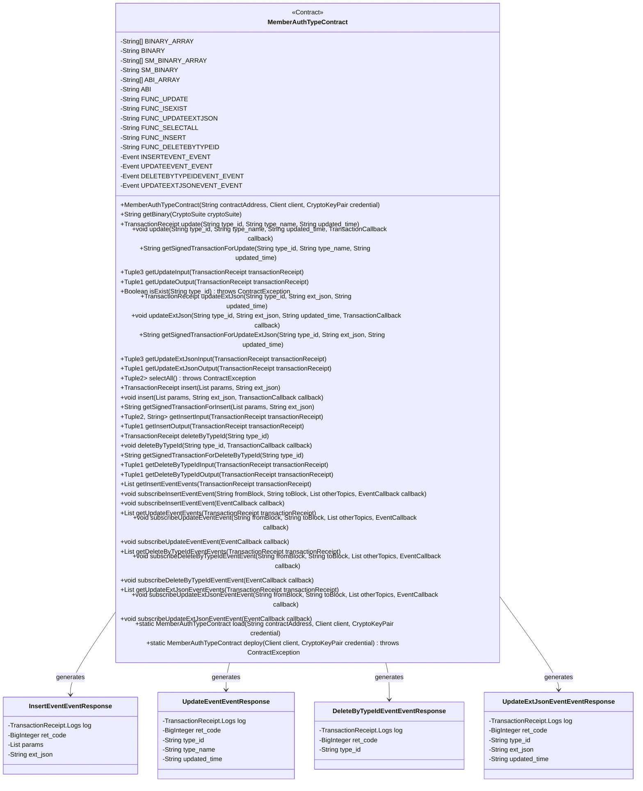
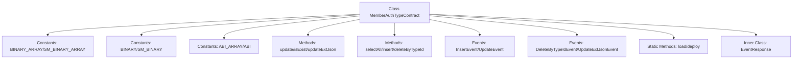
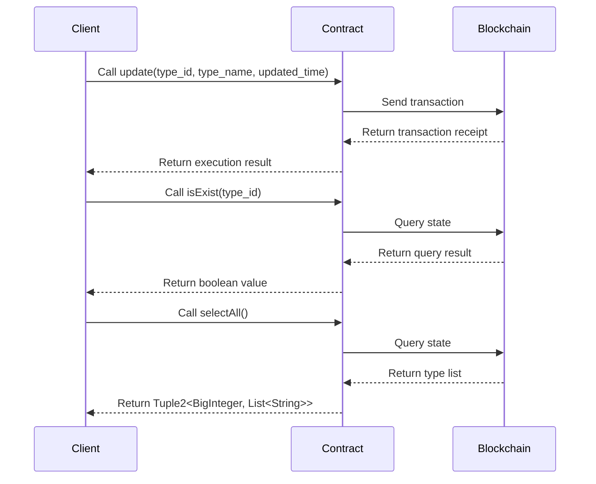

# Basic Information

|      |      |
|------|------|
| Name | MemberAuthTypeContract |
| Language | .java |
| Code Path | WeFe/manager/manager-service/src/main/java/com/welab/wefe/manager/service/contract/MemberAuthTypeContract.java |
| Package Name | com.welab.wefe.manager.service.contract |
| Dependencies | ['org.fisco.bcos.sdk.abi.FunctionReturnDecoder', 'org.fisco.bcos.sdk.abi.TypeReference', 'org.fisco.bcos.sdk.abi.datatypes', 'org.fisco.bcos.sdk.abi.datatypes.generated.Int256', 'org.fisco.bcos.sdk.abi.datatypes.generated.tuples.generated.Tuple1', 'org.fisco.bcos.sdk.abi.datatypes.generated.tuples.generated.Tuple2', 'org.fisco.bcos.sdk.abi.datatypes.generated.tuples.generated.Tuple3', 'org.fisco.bcos.sdk.client.Client', 'org.fisco.bcos.sdk.contract.Contract', 'org.fisco.bcos.sdk.crypto.CryptoSuite', 'org.fisco.bcos.sdk.crypto.keypair.CryptoKeyPair', 'org.fisco.bcos.sdk.eventsub.EventCallback', 'org.fisco.bcos.sdk.model.CryptoType', 'org.fisco.bcos.sdk.model.TransactionReceipt', 'org.fisco.bcos.sdk.model.callback.TransactionCallback', 'org.fisco.bcos.sdk.transaction.model.exception.ContractException', 'java.math.BigInteger', 'java.util.ArrayList', 'java.util.Arrays', 'java.util.Collections', 'java.util.List'] |
| Brief Description | MemberAuthTypeContract is a smart contract class designed for managing member authentication types. Its main functionalities include:1. Core Contract Features:- Update authentication type information (update)- Check type existence (isExist)- Update extended JSON data (updateExtJson)- Query all types (selectAll)- Add new types (insert)- Delete types (deleteByTypeId)2. Event Monitoring:- Insert event (InsertEvent)- Update event (UpdateEvent)- Delete event (DeleteByTypeIdEvent)- Update JSON event (UpdateExtJsonEvent)3. Technical Characteristics:- Supports ECDSA and SM2 encryption algorithms- Provides synchronous/asynchronous transaction methods- Supports event subscription functionality- Includes complete ABI and binary code4. Data Structures:- Uses strings to store type IDs, names, and timestamps- Supports dynamic arrays and JSON extended dataThis contract is suitable for blockchain application scenarios requiring management of multiple authentication types. |

# Description

MemberAuthTypeContract is a smart contract class designed to manage member authentication types. It inherits from the Contract base class and provides functionalities for interacting with the blockchain. The contract includes the following primary features:

1. Core Function Methods:
- update(): Updates authentication type information  
- isExist(): Checks if a type exists  
- updateExtJson(): Updates extended JSON information  
- selectAll(): Queries all types  
- insert(): Inserts a new authentication type  
- deleteByTypeId(): Deletes a specified type  

2. Event Listeners:
- insertEvent: Insert event  
- updateEvent: Update event  
- deleteByTypeIdEvent: Delete event  
- updateExtJsonEvent: Update JSON event  

3. Auxiliary Functions:
- Provides ABI and binary code  
- Supports both ECDSA and SM2 encryption algorithms  
- Includes input/output parameter parsing methods  
- Supports synchronous and asynchronous transactions  
- Offers event subscription functionality  

The contract is written in Solidity, supports complex data types such as strings and arrays, and implements off-chain notifications through an event mechanism. Each method provides a complete transaction processing flow, including transaction submission, receipt retrieval, and result parsing.

# Class Summary

| Name   | Type  | Description |
|-------|------|-------------|
| MemberAuthTypeContract | class | MemberAuthTypeContract is a smart contract class designed for managing member authentication types. Its primary functionalities include:1. Providing operations for updating, querying, inserting, and deleting authentication types  2. Containing 4 events: insertEvent, updateEvent, deleteByTypeIdEvent, and updateExtJsonEvent  3. Supporting two encryption algorithms: ECDSA and SM2  4. Offering both synchronous and asynchronous transaction execution modes  5. Including complete ABI and binary code  Key Points:  - Inherits from the Contract base class  - Contains 6 main functions: update, isExist, updateExtJson, selectAll, insert, and deleteByTypeId  - Each function has corresponding input/output parsing methods  - Supports event subscription functionality  - Provides contract deployment and loading methods  This is a comprehensive smart contract wrapper class for interacting with on-chain contracts. |

## Class MemberAuthTypeContract

|      |      |
|------|------|
| Access Modifier | @SuppressWarnings("unchecked");public |
| Type | class |
| Name | MemberAuthTypeContract |
| Description | MemberAuthTypeContract is a smart contract class designed for managing member authentication types. Its primary functionalities include:1. Providing operations for updating, querying, inserting, and deleting authentication types  2. Containing 4 events: insertEvent, updateEvent, deleteByTypeIdEvent, and updateExtJsonEvent  3. Supporting two encryption algorithms: ECDSA and SM2  4. Offering both synchronous and asynchronous transaction execution modes  5. Including complete ABI and binary code  Key Points:  - Inherits from the Contract base class  - Contains 6 main functions: update, isExist, updateExtJson, selectAll, insert, and deleteByTypeId  - Each function has corresponding input/output parsing methods  - Supports event subscription functionality  - Provides contract deployment and loading methods  This is a comprehensive smart contract wrapper class for interacting with on-chain contracts. |

### UML Class Diagram

### Internal Method Call Graph

This code is a Java wrapper class for a smart contract, with main functionalities including:
1. Providing member authentication type management functions including CRUD operations
2. Defining 4 events for recording contract operation logs
3. Supporting two interaction modes: regular transactions and query calls
4. Containing complete ABI and binary code to support contract deployment and loading
5. Using generics and Tuple structures to handle complex return values
6. Providing subscription functionality for event listening
7. Supporting both national cryptographic and non-national cryptographic algorithms

### Field List

| Name  | Type  | Description |
|-------|-------|------|
| INSERTEVENT_EVENT = new Event("insertEvent",             Arrays.<TypeReference<?>>asList(new TypeReference<Int256>() {}, new TypeReference<DynamicArray<Utf8String>>() {}, new TypeReference<Utf8String>() {})) | Event | Define a static constant INSERTEVENT_EVENT of type Event, containing the event name "insertEvent" and three parameter types: Int256, DynamicArray<Utf8String>, and Utf8String. |
| FUNC_DELETEBYTYPEID = "deleteByTypeId" | String | The static constant FUNC_DELETEBYTYPEID is defined as "deleteByTypeId". |
| FUNC_SELECTALL = "selectAll" | String | Define a public static constant FUNC_SELECTALL with the value "selectAll". |
| FUNC_UPDATEEXTJSON = "updateExtJson" | String | Static constant string, used for updating extended JSON data. |
| SM_BINARY_ARRAY = {"60806040523480156200001157600080fd5b506110016000806101000a81548173ffffffffffffffffffffffffffffffffffffffff021916908373ffffffffffffffffffffffffffffffffffffffff1602179055506000809054906101000a900473ffffffffffffffffffffffffffffffffffffffff1673ffffffffffffffffffffffffffffffffffffffff1663c92a78016040805190810160405280601081526020017f6d656d6265725f617574685f74797065000000000000000000000000000000008152506040518263ffffffff167c010000000000000000000000000000000000000000000000000000000002815260040162000101919062000270565b602060405180830381600087803b1580156200011c57600080fd5b505af115801562000131573d6000803e3d6000fd5b505050506040513d601f19601f8201168201806040525062000157919081019062000174565b506200031a565b60006200016c8251620002c9565b905092915050565b6000602082840312156200018757600080fd5b600062000197848285016200015e565b91505092915050565b6000620001ad82620002be565b808452620001c3816020860160208601620002d3565b620001ce8162000309565b602085010191505092915050565b6000603482527f747970655f69642c747970655f6e616d652c637265617465645f74696d652c7560208301527f7064617465645f74696d652c6578745f6a736f6e0000000000000000000000006040830152606082019050919050565b6000600682527f6669785f696400000000000000000000000000000000000000000000000000006020830152604082019050919050565b600060608201905081810360008301526200028c8184620001a0565b90508181036020830152620002a18162000239565b90508181036040830152620002b681620001dc565b905092915050565b600081519050919050565b6000819050919050565b60005b83811015620002f3578082015181840152602081019050620002d6565b8381111562000303576000848401525b50505050565b6000601f19601f8301169050919050565b613598806200032a6000396000f300608060405260043610610078576000357c0100000000000000000000000000000000000000000000000000000000900463ffffffff16806315d0d6251461007d578063568fe885146100ba5780637d71196c146100f75780639b6ba099146101345780639eb03ade14610171578063c181ca36146101ae575b600080fd5b34801561008957600080fd5b506100a4600480360361009f9190810190612c0e565b6101da565b6040516100b19190612f20565b60405180910390f35b3480156100c657600080fd5b506100e160048036036100dc9190810190612b8c565b61071c565b6040516100ee9190612f05565b60405180910390f35b34801561010357600080fd5b5061011e60048036036101199190810190612b8c565b610ae0565b60405161012b9190612f20565b60405180910390f35b34801561014057600080fd5b5061015b60048036036101569190810190612c0e565b610e6b565b6040516101689190612f20565b60405180910390f35b34801561017d57600080fd5b5061019860048036036101939190810190612a53565b611425565b6040516101a59190612f20565b60405180910390f35b3480156101ba57600080fd5b506101c3611b97565b6040516101d1929190612f3b565b60405180910390f35b6000806000806000806000809054906101000a900473ffffffffffffffffffffffffffffffffffffffff1673ffffffffffffffffffffffffffffffffffffffff166359a48b656040805190810160405280601081526020017f6d656d6265725f617574685f74797065000000000000000000000000000000008152506040518263ffffffff167c010000000000000000000000000000000000000000000000000000000002815260040161028e919061303a565b602060405180830381600087803b1580156102a857600080fd5b505af11580156102bc573d6000803e3d6000fd5b505050506040513d601f19601f820116820180604052506102e09190810190612b3a565b94508473ffffffffffffffffffffffffffffffffffffffff1663c74f8caf6040518163ffffffff167c0100000000000000000000000000000000000000000000000000000000028152600401602060405180830381600087803b15801561034657600080fd5b505af115801561035a573d6000803e3d6000fd5b505050506040513d601f19601f8201168201806040525061037e9190810190612abf565b93508373ffffffffffffffffffffffffffffffffffffffff1663ae763db58a6040518263ffffffff167c01000000000000000000000000000000000000000000000000000000000281526004016103d5919061314f565b600060405180830381600087803b1580156103ef57600080fd5b505af1158015610403573d6000803e3d6000fd5b505050508473ffffffffffffffffffffffffffffffffffffffff16635887ab246040518163ffffffff167c0100000000000000000000000000000000000000000000000000000000028152600401602060405180830381600087803b15801561046b57600080fd5b505af115801561047f573d6000803e3d6000fd5b505050506040513d601f19601f820116820180604052506104a39190810190612b11565b92508273ffffffffffffffffffffffffffffffffffffffff16631a391cb4896040518263ffffffff167c01000000000000000000000000000000000000000000000000000000000281526004016104fa9190613342565b600060405180830381600087803b15801561051457600080fd5b505af1158015610528573d6000803e3d6000fd5b505050508273ffffffffffffffffffffffffffffffffffffffff16631a391cb4886040518263ffffffff167c010000000000000000000000000000000000000000000000000000000002815260040161058191906131d9565b600060405180830381600087803b15801561059b57600080fd5b505af11580156105af573d6000803e3d6000fd5b505050508473ffffffffffffffffffffffffffffffffffffffff1663664b37d66040805190810160405280600a81526020017f6669785f69645f3030360000000000000000000000000000000000000000000081525085876040518463ffffffff167c0100000000000000000000000000000000000000000000000000000000028152600401610641939291906130bc565b602060405180830381600087803b15801561065b57600080fd5b505af115801561066f573d6000803e3d6000fd5b505050506040513d601f19601f820116820180604052506106939190810190612b63565b9150600090506001821215156106ac57600090506106d0565b7ffffffffffffffffffffffffffffffffffffffffffffffffffffffffffffffffe90505b7fb36a4960db7128c065f905021bc6b7ab38c8106c359c6ac8dcd55ed9356c994c818a8a8a6040516107059493929190612fe0565b60405180910390a180955050505050509392505050565b6000806000806000809054906101000a900473ffffffffffffffffffffffffffffffffffffffff1673ffffffffffffffffffffffffffffffffffffffff166359a48b656040805190810160405280601081526020017f6d656d6265725f617574685f74797065000000000000000000000000000000008152506040518263ffffffff167c01000000000000000000000000000000000000000000000000000000000281526004016107cd919061303a565b602060405180830381600087803b1580156107e757600080fd5b505af11580156107fb573d6000803e3d6000fd5b505050506040513d601f19601f8201168201806040525061081f9190810190612b3a565b92508273ffffffffffffffffffffffffffffffffffffffff1663c74f8caf6040518163ffffffff167c0100000000000000000000000000000000000000000000000000000000028152600401602060405180830381600087803b15801561088557600080fd5b505af1158015610899573d6000803e3d6000fd5b505050506040513d601f19601f820116820180604052506108bd9190810190612abf565b91508173ffffffffffffffffffffffffffffffffffffffff1663ae763db5866040518263ffffffff167c0100000000000000000000000000000000000000000000000000000000028152600401610914919061314f565b600060405180830381600087803b15801561092e57600080fd5b505af1158015610942573d6000803e3d6000fd5b505050508273ffffffffffffffffffffffffffffffffffffffff1663d8ac59576040805190810160405280600a81526020017f6669785f69645f30303600000000000000000000000000000000000000000000815250846040518363ffffffff167c01000000000000000000000000000000000000000000000000000000000281526004016109d292919061305c565b602060405180830381600087803b1580156109ec57600080fd5b505af1158015610a00573d6000803e3d6000fd5b505050506040513d601f19601f82011682018060405250610a249190810190612ae8565b905060008173ffffffffffffffffffffffffffffffffffffffff1663d3e9af5a6040518163ffffffff167c0100000000000000000000000000000000000000000000000000000000028152600401602060405180830381600087803b158015610a8c57600080fd5b505af1158015610aa0573d6000803e3d6000fd5b505050506040513d601f19601f82011682018060405250610ac49190810190612b63565b1115610ad35760019350610ad8565b600093505b505050919050565b60008060008060008093506000809054906101000a900473ffffffffffffffffffffffffffffffffffffffff1673ffffffffffffffffffffffffffffffffffffffff166359a48b656040805190810160405280601081526020017f6d656d6265725f617574685f74797065000000000000000000000000000000008152506040518263ffffffff167c0100000000000000000000000000000000000000000000000000000000028152600401610b96919061303a565b602060405180830381600087803b158015610bb057600080fd5b505af1158015610bc4573d6000803e3d6000fd5b505050506040513d601f19601f82011682018060405250610be89190810190612b3a565b92508273ffffffffffffffffffffffffffffffffffffffff1663c74f8caf6040518163ffffffff167c0100000000000000000000000000000000000000000000000000000000028152600401602060405180830381600087803b158015610c4e57600080fd5b505af1158015610c62573d6000803e3d6000fd5b505050506040513d601f19601f82011682018060405250610c869190810190612abf565b91508173ffffffffffffffffffffffffffffffffffffffff1663ae763db5876040518263ffffffff167c0100000000000000000000000000000000000000000000000000000000028152600401610c", "dd919061314f565b600060405180830381600087803b158015610cf757600080fd5b505af1158015610d0b573d6000803e3d6000fd5b505050508273ffffffffffffffffffffffffffffffffffffffff166309ff42f06040805190810160405280600a81526020017f6669785f69645f30303600000000000000000000000000000000000000000000815250846040518363ffffffff167c0100000000000000000000000000000000000000000000000000000000028152600401610d9b92919061305c565b602060405180830381600087803b158015610db557600080fd5b505af1158015610dc9573d6000803e3d6000fd5b505050506040513d601f19601f82011682018060405250610ded9190810190612b63565b9050600181121515610e025760009350610e26565b7ffffffffffffffffffffffffffffffffffffffffffffffffffffffffffffffffe93505b7f6b2f980959df7c69484eedc69946c27b3743d020380d5f3600dd0b0f57d0f4b18487604051610e57929190612fb0565b60405180910390a180945050505050919050565b60008060008060008060009450610e818961071c565b1515610eef577fffffffffffffffffffffffffffffffffffffffffffffffffffffffffffffffff94507f231031b5a33d2c7c5550f8174512618ed672d52be443d80b5146746637935cba858a8a8a604051610edf9493929190612fe0565b60405180910390a1849550611419565b6000809054906101000a900473ffffffffffffffffffffffffffffffffffffffff1673ffffffffffffffffffffffffffffffffffffffff166359a48b656040805190810160405280601081526020017f6d656d6265725f617574685f74797065000000000000000000000000000000008152506040518263ffffffff167c0100000000000000000000000000000000000000000000000000000000028152600401610f9a919061303a565b602060405180830381600087803b158015610fb457600080fd5b505af1158015610fc8573d6000803e3d6000fd5b505050506040513d601f19601f82011682018060405250610fec9190810190612b3a565b93508373ffffffffffffffffffffffffffffffffffffffff1663c74f8caf6040518163ffffffff167c0100000000000000000000000000000000000000000000000000000000028152600401602060405180830381600087803b15801561105257600080fd5b505af1158015611066573d6000803e3d6000fd5b505050506040513d601f19601f8201168201806040525061108a9190810190612abf565b92508273ffffffffffffffffffffffffffffffffffffffff1663ae763db58a6040518263ffffffff167c01000000000000000000000000000000000000000000000000000000000281526004016110e1919061314f565b600060405180830381600087803b1580156110fb57600080fd5b505af115801561110f573d6000803e3d6000fd5b505050508373ffffffffffffffffffffffffffffffffffffffff16635887ab246040518163ffffffff167c0100000000000000000000000000000000000000000000000000000000028152600401602060405180830381600087803b15801561117757600080fd5b505af115801561118b573d6000803e3d6000fd5b505050506040513d601f19601f820116820180604052506111af9190810190612b11565b91508173ffffffffffffffffffffffffffffffffffffffff16631a391cb4896040518263ffffffff167c010000000000000000000000000000000000000000000000000000000002815260040161120691906132ed565b600060405180830381600087803b15801561122057600080fd5b505af1158015611234573d6000803e3d6000fd5b505050508173ffffffffffffffffffffffffffffffffffffffff16631a391cb4886040518263ffffffff167c010000000000000000000000000000000000000000000000000000000002815260040161128d91906131d9565b600060405180830381600087803b1580156112a757600080fd5b505af11580156112bb573d6000803e3d6000fd5b505050508373ffffffffffffffffffffffffffffffffffffffff1663664b37d66040805190810160405280600a81526020017f6669785f69645f3030360000000000000000000000000000000000000000000081525084866040518463ffffffff167c010000000000000000000000000000000000000000000000000000000002815260040161134d939291906130bc565b602060405180830381600087803b15801561136757600080fd5b505af115801561137b573d6000803e3d6000fd5b505050506040513d601f19601f8201168201806040525061139f9190810190612b63565b90506001811215156113b457600094506113d8565b7ffffffffffffffffffffffffffffffffffffffffffffffffffffffffffffffffe94505b7f231031b5a33d2c7c5550f8174512618ed672d52be443d80b5146746637935cba858a8a8a60405161140d9493929190612fe0565b60405180910390a18095505b50505050509392505050565b600080600080600080935061145187600081518110151561144257fe5b9060200190602002015161071c565b156114dc577fffffffffffffffffffffffffffffffffffffffffffffffffffffffffffffffff93507fcb263a23d186eec891d55f1e0ba96ec8290af8c893d32d644c22dbff0953e51f8488886040516114ac93929190612f6b565b60405180910390a17fffffffffffffffffffffffffffffffffffffffffffffffffffffffffffffffff9450611b8d565b6000809054906101000a900473ffffffffffffffffffffffffffffffffffffffff1673ffffffffffffffffffffffffffffffffffffffff166359a48b656040805190810160405280601081526020017f6d656d6265725f617574685f74797065000000000000000000000000000000008152506040518263ffffffff167c0100000000000000000000000000000000000000000000000000000000028152600401611587919061303a565b602060405180830381600087803b1580156115a157600080fd5b505af11580156115b5573d6000803e3d6000fd5b505050506040513d601f19601f820116820180604052506115d99190810190612b3a565b92508273ffffffffffffffffffffffffffffffffffffffff16635887ab246040518163ffffffff167c0100000000000000000000000000000000000000000000000000000000028152600401602060405180830381600087803b15801561163f57600080fd5b505af1158015611653573d6000803e3d6000fd5b505050506040513d601f19601f820116820180604052506116779190810190612b11565b91508173ffffffffffffffffffffffffffffffffffffffff16631a391cb46040805190810160405280600a81526020017f6669785f69645f303036000000000000000000000000000000000000000000008152506040518263ffffffff167c01000000000000000000000000000000000000000000000000000000000281526004016117039190613263565b600060405180830381600087803b15801561171d57600080fd5b505af1158015611731573d6000803e3d6000fd5b505050508173ffffffffffffffffffffffffffffffffffffffff16631a391cb488600081518110151561176057fe5b906020019060200201516040518263ffffffff167c01000000000000000000000000000000000000000000000000000000000281526004016117a2919061311a565b600060405180830381600087803b1580156117bc57600080fd5b505af11580156117d0573d6000803e3d6000fd5b505050508173ffffffffffffffffffffffffffffffffffffffff16631a391cb48860018151811015156117ff57fe5b906020019060200201516040518263ffffffff167c010000000000000000000000000000000000000000000000000000000002815260040161184191906132b8565b600060405180830381600087803b15801561185b57600080fd5b505af115801561186f573d6000803e3d6000fd5b505050508173ffffffffffffffffffffffffffffffffffffffff16631a391cb488600281518110151561189e57fe5b906020019060200201516040518263ffffffff167c01000000000000000000000000000000000000000000000000000000000281526004016118e0919061322e565b600060405180830381600087803b1580156118fa57600080fd5b505af115801561190e573d6000803e3d6000fd5b505050508173ffffffffffffffffffffffffffffffffffffffff16631a391cb488600381518110151561193d57fe5b906020019060200201516040518263ffffffff167c010000000000000000000000000000000000000000000000000000000002815260040161197f91906131a4565b600060405180830381600087803b15801561199957600080fd5b505af11580156119ad573d6000803e3d6000fd5b505050508173ffffffffffffffffffffffffffffffffffffffff16631a391cb4876040518263ffffffff167c0100000000000000000000000000000000000000000000000000000000028152600401611a069190613342565b600060405180830381600087803b158015611a2057600080fd5b505af1158015611a34573d6000803e3d6000fd5b505050508273ffffffffffffffffffffffffffffffffffffffff16634c6f30c06040805190810160405280600a81526020017f6669785f69645f30303600000000000000000000000000000000000000000000815250846040518363ffffffff167c0100000000000000000000000000000000000000000000000000000000028152600401611ac492919061308c565b602060405180830381600087803b158015611ade57600080fd5b505af1158015611af2573d6000803e3d6000fd5b505050506040513d601f19601f82011682018060405250611b169190810190612b63565b90506001811415611b2a5760009350611b4e565b7ffffffffffffffffffffffffffffffffffffffffffffffffffffffffffffffffe93505b7fcb263a23d186eec891d55f1e0ba96ec8290af8c893d32d644c22dbff0953e51f848888604051611b8193929190612f6b565b60405180910390a18094505b5050505092915050565b600060606000806000809054906101000a900473ffffffffffffffffffffffffffffffffffffffff1673ffffffffffffffffffffffffffffffffffffffff166359a48b656040805190810160405280601081526020017f6d656d6265725f617574685f74797065000000000000000000000000000000008152506040518263ffffffff167c0100000000000000000000000000000000000000000000000000000000028152600401611c49919061303a565b602060405180830381600087803b158015611c6357600080fd5b505af1158015611c77573d6000803e3d6000fd5b505050506040513d601f19601f82011682018060405250611c9b9190810190612b3a565b91508173ffffffffffffffffffffffffffffffffffffffff1663d8ac59576040805190810160405280600a81526020017f6669785f69645f3030", "36000000000000000000000000000000000000000000008152508473ffffffffffffffffffffffffffffffffffffffff1663c74f8caf6040518163ffffffff167c0100000000000000000000000000000000000000000000000000000000028152600401602060405180830381600087803b158015611d5357600080fd5b505af1158015611d67573d6000803e3d6000fd5b505050506040513d601f19601f82011682018060405250611d8b9190810190612abf565b6040518363ffffffff167c0100000000000000000000000000000000000000000000000000000000028152600401611dc492919061305c565b602060405180830381600087803b158015611dde57600080fd5b505af1158015611df2573d6000803e3d6000fd5b505050506040513d601f19601f82011682018060405250611e169190810190612ae8565b90508073ffffffffffffffffffffffffffffffffffffffff1663d3e9af5a6040518163ffffffff167c0100000000000000000000000000000000000000000000000000000000028152600401602060405180830381600087803b158015611e7c57600080fd5b505af1158015611e90573d6000803e3d6000fd5b505050506040513d601f19601f82011682018060405250611eb49190810190612b63565b60001415611f22577ffffffffffffffffffffffffffffffffffffffffffffffffffffffffffffffffd6000604051908082528060200260200182016040528015611f1257816020015b6060815260200190600190039081611efd5790505b5081915080905093509350611f35565b6000611f2d82611f3b565b819150935093505b50509091565b60608060008060608573ffffffffffffffffffffffffffffffffffffffff1663d3e9af5a6040518163ffffffff167c0100000000000000000000000000000000000000000000000000000000028152600401602060405180830381600087803b158015611fa757600080fd5b505af1158015611fbb573d6000803e3d6000fd5b505050506040513d601f19601f82011682018060405250611fdf9190810190612b63565b60405190808252806020026020018201604052801561201257816020015b6060815260200190600190039081611ffd5790505b509350600092505b8573ffffffffffffffffffffffffffffffffffffffff1663d3e9af5a6040518163ffffffff167c0100000000000000000000000000000000000000000000000000000000028152600401602060405180830381600087803b15801561207e57600080fd5b505af1158015612092573d6000803e3d6000fd5b505050506040513d601f19601f820116820180604052506120b69190810190612b63565b831215612636578573ffffffffffffffffffffffffffffffffffffffff16633dd2b614846040518263ffffffff167c01000000000000000000000000000000000000000000000000000000000281526004016121129190612f20565b602060405180830381600087803b15801561212c57600080fd5b505af1158015612140573d6000803e3d6000fd5b505050506040513d601f19601f820116820180604052506121649190810190612b11565b915061225661221b8373ffffffffffffffffffffffffffffffffffffffff16639bca41e86040518163ffffffff167c01000000000000000000000000000000000000000000000000000000000281526004016121bf906130fa565b600060405180830381600087803b1580156121d957600080fd5b505af11580156121ed573d6000803e3d6000fd5b505050506040513d6000823e3d601f19601f820116820180604052506122169190810190612bcd565b612642565b6040805190810160405280600181526020017f7c0000000000000000000000000000000000000000000000000000000000000081525061269b565b90506123138161230e8473ffffffffffffffffffffffffffffffffffffffff16639bca41e86040518163ffffffff167c01000000000000000000000000000000000000000000000000000000000281526004016122b290613298565b600060405180830381600087803b1580156122cc57600080fd5b505af11580156122e0573d6000803e3d6000fd5b505050506040513d6000823e3d601f19601f820116820180604052506123099190810190612bcd565b612642565b61269b565b9050612354816040805190810160405280600181526020017f7c0000000000000000000000000000000000000000000000000000000000000081525061269b565b90506124118161240c8473ffffffffffffffffffffffffffffffffffffffff16639bca41e86040518163ffffffff167c01000000000000000000000000000000000000000000000000000000000281526004016123b09061320e565b600060405180830381600087803b1580156123ca57600080fd5b505af11580156123de573d6000803e3d6000fd5b505050506040513d6000823e3d601f19601f820116820180604052506124079190810190612bcd565b612642565b61269b565b9050612452816040805190810160405280600181526020017f7c0000000000000000000000000000000000000000000000000000000000000081525061269b565b905061250f8161250a8473ffffffffffffffffffffffffffffffffffffffff16639bca41e86040518163ffffffff167c01000000000000000000000000000000000000000000000000000000000281526004016124ae90613184565b600060405180830381600087803b1580156124c857600080fd5b505af11580156124dc573d6000803e3d6000fd5b505050506040513d6000823e3d601f19601f820116820180604052506125059190810190612bcd565b612642565b61269b565b9050612550816040805190810160405280600181526020017f7c0000000000000000000000000000000000000000000000000000000000000081525061269b565b905061260d816126088473ffffffffffffffffffffffffffffffffffffffff16639bca41e86040518163ffffffff167c01000000000000000000000000000000000000000000000000000000000281526004016125ac90613322565b600060405180830381600087803b1580156125c657600080fd5b505af11580156125da573d6000803e3d6000fd5b505050506040513d6000823e3d601f19601f820116820180604052506126039190810190612bcd565b612642565b61269b565b905080848481518110151561261e57fe5b9060200190602002018190525082600101925061201a565b83945050505050919050565b6060600061264f8361286c565b1415612692576040805190810160405280600181526020017f20000000000000000000000000000000000000000000000000000000000000008152509050612696565b8190505b919050565b606080606080606060008088955087945084518651016040519080825280601f01601f1916602001820160405280156126e35781602001602082028038833980820191505090505b50935083925060009150600090505b85518110156127a557858181518110151561270957fe5b9060200101517f010000000000000000000000000000000000000000000000000000000000000090047f010000000000000000000000000000000000000000000000000000000000000002838380600101945081518110151561276857fe5b9060200101907effffffffffffffffffffffffffffffffffffffffffffffffffffffffffffff1916908160001a90535080806001019150506126f2565b600090505b845181101561285d5784818151811015156127c157fe5b9060200101517f010000000000000000000000000000000000000000000000000000000000000090047f010000000000000000000000000000000000000000000000000000000000000002838380600101945081518110151561282057fe5b9060200101907effffffffffffffffffffffffffffffffffffffffffffffffffffffffffffff1916908160001a90535080806001019150506127aa565b83965050505050505092915050565b600081519050919050565b600082601f830112151561288a57600080fd5b813561289d612898826133a4565b613377565b9150818183526020840193506020810190508360005b838110156128e357813586016128c98882612951565b8452602084019350602083019250506001810190506128b3565b5050505092915050565b60006128f98251613495565b905092915050565b600061290d82516134a7565b905092915050565b600061292182516134b9565b905092915050565b600061293582516134cb565b905092915050565b600061294982516134dd565b905092915050565b600082601f830112151561296457600080fd5b8135612977612972826133cc565b613377565b9150808252602083016020830185838301111561299357600080fd5b61299e83828461350b565b50505092915050565b600082601f83011215156129ba57600080fd5b81356129cd6129c8826133f8565b613377565b915080825260208301602083018583830111156129e957600080fd5b6129f483828461350b565b50505092915050565b600082601f8301121515612a1057600080fd5b8151612a23612a1e826133f8565b613377565b91508082526020830160208301858383011115612a3f57600080fd5b612a4a83828461351a565b50505092915050565b60008060408385031215612a6657600080fd5b600083013567ffffffffffffffff811115612a8057600080fd5b612a8c85828601612877565b925050602083013567ffffffffffffffff811115612aa957600080fd5b612ab5858286016129a7565b9150509250929050565b600060208284031215612ad157600080fd5b6000612adf848285016128ed565b91505092915050565b600060208284031215612afa57600080fd5b6000612b0884828501612901565b91505092915050565b600060208284031215612b2357600080fd5b6000612b3184828501612915565b91505092915050565b600060208284031215612b4c57600080fd5b6000612b5a84828501612929565b91505092915050565b600060208284031215612b7557600080fd5b6000612b838482850161293d565b91505092915050565b600060208284031215612b9e57600080fd5b600082013567ffffffffffffffff811115612bb857600080fd5b612bc4848285016129a7565b91505092915050565b600060208284031215612bdf57600080fd5b600082015167ffffffffffffffff811115612bf957600080fd5b612c05848285016129fd565b91505092915050565b600080600060608486031215612c2357600080fd5b600084013567ffffffffffffffff811115612c3d57600080fd5b612c49868287016129a7565b935050602084013567ffffffffffffffff811115612c6657600080fd5b612c72868287016129a7565b925050604084013567ffffffffffffffff811115612c8f57600080fd5b612c9b868287016129a7565b9150509250925092565b6000612cb082613431565b80845260208401935083602082028501612cc985613424565b60005b84811015612d025783", "83038852612ce4838351612d85565b9250612cef82613452565b9150602088019750600181019050612ccc565b508196508694505050505092915050565b612d1c8161347f565b82525050565b612d2b816134e7565b82525050565b612d3a816134f9565b82525050565b612d498161348b565b82525050565b6000612d5a82613447565b808452612d6e81602086016020860161351a565b612d778161354d565b602085010191505092915050565b6000612d908261343c565b808452612da481602086016020860161351a565b612dad8161354d565b602085010191505092915050565b6000600782527f747970655f6964000000000000000000000000000000000000000000000000006020830152604082019050919050565b6000600c82527f757064617465645f74696d6500000000000000000000000000000000000000006020830152604082019050919050565b6000600c82527f637265617465645f74696d6500000000000000000000000000000000000000006020830152604082019050919050565b6000600682527f6669785f696400000000000000000000000000000000000000000000000000006020830152604082019050919050565b6000600982527f747970655f6e616d6500000000000000000000000000000000000000000000006020830152604082019050919050565b6000600882527f6578745f6a736f6e0000000000000000000000000000000000000000000000006020830152604082019050919050565b6000602082019050612f1a6000830184612d13565b92915050565b6000602082019050612f356000830184612d40565b92915050565b6000604082019050612f506000830185612d40565b8181036020830152612f628184612ca5565b90509392505050565b6000606082019050612f806000830186612d40565b8181036020830152612f928185612ca5565b90508181036040830152612fa68184612d4f565b9050949350505050565b6000604082019050612fc56000830185612d40565b8181036020830152612fd78184612d4f565b90509392505050565b6000608082019050612ff56000830187612d40565b81810360208301526130078186612d4f565b9050818103604083015261301b8185612d4f565b9050818103606083015261302f8184612d4f565b905095945050505050565b600060208201905081810360008301526130548184612d85565b905092915050565b600060408201905081810360008301526130768185612d85565b90506130856020830184612d22565b9392505050565b600060408201905081810360008301526130a68185612d85565b90506130b56020830184612d31565b9392505050565b600060608201905081810360008301526130d68186612d85565b90506130e56020830185612d31565b6130f26040830184612d22565b949350505050565b6000602082019050818103600083015261311381612dbb565b9050919050565b6000604082019050818103600083015261313381612dbb565b905081810360208301526131478184612d85565b905092915050565b6000604082019050818103600083015261316881612dbb565b9050818103602083015261317c8184612d4f565b905092915050565b6000602082019050818103600083015261319d81612df2565b9050919050565b600060408201905081810360008301526131bd81612df2565b905081810360208301526131d18184612d85565b905092915050565b600060408201905081810360008301526131f281612df2565b905081810360208301526132068184612d4f565b905092915050565b6000602082019050818103600083015261322781612e29565b9050919050565b6000604082019050818103600083015261324781612e29565b9050818103602083015261325b8184612d85565b905092915050565b6000604082019050818103600083015261327c81612e60565b905081810360208301526132908184612d85565b905092915050565b600060208201905081810360008301526132b181612e97565b9050919050565b600060408201905081810360008301526132d181612e97565b905081810360208301526132e58184612d85565b905092915050565b6000604082019050818103600083015261330681612e97565b9050818103602083015261331a8184612d4f565b905092915050565b6000602082019050818103600083015261333b81612ece565b9050919050565b6000604082019050818103600083015261335b81612ece565b9050818103602083015261336f8184612d4f565b905092915050565b6000604051905081810181811067ffffffffffffffff8211171561339a57600080fd5b8060405250919050565b600067ffffffffffffffff8211156133bb57600080fd5b602082029050602081019050919050565b600067ffffffffffffffff8211156133e357600080fd5b601f19601f8301169050602081019050919050565b600067ffffffffffffffff82111561340f57600080fd5b601f19601f8301169050602081019050919050565b6000602082019050919050565b600081519050919050565b600081519050919050565b600081519050919050565b6000602082019050919050565b600073ffffffffffffffffffffffffffffffffffffffff82169050919050565b60008115159050919050565b6000819050919050565b60006134a08261345f565b9050919050565b60006134b28261345f565b9050919050565b60006134c48261345f565b9050919050565b60006134d68261345f565b9050919050565b6000819050919050565b60006134f28261345f565b9050919050565b60006135048261345f565b9050919050565b82818337600083830152505050565b60005b8381101561353857808201518184015260208101905061351d565b83811115613547576000848401525b50505050565b6000601f19601f83011690509190505600a265627a7a72305820f02d97234333d662792dfe6f5169ae37634a00e0afc602de39f7290c8c9b124f6c6578706572696d656e74616cf50037"} | String[] | The SM_BINARY_ARRAY contains two long hexadecimal strings, likely representing the bytecode or related data of a smart contract. |
| DELETEBYTYPEIDEVENT_EVENT = new Event("deleteByTypeIdEvent",             Arrays.<TypeReference<?>>asList(new TypeReference<Int256>() {}, new TypeReference<Utf8String>() {})) | Event | The static constant DELETEBYTYPEIDEVENT_EVENT defines an event containing the name "deleteByTypeIdEvent" and two parameter types: Int256 and Utf8String. |
| FUNC_ISEXIST = "isExist" | String | The static constant string FUNC_ISEXIST has a value of "isExist". |
| ABI = String.join("", ABI_ARRAY) | String | Concatenate the elements of the ABI_ARRAY into an ABI string constant. |
| FUNC_INSERT = "insert" | String | The static constant string FUNC_INSERT has a value of "insert". |
| UPDATEEXTJSONEVENT_EVENT = new Event("updateExtJsonEvent",             Arrays.<TypeReference<?>>asList(new TypeReference<Int256>() {}, new TypeReference<Utf8String>() {}, new TypeReference<Utf8String>() {}, new TypeReference<Utf8String>() {})) | Event | Define a static constant UPDATEEXTJSONEVENT_EVENT of type Event, containing four parameters: Int256 and three Utf8String. |
| UPDATEEVENT_EVENT = new Event("updateEvent",             Arrays.<TypeReference<?>>asList(new TypeReference<Int256>() {}, new TypeReference<Utf8String>() {}, new TypeReference<Utf8String>() {}, new TypeReference<Utf8String>() {})) | Event | Define a public static constant event named UPDATEEVENT_EVENT, containing parameters of type Int256 and three Utf8String. |
| SM_BINARY = String.join("", SM_BINARY_ARRAY) | String | Define a static constant SM_BINARY, whose value is a string concatenated from SM_BINARY_ARRAY. |
| ABI_ARRAY = {"[{\"constant\":false,\"inputs\":[{\"name\":\"type_id\",\"type\":\"string\"},{\"name\":\"type_name\",\"type\":\"string\"},{\"name\":\"updated_time\",\"type\":\"string\"}],\"name\":\"update\",\"outputs\":[{\"name\":\"\",\"type\":\"int256\"}],\"payable\":false,\"stateMutability\":\"nonpayable\",\"type\":\"function\"},{\"constant\":true,\"inputs\":[{\"name\":\"type_id\",\"type\":\"string\"}],\"name\":\"isExist\",\"outputs\":[{\"name\":\"\",\"type\":\"bool\"}],\"payable\":false,\"stateMutability\":\"view\",\"type\":\"function\"},{\"constant\":false,\"inputs\":[{\"name\":\"type_id\",\"type\":\"string\"},{\"name\":\"ext_json\",\"type\":\"string\"},{\"name\":\"updated_time\",\"type\":\"string\"}],\"name\":\"updateExtJson\",\"outputs\":[{\"name\":\"\",\"type\":\"int256\"}],\"payable\":false,\"stateMutability\":\"nonpayable\",\"type\":\"function\"},{\"constant\":true,\"inputs\":[],\"name\":\"selectAll\",\"outputs\":[{\"name\":\"\",\"type\":\"int256\"},{\"name\":\"\",\"type\":\"string[]\"}],\"payable\":false,\"stateMutability\":\"view\",\"type\":\"function\"},{\"constant\":false,\"inputs\":[{\"name\":\"params\",\"type\":\"string[]\"},{\"name\":\"ext_json\",\"type\":\"string\"}],\"name\":\"insert\",\"outputs\":[{\"name\":\"\",\"type\":\"int256\"}],\"payable\":false,\"stateMutability\":\"nonpayable\",\"type\":\"function\"},{\"constant\":false,\"inputs\":[{\"name\":\"type_id\",\"type\":\"string\"}],\"name\":\"deleteByTypeId\",\"outputs\":[{\"name\":\"\",\"type\":\"int256\"}],\"payable\":false,\"stateMutability\":\"nonpayable\",\"type\":\"function\"},{\"inputs\":[],\"payable\":false,\"stateMutability\":\"nonpayable\",\"type\":\"constructor\"},{\"anonymous\":false,\"inputs\":[{\"indexed\":false,\"name\":\"ret_code\",\"type\":\"int256\"},{\"indexed\":false,\"name\":\"params\",\"type\":\"string[]\"},{\"indexed\":false,\"name\":\"ext_json\",\"type\":\"string\"}],\"name\":\"insertEvent\",\"type\":\"event\"},{\"anonymous\":false,\"inputs\":[{\"indexed\":false,\"name\":\"ret_code\",\"type\":\"int256\"},{\"indexed\":false,\"name\":\"type_id\",\"type\":\"string\"},{\"indexed\":false,\"name\":\"type_name\",\"type\":\"string\"},{\"indexed\":false,\"name\":\"updated_time\",\"type\":\"string\"}],\"name\":\"updateEvent\",\"type\":\"event\"},{\"anonymous\":false,\"inputs\":[{\"indexed\":false,\"name\":\"ret_code\",\"type\":\"int256\"},{\"indexed\":false,\"name\":\"type_id\",\"type\":\"string\"}],\"name\":\"deleteByTypeIdEvent\",\"type\":\"event\"},{\"anonymous\":false,\"inputs\":[{\"indexed\":false,\"name\":\"ret_code\",\"type\":\"int256\"},{\"indexed\":false,\"name\":\"type_id\",\"type\":\"string\"},{\"indexed\":false,\"name\":\"ext_json\",\"type\":\"string\"},{\"indexed\":false,\"name\":\"updated_time\",\"type\":\"string\"}],\"name\":\"updateExtJsonEvent\",\"type\":\"event\"}]"} | String[] | The ABI array contains the function and event definitions of a smart contract, involving update, query, insert, delete operations and their corresponding events. |
| BINARY_ARRAY = {"60806040523480156200001157600080fd5b506110016000806101000a81548173ffffffffffffffffffffffffffffffffffffffff021916908373ffffffffffffffffffffffffffffffffffffffff1602179055506000809054906101000a900473ffffffffffffffffffffffffffffffffffffffff1673ffffffffffffffffffffffffffffffffffffffff166356004b6a6040805190810160405280601081526020017f6d656d6265725f617574685f74797065000000000000000000000000000000008152506040518263ffffffff167c010000000000000000000000000000000000000000000000000000000002815260040162000101919062000270565b602060405180830381600087803b1580156200011c57600080fd5b505af115801562000131573d6000803e3d6000fd5b505050506040513d601f19601f8201168201806040525062000157919081019062000174565b506200031a565b60006200016c8251620002c9565b905092915050565b6000602082840312156200018757600080fd5b600062000197848285016200015e565b91505092915050565b6000620001ad82620002be565b808452620001c3816020860160208601620002d3565b620001ce8162000309565b602085010191505092915050565b6000600682527f6669785f696400000000000000000000000000000000000000000000000000006020830152604082019050919050565b6000603482527f747970655f69642c747970655f6e616d652c637265617465645f74696d652c7560208301527f7064617465645f74696d652c6578745f6a736f6e0000000000000000000000006040830152606082019050919050565b600060608201905081810360008301526200028c8184620001a0565b90508181036020830152620002a181620001dc565b90508181036040830152620002b68162000213565b905092915050565b600081519050919050565b6000819050919050565b60005b83811015620002f3578082015181840152602081019050620002d6565b8381111562000303576000848401525b50505050565b6000601f19601f8301169050919050565b613598806200032a6000396000f300608060405260043610610078576000357c0100000000000000000000000000000000000000000000000000000000900463ffffffff16806331c3e4561461007d5780634d3d096b146100ba57806363964aa3146100f7578063857cb0eb1461013457806397291150146101605780639a76fa5b1461019d575b600080fd5b34801561008957600080fd5b506100a4600480360361009f9190810190612c0e565b6101da565b6040516100b19190612f20565b60405180910390f35b3480156100c657600080fd5b506100e160048036036100dc9190810190612b8c565b610794565b6040516100ee9190612f05565b60405180910390f35b34801561010357600080fd5b5061011e60048036036101199190810190612c0e565b610b58565b60405161012b9190612f20565b60405180910390f35b34801561014057600080fd5b5061014961109a565b604051610157929190612f3b565b60405180910390f35b34801561016c57600080fd5b5061018760048036036101829190810190612a53565b61143e565b6040516101949190612f20565b60405180910390f35b3480156101a957600080fd5b506101c460048036036101bf9190810190612b8c565b611bb0565b6040516101d19190612f20565b60405180910390f35b600080600080600080600094506101f089610794565b151561025e577fffffffffffffffffffffffffffffffffffffffffffffffffffffffffffffffff94507f0231c8f3a3c3deaaaafc45211385f59dee4db8b34e29d7ff74851d7bc5179d00858a8a8a60405161024e9493929190612fe0565b60405180910390a1849550610788565b6000809054906101000a900473ffffffffffffffffffffffffffffffffffffffff1673ffffffffffffffffffffffffffffffffffffffff1663f23f63c96040805190810160405280601081526020017f6d656d6265725f617574685f74797065000000000000000000000000000000008152506040518263ffffffff167c0100000000000000000000000000000000000000000000000000000000028152600401610309919061303a565b602060405180830381600087803b15801561032357600080fd5b505af1158015610337573d6000803e3d6000fd5b505050506040513d601f19601f8201168201806040525061035b9190810190612b3a565b93508373ffffffffffffffffffffffffffffffffffffffff16637857d7c96040518163ffffffff167c0100000000000000000000000000000000000000000000000000000000028152600401602060405180830381600087803b1580156103c157600080fd5b505af11580156103d5573d6000803e3d6000fd5b505050506040513d601f19601f820116820180604052506103f99190810190612abf565b92508273ffffffffffffffffffffffffffffffffffffffff1663cd30a1d18a6040518263ffffffff167c01000000000000000000000000000000000000000000000000000000000281526004016104509190613263565b600060405180830381600087803b15801561046a57600080fd5b505af115801561047e573d6000803e3d6000fd5b505050508373ffffffffffffffffffffffffffffffffffffffff166313db93466040518163ffffffff167c0100000000000000000000000000000000000000000000000000000000028152600401602060405180830381600087803b1580156104e657600080fd5b505af11580156104fa573d6000803e3d6000fd5b505050506040513d601f19601f8201168201806040525061051e9190810190612b11565b91508173ffffffffffffffffffffffffffffffffffffffff1663e942b516896040518263ffffffff167c01000000000000000000000000000000000000000000000000000000000281526004016105759190613342565b600060405180830381600087803b15801561058f57600080fd5b505af11580156105a3573d6000803e3d6000fd5b505050508173ffffffffffffffffffffffffffffffffffffffff1663e942b516886040518263ffffffff167c01000000000000000000000000000000000000000000000000000000000281526004016105fc91906131d9565b600060405180830381600087803b15801561061657600080fd5b505af115801561062a573d6000803e3d6000fd5b505050508373ffffffffffffffffffffffffffffffffffffffff1663bf2b70a16040805190810160405280600a81526020017f6669785f69645f3030360000000000000000000000000000000000000000000081525084866040518463ffffffff167c01000000000000000000000000000000000000000000000000000000000281526004016106bc939291906130bc565b602060405180830381600087803b1580156106d657600080fd5b505af11580156106ea573d6000803e3d6000fd5b505050506040513d601f19601f8201168201806040525061070e9190810190612b63565b90506001811215156107235760009450610747565b7ffffffffffffffffffffffffffffffffffffffffffffffffffffffffffffffffe94505b7f0231c8f3a3c3deaaaafc45211385f59dee4db8b34e29d7ff74851d7bc5179d00858a8a8a60405161077c9493929190612fe0565b60405180910390a18095505b50505050509392505050565b6000806000806000809054906101000a900473ffffffffffffffffffffffffffffffffffffffff1673ffffffffffffffffffffffffffffffffffffffff1663f23f63c96040805190810160405280601081526020017f6d656d6265725f617574685f74797065000000000000000000000000000000008152506040518263ffffffff167c0100000000000000000000000000000000000000000000000000000000028152600401610845919061303a565b602060405180830381600087803b15801561085f57600080fd5b505af1158015610873573d6000803e3d6000fd5b505050506040513d601f19601f820116820180604052506108979190810190612b3a565b92508273ffffffffffffffffffffffffffffffffffffffff16637857d7c96040518163ffffffff167c0100000000000000000000000000000000000000000000000000000000028152600401602060405180830381600087803b1580156108fd57600080fd5b505af1158015610911573d6000803e3d6000fd5b505050506040513d601f19601f820116820180604052506109359190810190612abf565b91508173ffffffffffffffffffffffffffffffffffffffff1663cd30a1d1866040518263ffffffff167c010000000000000000000000000000000000000000000000000000000002815260040161098c9190613263565b600060405180830381600087803b1580156109a657600080fd5b505af11580156109ba573d6000803e3d6000fd5b505050508273ffffffffffffffffffffffffffffffffffffffff1663e8434e396040805190810160405280600a81526020017f6669785f69645f30303600000000000000000000000000000000000000000000815250846040518363ffffffff167c0100000000000000000000000000000000000000000000000000000000028152600401610a4a92919061305c565b602060405180830381600087803b158015610a6457600080fd5b505af1158015610a78573d6000803e3d6000fd5b505050506040513d601f19601f82011682018060405250610a9c9190810190612ae8565b905060008173ffffffffffffffffffffffffffffffffffffffff1663949d225d6040518163ffffffff167c0100000000000000000000000000000000000000000000000000000000028152600401602060405180830381600087803b158015610b0457600080fd5b505af1158015610b18573d6000803e3d6000fd5b505050506040513d601f19601f82011682018060405250610b3c9190810190612b63565b1115610b4b5760019350610b50565b600093505b505050919050565b6000806000806000806000809054906101000a900473ffffffffffffffffffffffffffffffffffffffff1673ffffffffffffffffffffffffffffffffffffffff1663f23f63c96040805190810160405280601081526020017f6d656d6265725f617574685f74797065000000000000000000000000000000008152506040518263ffffffff167c0100000000000000000000000000000000000000000000000000000000028152600401610c0c919061303a565b602060405180830381600087803b158015610c2657600080fd5b505af1158015610c3a573d6000803e3d6000fd5b505050506040513d601f19601f82011682018060405250610c5e9190810190612b3a565b94508473ffffffffffffffffffffffffffffffffffffffff16637857d7c96040518163ffffffff167c0100000000000000000000000000000000000000000000000000000000028152600401602060405180830381600087803b158015610cc457600080fd5b505af1158015610cd8573d6000803e3d60", "00fd5b505050506040513d601f19601f82011682018060405250610cfc9190810190612abf565b93508373ffffffffffffffffffffffffffffffffffffffff1663cd30a1d18a6040518263ffffffff167c0100000000000000000000000000000000000000000000000000000000028152600401610d539190613263565b600060405180830381600087803b158015610d6d57600080fd5b505af1158015610d81573d6000803e3d6000fd5b505050508473ffffffffffffffffffffffffffffffffffffffff166313db93466040518163ffffffff167c0100000000000000000000000000000000000000000000000000000000028152600401602060405180830381600087803b158015610de957600080fd5b505af1158015610dfd573d6000803e3d6000fd5b505050506040513d601f19601f82011682018060405250610e219190810190612b11565b92508273ffffffffffffffffffffffffffffffffffffffff1663e942b516896040518263ffffffff167c0100000000000000000000000000000000000000000000000000000000028152600401610e78919061311a565b600060405180830381600087803b158015610e9257600080fd5b505af1158015610ea6573d6000803e3d6000fd5b505050508273ffffffffffffffffffffffffffffffffffffffff1663e942b516886040518263ffffffff167c0100000000000000000000000000000000000000000000000000000000028152600401610eff91906131d9565b600060405180830381600087803b158015610f1957600080fd5b505af1158015610f2d573d6000803e3d6000fd5b505050508473ffffffffffffffffffffffffffffffffffffffff1663bf2b70a16040805190810160405280600a81526020017f6669785f69645f3030360000000000000000000000000000000000000000000081525085876040518463ffffffff167c0100000000000000000000000000000000000000000000000000000000028152600401610fbf939291906130bc565b602060405180830381600087803b158015610fd957600080fd5b505af1158015610fed573d6000803e3d6000fd5b505050506040513d601f19601f820116820180604052506110119190810190612b63565b91506000905060018212151561102a576000905061104e565b7ffffffffffffffffffffffffffffffffffffffffffffffffffffffffffffffffe90505b7f91fa9d6109b9b8b47733f98f4b6858346683ebdf73ba3c2f98b90c0d352f83e1818a8a8a6040516110839493929190612fe0565b60405180910390a180955050505050509392505050565b600060606000806000809054906101000a900473ffffffffffffffffffffffffffffffffffffffff1673ffffffffffffffffffffffffffffffffffffffff1663f23f63c96040805190810160405280601081526020017f6d656d6265725f617574685f74797065000000000000000000000000000000008152506040518263ffffffff167c010000000000000000000000000000000000000000000000000000000002815260040161114c919061303a565b602060405180830381600087803b15801561116657600080fd5b505af115801561117a573d6000803e3d6000fd5b505050506040513d601f19601f8201168201806040525061119e9190810190612b3a565b91508173ffffffffffffffffffffffffffffffffffffffff1663e8434e396040805190810160405280600a81526020017f6669785f69645f303036000000000000000000000000000000000000000000008152508473ffffffffffffffffffffffffffffffffffffffff16637857d7c96040518163ffffffff167c0100000000000000000000000000000000000000000000000000000000028152600401602060405180830381600087803b15801561125657600080fd5b505af115801561126a573d6000803e3d6000fd5b505050506040513d601f19601f8201168201806040525061128e9190810190612abf565b6040518363ffffffff167c01000000000000000000000000000000000000000000000000000000000281526004016112c792919061305c565b602060405180830381600087803b1580156112e157600080fd5b505af11580156112f5573d6000803e3d6000fd5b505050506040513d601f19601f820116820180604052506113199190810190612ae8565b90508073ffffffffffffffffffffffffffffffffffffffff1663949d225d6040518163ffffffff167c0100000000000000000000000000000000000000000000000000000000028152600401602060405180830381600087803b15801561137f57600080fd5b505af1158015611393573d6000803e3d6000fd5b505050506040513d601f19601f820116820180604052506113b79190810190612b63565b60001415611425577ffffffffffffffffffffffffffffffffffffffffffffffffffffffffffffffffd600060405190808252806020026020018201604052801561141557816020015b60608152602001906001900390816114005790505b5081915080905093509350611438565b600061143082611f3b565b819150935093505b50509091565b600080600080600080935061146a87600081518110151561145b57fe5b90602001906020020151610794565b156114f5577fffffffffffffffffffffffffffffffffffffffffffffffffffffffffffffffff93507f5157dc1ab0b55c7621be94a34b2ae4228f7d16e8271628060cc027b1a513b12f8488886040516114c593929190612f6b565b60405180910390a17fffffffffffffffffffffffffffffffffffffffffffffffffffffffffffffffff9450611ba6565b6000809054906101000a900473ffffffffffffffffffffffffffffffffffffffff1673ffffffffffffffffffffffffffffffffffffffff1663f23f63c96040805190810160405280601081526020017f6d656d6265725f617574685f74797065000000000000000000000000000000008152506040518263ffffffff167c01000000000000000000000000000000000000000000000000000000000281526004016115a0919061303a565b602060405180830381600087803b1580156115ba57600080fd5b505af11580156115ce573d6000803e3d6000fd5b505050506040513d601f19601f820116820180604052506115f29190810190612b3a565b92508273ffffffffffffffffffffffffffffffffffffffff166313db93466040518163ffffffff167c0100000000000000000000000000000000000000000000000000000000028152600401602060405180830381600087803b15801561165857600080fd5b505af115801561166c573d6000803e3d6000fd5b505050506040513d601f19601f820116820180604052506116909190810190612b11565b91508173ffffffffffffffffffffffffffffffffffffffff1663e942b5166040805190810160405280600a81526020017f6669785f69645f303036000000000000000000000000000000000000000000008152506040518263ffffffff167c010000000000000000000000000000000000000000000000000000000002815260040161171c919061314f565b600060405180830381600087803b15801561173657600080fd5b505af115801561174a573d6000803e3d6000fd5b505050508173ffffffffffffffffffffffffffffffffffffffff1663e942b51688600081518110151561177957fe5b906020019060200201516040518263ffffffff167c01000000000000000000000000000000000000000000000000000000000281526004016117bb919061322e565b600060405180830381600087803b1580156117d557600080fd5b505af11580156117e9573d6000803e3d6000fd5b505050508173ffffffffffffffffffffffffffffffffffffffff1663e942b51688600181518110151561181857fe5b906020019060200201516040518263ffffffff167c010000000000000000000000000000000000000000000000000000000002815260040161185a919061330d565b600060405180830381600087803b15801561187457600080fd5b505af1158015611888573d6000803e3d6000fd5b505050508173ffffffffffffffffffffffffffffffffffffffff1663e942b5168860028151811015156118b757fe5b906020019060200201516040518263ffffffff167c01000000000000000000000000000000000000000000000000000000000281526004016118f991906132b8565b600060405180830381600087803b15801561191357600080fd5b505af1158015611927573d6000803e3d6000fd5b505050508173ffffffffffffffffffffffffffffffffffffffff1663e942b51688600381518110151561195657fe5b906020019060200201516040518263ffffffff167c010000000000000000000000000000000000000000000000000000000002815260040161199891906131a4565b600060405180830381600087803b1580156119b257600080fd5b505af11580156119c6573d6000803e3d6000fd5b505050508173ffffffffffffffffffffffffffffffffffffffff1663e942b516876040518263ffffffff167c0100000000000000000000000000000000000000000000000000000000028152600401611a1f919061311a565b600060405180830381600087803b158015611a3957600080fd5b505af1158015611a4d573d6000803e3d6000fd5b505050508273ffffffffffffffffffffffffffffffffffffffff166331afac366040805190810160405280600a81526020017f6669785f69645f30303600000000000000000000000000000000000000000000815250846040518363ffffffff167c0100000000000000000000000000000000000000000000000000000000028152600401611add92919061308c565b602060405180830381600087803b158015611af757600080fd5b505af1158015611b0b573d6000803e3d6000fd5b505050506040513d601f19601f82011682018060405250611b2f9190810190612b63565b90506001811415611b435760009350611b67565b7ffffffffffffffffffffffffffffffffffffffffffffffffffffffffffffffffe93505b7f5157dc1ab0b55c7621be94a34b2ae4228f7d16e8271628060cc027b1a513b12f848888604051611b9a93929190612f6b565b60405180910390a18094505b5050505092915050565b60008060008060008093506000809054906101000a900473ffffffffffffffffffffffffffffffffffffffff1673ffffffffffffffffffffffffffffffffffffffff1663f23f63c96040805190810160405280601081526020017f6d656d6265725f617574685f74797065000000000000000000000000000000008152506040518263ffffffff167c0100000000000000000000000000000000000000000000000000000000028152600401611c66919061303a565b602060405180830381600087803b158015611c8057600080fd5b505af1158015611c94573d6000803e3d6000fd5b505050506040513d601f19601f82011682018060405250611cb89190810190612b3a565b92508273ffffffffffffffffffffffffffffffffffffffff16637857d7", "c96040518163ffffffff167c0100000000000000000000000000000000000000000000000000000000028152600401602060405180830381600087803b158015611d1e57600080fd5b505af1158015611d32573d6000803e3d6000fd5b505050506040513d601f19601f82011682018060405250611d569190810190612abf565b91508173ffffffffffffffffffffffffffffffffffffffff1663cd30a1d1876040518263ffffffff167c0100000000000000000000000000000000000000000000000000000000028152600401611dad9190613263565b600060405180830381600087803b158015611dc757600080fd5b505af1158015611ddb573d6000803e3d6000fd5b505050508273ffffffffffffffffffffffffffffffffffffffff166328bb21176040805190810160405280600a81526020017f6669785f69645f30303600000000000000000000000000000000000000000000815250846040518363ffffffff167c0100000000000000000000000000000000000000000000000000000000028152600401611e6b92919061305c565b602060405180830381600087803b158015611e8557600080fd5b505af1158015611e99573d6000803e3d6000fd5b505050506040513d601f19601f82011682018060405250611ebd9190810190612b63565b9050600181121515611ed25760009350611ef6565b7ffffffffffffffffffffffffffffffffffffffffffffffffffffffffffffffffe93505b7f14b8f78bc0056726e64fe4da75cf492532421910d373685f39c105d0cdd501d28487604051611f27929190612fb0565b60405180910390a180945050505050919050565b60608060008060608573ffffffffffffffffffffffffffffffffffffffff1663949d225d6040518163ffffffff167c0100000000000000000000000000000000000000000000000000000000028152600401602060405180830381600087803b158015611fa757600080fd5b505af1158015611fbb573d6000803e3d6000fd5b505050506040513d601f19601f82011682018060405250611fdf9190810190612b63565b60405190808252806020026020018201604052801561201257816020015b6060815260200190600190039081611ffd5790505b509350600092505b8573ffffffffffffffffffffffffffffffffffffffff1663949d225d6040518163ffffffff167c0100000000000000000000000000000000000000000000000000000000028152600401602060405180830381600087803b15801561207e57600080fd5b505af1158015612092573d6000803e3d6000fd5b505050506040513d601f19601f820116820180604052506120b69190810190612b63565b831215612636578573ffffffffffffffffffffffffffffffffffffffff1663846719e0846040518263ffffffff167c01000000000000000000000000000000000000000000000000000000000281526004016121129190612f20565b602060405180830381600087803b15801561212c57600080fd5b505af1158015612140573d6000803e3d6000fd5b505050506040513d601f19601f820116820180604052506121649190810190612b11565b915061225661221b8373ffffffffffffffffffffffffffffffffffffffff16639c981fcb6040518163ffffffff167c01000000000000000000000000000000000000000000000000000000000281526004016121bf9061320e565b600060405180830381600087803b1580156121d957600080fd5b505af11580156121ed573d6000803e3d6000fd5b505050506040513d6000823e3d601f19601f820116820180604052506122169190810190612bcd565b612642565b6040805190810160405280600181526020017f7c0000000000000000000000000000000000000000000000000000000000000081525061269b565b90506123138161230e8473ffffffffffffffffffffffffffffffffffffffff16639c981fcb6040518163ffffffff167c01000000000000000000000000000000000000000000000000000000000281526004016122b2906132ed565b600060405180830381600087803b1580156122cc57600080fd5b505af11580156122e0573d6000803e3d6000fd5b505050506040513d6000823e3d601f19601f820116820180604052506123099190810190612bcd565b612642565b61269b565b9050612354816040805190810160405280600181526020017f7c0000000000000000000000000000000000000000000000000000000000000081525061269b565b90506124118161240c8473ffffffffffffffffffffffffffffffffffffffff16639c981fcb6040518163ffffffff167c01000000000000000000000000000000000000000000000000000000000281526004016123b090613298565b600060405180830381600087803b1580156123ca57600080fd5b505af11580156123de573d6000803e3d6000fd5b505050506040513d6000823e3d601f19601f820116820180604052506124079190810190612bcd565b612642565b61269b565b9050612452816040805190810160405280600181526020017f7c0000000000000000000000000000000000000000000000000000000000000081525061269b565b905061250f8161250a8473ffffffffffffffffffffffffffffffffffffffff16639c981fcb6040518163ffffffff167c01000000000000000000000000000000000000000000000000000000000281526004016124ae90613184565b600060405180830381600087803b1580156124c857600080fd5b505af11580156124dc573d6000803e3d6000fd5b505050506040513d6000823e3d601f19601f820116820180604052506125059190810190612bcd565b612642565b61269b565b9050612550816040805190810160405280600181526020017f7c0000000000000000000000000000000000000000000000000000000000000081525061269b565b905061260d816126088473ffffffffffffffffffffffffffffffffffffffff16639c981fcb6040518163ffffffff167c01000000000000000000000000000000000000000000000000000000000281526004016125ac906130fa565b600060405180830381600087803b1580156125c657600080fd5b505af11580156125da573d6000803e3d6000fd5b505050506040513d6000823e3d601f19601f820116820180604052506126039190810190612bcd565b612642565b61269b565b905080848481518110151561261e57fe5b9060200190602002018190525082600101925061201a565b83945050505050919050565b6060600061264f8361286c565b1415612692576040805190810160405280600181526020017f20000000000000000000000000000000000000000000000000000000000000008152509050612696565b8190505b919050565b606080606080606060008088955087945084518651016040519080825280601f01601f1916602001820160405280156126e35781602001602082028038833980820191505090505b50935083925060009150600090505b85518110156127a557858181518110151561270957fe5b9060200101517f010000000000000000000000000000000000000000000000000000000000000090047f010000000000000000000000000000000000000000000000000000000000000002838380600101945081518110151561276857fe5b9060200101907effffffffffffffffffffffffffffffffffffffffffffffffffffffffffffff1916908160001a90535080806001019150506126f2565b600090505b845181101561285d5784818151811015156127c157fe5b9060200101517f010000000000000000000000000000000000000000000000000000000000000090047f010000000000000000000000000000000000000000000000000000000000000002838380600101945081518110151561282057fe5b9060200101907effffffffffffffffffffffffffffffffffffffffffffffffffffffffffffff1916908160001a90535080806001019150506127aa565b83965050505050505092915050565b600081519050919050565b600082601f830112151561288a57600080fd5b813561289d612898826133a4565b613377565b9150818183526020840193506020810190508360005b838110156128e357813586016128c98882612951565b8452602084019350602083019250506001810190506128b3565b5050505092915050565b60006128f98251613495565b905092915050565b600061290d82516134a7565b905092915050565b600061292182516134b9565b905092915050565b600061293582516134cb565b905092915050565b600061294982516134dd565b905092915050565b600082601f830112151561296457600080fd5b8135612977612972826133cc565b613377565b9150808252602083016020830185838301111561299357600080fd5b61299e83828461350b565b50505092915050565b600082601f83011215156129ba57600080fd5b81356129cd6129c8826133f8565b613377565b915080825260208301602083018583830111156129e957600080fd5b6129f483828461350b565b50505092915050565b600082601f8301121515612a1057600080fd5b8151612a23612a1e826133f8565b613377565b91508082526020830160208301858383011115612a3f57600080fd5b612a4a83828461351a565b50505092915050565b60008060408385031215612a6657600080fd5b600083013567ffffffffffffffff811115612a8057600080fd5b612a8c85828601612877565b925050602083013567ffffffffffffffff811115612aa957600080fd5b612ab5858286016129a7565b9150509250929050565b600060208284031215612ad157600080fd5b6000612adf848285016128ed565b91505092915050565b600060208284031215612afa57600080fd5b6000612b0884828501612901565b91505092915050565b600060208284031215612b2357600080fd5b6000612b3184828501612915565b91505092915050565b600060208284031215612b4c57600080fd5b6000612b5a84828501612929565b91505092915050565b600060208284031215612b7557600080fd5b6000612b838482850161293d565b91505092915050565b600060208284031215612b9e57600080fd5b600082013567ffffffffffffffff811115612bb857600080fd5b612bc4848285016129a7565b91505092915050565b600060208284031215612bdf57600080fd5b600082015167ffffffffffffffff811115612bf957600080fd5b612c05848285016129fd565b91505092915050565b600080600060608486031215612c2357600080fd5b600084013567ffffffffffffffff811115612c3d57600080fd5b612c49868287016129a7565b935050602084013567ffffffffffffffff811115612c6657600080fd5b612c72868287016129a7565b925050604084013567ffffffffffffffff811115612c8f57600080fd5b612c9b868287016129a7565b9150509250925092565b6000612cb082613431565b80845260208401935083602082028501612cc985613424565b60005b84811015612d025783", "83038852612ce4838351612d85565b9250612cef82613452565b9150602088019750600181019050612ccc565b508196508694505050505092915050565b612d1c8161347f565b82525050565b612d2b816134e7565b82525050565b612d3a816134f9565b82525050565b612d498161348b565b82525050565b6000612d5a82613447565b808452612d6e81602086016020860161351a565b612d778161354d565b602085010191505092915050565b6000612d908261343c565b808452612da481602086016020860161351a565b612dad8161354d565b602085010191505092915050565b6000600882527f6578745f6a736f6e0000000000000000000000000000000000000000000000006020830152604082019050919050565b6000600682527f6669785f696400000000000000000000000000000000000000000000000000006020830152604082019050919050565b6000600c82527f757064617465645f74696d6500000000000000000000000000000000000000006020830152604082019050919050565b6000600782527f747970655f6964000000000000000000000000000000000000000000000000006020830152604082019050919050565b6000600c82527f637265617465645f74696d6500000000000000000000000000000000000000006020830152604082019050919050565b6000600982527f747970655f6e616d6500000000000000000000000000000000000000000000006020830152604082019050919050565b6000602082019050612f1a6000830184612d13565b92915050565b6000602082019050612f356000830184612d40565b92915050565b6000604082019050612f506000830185612d40565b8181036020830152612f628184612ca5565b90509392505050565b6000606082019050612f806000830186612d40565b8181036020830152612f928185612ca5565b90508181036040830152612fa68184612d4f565b9050949350505050565b6000604082019050612fc56000830185612d40565b8181036020830152612fd78184612d4f565b90509392505050565b6000608082019050612ff56000830187612d40565b81810360208301526130078186612d4f565b9050818103604083015261301b8185612d4f565b9050818103606083015261302f8184612d4f565b905095945050505050565b600060208201905081810360008301526130548184612d85565b905092915050565b600060408201905081810360008301526130768185612d85565b90506130856020830184612d22565b9392505050565b600060408201905081810360008301526130a68185612d85565b90506130b56020830184612d31565b9392505050565b600060608201905081810360008301526130d68186612d85565b90506130e56020830185612d31565b6130f26040830184612d22565b949350505050565b6000602082019050818103600083015261311381612dbb565b9050919050565b6000604082019050818103600083015261313381612dbb565b905081810360208301526131478184612d4f565b905092915050565b6000604082019050818103600083015261316881612df2565b9050818103602083015261317c8184612d85565b905092915050565b6000602082019050818103600083015261319d81612e29565b9050919050565b600060408201905081810360008301526131bd81612e29565b905081810360208301526131d18184612d85565b905092915050565b600060408201905081810360008301526131f281612e29565b905081810360208301526132068184612d4f565b905092915050565b6000602082019050818103600083015261322781612e60565b9050919050565b6000604082019050818103600083015261324781612e60565b9050818103602083015261325b8184612d85565b905092915050565b6000604082019050818103600083015261327c81612e60565b905081810360208301526132908184612d4f565b905092915050565b600060208201905081810360008301526132b181612e97565b9050919050565b600060408201905081810360008301526132d181612e97565b905081810360208301526132e58184612d85565b905092915050565b6000602082019050818103600083015261330681612ece565b9050919050565b6000604082019050818103600083015261332681612ece565b9050818103602083015261333a8184612d85565b905092915050565b6000604082019050818103600083015261335b81612ece565b9050818103602083015261336f8184612d4f565b905092915050565b6000604051905081810181811067ffffffffffffffff8211171561339a57600080fd5b8060405250919050565b600067ffffffffffffffff8211156133bb57600080fd5b602082029050602081019050919050565b600067ffffffffffffffff8211156133e357600080fd5b601f19601f8301169050602081019050919050565b600067ffffffffffffffff82111561340f57600080fd5b601f19601f8301169050602081019050919050565b6000602082019050919050565b600081519050919050565b600081519050919050565b600081519050919050565b6000602082019050919050565b600073ffffffffffffffffffffffffffffffffffffffff82169050919050565b60008115159050919050565b6000819050919050565b60006134a08261345f565b9050919050565b60006134b28261345f565b9050919050565b60006134c48261345f565b9050919050565b60006134d68261345f565b9050919050565b6000819050919050565b60006134f28261345f565b9050919050565b60006135048261345f565b9050919050565b82818337600083830152505050565b60005b8381101561353857808201518184015260208101905061351d565b83811115613547576000848401525b50505050565b6000601f19601f83011690509190505600a265627a7a723058203865772e20a666e5d91147637876677930c452c547ee142634a7a13e3d37a5eb6c6578706572696d656e74616cf50037"} | String[] | This is a string array containing smart contract bytecode, used for blockchain deployment or interaction. |
| FUNC_UPDATE = "update" | String | Static constant string FUNC_UPDATE with the value "update". |
| BINARY = String.join("", BINARY_ARRAY) | String | Concatenate BINARY_ARRAY into a BINARY string constant. |

### Method List

| Name  | Type  | Description |
|-------|-------|------|
| getSignedTransactionForUpdateExtJson | String | Method generates a signed transaction for updating the extended JSON, accepting parameters such as type ID, extended JSON, and update time, and invoking internal functions to create the signed transaction. |
| subscribeInsertEventEvent | void | Methods for subscribing to insertion events, by encoding the topic and invoking subscribeEvent to achieve callback registration. |
| deleteByTypeId | TransactionReceipt | This method deletes records based on type ID and returns a transaction receipt. It is implemented by constructing a function object and executing the transaction, with the parameter being the type ID string. |
| updateExtJson | void | This method extends JSON data updates through asynchronous transactions, accepting parameters such as type ID, JSON string, update time, and callback function, then constructs and executes the asynchronous operation after forming the request. |
| getInsertInput | Tuple2<List<String>, String> | The method `getInsertInput` processes transaction receipts, decodes input data, and returns a tuple of string lists and strings. It uses `Function` to decode dynamic arrays and strings, then returns the converted results. |
| subscribeInsertEventEvent | void | Method for subscribing to insertion events, with parameters including the start block, end block, list of other topics, and callback function, which internally calls the subscription event function. |
| getBinary | String | This method returns the corresponding binary string based on the encryption suite type: if configured as ECDSA type, it returns BINARY; otherwise, it returns SM_BINARY. |
| getUpdateOutput | Tuple1<BigInteger> | This method decodes transaction receipt data, extracts the return values of the smart contract function UPDATE, and encapsulates them into a tuple containing BigInteger for return. |
| getDeleteByTypeIdInput | Tuple1<String> | The method parses the transaction receipt input data, decodes it, and returns a string result based on the type ID deletion operation. |
| selectAll | Tuple2<BigInteger, List<String>> | The method defines a function named selectAll, which returns a tuple containing a BigInteger and a list of strings. By invoking the smart contract function FUNC_SELECTALL, it retrieves Int256 and dynamic string array results, processes them, and returns the output. A ContractException may be thrown. |
| getInsertOutput | Tuple1<BigInteger> | This method decodes the output of an insertion operation from the transaction receipt, returning a tuple containing the BigInteger result. It uses the FunctionReturnDecoder to decode the data and extract the value of type Int256. |
| getUpdateEventEvents | List<UpdateEventEventResponse> | The method extracts UpdateEvent parameters from transaction receipts, creates a response list containing logs, return codes, type IDs, type names, and update timestamps, and finally returns the response list. |
| getSignedTransactionForUpdate | String | The Java method `getSignedTransactionForUpdate` takes three string parameters, constructs a transaction object containing update functionality, and returns the signed transaction string. |
| subscribeUpdateEventEvent | void | Subscription update event method, with parameters including start block, end block, other topic lists, and callback function, calls the internal subscription event function. |
| getInsertEventEvents | List<InsertEventEventResponse> | The method extracts INSERTEVENT_EVENT event parameters from transaction receipts to generate a response list. Each response includes logs, return codes, parameter lists, and extended JSON data. |
| getSignedTransactionForDeleteByTypeId | String | This method generates a signed transaction for deletion by type ID, taking the type ID parameter, constructing a function object, and invoking the method to create the signed transaction. |
| insert | TransactionReceipt | Java Method: Insert transaction data. The parameters are a string list and a JSON string. After constructing the function object, execute the transaction and return the receipt. |
| update | void | Update method, which takes type ID, name, and update time as parameters, and performs the update operation through an asynchronous transaction callback. |
| getUpdateExtJsonOutput | Tuple1<BigInteger> | The method `getUpdateExtJsonOutput` decodes the transaction receipt output data and returns a tuple containing `BigInteger`. The input is a `TransactionReceipt`, and the result is extracted after decoding using the specified function. |
| isExist | Boolean | Check if the specified type ID exists and return a boolean value. Calls the smart contract function for processing and may throw exceptions. |
| deleteByTypeId | void | The method `deleteByTypeId` asynchronously deletes data with the specified `type_id` within a transaction, encapsulating the operation using `Function` and invoking `asyncExecuteTransaction` for execution. |
| insert | void | Java Method: Insert data into the blockchain. Parameters: a string list `params`, a JSON string `ext_json`, and a callback `callback`. If `params` is absent, use an empty array; otherwise, convert it into a Utf8String array. Finally, execute the transaction asynchronously. |
| getDeleteByTypeIdOutput | Tuple1<BigInteger> | The method `getDeleteByTypeIdOutput` parses transaction receipt data, decodes it, and returns a tuple containing the BigInteger result. |
| getSignedTransactionForInsert | String | Java method `getSignedTransactionForInsert`: Constructs a signed insertion transaction, accepts a parameter list and a JSON string, and returns the signed transaction data. |
| updateExtJson | TransactionReceipt | The method `updateExtJson` accepts a type ID, an extension JSON, and an update time. The constructor invokes and executes the transaction, returning the transaction receipt. |
| getUpdateInput | Tuple3<String, String, String> | The method extracts input data from transaction receipts, decodes it, and returns a tuple containing three strings. |
| update | TransactionReceipt | The method `update` takes three string parameters, constructs a smart contract function call containing these parameters, and returns the transaction receipt. |
| getUpdateExtJsonInput | Tuple3<String, String, String> | This method decodes the transaction receipt input data, extracts three string parameters, and returns a triple. |
| subscribeUpdateEventEvent | void | Methods for subscribing to update events: use event encoders to generate topics, call the subscription event function, and pass in the ABI, binary data, topics, and callback function. |
| getDeleteByTypeIdEventEvents | List<DeleteByTypeIdEventEventResponse> | This method extracts the DeleteByTypeIdEvent parameters from transaction receipts, creates a list of response objects, populates the return codes and type IDs, and then returns them. |
| subscribeDeleteByTypeIdEventEvent | void | Method to subscribe to type ID events for deletion, with parameters including start block, end block, additional topics, and callback function, invoking the internal event subscription functionality. |
| subscribeDeleteByTypeIdEventEvent | void | Method for subscribing to deletion type ID events by encoding the topic and invoking the event subscription function. |
| getUpdateExtJsonEventEvents | List<UpdateExtJsonEventEventResponse> | This method extracts the UpdateExtJsonEvent parameters from transaction receipts and generates an event response list containing logs, return codes, type IDs, extended JSON, and update timestamps. |
| subscribeUpdateExtJsonEventEvent | void | Method for subscribing to JSON extended event updates, with parameters including the starting block, ending block, a list of additional topics, and a callback function. |
| subscribeUpdateExtJsonEventEvent | void | Methods for subscribing to extended JSON event updates, achieved by encoding topics and invoking event subscription functions. |
| load | MemberAuthTypeContract | The static method `load` creates and returns an instance of `MemberAuthTypeContract` using the contract address, client, and key credentials. |
| deploy | MemberAuthTypeContract | To deploy the MemberAuthTypeContract contract using static methods, you need to pass the client and key credentials, invoke the internal deployment logic, and return the contract instance. |

