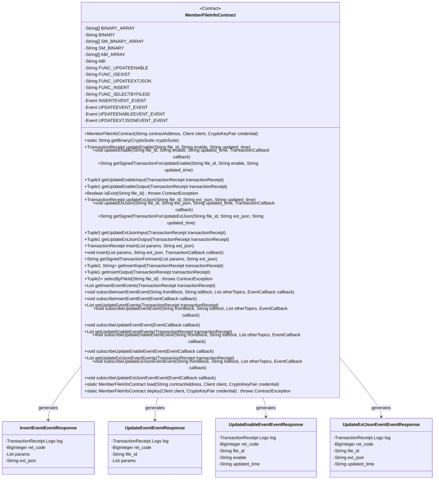
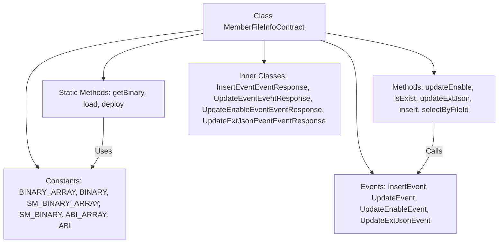

# Basic Information

|      |      |
|------|------|
| Name | MemberFileInfoContract |
| Language | .java |
| Code Path | WeFe/manager/manager-service/src/main/java/com/welab/wefe/manager/service/contract/MemberFileInfoContract.java |
| Package Name | com.welab.wefe.manager.service.contract |
| Dependencies | ['org.fisco.bcos.sdk.abi.FunctionReturnDecoder', 'org.fisco.bcos.sdk.abi.TypeReference', 'org.fisco.bcos.sdk.abi.datatypes', 'org.fisco.bcos.sdk.abi.datatypes.generated.Int256', 'org.fisco.bcos.sdk.abi.datatypes.generated.tuples.generated.Tuple1', 'org.fisco.bcos.sdk.abi.datatypes.generated.tuples.generated.Tuple2', 'org.fisco.bcos.sdk.abi.datatypes.generated.tuples.generated.Tuple3', 'org.fisco.bcos.sdk.client.Client', 'org.fisco.bcos.sdk.contract.Contract', 'org.fisco.bcos.sdk.crypto.CryptoSuite', 'org.fisco.bcos.sdk.crypto.keypair.CryptoKeyPair', 'org.fisco.bcos.sdk.eventsub.EventCallback', 'org.fisco.bcos.sdk.model.CryptoType', 'org.fisco.bcos.sdk.model.TransactionReceipt', 'org.fisco.bcos.sdk.model.callback.TransactionCallback', 'org.fisco.bcos.sdk.transaction.model.exception.ContractException', 'java.math.BigInteger', 'java.util.ArrayList', 'java.util.Arrays', 'java.util.Collections', 'java.util.List'] |
| Brief Description | MemberFileInfoContract is a smart contract class that inherits from the Contract base class, providing member file information management functionality. Its main features include:1. Contract Constants: Includes bytecode constants such as BINARY_ARRAY, BINARY, SM_BINARY_ARRAY, SM_BINARY, as well as the ABI_ARRAY contract interface definition.2. Contract Methods:   - updateEnable: Updates the file enable status   - isExist: Checks whether a file exists   - updateExtJson: Updates the file extension JSON   - insert: Inserts a new file record   - selectByFileId: Queries by file ID3. Event Definitions:   - insertEvent: Insert event   - updateEvent: Update event   - updateEnableEvent: Enable status update event   - updateExtJsonEvent: Extension JSON update event4. Utility Methods: Provides functionalities such as deployment, contract loading, and event subscription.This contract is used to manage member file information, supporting file CRUD operations and notifying status changes through events. |

# Description

MemberFileInfoContract is a smart contract class primarily used for managing member file information. It includes the following key functionalities:

1. Contract Functions:
- Update file enable status (updateEnable)
- Check file existence (isExist)
- Update file extension JSON data (updateExtJson)
- Insert new file record (insert)
- Query file information by file ID (selectByFileId)

2. Event Listeners:
- Insert event (insertEvent)
- Update event (updateEvent)
- Update enable status event (updateEnableEvent)
- Update extension JSON event (updateExtJsonEvent)

3. Technical Features:
- Supports both ECDSA and SM2 encryption algorithms
- Provides synchronous and asynchronous transaction execution modes
- Includes complete ABI definitions and binary code
- Offers event subscription functionality

4. Data Structures:
- Uses Tuple to encapsulate multiple return values
- Defines multiple event response classes
- Includes comprehensive input/output parameter parsing

This contract is designed for managing member file information in blockchain environments, providing complete CRUD operations and event notification mechanisms.

# Class Summary

| Name   | Type  | Description |
|-------|------|-------------|
| MemberFileInfoContract | class | MemberFileInfoContract is a smart contract class designed for managing member file information. Its primary functionalities include:1. Core Features:  - Update file activation status (updateEnable)  - Check file existence (isExist)  - Update extended JSON data of files (updateExtJson)  - Insert new file records (insert)  - Query file information by file ID (selectByFileId)  2. Event Monitoring:  - Insert event (insertEvent)  - Update event (updateEvent)  - Update activation status event (updateEnableEvent)  - Update extended JSON event (updateExtJsonEvent)  3. Technical Characteristics:  - Supports both SM (Chinese cryptographic standard) and ECDSA encryption algorithms  - Provides synchronous and asynchronous transaction execution modes  - Includes ABI and binary contract code  - Offers event subscription functionality  4. Auxiliary Functions:  - Contract deployment and loading  - Transaction input/output parsing  - Event response handling  This contract is suitable for blockchain application scenarios requiring management of member file information. |

## Class MemberFileInfoContract

|      |      |
|------|------|
| Access Modifier | @SuppressWarnings("unchecked");public |
| Type | class |
| Name | MemberFileInfoContract |
| Description | MemberFileInfoContract is a smart contract class designed for managing member file information. Its primary functionalities include:1. Core Features:  - Update file activation status (updateEnable)  - Check file existence (isExist)  - Update extended JSON data of files (updateExtJson)  - Insert new file records (insert)  - Query file information by file ID (selectByFileId)  2. Event Monitoring:  - Insert event (insertEvent)  - Update event (updateEvent)  - Update activation status event (updateEnableEvent)  - Update extended JSON event (updateExtJsonEvent)  3. Technical Characteristics:  - Supports both SM (Chinese cryptographic standard) and ECDSA encryption algorithms  - Provides synchronous and asynchronous transaction execution modes  - Includes ABI and binary contract code  - Offers event subscription functionality  4. Auxiliary Functions:  - Contract deployment and loading  - Transaction input/output parsing  - Event response handling  This contract is suitable for blockchain application scenarios requiring management of member file information. |

### UML Class Diagram

This code represents a smart contract class `MemberFileInfoContract` designed for managing member file information. Its primary functionalities include: updating file activation status, checking file existence, updating extended JSON, inserting new records, and querying file information. The contract contains multiple event response classes (InsertEventEventResponse, UpdateEventEventResponse, etc.) to handle different types of event responses. The class diagram illustrates the relationships between the contract and various event response classes, showing how the contract generates different event responses through method calls. The contract supports both standard transactions and asynchronous transactions, and provides event subscription capabilities.

### Internal Method Call Graph

This flowchart illustrates the core structure and relationships of the `MemberFileInfoContract` class. The class includes constant definitions (contract binary code and ABI), main business methods (such as file operations), event definitions (like insert and update events), static utility methods (such as deploying and loading contracts), and inner response classes. Arrows indicate calling or dependency relationships, such as business methods triggering events and static methods utilizing constant data. Overall, it presents a comprehensive functional module division and interaction logic of a smart contract.

### Field List

| Name  | Type  | Description |
|-------|-------|------|
| FUNC_ISEXIST = "isExist" | String | The static constant string FUNC_ISEXIST is defined as "isExist". |
| SM_BINARY = String.join("", SM_BINARY_ARRAY) | String | Define a static constant SM_BINARY, whose value is the concatenated string of SM_BINARY_ARRAY. |
| INSERTEVENT_EVENT = new Event("insertEvent",             Arrays.<TypeReference<?>>asList(new TypeReference<Int256>() {}, new TypeReference<DynamicArray<Utf8String>>() {}, new TypeReference<Utf8String>() {})) | Event | Define a static constant INSERTEVENT_EVENT, of type Event, containing three parameters: Int256, DynamicArray<Utf8String>, and Utf8String. |
| UPDATEEVENT_EVENT = new Event("updateEvent",             Arrays.<TypeReference<?>>asList(new TypeReference<Int256>() {}, new TypeReference<Utf8String>() {}, new TypeReference<DynamicArray<Utf8String>>() {})) | Event | Define a static constant UPDATEEVENT_EVENT, of type Event, containing three parameters: Int256, Utf8String, and DynamicArray<Utf8String>. |
| FUNC_INSERT = "insert" | String | Define the string constant FUNC_INSERT with the value "insert". |
| UPDATEEXTJSONEVENT_EVENT = new Event("updateExtJsonEvent",             Arrays.<TypeReference<?>>asList(new TypeReference<Int256>() {}, new TypeReference<Utf8String>() {}, new TypeReference<Utf8String>() {}, new TypeReference<Utf8String>() {})) | Event | Defined a public static constant event named UPDATEEXTJSONEVENT_EVENT, containing parameters of type Int256 and three Utf8String. |
| SM_BINARY_ARRAY = {"60806040523480156200001157600080fd5b506110016000806101000a81548173ffffffffffffffffffffffffffffffffffffffff021916908373ffffffffffffffffffffffffffffffffffffffff1602179055506000809054906101000a900473ffffffffffffffffffffffffffffffffffffffff1673ffffffffffffffffffffffffffffffffffffffff1663c92a78016040805190810160405280601981526020017f6d656d6265725f66696c655f696e666f5f636f6e7472616374000000000000008152506040518263ffffffff167c0100000000000000000000000000000000000000000000000000000000028152600401620001019190620002bc565b602060405180830381600087803b1580156200011c57600080fd5b505af115801562000131573d6000803e3d6000fd5b505050506040513d601f19601f8201168201806040525062000157919081019062000174565b5062000366565b60006200016c825162000315565b905092915050565b6000602082840312156200018757600080fd5b600062000197848285016200015e565b91505092915050565b6000620001ad826200030a565b808452620001c38160208601602086016200031f565b620001ce8162000355565b602085010191505092915050565b6000607d82527f66696c655f69642c66696c655f7369676e2c66696c655f6e616d652c66696c6560208301527f5f73697a652c6d656d6265725f69642c626c6f636b636861696e5f6e6f64655f60408301527f69642c707572706f73652c64657363726962652c656e61626c652c637265617460608301527f65645f74696d652c757064617465645f74696d652c6578745f6a736f6e000000608083015260a082019050919050565b6000600682527f6669785f696400000000000000000000000000000000000000000000000000006020830152604082019050919050565b60006060820190508181036000830152620002d88184620001a0565b90508181036020830152620002ed8162000285565b905081810360408301526200030281620001dc565b905092915050565b600081519050919050565b6000819050919050565b60005b838110156200033f57808201518184015260208101905062000322565b838111156200034f576000848401525b50505050565b6000601f19601f8301169050919050565b6141cc80620003766000396000f30060806040526004361061006d576000357c0100000000000000000000000000000000000000000000000000000000900463ffffffff16806315d0d62514610072578063568fe885146100af5780635ecadc90146100ec5780639eb03ade1461012a578063d5fc5a5314610167575b600080fd5b34801561007e57600080fd5b506100996004803603610094919081019061349e565b6101a4565b6040516100a69190613931565b60405180910390f35b3480156100bb57600080fd5b506100d660048036036100d1919081019061341c565b61075e565b6040516100e39190613916565b60405180910390f35b3480156100f857600080fd5b50610113600480360361010e919081019061341c565b610b22565b60405161012192919061394c565b60405180910390f35b34801561013657600080fd5b50610151600480360361014c91908101906132e3565b610f54565b60405161015e9190613931565b60405180910390f35b34801561017357600080fd5b5061018e6004803603610189919081019061349e565b611b1f565b60405161019b9190613931565b60405180910390f35b600080600080600080600094506101ba8961075e565b1515610228577ffffffffffffffffffffffffffffffffffffffffffffffffffffffffffffffffd94507fb36a4960db7128c065f905021bc6b7ab38c8106c359c6ac8dcd55ed9356c994c858a8a8a60405161021894939291906139c1565b60405180910390a1849550610752565b6000809054906101000a900473ffffffffffffffffffffffffffffffffffffffff1673ffffffffffffffffffffffffffffffffffffffff166359a48b656040805190810160405280601981526020017f6d656d6265725f66696c655f696e666f5f636f6e7472616374000000000000008152506040518263ffffffff167c01000000000000000000000000000000000000000000000000000000000281526004016102d39190613a1b565b602060405180830381600087803b1580156102ed57600080fd5b505af1158015610301573d6000803e3d6000fd5b505050506040513d601f19601f8201168201806040525061032591908101906133ca565b93508373ffffffffffffffffffffffffffffffffffffffff1663c74f8caf6040518163ffffffff167c0100000000000000000000000000000000000000000000000000000000028152600401602060405180830381600087803b15801561038b57600080fd5b505af115801561039f573d6000803e3d6000fd5b505050506040513d601f19601f820116820180604052506103c3919081019061334f565b92508273ffffffffffffffffffffffffffffffffffffffff1663ae763db58a6040518263ffffffff167c010000000000000000000000000000000000000000000000000000000002815260040161041a9190613ded565b600060405180830381600087803b15801561043457600080fd5b505af1158015610448573d6000803e3d6000fd5b505050508373ffffffffffffffffffffffffffffffffffffffff16635887ab246040518163ffffffff167c0100000000000000000000000000000000000000000000000000000000028152600401602060405180830381600087803b1580156104b057600080fd5b505af11580156104c4573d6000803e3d6000fd5b505050506040513d601f19601f820116820180604052506104e891908101906133a1565b91508173ffffffffffffffffffffffffffffffffffffffff16631a391cb4896040518263ffffffff167c010000000000000000000000000000000000000000000000000000000002815260040161053f9190613f76565b600060405180830381600087803b15801561055957600080fd5b505af115801561056d573d6000803e3d6000fd5b505050508173ffffffffffffffffffffffffffffffffffffffff16631a391cb4886040518263ffffffff167c01000000000000000000000000000000000000000000000000000000000281526004016105c69190613cb9565b600060405180830381600087803b1580156105e057600080fd5b505af11580156105f4573d6000803e3d6000fd5b505050508373ffffffffffffffffffffffffffffffffffffffff1663664b37d66040805190810160405280600a81526020017f6669785f69645f3030380000000000000000000000000000000000000000000081525084866040518463ffffffff167c010000000000000000000000000000000000000000000000000000000002815260040161068693929190613a9d565b602060405180830381600087803b1580156106a057600080fd5b505af11580156106b4573d6000803e3d6000fd5b505050506040513d601f19601f820116820180604052506106d891908101906133f3565b90506001811215156106ed5760009450610711565b7ffffffffffffffffffffffffffffffffffffffffffffffffffffffffffffffffe94505b7fb36a4960db7128c065f905021bc6b7ab38c8106c359c6ac8dcd55ed9356c994c858a8a8a60405161074694939291906139c1565b60405180910390a18495505b50505050509392505050565b6000806000806000809054906101000a900473ffffffffffffffffffffffffffffffffffffffff1673ffffffffffffffffffffffffffffffffffffffff166359a48b656040805190810160405280601981526020017f6d656d6265725f66696c655f696e666f5f636f6e7472616374000000000000008152506040518263ffffffff167c010000000000000000000000000000000000000000000000000000000002815260040161080f9190613a1b565b602060405180830381600087803b15801561082957600080fd5b505af115801561083d573d6000803e3d6000fd5b505050506040513d601f19601f8201168201806040525061086191908101906133ca565b92508273ffffffffffffffffffffffffffffffffffffffff1663c74f8caf6040518163ffffffff167c0100000000000000000000000000000000000000000000000000000000028152600401602060405180830381600087803b1580156108c757600080fd5b505af11580156108db573d6000803e3d6000fd5b505050506040513d601f19601f820116820180604052506108ff919081019061334f565b91508173ffffffffffffffffffffffffffffffffffffffff1663ae763db5866040518263ffffffff167c01000000000000000000000000000000000000000000000000000000000281526004016109569190613ded565b600060405180830381600087803b15801561097057600080fd5b505af1158015610984573d6000803e3d6000fd5b505050508273ffffffffffffffffffffffffffffffffffffffff1663d8ac59576040805190810160405280600a81526020017f6669785f69645f30303800000000000000000000000000000000000000000000815250846040518363ffffffff167c0100000000000000000000000000000000000000000000000000000000028152600401610a14929190613a3d565b602060405180830381600087803b158015610a2e57600080fd5b505af1158015610a42573d6000803e3d6000fd5b505050506040513d601f19601f82011682018060405250610a669190810190613378565b905060008173ffffffffffffffffffffffffffffffffffffffff1663d3e9af5a6040518163ffffffff167c0100000000000000000000000000000000000000000000000000000000028152600401602060405180830381600087803b158015610ace57600080fd5b505af1158015610ae2573d6000803e3d6000fd5b505050506040513d601f19601f82011682018060405250610b0691908101906133f3565b1115610b155760019350610b1a565b600093505b505050919050565b6000606060008060008060009054906101000a900473ffffffffffffffffffffffffffffffffffffffff1673ffffffffffffffffffffffffffffffffffffffff166359a48b656040805190810160405280601981526020017f6d656d6265725f66696c655f696e666f5f636f6e7472616374000000000000008152506040518263ffffffff167c0100000000000000000000000000000000000000000000000000000000028152600401610bd69190613a1b565b602060405180830381600087803b158015610bf057600080fd5b505af1158015610c04573d6000803e3d6000fd5b505050506040513d601f19601f82011682018060405250610c2891908101906133ca565b92508273ffffffffffffffffffffffffffffffffffffffff1663c74f8caf6040518163ffffffff167c0100000000000000000000000000000000000000000000000000000000028152600401602060405180830381600087803b158015610c8e57", "600080fd5b505af1158015610ca2573d6000803e3d6000fd5b505050506040513d601f19601f82011682018060405250610cc6919081019061334f565b91508173ffffffffffffffffffffffffffffffffffffffff1663ae763db5876040518263ffffffff167c0100000000000000000000000000000000000000000000000000000000028152600401610d1d9190613ded565b600060405180830381600087803b158015610d3757600080fd5b505af1158015610d4b573d6000803e3d6000fd5b505050508273ffffffffffffffffffffffffffffffffffffffff1663d8ac59576040805190810160405280600a81526020017f6669785f69645f30303800000000000000000000000000000000000000000000815250846040518363ffffffff167c0100000000000000000000000000000000000000000000000000000000028152600401610ddb929190613a3d565b602060405180830381600087803b158015610df557600080fd5b505af1158015610e09573d6000803e3d6000fd5b505050506040513d601f19601f82011682018060405250610e2d9190810190613378565b90508073ffffffffffffffffffffffffffffffffffffffff1663d3e9af5a6040518163ffffffff167c0100000000000000000000000000000000000000000000000000000000028152600401602060405180830381600087803b158015610e9357600080fd5b505af1158015610ea7573d6000803e3d6000fd5b505050506040513d601f19601f82011682018060405250610ecb91908101906133f3565b60001415610f39577ffffffffffffffffffffffffffffffffffffffffffffffffffffffffffffffffd6000604051908082528060200260200182016040528015610f2957816020015b6060815260200190600190039081610f145790505b5081915080905094509450610f4c565b6000610f44826120d9565b819150945094505b505050915091565b6000806000806000809350610f80876000815181101515610f7157fe5b9060200190602002015161075e565b1561100b577fffffffffffffffffffffffffffffffffffffffffffffffffffffffffffffffff93507fcb263a23d186eec891d55f1e0ba96ec8290af8c893d32d644c22dbff0953e51f848888604051610fdb9392919061397c565b60405180910390a17fffffffffffffffffffffffffffffffffffffffffffffffffffffffffffffffff9450611b15565b6000809054906101000a900473ffffffffffffffffffffffffffffffffffffffff1673ffffffffffffffffffffffffffffffffffffffff166359a48b656040805190810160405280601981526020017f6d656d6265725f66696c655f696e666f5f636f6e7472616374000000000000008152506040518263ffffffff167c01000000000000000000000000000000000000000000000000000000000281526004016110b69190613a1b565b602060405180830381600087803b1580156110d057600080fd5b505af11580156110e4573d6000803e3d6000fd5b505050506040513d601f19601f8201168201806040525061110891908101906133ca565b92508273ffffffffffffffffffffffffffffffffffffffff16635887ab246040518163ffffffff167c0100000000000000000000000000000000000000000000000000000000028152600401602060405180830381600087803b15801561116e57600080fd5b505af1158015611182573d6000803e3d6000fd5b505050506040513d601f19601f820116820180604052506111a691908101906133a1565b91508173ffffffffffffffffffffffffffffffffffffffff16631a391cb46040805190810160405280600a81526020017f6669785f69645f303038000000000000000000000000000000000000000000008152506040518263ffffffff167c01000000000000000000000000000000000000000000000000000000000281526004016112329190613e77565b600060405180830381600087803b15801561124c57600080fd5b505af1158015611260573d6000803e3d6000fd5b505050508173ffffffffffffffffffffffffffffffffffffffff16631a391cb488600081518110151561128f57fe5b906020019060200201516040518263ffffffff167c01000000000000000000000000000000000000000000000000000000000281526004016112d19190613db8565b600060405180830381600087803b1580156112eb57600080fd5b505af11580156112ff573d6000803e3d6000fd5b505050508173ffffffffffffffffffffffffffffffffffffffff16631a391cb488600181518110151561132e57fe5b906020019060200201516040518263ffffffff167c01000000000000000000000000000000000000000000000000000000000281526004016113709190613f21565b600060405180830381600087803b15801561138a57600080fd5b505af115801561139e573d6000803e3d6000fd5b505050508173ffffffffffffffffffffffffffffffffffffffff16631a391cb48860028151811015156113cd57fe5b906020019060200201516040518263ffffffff167c010000000000000000000000000000000000000000000000000000000002815260040161140f9190613c2f565b600060405180830381600087803b15801561142957600080fd5b505af115801561143d573d6000803e3d6000fd5b505050508173ffffffffffffffffffffffffffffffffffffffff16631a391cb488600381518110151561146c57fe5b906020019060200201516040518263ffffffff167c01000000000000000000000000000000000000000000000000000000000281526004016114ae9190613e42565b600060405180830381600087803b1580156114c857600080fd5b505af11580156114dc573d6000803e3d6000fd5b505050508173ffffffffffffffffffffffffffffffffffffffff16631a391cb488600481518110151561150b57fe5b906020019060200201516040518263ffffffff167c010000000000000000000000000000000000000000000000000000000002815260040161154d9190613d0e565b600060405180830381600087803b15801561156757600080fd5b505af115801561157b573d6000803e3d6000fd5b505050508173ffffffffffffffffffffffffffffffffffffffff16631a391cb48860058151811015156115aa57fe5b906020019060200201516040518263ffffffff167c01000000000000000000000000000000000000000000000000000000000281526004016115ec9190613afb565b600060405180830381600087803b15801561160657600080fd5b505af115801561161a573d6000803e3d6000fd5b505050508173ffffffffffffffffffffffffffffffffffffffff16631a391cb488600681518110151561164957fe5b906020019060200201516040518263ffffffff167c010000000000000000000000000000000000000000000000000000000002815260040161168b9190613ecc565b600060405180830381600087803b1580156116a557600080fd5b505af11580156116b9573d6000803e3d6000fd5b505050508173ffffffffffffffffffffffffffffffffffffffff16631a391cb48860078151811015156116e857fe5b906020019060200201516040518263ffffffff167c010000000000000000000000000000000000000000000000000000000002815260040161172a9190613b50565b600060405180830381600087803b15801561174457600080fd5b505af1158015611758573d6000803e3d6000fd5b505050508173ffffffffffffffffffffffffffffffffffffffff16631a391cb488600881518110151561178757fe5b906020019060200201516040518263ffffffff167c01000000000000000000000000000000000000000000000000000000000281526004016117c99190613ba5565b600060405180830381600087803b1580156117e357600080fd5b505af11580156117f7573d6000803e3d6000fd5b505050508173ffffffffffffffffffffffffffffffffffffffff16631a391cb488600981518110151561182657fe5b906020019060200201516040518263ffffffff167c01000000000000000000000000000000000000000000000000000000000281526004016118689190613d63565b600060405180830381600087803b15801561188257600080fd5b505af1158015611896573d6000803e3d6000fd5b505050508173ffffffffffffffffffffffffffffffffffffffff16631a391cb488600a8151811015156118c557fe5b906020019060200201516040518263ffffffff167c01000000000000000000000000000000000000000000000000000000000281526004016119079190613c84565b600060405180830381600087803b15801561192157600080fd5b505af1158015611935573d6000803e3d6000fd5b505050508173ffffffffffffffffffffffffffffffffffffffff16631a391cb4876040518263ffffffff167c010000000000000000000000000000000000000000000000000000000002815260040161198e9190613f76565b600060405180830381600087803b1580156119a857600080fd5b505af11580156119bc573d6000803e3d6000fd5b505050508273ffffffffffffffffffffffffffffffffffffffff16634c6f30c06040805190810160405280600a81526020017f6669785f69645f30303800000000000000000000000000000000000000000000815250846040518363ffffffff167c0100000000000000000000000000000000000000000000000000000000028152600401611a4c929190613a6d565b602060405180830381600087803b158015611a6657600080fd5b505af1158015611a7a573d6000803e3d6000fd5b505050506040513d601f19601f82011682018060405250611a9e91908101906133f3565b90506001811415611ab25760009350611ad6565b7ffffffffffffffffffffffffffffffffffffffffffffffffffffffffffffffffe93505b7fcb263a23d186eec891d55f1e0ba96ec8290af8c893d32d644c22dbff0953e51f848888604051611b099392919061397c565b60405180910390a18394505b5050505092915050565b60008060008060008060009450611b358961075e565b1515611ba3577ffffffffffffffffffffffffffffffffffffffffffffffffffffffffffffffffd94507f6cbca64bfdd615f94babd25f1fed6a9d80607ed38c5e9cd592d1647e6de646a2858a8a8a604051611b9394939291906139c1565b60405180910390a18495506120cd565b6000809054906101000a900473ffffffffffffffffffffffffffffffffffffffff1673ffffffffffffffffffffffffffffffffffffffff166359a48b656040805190810160405280601981526020017f6d656d6265725f66696c655f696e666f5f636f6e7472616374000000000000008152506040518263ffffffff167c0100000000000000000000000000000000000000000000000000000000028152600401611c4e9190613a1b565b602060405180830381600087803b158015611c6857600080fd5b505af1158015611c7c573d6000803e3d6000fd5b505050506040513d601f19601f", "82011682018060405250611ca091908101906133ca565b93508373ffffffffffffffffffffffffffffffffffffffff1663c74f8caf6040518163ffffffff167c0100000000000000000000000000000000000000000000000000000000028152600401602060405180830381600087803b158015611d0657600080fd5b505af1158015611d1a573d6000803e3d6000fd5b505050506040513d601f19601f82011682018060405250611d3e919081019061334f565b92508273ffffffffffffffffffffffffffffffffffffffff1663ae763db58a6040518263ffffffff167c0100000000000000000000000000000000000000000000000000000000028152600401611d959190613ded565b600060405180830381600087803b158015611daf57600080fd5b505af1158015611dc3573d6000803e3d6000fd5b505050508373ffffffffffffffffffffffffffffffffffffffff16635887ab246040518163ffffffff167c0100000000000000000000000000000000000000000000000000000000028152600401602060405180830381600087803b158015611e2b57600080fd5b505af1158015611e3f573d6000803e3d6000fd5b505050506040513d601f19601f82011682018060405250611e6391908101906133a1565b91508173ffffffffffffffffffffffffffffffffffffffff16631a391cb4896040518263ffffffff167c0100000000000000000000000000000000000000000000000000000000028152600401611eba9190613bda565b600060405180830381600087803b158015611ed457600080fd5b505af1158015611ee8573d6000803e3d6000fd5b505050508173ffffffffffffffffffffffffffffffffffffffff16631a391cb4886040518263ffffffff167c0100000000000000000000000000000000000000000000000000000000028152600401611f419190613cb9565b600060405180830381600087803b158015611f5b57600080fd5b505af1158015611f6f573d6000803e3d6000fd5b505050508373ffffffffffffffffffffffffffffffffffffffff1663664b37d66040805190810160405280600a81526020017f6669785f69645f3030380000000000000000000000000000000000000000000081525084866040518463ffffffff167c010000000000000000000000000000000000000000000000000000000002815260040161200193929190613a9d565b602060405180830381600087803b15801561201b57600080fd5b505af115801561202f573d6000803e3d6000fd5b505050506040513d601f19601f8201168201806040525061205391908101906133f3565b9050600181121515612068576000945061208c565b7ffffffffffffffffffffffffffffffffffffffffffffffffffffffffffffffffe94505b7f6cbca64bfdd615f94babd25f1fed6a9d80607ed38c5e9cd592d1647e6de646a2858a8a8a6040516120c194939291906139c1565b60405180910390a18495505b50505050509392505050565b60608060008060608573ffffffffffffffffffffffffffffffffffffffff1663d3e9af5a6040518163ffffffff167c0100000000000000000000000000000000000000000000000000000000028152600401602060405180830381600087803b15801561214557600080fd5b505af1158015612159573d6000803e3d6000fd5b505050506040513d601f19601f8201168201806040525061217d91908101906133f3565b6040519080825280602002602001820160405280156121b057816020015b606081526020019060019003908161219b5790505b509350600092505b8573ffffffffffffffffffffffffffffffffffffffff1663d3e9af5a6040518163ffffffff167c0100000000000000000000000000000000000000000000000000000000028152600401602060405180830381600087803b15801561221c57600080fd5b505af1158015612230573d6000803e3d6000fd5b505050506040513d601f19601f8201168201806040525061225491908101906133f3565b831215612ec6578573ffffffffffffffffffffffffffffffffffffffff16633dd2b614846040518263ffffffff167c01000000000000000000000000000000000000000000000000000000000281526004016122b09190613931565b602060405180830381600087803b1580156122ca57600080fd5b505af11580156122de573d6000803e3d6000fd5b505050506040513d601f19601f8201168201806040525061230291908101906133a1565b91506123f46123b98373ffffffffffffffffffffffffffffffffffffffff16639bca41e86040518163ffffffff167c010000000000000000000000000000000000000000000000000000000002815260040161235d90613d98565b600060405180830381600087803b15801561237757600080fd5b505af115801561238b573d6000803e3d6000fd5b505050506040513d6000823e3d601f19601f820116820180604052506123b4919081019061345d565b612ed2565b6040805190810160405280600181526020017f7c00000000000000000000000000000000000000000000000000000000000000815250612f2b565b90506124b1816124ac8473ffffffffffffffffffffffffffffffffffffffff16639bca41e86040518163ffffffff167c010000000000000000000000000000000000000000000000000000000002815260040161245090613f01565b600060405180830381600087803b15801561246a57600080fd5b505af115801561247e573d6000803e3d6000fd5b505050506040513d6000823e3d601f19601f820116820180604052506124a7919081019061345d565b612ed2565b612f2b565b90506124f2816040805190810160405280600181526020017f7c00000000000000000000000000000000000000000000000000000000000000815250612f2b565b90506125af816125aa8473ffffffffffffffffffffffffffffffffffffffff16639bca41e86040518163ffffffff167c010000000000000000000000000000000000000000000000000000000002815260040161254e90613c0f565b600060405180830381600087803b15801561256857600080fd5b505af115801561257c573d6000803e3d6000fd5b505050506040513d6000823e3d601f19601f820116820180604052506125a5919081019061345d565b612ed2565b612f2b565b90506125f0816040805190810160405280600181526020017f7c00000000000000000000000000000000000000000000000000000000000000815250612f2b565b90506126ad816126a88473ffffffffffffffffffffffffffffffffffffffff16639bca41e86040518163ffffffff167c010000000000000000000000000000000000000000000000000000000002815260040161264c90613e22565b600060405180830381600087803b15801561266657600080fd5b505af115801561267a573d6000803e3d6000fd5b505050506040513d6000823e3d601f19601f820116820180604052506126a3919081019061345d565b612ed2565b612f2b565b90506126ee816040805190810160405280600181526020017f7c00000000000000000000000000000000000000000000000000000000000000815250612f2b565b90506127ab816127a68473ffffffffffffffffffffffffffffffffffffffff16639bca41e86040518163ffffffff167c010000000000000000000000000000000000000000000000000000000002815260040161274a90613cee565b600060405180830381600087803b15801561276457600080fd5b505af1158015612778573d6000803e3d6000fd5b505050506040513d6000823e3d601f19601f820116820180604052506127a1919081019061345d565b612ed2565b612f2b565b90506127ec816040805190810160405280600181526020017f7c00000000000000000000000000000000000000000000000000000000000000815250612f2b565b90506128a9816128a48473ffffffffffffffffffffffffffffffffffffffff16639bca41e86040518163ffffffff167c010000000000000000000000000000000000000000000000000000000002815260040161284890613adb565b600060405180830381600087803b15801561286257600080fd5b505af1158015612876573d6000803e3d6000fd5b505050506040513d6000823e3d601f19601f8201168201806040525061289f919081019061345d565b612ed2565b612f2b565b90506128ea816040805190810160405280600181526020017f7c00000000000000000000000000000000000000000000000000000000000000815250612f2b565b90506129a7816129a28473ffffffffffffffffffffffffffffffffffffffff16639bca41e86040518163ffffffff167c010000000000000000000000000000000000000000000000000000000002815260040161294690613eac565b600060405180830381600087803b15801561296057600080fd5b505af1158015612974573d6000803e3d6000fd5b505050506040513d6000823e3d601f19601f8201168201806040525061299d919081019061345d565b612ed2565b612f2b565b90506129e8816040805190810160405280600181526020017f7c00000000000000000000000000000000000000000000000000000000000000815250612f2b565b9050612aa581612aa08473ffffffffffffffffffffffffffffffffffffffff16639bca41e86040518163ffffffff167c0100000000000000000000000000000000000000000000000000000000028152600401612a4490613b30565b600060405180830381600087803b158015612a5e57600080fd5b505af1158015612a72573d6000803e3d6000fd5b505050506040513d6000823e3d601f19601f82011682018060405250612a9b919081019061345d565b612ed2565b612f2b565b9050612ae6816040805190810160405280600181526020017f7c00000000000000000000000000000000000000000000000000000000000000815250612f2b565b9050612ba381612b9e8473ffffffffffffffffffffffffffffffffffffffff16639bca41e86040518163ffffffff167c0100000000000000000000000000000000000000000000000000000000028152600401612b4290613b85565b600060405180830381600087803b158015612b5c57600080fd5b505af1158015612b70573d6000803e3d6000fd5b505050506040513d6000823e3d601f19601f82011682018060405250612b99919081019061345d565b612ed2565b612f2b565b9050612be4816040805190810160405280600181526020017f7c00000000000000000000000000000000000000000000000000000000000000815250612f2b565b9050612ca181612c9c8473ffffffffffffffffffffffffffffffffffffffff16639bca41e86040518163ffffffff167c0100000000000000000000000000000000000000000000000000000000028152600401612c4090613d43565b600060405180830381600087803b158015612c5a57600080fd5b505af1158015612c6e573d6000803e3d6000fd5b505050506040513d6000823e3d601f19601f820116820180604052", "50612c97919081019061345d565b612ed2565b612f2b565b9050612ce2816040805190810160405280600181526020017f7c00000000000000000000000000000000000000000000000000000000000000815250612f2b565b9050612d9f81612d9a8473ffffffffffffffffffffffffffffffffffffffff16639bca41e86040518163ffffffff167c0100000000000000000000000000000000000000000000000000000000028152600401612d3e90613c64565b600060405180830381600087803b158015612d5857600080fd5b505af1158015612d6c573d6000803e3d6000fd5b505050506040513d6000823e3d601f19601f82011682018060405250612d95919081019061345d565b612ed2565b612f2b565b9050612de0816040805190810160405280600181526020017f7c00000000000000000000000000000000000000000000000000000000000000815250612f2b565b9050612e9d81612e988473ffffffffffffffffffffffffffffffffffffffff16639bca41e86040518163ffffffff167c0100000000000000000000000000000000000000000000000000000000028152600401612e3c90613f56565b600060405180830381600087803b158015612e5657600080fd5b505af1158015612e6a573d6000803e3d6000fd5b505050506040513d6000823e3d601f19601f82011682018060405250612e93919081019061345d565b612ed2565b612f2b565b9050808484815181101515612eae57fe5b906020019060200201819052508260010192506121b8565b83945050505050919050565b60606000612edf836130fc565b1415612f22576040805190810160405280600181526020017f20000000000000000000000000000000000000000000000000000000000000008152509050612f26565b8190505b919050565b606080606080606060008088955087945084518651016040519080825280601f01601f191660200182016040528015612f735781602001602082028038833980820191505090505b50935083925060009150600090505b8551811015613035578581815181101515612f9957fe5b9060200101517f010000000000000000000000000000000000000000000000000000000000000090047f0100000000000000000000000000000000000000000000000000000000000000028383806001019450815181101515612ff857fe5b9060200101907effffffffffffffffffffffffffffffffffffffffffffffffffffffffffffff1916908160001a9053508080600101915050612f82565b600090505b84518110156130ed57848181518110151561305157fe5b9060200101517f010000000000000000000000000000000000000000000000000000000000000090047f01000000000000000000000000000000000000000000000000000000000000000283838060010194508151811015156130b057fe5b9060200101907effffffffffffffffffffffffffffffffffffffffffffffffffffffffffffff1916908160001a905350808060010191505061303a565b83965050505050505092915050565b600081519050919050565b600082601f830112151561311a57600080fd5b813561312d61312882613fd8565b613fab565b9150818183526020840193506020810190508360005b83811015613173578135860161315988826131e1565b845260208401935060208301925050600181019050613143565b5050505092915050565b600061318982516140c9565b905092915050565b600061319d82516140db565b905092915050565b60006131b182516140ed565b905092915050565b60006131c582516140ff565b905092915050565b60006131d98251614111565b905092915050565b600082601f83011215156131f457600080fd5b813561320761320282614000565b613fab565b9150808252602083016020830185838301111561322357600080fd5b61322e83828461413f565b50505092915050565b600082601f830112151561324a57600080fd5b813561325d6132588261402c565b613fab565b9150808252602083016020830185838301111561327957600080fd5b61328483828461413f565b50505092915050565b600082601f83011215156132a057600080fd5b81516132b36132ae8261402c565b613fab565b915080825260208301602083018583830111156132cf57600080fd5b6132da83828461414e565b50505092915050565b600080604083850312156132f657600080fd5b600083013567ffffffffffffffff81111561331057600080fd5b61331c85828601613107565b925050602083013567ffffffffffffffff81111561333957600080fd5b61334585828601613237565b9150509250929050565b60006020828403121561336157600080fd5b600061336f8482850161317d565b91505092915050565b60006020828403121561338a57600080fd5b600061339884828501613191565b91505092915050565b6000602082840312156133b357600080fd5b60006133c1848285016131a5565b91505092915050565b6000602082840312156133dc57600080fd5b60006133ea848285016131b9565b91505092915050565b60006020828403121561340557600080fd5b6000613413848285016131cd565b91505092915050565b60006020828403121561342e57600080fd5b600082013567ffffffffffffffff81111561344857600080fd5b61345484828501613237565b91505092915050565b60006020828403121561346f57600080fd5b600082015167ffffffffffffffff81111561348957600080fd5b6134958482850161328d565b91505092915050565b6000806000606084860312156134b357600080fd5b600084013567ffffffffffffffff8111156134cd57600080fd5b6134d986828701613237565b935050602084013567ffffffffffffffff8111156134f657600080fd5b61350286828701613237565b925050604084013567ffffffffffffffff81111561351f57600080fd5b61352b86828701613237565b9150509250925092565b600061354082614065565b8084526020840193508360208202850161355985614058565b60005b84811015613592578383038852613574838351613615565b925061357f82614086565b915060208801975060018101905061355c565b508196508694505050505092915050565b6135ac816140b3565b82525050565b6135bb8161411b565b82525050565b6135ca8161412d565b82525050565b6135d9816140bf565b82525050565b60006135ea8261407b565b8084526135fe81602086016020860161414e565b61360781614181565b602085010191505092915050565b600061362082614070565b80845261363481602086016020860161414e565b61363d81614181565b602085010191505092915050565b6000601282527f626c6f636b636861696e5f6e6f64655f696400000000000000000000000000006020830152604082019050919050565b6000600882527f64657363726962650000000000000000000000000000000000000000000000006020830152604082019050919050565b6000600682527f656e61626c6500000000000000000000000000000000000000000000000000006020830152604082019050919050565b6000600982527f66696c655f6e616d6500000000000000000000000000000000000000000000006020830152604082019050919050565b6000600c82527f757064617465645f74696d6500000000000000000000000000000000000000006020830152604082019050919050565b6000600982527f6d656d6265725f696400000000000000000000000000000000000000000000006020830152604082019050919050565b6000600c82527f637265617465645f74696d6500000000000000000000000000000000000000006020830152604082019050919050565b6000600782527f66696c655f6964000000000000000000000000000000000000000000000000006020830152604082019050919050565b6000600982527f66696c655f73697a6500000000000000000000000000000000000000000000006020830152604082019050919050565b6000600682527f6669785f696400000000000000000000000000000000000000000000000000006020830152604082019050919050565b6000600782527f707572706f7365000000000000000000000000000000000000000000000000006020830152604082019050919050565b6000600982527f66696c655f7369676e00000000000000000000000000000000000000000000006020830152604082019050919050565b6000600882527f6578745f6a736f6e0000000000000000000000000000000000000000000000006020830152604082019050919050565b600060208201905061392b60008301846135a3565b92915050565b600060208201905061394660008301846135d0565b92915050565b600060408201905061396160008301856135d0565b81810360208301526139738184613535565b90509392505050565b600060608201905061399160008301866135d0565b81810360208301526139a38185613535565b905081810360408301526139b781846135df565b9050949350505050565b60006080820190506139d660008301876135d0565b81810360208301526139e881866135df565b905081810360408301526139fc81856135df565b90508181036060830152613a1081846135df565b905095945050505050565b60006020820190508181036000830152613a358184613615565b905092915050565b60006040820190508181036000830152613a578185613615565b9050613a6660208301846135b2565b9392505050565b60006040820190508181036000830152613a878185613615565b9050613a9660208301846135c1565b9392505050565b60006060820190508181036000830152613ab78186613615565b9050613ac660208301856135c1565b613ad360408301846135b2565b949350505050565b60006020820190508181036000830152613af48161364b565b9050919050565b60006040820190508181036000830152613b148161364b565b90508181036020830152613b288184613615565b905092915050565b60006020820190508181036000830152613b4981613682565b9050919050565b60006040820190508181036000830152613b6981613682565b90508181036020830152613b7d8184613615565b905092915050565b60006020820190508181036000830152613b9e816136b9565b9050919050565b60006040820190508181036000830152613bbe816136b9565b90508181036020830152613bd28184613615565b905092915050565b60006040820190508181036000830152613bf3816136b9565b90508181036020830152613c0781846135df565b905092915050565b60006020820190508181036000830152613c28816136f0565b9050919050565b60006040820190508181036000830152613c48816136f0565b90508181036020830152613c5c8184613615565b905092915050565b60006020820190508181036000830152613c7d81613727565b9050919050565b6000604082", "0190508181036000830152613c9d81613727565b90508181036020830152613cb18184613615565b905092915050565b60006040820190508181036000830152613cd281613727565b90508181036020830152613ce681846135df565b905092915050565b60006020820190508181036000830152613d078161375e565b9050919050565b60006040820190508181036000830152613d278161375e565b90508181036020830152613d3b8184613615565b905092915050565b60006020820190508181036000830152613d5c81613795565b9050919050565b60006040820190508181036000830152613d7c81613795565b90508181036020830152613d908184613615565b905092915050565b60006020820190508181036000830152613db1816137cc565b9050919050565b60006040820190508181036000830152613dd1816137cc565b90508181036020830152613de58184613615565b905092915050565b60006040820190508181036000830152613e06816137cc565b90508181036020830152613e1a81846135df565b905092915050565b60006020820190508181036000830152613e3b81613803565b9050919050565b60006040820190508181036000830152613e5b81613803565b90508181036020830152613e6f8184613615565b905092915050565b60006040820190508181036000830152613e908161383a565b90508181036020830152613ea48184613615565b905092915050565b60006020820190508181036000830152613ec581613871565b9050919050565b60006040820190508181036000830152613ee581613871565b90508181036020830152613ef98184613615565b905092915050565b60006020820190508181036000830152613f1a816138a8565b9050919050565b60006040820190508181036000830152613f3a816138a8565b90508181036020830152613f4e8184613615565b905092915050565b60006020820190508181036000830152613f6f816138df565b9050919050565b60006040820190508181036000830152613f8f816138df565b90508181036020830152613fa381846135df565b905092915050565b6000604051905081810181811067ffffffffffffffff82111715613fce57600080fd5b8060405250919050565b600067ffffffffffffffff821115613fef57600080fd5b602082029050602081019050919050565b600067ffffffffffffffff82111561401757600080fd5b601f19601f8301169050602081019050919050565b600067ffffffffffffffff82111561404357600080fd5b601f19601f8301169050602081019050919050565b6000602082019050919050565b600081519050919050565b600081519050919050565b600081519050919050565b6000602082019050919050565b600073ffffffffffffffffffffffffffffffffffffffff82169050919050565b60008115159050919050565b6000819050919050565b60006140d482614093565b9050919050565b60006140e682614093565b9050919050565b60006140f882614093565b9050919050565b600061410a82614093565b9050919050565b6000819050919050565b600061412682614093565b9050919050565b600061413882614093565b9050919050565b82818337600083830152505050565b60005b8381101561416c578082015181840152602081019050614151565b8381111561417b576000848401525b50505050565b6000601f19601f83011690509190505600a265627a7a72305820a2438e37d6d562de7d1aad455135b426db306228592bb4f0a7dfcc5c7f8286a76c6578706572696d656e74616cf50037"} | String[] | This is a static string array containing smart contract bytecode, used for blockchain deployment or interaction. |
| FUNC_UPDATEENABLE = "updateEnable" | String | Define the static constant FUNC_UPDATEENABLE with the value "updateEnable". |
| FUNC_SELECTBYFILEID = "selectByFileId" | String | This is a Java static constant named FUNC_SELECTBYFILEID, with the value "selectByFileId", representing the functional identifier for querying by file ID. |
| ABI_ARRAY = {"[{\"constant\":false,\"inputs\":[{\"name\":\"file_id\",\"type\":\"string\"},{\"name\":\"enable\",\"type\":\"string\"},{\"name\":\"updated_time\",\"type\":\"string\"}],\"name\":\"updateEnable\",\"outputs\":[{\"name\":\"\",\"type\":\"int256\"}],\"payable\":false,\"stateMutability\":\"nonpayable\",\"type\":\"function\"},{\"constant\":true,\"inputs\":[{\"name\":\"file_id\",\"type\":\"string\"}],\"name\":\"isExist\",\"outputs\":[{\"name\":\"\",\"type\":\"bool\"}],\"payable\":false,\"stateMutability\":\"view\",\"type\":\"function\"},{\"constant\":false,\"inputs\":[{\"name\":\"file_id\",\"type\":\"string\"},{\"name\":\"ext_json\",\"type\":\"string\"},{\"name\":\"updated_time\",\"type\":\"string\"}],\"name\":\"updateExtJson\",\"outputs\":[{\"name\":\"\",\"type\":\"int256\"}],\"payable\":false,\"stateMutability\":\"nonpayable\",\"type\":\"function\"},{\"constant\":false,\"inputs\":[{\"name\":\"params\",\"type\":\"string[]\"},{\"name\":\"ext_json\",\"type\":\"string\"}],\"name\":\"insert\",\"outputs\":[{\"name\":\"\",\"type\":\"int256\"}],\"payable\":false,\"stateMutability\":\"nonpayable\",\"type\":\"function\"},{\"constant\":true,\"inputs\":[{\"name\":\"file_id\",\"type\":\"string\"}],\"name\":\"selectByFileId\",\"outputs\":[{\"name\":\"\",\"type\":\"int256\"},{\"name\":\"\",\"type\":\"string[]\"}],\"payable\":false,\"stateMutability\":\"view\",\"type\":\"function\"},{\"inputs\":[],\"payable\":false,\"stateMutability\":\"nonpayable\",\"type\":\"constructor\"},{\"anonymous\":false,\"inputs\":[{\"indexed\":false,\"name\":\"ret_code\",\"type\":\"int256\"},{\"indexed\":false,\"name\":\"params\",\"type\":\"string[]\"},{\"indexed\":false,\"name\":\"ext_json\",\"type\":\"string\"}],\"name\":\"insertEvent\",\"type\":\"event\"},{\"anonymous\":false,\"inputs\":[{\"indexed\":false,\"name\":\"ret_code\",\"type\":\"int256\"},{\"indexed\":false,\"name\":\"file_id\",\"type\":\"string\"},{\"indexed\":false,\"name\":\"params\",\"type\":\"string[]\"}],\"name\":\"updateEvent\",\"type\":\"event\"},{\"anonymous\":false,\"inputs\":[{\"indexed\":false,\"name\":\"ret_code\",\"type\":\"int256\"},{\"indexed\":false,\"name\":\"file_id\",\"type\":\"string\"},{\"indexed\":false,\"name\":\"enable\",\"type\":\"string\"},{\"indexed\":false,\"name\":\"updated_time\",\"type\":\"string\"}],\"name\":\"updateEnableEvent\",\"type\":\"event\"},{\"anonymous\":false,\"inputs\":[{\"indexed\":false,\"name\":\"ret_code\",\"type\":\"int256\"},{\"indexed\":false,\"name\":\"file_id\",\"type\":\"string\"},{\"indexed\":false,\"name\":\"ext_json\",\"type\":\"string\"},{\"indexed\":false,\"name\":\"updated_time\",\"type\":\"string\"}],\"name\":\"updateExtJsonEvent\",\"type\":\"event\"}]"} | String[] | Define the smart contract ABI array, including functions such as updateEnable, isExist, updateExtJson, insert, selectByFileId, and events such as insertEvent, updateEvent. |
| BINARY = String.join("", BINARY_ARRAY) | String | Concatenate the BINARY_ARRAY into a string and assign it to the constant BINARY. |
| ABI = String.join("", ABI_ARRAY) | String | Merge the ABI_ARRAY array into a string and assign it to the constant ABI. |
| UPDATEENABLEEVENT_EVENT = new Event("updateEnableEvent",             Arrays.<TypeReference<?>>asList(new TypeReference<Int256>() {}, new TypeReference<Utf8String>() {}, new TypeReference<Utf8String>() {}, new TypeReference<Utf8String>() {})) | Event | Define a static constant UPDATEENABLEEVENT_EVENT, of type Event, containing four parameters: Int256 and three Utf8String. |
| FUNC_UPDATEEXTJSON = "updateExtJson" | String | Static constant string, used for updating extended JSON data. |
| BINARY_ARRAY = {"60806040523480156200001157600080fd5b506110016000806101000a81548173ffffffffffffffffffffffffffffffffffffffff021916908373ffffffffffffffffffffffffffffffffffffffff1602179055506000809054906101000a900473ffffffffffffffffffffffffffffffffffffffff1673ffffffffffffffffffffffffffffffffffffffff166356004b6a6040805190810160405280601981526020017f6d656d6265725f66696c655f696e666f5f636f6e7472616374000000000000008152506040518263ffffffff167c0100000000000000000000000000000000000000000000000000000000028152600401620001019190620002bc565b602060405180830381600087803b1580156200011c57600080fd5b505af115801562000131573d6000803e3d6000fd5b505050506040513d601f19601f8201168201806040525062000157919081019062000174565b5062000366565b60006200016c825162000315565b905092915050565b6000602082840312156200018757600080fd5b600062000197848285016200015e565b91505092915050565b6000620001ad826200030a565b808452620001c38160208601602086016200031f565b620001ce8162000355565b602085010191505092915050565b6000600682527f6669785f696400000000000000000000000000000000000000000000000000006020830152604082019050919050565b6000607d82527f66696c655f69642c66696c655f7369676e2c66696c655f6e616d652c66696c6560208301527f5f73697a652c6d656d6265725f69642c626c6f636b636861696e5f6e6f64655f60408301527f69642c707572706f73652c64657363726962652c656e61626c652c637265617460608301527f65645f74696d652c757064617465645f74696d652c6578745f6a736f6e000000608083015260a082019050919050565b60006060820190508181036000830152620002d88184620001a0565b90508181036020830152620002ed81620001dc565b90508181036040830152620003028162000213565b905092915050565b600081519050919050565b6000819050919050565b60005b838110156200033f57808201518184015260208101905062000322565b838111156200034f576000848401525b50505050565b6000601f19601f8301169050919050565b6141cc80620003766000396000f30060806040526004361061006d576000357c0100000000000000000000000000000000000000000000000000000000900463ffffffff16806305a9bbe7146100725780634d3d096b146100af57806363964aa3146100ec5780639729115014610129578063d15b71e214610166575b600080fd5b34801561007e57600080fd5b506100996004803603610094919081019061349e565b6101a4565b6040516100a69190613931565b60405180910390f35b3480156100bb57600080fd5b506100d660048036036100d1919081019061341c565b61075e565b6040516100e39190613916565b60405180910390f35b3480156100f857600080fd5b50610113600480360361010e919081019061349e565b610b22565b6040516101209190613931565b60405180910390f35b34801561013557600080fd5b50610150600480360361014b91908101906132e3565b6110dc565b60405161015d9190613931565b60405180910390f35b34801561017257600080fd5b5061018d6004803603610188919081019061341c565b611ca7565b60405161019b92919061394c565b60405180910390f35b600080600080600080600094506101ba8961075e565b1515610228577ffffffffffffffffffffffffffffffffffffffffffffffffffffffffffffffffd94507f7d29950a0ae63eb067d4a746f4bfc4351fff7ffaa81e13a0c7f07a80aa4f529d858a8a8a60405161021894939291906139c1565b60405180910390a1849550610752565b6000809054906101000a900473ffffffffffffffffffffffffffffffffffffffff1673ffffffffffffffffffffffffffffffffffffffff1663f23f63c96040805190810160405280601981526020017f6d656d6265725f66696c655f696e666f5f636f6e7472616374000000000000008152506040518263ffffffff167c01000000000000000000000000000000000000000000000000000000000281526004016102d39190613a1b565b602060405180830381600087803b1580156102ed57600080fd5b505af1158015610301573d6000803e3d6000fd5b505050506040513d601f19601f8201168201806040525061032591908101906133ca565b93508373ffffffffffffffffffffffffffffffffffffffff16637857d7c96040518163ffffffff167c0100000000000000000000000000000000000000000000000000000000028152600401602060405180830381600087803b15801561038b57600080fd5b505af115801561039f573d6000803e3d6000fd5b505050506040513d601f19601f820116820180604052506103c3919081019061334f565b92508273ffffffffffffffffffffffffffffffffffffffff1663cd30a1d18a6040518263ffffffff167c010000000000000000000000000000000000000000000000000000000002815260040161041a9190613c2f565b600060405180830381600087803b15801561043457600080fd5b505af1158015610448573d6000803e3d6000fd5b505050508373ffffffffffffffffffffffffffffffffffffffff166313db93466040518163ffffffff167c0100000000000000000000000000000000000000000000000000000000028152600401602060405180830381600087803b1580156104b057600080fd5b505af11580156104c4573d6000803e3d6000fd5b505050506040513d601f19601f820116820180604052506104e891908101906133a1565b91508173ffffffffffffffffffffffffffffffffffffffff1663e942b516896040518263ffffffff167c010000000000000000000000000000000000000000000000000000000002815260040161053f9190613ecc565b600060405180830381600087803b15801561055957600080fd5b505af115801561056d573d6000803e3d6000fd5b505050508173ffffffffffffffffffffffffffffffffffffffff1663e942b516886040518263ffffffff167c01000000000000000000000000000000000000000000000000000000000281526004016105c69190613d43565b600060405180830381600087803b1580156105e057600080fd5b505af11580156105f4573d6000803e3d6000fd5b505050508373ffffffffffffffffffffffffffffffffffffffff1663bf2b70a16040805190810160405280600a81526020017f6669785f69645f3030380000000000000000000000000000000000000000000081525084866040518463ffffffff167c010000000000000000000000000000000000000000000000000000000002815260040161068693929190613a9d565b602060405180830381600087803b1580156106a057600080fd5b505af11580156106b4573d6000803e3d6000fd5b505050506040513d601f19601f820116820180604052506106d891908101906133f3565b90506001811215156106ed5760009450610711565b7ffffffffffffffffffffffffffffffffffffffffffffffffffffffffffffffffe94505b7f7d29950a0ae63eb067d4a746f4bfc4351fff7ffaa81e13a0c7f07a80aa4f529d858a8a8a60405161074694939291906139c1565b60405180910390a18495505b50505050509392505050565b6000806000806000809054906101000a900473ffffffffffffffffffffffffffffffffffffffff1673ffffffffffffffffffffffffffffffffffffffff1663f23f63c96040805190810160405280601981526020017f6d656d6265725f66696c655f696e666f5f636f6e7472616374000000000000008152506040518263ffffffff167c010000000000000000000000000000000000000000000000000000000002815260040161080f9190613a1b565b602060405180830381600087803b15801561082957600080fd5b505af115801561083d573d6000803e3d6000fd5b505050506040513d601f19601f8201168201806040525061086191908101906133ca565b92508273ffffffffffffffffffffffffffffffffffffffff16637857d7c96040518163ffffffff167c0100000000000000000000000000000000000000000000000000000000028152600401602060405180830381600087803b1580156108c757600080fd5b505af11580156108db573d6000803e3d6000fd5b505050506040513d601f19601f820116820180604052506108ff919081019061334f565b91508173ffffffffffffffffffffffffffffffffffffffff1663cd30a1d1866040518263ffffffff167c01000000000000000000000000000000000000000000000000000000000281526004016109569190613c2f565b600060405180830381600087803b15801561097057600080fd5b505af1158015610984573d6000803e3d6000fd5b505050508273ffffffffffffffffffffffffffffffffffffffff1663e8434e396040805190810160405280600a81526020017f6669785f69645f30303800000000000000000000000000000000000000000000815250846040518363ffffffff167c0100000000000000000000000000000000000000000000000000000000028152600401610a14929190613a3d565b602060405180830381600087803b158015610a2e57600080fd5b505af1158015610a42573d6000803e3d6000fd5b505050506040513d601f19601f82011682018060405250610a669190810190613378565b905060008173ffffffffffffffffffffffffffffffffffffffff1663949d225d6040518163ffffffff167c0100000000000000000000000000000000000000000000000000000000028152600401602060405180830381600087803b158015610ace57600080fd5b505af1158015610ae2573d6000803e3d6000fd5b505050506040513d601f19601f82011682018060405250610b0691908101906133f3565b1115610b155760019350610b1a565b600093505b505050919050565b60008060008060008060009450610b388961075e565b1515610ba6577ffffffffffffffffffffffffffffffffffffffffffffffffffffffffffffffffd94507f91fa9d6109b9b8b47733f98f4b6858346683ebdf73ba3c2f98b90c0d352f83e1858a8a8a604051610b9694939291906139c1565b60405180910390a18495506110d0565b6000809054906101000a900473ffffffffffffffffffffffffffffffffffffffff1673ffffffffffffffffffffffffffffffffffffffff1663f23f63c96040805190810160405280601981526020017f6d656d6265725f66696c655f696e666f5f636f6e7472616374000000000000008152506040518263ffffffff167c0100000000000000000000000000000000000000000000000000000000028152600401610c519190613a1b565b602060405180830381600087803b158015610c6b57600080fd5b505af1158015610c7f573d6000803e3d6000fd5b505050506040513d601f", "19601f82011682018060405250610ca391908101906133ca565b93508373ffffffffffffffffffffffffffffffffffffffff16637857d7c96040518163ffffffff167c0100000000000000000000000000000000000000000000000000000000028152600401602060405180830381600087803b158015610d0957600080fd5b505af1158015610d1d573d6000803e3d6000fd5b505050506040513d601f19601f82011682018060405250610d41919081019061334f565b92508273ffffffffffffffffffffffffffffffffffffffff1663cd30a1d18a6040518263ffffffff167c0100000000000000000000000000000000000000000000000000000000028152600401610d989190613c2f565b600060405180830381600087803b158015610db257600080fd5b505af1158015610dc6573d6000803e3d6000fd5b505050508373ffffffffffffffffffffffffffffffffffffffff166313db93466040518163ffffffff167c0100000000000000000000000000000000000000000000000000000000028152600401602060405180830381600087803b158015610e2e57600080fd5b505af1158015610e42573d6000803e3d6000fd5b505050506040513d601f19601f82011682018060405250610e6691908101906133a1565b91508173ffffffffffffffffffffffffffffffffffffffff1663e942b516896040518263ffffffff167c0100000000000000000000000000000000000000000000000000000000028152600401610ebd9190613ba5565b600060405180830381600087803b158015610ed757600080fd5b505af1158015610eeb573d6000803e3d6000fd5b505050508173ffffffffffffffffffffffffffffffffffffffff1663e942b516886040518263ffffffff167c0100000000000000000000000000000000000000000000000000000000028152600401610f449190613d43565b600060405180830381600087803b158015610f5e57600080fd5b505af1158015610f72573d6000803e3d6000fd5b505050508373ffffffffffffffffffffffffffffffffffffffff1663bf2b70a16040805190810160405280600a81526020017f6669785f69645f3030380000000000000000000000000000000000000000000081525084866040518463ffffffff167c010000000000000000000000000000000000000000000000000000000002815260040161100493929190613a9d565b602060405180830381600087803b15801561101e57600080fd5b505af1158015611032573d6000803e3d6000fd5b505050506040513d601f19601f8201168201806040525061105691908101906133f3565b905060018112151561106b576000945061108f565b7ffffffffffffffffffffffffffffffffffffffffffffffffffffffffffffffffe94505b7f91fa9d6109b9b8b47733f98f4b6858346683ebdf73ba3c2f98b90c0d352f83e1858a8a8a6040516110c494939291906139c1565b60405180910390a18495505b50505050509392505050565b60008060008060008093506111088760008151811015156110f957fe5b9060200190602002015161075e565b15611193577fffffffffffffffffffffffffffffffffffffffffffffffffffffffffffffffff93507f5157dc1ab0b55c7621be94a34b2ae4228f7d16e8271628060cc027b1a513b12f8488886040516111639392919061397c565b60405180910390a17fffffffffffffffffffffffffffffffffffffffffffffffffffffffffffffffff9450611c9d565b6000809054906101000a900473ffffffffffffffffffffffffffffffffffffffff1673ffffffffffffffffffffffffffffffffffffffff1663f23f63c96040805190810160405280601981526020017f6d656d6265725f66696c655f696e666f5f636f6e7472616374000000000000008152506040518263ffffffff167c010000000000000000000000000000000000000000000000000000000002815260040161123e9190613a1b565b602060405180830381600087803b15801561125857600080fd5b505af115801561126c573d6000803e3d6000fd5b505050506040513d601f19601f8201168201806040525061129091908101906133ca565b92508273ffffffffffffffffffffffffffffffffffffffff166313db93466040518163ffffffff167c0100000000000000000000000000000000000000000000000000000000028152600401602060405180830381600087803b1580156112f657600080fd5b505af115801561130a573d6000803e3d6000fd5b505050506040513d601f19601f8201168201806040525061132e91908101906133a1565b91508173ffffffffffffffffffffffffffffffffffffffff1663e942b5166040805190810160405280600a81526020017f6669785f69645f303038000000000000000000000000000000000000000000008152506040518263ffffffff167c01000000000000000000000000000000000000000000000000000000000281526004016113ba9190613cb9565b600060405180830381600087803b1580156113d457600080fd5b505af11580156113e8573d6000803e3d6000fd5b505050508173ffffffffffffffffffffffffffffffffffffffff1663e942b51688600081518110151561141757fe5b906020019060200201516040518263ffffffff167c01000000000000000000000000000000000000000000000000000000000281526004016114599190613bfa565b600060405180830381600087803b15801561147357600080fd5b505af1158015611487573d6000803e3d6000fd5b505050508173ffffffffffffffffffffffffffffffffffffffff1663e942b5168860018151811015156114b657fe5b906020019060200201516040518263ffffffff167c01000000000000000000000000000000000000000000000000000000000281526004016114f89190613d98565b600060405180830381600087803b15801561151257600080fd5b505af1158015611526573d6000803e3d6000fd5b505050508173ffffffffffffffffffffffffffffffffffffffff1663e942b51688600281518110151561155557fe5b906020019060200201516040518263ffffffff167c01000000000000000000000000000000000000000000000000000000000281526004016115979190613e42565b600060405180830381600087803b1580156115b157600080fd5b505af11580156115c5573d6000803e3d6000fd5b505050508173ffffffffffffffffffffffffffffffffffffffff1663e942b5168860038151811015156115f457fe5b906020019060200201516040518263ffffffff167c01000000000000000000000000000000000000000000000000000000000281526004016116369190613f76565b600060405180830381600087803b15801561165057600080fd5b505af1158015611664573d6000803e3d6000fd5b505050508173ffffffffffffffffffffffffffffffffffffffff1663e942b51688600481518110151561169357fe5b906020019060200201516040518263ffffffff167c01000000000000000000000000000000000000000000000000000000000281526004016116d59190613afb565b600060405180830381600087803b1580156116ef57600080fd5b505af1158015611703573d6000803e3d6000fd5b505050508173ffffffffffffffffffffffffffffffffffffffff1663e942b51688600581518110151561173257fe5b906020019060200201516040518263ffffffff167c01000000000000000000000000000000000000000000000000000000000281526004016117749190613ded565b600060405180830381600087803b15801561178e57600080fd5b505af11580156117a2573d6000803e3d6000fd5b505050508173ffffffffffffffffffffffffffffffffffffffff1663e942b5168860068151811015156117d157fe5b906020019060200201516040518263ffffffff167c01000000000000000000000000000000000000000000000000000000000281526004016118139190613b50565b600060405180830381600087803b15801561182d57600080fd5b505af1158015611841573d6000803e3d6000fd5b505050508173ffffffffffffffffffffffffffffffffffffffff1663e942b51688600781518110151561187057fe5b906020019060200201516040518263ffffffff167c01000000000000000000000000000000000000000000000000000000000281526004016118b29190613c84565b600060405180830381600087803b1580156118cc57600080fd5b505af11580156118e0573d6000803e3d6000fd5b505050508173ffffffffffffffffffffffffffffffffffffffff1663e942b51688600881518110151561190f57fe5b906020019060200201516040518263ffffffff167c01000000000000000000000000000000000000000000000000000000000281526004016119519190613e97565b600060405180830381600087803b15801561196b57600080fd5b505af115801561197f573d6000803e3d6000fd5b505050508173ffffffffffffffffffffffffffffffffffffffff1663e942b5168860098151811015156119ae57fe5b906020019060200201516040518263ffffffff167c01000000000000000000000000000000000000000000000000000000000281526004016119f09190613f21565b600060405180830381600087803b158015611a0a57600080fd5b505af1158015611a1e573d6000803e3d6000fd5b505050508173ffffffffffffffffffffffffffffffffffffffff1663e942b51688600a815181101515611a4d57fe5b906020019060200201516040518263ffffffff167c0100000000000000000000000000000000000000000000000000000000028152600401611a8f9190613d0e565b600060405180830381600087803b158015611aa957600080fd5b505af1158015611abd573d6000803e3d6000fd5b505050508173ffffffffffffffffffffffffffffffffffffffff1663e942b516876040518263ffffffff167c0100000000000000000000000000000000000000000000000000000000028152600401611b169190613ba5565b600060405180830381600087803b158015611b3057600080fd5b505af1158015611b44573d6000803e3d6000fd5b505050508273ffffffffffffffffffffffffffffffffffffffff166331afac366040805190810160405280600a81526020017f6669785f69645f30303800000000000000000000000000000000000000000000815250846040518363ffffffff167c0100000000000000000000000000000000000000000000000000000000028152600401611bd4929190613a6d565b602060405180830381600087803b158015611bee57600080fd5b505af1158015611c02573d6000803e3d6000fd5b505050506040513d601f19601f82011682018060405250611c2691908101906133f3565b90506001811415611c3a5760009350611c5e565b7ffffffffffffffffffffffffffffffffffffffffffffffffffffffffffffffffe93505b7f5157dc1ab0b55c7621be94a34b2ae4228f7d16e8271628060cc027b1a513b12f848888604051611c9193", "92919061397c565b60405180910390a18394505b5050505092915050565b6000606060008060008060009054906101000a900473ffffffffffffffffffffffffffffffffffffffff1673ffffffffffffffffffffffffffffffffffffffff1663f23f63c96040805190810160405280601981526020017f6d656d6265725f66696c655f696e666f5f636f6e7472616374000000000000008152506040518263ffffffff167c0100000000000000000000000000000000000000000000000000000000028152600401611d5b9190613a1b565b602060405180830381600087803b158015611d7557600080fd5b505af1158015611d89573d6000803e3d6000fd5b505050506040513d601f19601f82011682018060405250611dad91908101906133ca565b92508273ffffffffffffffffffffffffffffffffffffffff16637857d7c96040518163ffffffff167c0100000000000000000000000000000000000000000000000000000000028152600401602060405180830381600087803b158015611e1357600080fd5b505af1158015611e27573d6000803e3d6000fd5b505050506040513d601f19601f82011682018060405250611e4b919081019061334f565b91508173ffffffffffffffffffffffffffffffffffffffff1663cd30a1d1876040518263ffffffff167c0100000000000000000000000000000000000000000000000000000000028152600401611ea29190613c2f565b600060405180830381600087803b158015611ebc57600080fd5b505af1158015611ed0573d6000803e3d6000fd5b505050508273ffffffffffffffffffffffffffffffffffffffff1663e8434e396040805190810160405280600a81526020017f6669785f69645f30303800000000000000000000000000000000000000000000815250846040518363ffffffff167c0100000000000000000000000000000000000000000000000000000000028152600401611f60929190613a3d565b602060405180830381600087803b158015611f7a57600080fd5b505af1158015611f8e573d6000803e3d6000fd5b505050506040513d601f19601f82011682018060405250611fb29190810190613378565b90508073ffffffffffffffffffffffffffffffffffffffff1663949d225d6040518163ffffffff167c0100000000000000000000000000000000000000000000000000000000028152600401602060405180830381600087803b15801561201857600080fd5b505af115801561202c573d6000803e3d6000fd5b505050506040513d601f19601f8201168201806040525061205091908101906133f3565b600014156120be577ffffffffffffffffffffffffffffffffffffffffffffffffffffffffffffffffd60006040519080825280602002602001820160405280156120ae57816020015b60608152602001906001900390816120995790505b50819150809050945094506120d1565b60006120c9826120d9565b819150945094505b505050915091565b60608060008060608573ffffffffffffffffffffffffffffffffffffffff1663949d225d6040518163ffffffff167c0100000000000000000000000000000000000000000000000000000000028152600401602060405180830381600087803b15801561214557600080fd5b505af1158015612159573d6000803e3d6000fd5b505050506040513d601f19601f8201168201806040525061217d91908101906133f3565b6040519080825280602002602001820160405280156121b057816020015b606081526020019060019003908161219b5790505b509350600092505b8573ffffffffffffffffffffffffffffffffffffffff1663949d225d6040518163ffffffff167c0100000000000000000000000000000000000000000000000000000000028152600401602060405180830381600087803b15801561221c57600080fd5b505af1158015612230573d6000803e3d6000fd5b505050506040513d601f19601f8201168201806040525061225491908101906133f3565b831215612ec6578573ffffffffffffffffffffffffffffffffffffffff1663846719e0846040518263ffffffff167c01000000000000000000000000000000000000000000000000000000000281526004016122b09190613931565b602060405180830381600087803b1580156122ca57600080fd5b505af11580156122de573d6000803e3d6000fd5b505050506040513d601f19601f8201168201806040525061230291908101906133a1565b91506123f46123b98373ffffffffffffffffffffffffffffffffffffffff16639c981fcb6040518163ffffffff167c010000000000000000000000000000000000000000000000000000000002815260040161235d90613bda565b600060405180830381600087803b15801561237757600080fd5b505af115801561238b573d6000803e3d6000fd5b505050506040513d6000823e3d601f19601f820116820180604052506123b4919081019061345d565b612ed2565b6040805190810160405280600181526020017f7c00000000000000000000000000000000000000000000000000000000000000815250612f2b565b90506124b1816124ac8473ffffffffffffffffffffffffffffffffffffffff16639c981fcb6040518163ffffffff167c010000000000000000000000000000000000000000000000000000000002815260040161245090613d78565b600060405180830381600087803b15801561246a57600080fd5b505af115801561247e573d6000803e3d6000fd5b505050506040513d6000823e3d601f19601f820116820180604052506124a7919081019061345d565b612ed2565b612f2b565b90506124f2816040805190810160405280600181526020017f7c00000000000000000000000000000000000000000000000000000000000000815250612f2b565b90506125af816125aa8473ffffffffffffffffffffffffffffffffffffffff16639c981fcb6040518163ffffffff167c010000000000000000000000000000000000000000000000000000000002815260040161254e90613e22565b600060405180830381600087803b15801561256857600080fd5b505af115801561257c573d6000803e3d6000fd5b505050506040513d6000823e3d601f19601f820116820180604052506125a5919081019061345d565b612ed2565b612f2b565b90506125f0816040805190810160405280600181526020017f7c00000000000000000000000000000000000000000000000000000000000000815250612f2b565b90506126ad816126a88473ffffffffffffffffffffffffffffffffffffffff16639c981fcb6040518163ffffffff167c010000000000000000000000000000000000000000000000000000000002815260040161264c90613f56565b600060405180830381600087803b15801561266657600080fd5b505af115801561267a573d6000803e3d6000fd5b505050506040513d6000823e3d601f19601f820116820180604052506126a3919081019061345d565b612ed2565b612f2b565b90506126ee816040805190810160405280600181526020017f7c00000000000000000000000000000000000000000000000000000000000000815250612f2b565b90506127ab816127a68473ffffffffffffffffffffffffffffffffffffffff16639c981fcb6040518163ffffffff167c010000000000000000000000000000000000000000000000000000000002815260040161274a90613adb565b600060405180830381600087803b15801561276457600080fd5b505af1158015612778573d6000803e3d6000fd5b505050506040513d6000823e3d601f19601f820116820180604052506127a1919081019061345d565b612ed2565b612f2b565b90506127ec816040805190810160405280600181526020017f7c00000000000000000000000000000000000000000000000000000000000000815250612f2b565b90506128a9816128a48473ffffffffffffffffffffffffffffffffffffffff16639c981fcb6040518163ffffffff167c010000000000000000000000000000000000000000000000000000000002815260040161284890613dcd565b600060405180830381600087803b15801561286257600080fd5b505af1158015612876573d6000803e3d6000fd5b505050506040513d6000823e3d601f19601f8201168201806040525061289f919081019061345d565b612ed2565b612f2b565b90506128ea816040805190810160405280600181526020017f7c00000000000000000000000000000000000000000000000000000000000000815250612f2b565b90506129a7816129a28473ffffffffffffffffffffffffffffffffffffffff16639c981fcb6040518163ffffffff167c010000000000000000000000000000000000000000000000000000000002815260040161294690613b30565b600060405180830381600087803b15801561296057600080fd5b505af1158015612974573d6000803e3d6000fd5b505050506040513d6000823e3d601f19601f8201168201806040525061299d919081019061345d565b612ed2565b612f2b565b90506129e8816040805190810160405280600181526020017f7c00000000000000000000000000000000000000000000000000000000000000815250612f2b565b9050612aa581612aa08473ffffffffffffffffffffffffffffffffffffffff16639c981fcb6040518163ffffffff167c0100000000000000000000000000000000000000000000000000000000028152600401612a4490613c64565b600060405180830381600087803b158015612a5e57600080fd5b505af1158015612a72573d6000803e3d6000fd5b505050506040513d6000823e3d601f19601f82011682018060405250612a9b919081019061345d565b612ed2565b612f2b565b9050612ae6816040805190810160405280600181526020017f7c00000000000000000000000000000000000000000000000000000000000000815250612f2b565b9050612ba381612b9e8473ffffffffffffffffffffffffffffffffffffffff16639c981fcb6040518163ffffffff167c0100000000000000000000000000000000000000000000000000000000028152600401612b4290613e77565b600060405180830381600087803b158015612b5c57600080fd5b505af1158015612b70573d6000803e3d6000fd5b505050506040513d6000823e3d601f19601f82011682018060405250612b99919081019061345d565b612ed2565b612f2b565b9050612be4816040805190810160405280600181526020017f7c00000000000000000000000000000000000000000000000000000000000000815250612f2b565b9050612ca181612c9c8473ffffffffffffffffffffffffffffffffffffffff16639c981fcb6040518163ffffffff167c0100000000000000000000000000000000000000000000000000000000028152600401612c4090613f01565b600060405180830381600087803b158015612c5a57600080fd5b505af1158015612c6e573d6000803e3d6000fd5b505050506040513d6000823e3d601f19601f820116820180604052", "50612c97919081019061345d565b612ed2565b612f2b565b9050612ce2816040805190810160405280600181526020017f7c00000000000000000000000000000000000000000000000000000000000000815250612f2b565b9050612d9f81612d9a8473ffffffffffffffffffffffffffffffffffffffff16639c981fcb6040518163ffffffff167c0100000000000000000000000000000000000000000000000000000000028152600401612d3e90613cee565b600060405180830381600087803b158015612d5857600080fd5b505af1158015612d6c573d6000803e3d6000fd5b505050506040513d6000823e3d601f19601f82011682018060405250612d95919081019061345d565b612ed2565b612f2b565b9050612de0816040805190810160405280600181526020017f7c00000000000000000000000000000000000000000000000000000000000000815250612f2b565b9050612e9d81612e988473ffffffffffffffffffffffffffffffffffffffff16639c981fcb6040518163ffffffff167c0100000000000000000000000000000000000000000000000000000000028152600401612e3c90613b85565b600060405180830381600087803b158015612e5657600080fd5b505af1158015612e6a573d6000803e3d6000fd5b505050506040513d6000823e3d601f19601f82011682018060405250612e93919081019061345d565b612ed2565b612f2b565b9050808484815181101515612eae57fe5b906020019060200201819052508260010192506121b8565b83945050505050919050565b60606000612edf836130fc565b1415612f22576040805190810160405280600181526020017f20000000000000000000000000000000000000000000000000000000000000008152509050612f26565b8190505b919050565b606080606080606060008088955087945084518651016040519080825280601f01601f191660200182016040528015612f735781602001602082028038833980820191505090505b50935083925060009150600090505b8551811015613035578581815181101515612f9957fe5b9060200101517f010000000000000000000000000000000000000000000000000000000000000090047f0100000000000000000000000000000000000000000000000000000000000000028383806001019450815181101515612ff857fe5b9060200101907effffffffffffffffffffffffffffffffffffffffffffffffffffffffffffff1916908160001a9053508080600101915050612f82565b600090505b84518110156130ed57848181518110151561305157fe5b9060200101517f010000000000000000000000000000000000000000000000000000000000000090047f01000000000000000000000000000000000000000000000000000000000000000283838060010194508151811015156130b057fe5b9060200101907effffffffffffffffffffffffffffffffffffffffffffffffffffffffffffff1916908160001a905350808060010191505061303a565b83965050505050505092915050565b600081519050919050565b600082601f830112151561311a57600080fd5b813561312d61312882613fd8565b613fab565b9150818183526020840193506020810190508360005b83811015613173578135860161315988826131e1565b845260208401935060208301925050600181019050613143565b5050505092915050565b600061318982516140c9565b905092915050565b600061319d82516140db565b905092915050565b60006131b182516140ed565b905092915050565b60006131c582516140ff565b905092915050565b60006131d98251614111565b905092915050565b600082601f83011215156131f457600080fd5b813561320761320282614000565b613fab565b9150808252602083016020830185838301111561322357600080fd5b61322e83828461413f565b50505092915050565b600082601f830112151561324a57600080fd5b813561325d6132588261402c565b613fab565b9150808252602083016020830185838301111561327957600080fd5b61328483828461413f565b50505092915050565b600082601f83011215156132a057600080fd5b81516132b36132ae8261402c565b613fab565b915080825260208301602083018583830111156132cf57600080fd5b6132da83828461414e565b50505092915050565b600080604083850312156132f657600080fd5b600083013567ffffffffffffffff81111561331057600080fd5b61331c85828601613107565b925050602083013567ffffffffffffffff81111561333957600080fd5b61334585828601613237565b9150509250929050565b60006020828403121561336157600080fd5b600061336f8482850161317d565b91505092915050565b60006020828403121561338a57600080fd5b600061339884828501613191565b91505092915050565b6000602082840312156133b357600080fd5b60006133c1848285016131a5565b91505092915050565b6000602082840312156133dc57600080fd5b60006133ea848285016131b9565b91505092915050565b60006020828403121561340557600080fd5b6000613413848285016131cd565b91505092915050565b60006020828403121561342e57600080fd5b600082013567ffffffffffffffff81111561344857600080fd5b61345484828501613237565b91505092915050565b60006020828403121561346f57600080fd5b600082015167ffffffffffffffff81111561348957600080fd5b6134958482850161328d565b91505092915050565b6000806000606084860312156134b357600080fd5b600084013567ffffffffffffffff8111156134cd57600080fd5b6134d986828701613237565b935050602084013567ffffffffffffffff8111156134f657600080fd5b61350286828701613237565b925050604084013567ffffffffffffffff81111561351f57600080fd5b61352b86828701613237565b9150509250925092565b600061354082614065565b8084526020840193508360208202850161355985614058565b60005b84811015613592578383038852613574838351613615565b925061357f82614086565b915060208801975060018101905061355c565b508196508694505050505092915050565b6135ac816140b3565b82525050565b6135bb8161411b565b82525050565b6135ca8161412d565b82525050565b6135d9816140bf565b82525050565b60006135ea8261407b565b8084526135fe81602086016020860161414e565b61360781614181565b602085010191505092915050565b600061362082614070565b80845261363481602086016020860161414e565b61363d81614181565b602085010191505092915050565b6000600982527f6d656d6265725f696400000000000000000000000000000000000000000000006020830152604082019050919050565b6000600782527f707572706f7365000000000000000000000000000000000000000000000000006020830152604082019050919050565b6000600882527f6578745f6a736f6e0000000000000000000000000000000000000000000000006020830152604082019050919050565b6000600782527f66696c655f6964000000000000000000000000000000000000000000000000006020830152604082019050919050565b6000600882527f64657363726962650000000000000000000000000000000000000000000000006020830152604082019050919050565b6000600682527f6669785f696400000000000000000000000000000000000000000000000000006020830152604082019050919050565b6000600c82527f757064617465645f74696d6500000000000000000000000000000000000000006020830152604082019050919050565b6000600982527f66696c655f7369676e00000000000000000000000000000000000000000000006020830152604082019050919050565b6000601282527f626c6f636b636861696e5f6e6f64655f696400000000000000000000000000006020830152604082019050919050565b6000600982527f66696c655f6e616d6500000000000000000000000000000000000000000000006020830152604082019050919050565b6000600682527f656e61626c6500000000000000000000000000000000000000000000000000006020830152604082019050919050565b6000600c82527f637265617465645f74696d6500000000000000000000000000000000000000006020830152604082019050919050565b6000600982527f66696c655f73697a6500000000000000000000000000000000000000000000006020830152604082019050919050565b600060208201905061392b60008301846135a3565b92915050565b600060208201905061394660008301846135d0565b92915050565b600060408201905061396160008301856135d0565b81810360208301526139738184613535565b90509392505050565b600060608201905061399160008301866135d0565b81810360208301526139a38185613535565b905081810360408301526139b781846135df565b9050949350505050565b60006080820190506139d660008301876135d0565b81810360208301526139e881866135df565b905081810360408301526139fc81856135df565b90508181036060830152613a1081846135df565b905095945050505050565b60006020820190508181036000830152613a358184613615565b905092915050565b60006040820190508181036000830152613a578185613615565b9050613a6660208301846135b2565b9392505050565b60006040820190508181036000830152613a878185613615565b9050613a9660208301846135c1565b9392505050565b60006060820190508181036000830152613ab78186613615565b9050613ac660208301856135c1565b613ad360408301846135b2565b949350505050565b60006020820190508181036000830152613af48161364b565b9050919050565b60006040820190508181036000830152613b148161364b565b90508181036020830152613b288184613615565b905092915050565b60006020820190508181036000830152613b4981613682565b9050919050565b60006040820190508181036000830152613b6981613682565b90508181036020830152613b7d8184613615565b905092915050565b60006020820190508181036000830152613b9e816136b9565b9050919050565b60006040820190508181036000830152613bbe816136b9565b90508181036020830152613bd281846135df565b905092915050565b60006020820190508181036000830152613bf3816136f0565b9050919050565b60006040820190508181036000830152613c13816136f0565b90508181036020830152613c278184613615565b905092915050565b60006040820190508181036000830152613c48816136f0565b90508181036020830152613c5c81846135df565b905092915050565b60006020820190508181036000830152613c7d81613727565b9050919050565b6000604082", "0190508181036000830152613c9d81613727565b90508181036020830152613cb18184613615565b905092915050565b60006040820190508181036000830152613cd28161375e565b90508181036020830152613ce68184613615565b905092915050565b60006020820190508181036000830152613d0781613795565b9050919050565b60006040820190508181036000830152613d2781613795565b90508181036020830152613d3b8184613615565b905092915050565b60006040820190508181036000830152613d5c81613795565b90508181036020830152613d7081846135df565b905092915050565b60006020820190508181036000830152613d91816137cc565b9050919050565b60006040820190508181036000830152613db1816137cc565b90508181036020830152613dc58184613615565b905092915050565b60006020820190508181036000830152613de681613803565b9050919050565b60006040820190508181036000830152613e0681613803565b90508181036020830152613e1a8184613615565b905092915050565b60006020820190508181036000830152613e3b8161383a565b9050919050565b60006040820190508181036000830152613e5b8161383a565b90508181036020830152613e6f8184613615565b905092915050565b60006020820190508181036000830152613e9081613871565b9050919050565b60006040820190508181036000830152613eb081613871565b90508181036020830152613ec48184613615565b905092915050565b60006040820190508181036000830152613ee581613871565b90508181036020830152613ef981846135df565b905092915050565b60006020820190508181036000830152613f1a816138a8565b9050919050565b60006040820190508181036000830152613f3a816138a8565b90508181036020830152613f4e8184613615565b905092915050565b60006020820190508181036000830152613f6f816138df565b9050919050565b60006040820190508181036000830152613f8f816138df565b90508181036020830152613fa38184613615565b905092915050565b6000604051905081810181811067ffffffffffffffff82111715613fce57600080fd5b8060405250919050565b600067ffffffffffffffff821115613fef57600080fd5b602082029050602081019050919050565b600067ffffffffffffffff82111561401757600080fd5b601f19601f8301169050602081019050919050565b600067ffffffffffffffff82111561404357600080fd5b601f19601f8301169050602081019050919050565b6000602082019050919050565b600081519050919050565b600081519050919050565b600081519050919050565b6000602082019050919050565b600073ffffffffffffffffffffffffffffffffffffffff82169050919050565b60008115159050919050565b6000819050919050565b60006140d482614093565b9050919050565b60006140e682614093565b9050919050565b60006140f882614093565b9050919050565b600061410a82614093565b9050919050565b6000819050919050565b600061412682614093565b9050919050565b600061413882614093565b9050919050565b82818337600083830152505050565b60005b8381101561416c578082015181840152602081019050614151565b8381111561417b576000848401525b50505050565b6000601f19601f83011690509190505600a265627a7a7230582075328621b9f3602c2f16ebbd0f5544f0f5a67fa5262ecb46555d775a92344e916c6578706572696d656e74616cf50037"} | String[] | This is a string array containing smart contract bytecode, intended for blockchain deployment. |

### Method List

| Name  | Type  | Description |
|-------|-------|------|
| deploy | MemberFileInfoContract | Java Method: Deploy the MemberFileInfoContract smart contract, requires passing in a client instance and key credentials, and may throw a contract exception. |
| subscribeInsertEventEvent | void | Subscribe to the callback method for insertion events by encoding the topic and invoking the subscription event function. |
| subscribeUpdateEnableEventEvent | void | Method for subscribing to update events, with parameters including start block, end block, additional topics, and callback function, invoking the internal event subscription functionality. |
| subscribeUpdateEnableEventEvent | void | The method to subscribe to update enable events is achieved by encoding the topic and calling the subscription event function. |
| updateEnable | void | The method `updateEnable` updates the file enable status through an asynchronous transaction, with parameters including the file ID, enable flag, update time, and callback function. |
| updateEnable | TransactionReceipt | The method `updateEnable` takes a file ID, an enable status, and an update time, constructs a smart contract function call, and returns the transaction receipt. |
| getSignedTransactionForInsert | String | This method generates a signed transaction for an insert operation. It takes a parameter list and a JSON string as input, constructs a transaction object, and returns the signed transaction. |
| subscribeInsertEventEvent | void | Method for subscribing to insertion events, with parameters including the start block, end block, list of other topics, and callback function, internally invoking the event subscription functionality. |
| insert | TransactionReceipt | The Java method `insert` accepts a parameter list and a JSON string, constructs a smart contract function call, and executes the transaction. |
| getSignedTransactionForUpdateExtJson | String | This method generates a signed transaction for updating the extended JSON, taking the file ID, extended JSON, and update time as parameters, calling an internal function to create the signed transaction and returning it. |
| getBinary | String | This method returns the corresponding binary string based on the encryption suite type: it returns BINARY for ECDSA type, otherwise SM_BINARY. |
| getInsertEventEvents | List<InsertEventEventResponse> | This method extracts event parameters from transaction receipts, constructs, and returns a list of response objects containing logs, return codes, parameter lists, and extended JSON. |
| getSignedTransactionForUpdateEnable | String | This method generates a signed transaction for updating the enabled status of a file, taking the file ID, enable flag, and update time as parameters. It calls an internal function to create the signed transaction and returns it. |
| getInsertOutput | Tuple1<BigInteger> | This method decodes the transaction receipt output data, extracts and returns the insertion operation result of type BigInteger. |
| insert | void | Java Method: Insert data into the blockchain. Parameters: String list, JSON string, callback function. Internally constructs a Function object and executes the transaction asynchronously. |
| getUpdateEventEvents | List<UpdateEventEventResponse> | This method extracts UPDATEEVENT event parameters from transaction receipts and generates a list of response objects containing logs, return codes, file IDs, and parameter lists. |
| selectByFileId | Tuple2<BigInteger, List<String>> | This method queries data by file ID and returns a tuple containing a BigInteger and a list of strings. It uses smart contract function calls, processes type conversion, and returns the result. |
| getUpdateEnableOutput | Tuple1<BigInteger> | Parse the transaction receipt output, decode it, and return the result as a BigInteger type. |
| getUpdateExtJsonEventEvents | List<UpdateExtJsonEventEventResponse> | This method extracts the UpdateExtJsonEvent parameters from transaction receipts and generates a list of event responses containing logs, return codes, file IDs, extended JSON, and update timestamps. |
| subscribeUpdateEventEvent | void | Subscription update event method, with parameters including start block, end block, a list of other topics, and a callback function, which calls the internal subscription event method. |
| isExist | Boolean | Method to check if a file ID exists: Input a file ID and return a boolean value. Returns true if it exists, otherwise false. Internally calls a smart contract function for processing. |
| getUpdateExtJsonOutput | Tuple1<BigInteger> | This method decodes the transaction receipt output data, extracts and returns the updated extended JSON result of type BigInteger. |
| subscribeUpdateExtJsonEventEvent | void | Method for subscribing to extended JSON event updates, with parameters including the starting block, ending block, list of additional topics, and callback function. Internally encodes topics and calls the generic event subscription function. |
| updateExtJson | void | This is a Java method designed to asynchronously update external JSON data. The method takes a file ID, a JSON string, an update time, and a callback function as parameters, executing the update operation through an asynchronous transaction. |
| updateExtJson | TransactionReceipt | This method is used to update extended JSON data, accepting parameters such as file ID, extended JSON, and update time, with the constructor making the call and executing the transaction. |
| getUpdateEnableInput | Tuple3<String, String, String> | The method `getUpdateEnableInput` parses transaction receipts, decodes input data, and returns a tuple containing three strings. |
| getInsertInput | Tuple2<List<String>, String> | The method `getInsertInput` parses the transaction receipt input data, decodes it, and returns a tuple consisting of a string list and a string. The input is truncated and then decoded via `FunctionReturnDecoder`. After type conversion, it is encapsulated as a `Tuple2` and returned. |
| subscribeUpdateEventEvent | void | Subscribe to the callback method for update events by encoding the topic and invoking the subscription event function. |
| getUpdateExtJsonInput | Tuple3<String, String, String> | The method extracts input data from the transaction receipt, decodes it, and returns a tuple containing three strings. The input data is truncated after the 10th character, decoded using a specified function, and yields three results of type Utf8String. |
| getUpdateEnableEventEvents | List<UpdateEnableEventEventResponse> | The method extracts UPDATEENABLEEVENT parameters from transaction receipts and generates an event response list containing return codes, file IDs, enablement statuses, and update timestamps. |
| subscribeUpdateExtJsonEventEvent | void | Methods for subscribing to JSON event updates by encoding topics and invoking the subscription event function. |
| load | MemberFileInfoContract | The static method `load` loads and returns an instance of `MemberFileInfoContract` using the contract address, client, and key credentials. |

