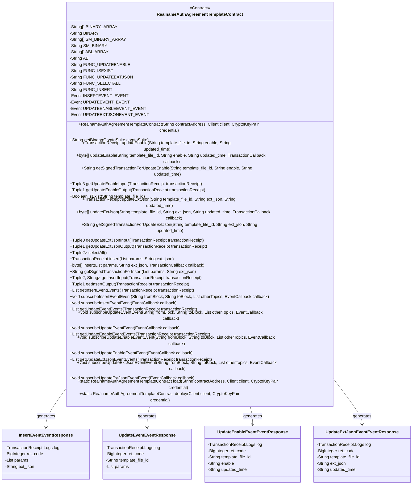
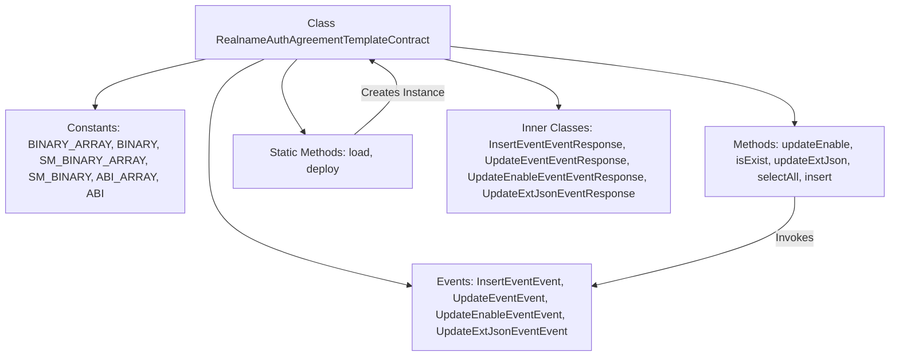
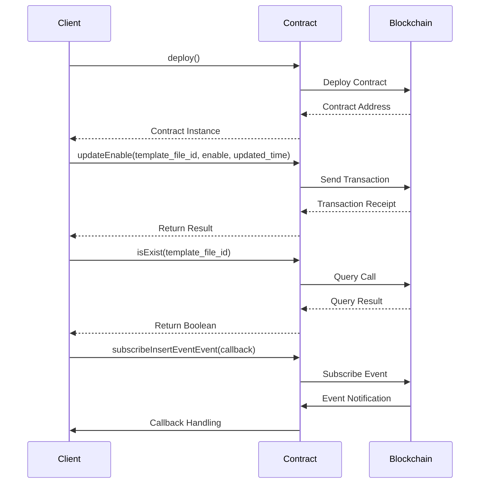

# Basic Information

|      |      |
|------|------|
| Name | RealnameAuthAgreementTemplateContract |
| Language | .java |
| Code Path | WeFe/manager/manager-service/src/main/java/com/welab/wefe/manager/service/contract/RealnameAuthAgreementTemplateContract.java |
| Package Name | com.welab.wefe.manager.service.contract |
| Dependencies | ['org.fisco.bcos.sdk.abi.FunctionReturnDecoder', 'org.fisco.bcos.sdk.abi.TypeReference', 'org.fisco.bcos.sdk.abi.datatypes', 'org.fisco.bcos.sdk.abi.datatypes.generated.Int256', 'org.fisco.bcos.sdk.abi.datatypes.generated.tuples.generated.Tuple1', 'org.fisco.bcos.sdk.abi.datatypes.generated.tuples.generated.Tuple2', 'org.fisco.bcos.sdk.abi.datatypes.generated.tuples.generated.Tuple3', 'org.fisco.bcos.sdk.client.Client', 'org.fisco.bcos.sdk.contract.Contract', 'org.fisco.bcos.sdk.crypto.CryptoSuite', 'org.fisco.bcos.sdk.crypto.keypair.CryptoKeyPair', 'org.fisco.bcos.sdk.eventsub.EventCallback', 'org.fisco.bcos.sdk.model.CryptoType', 'org.fisco.bcos.sdk.model.TransactionReceipt', 'org.fisco.bcos.sdk.model.callback.TransactionCallback', 'org.fisco.bcos.sdk.transaction.model.exception.ContractException', 'java.math.BigInteger', 'java.util.ArrayList', 'java.util.Arrays', 'java.util.Collections', 'java.util.List'] |
| Brief Description | This is a Java wrapper class for a smart contract named `RealnameAuthAgreementTemplateContract`, with the following key functionalities:1. **Contract Basic Information**:   - Includes the contract's bytecode (BINARY/SM_BINARY) and ABI interface definition   - Defines 5 contract functions and 4 events2. **Core Features**:   - `updateEnable()`: Updates template activation status   - `isExist()`: Checks template existence   - `updateExtJson()`: Updates template extension JSON   - `selectAll()`: Queries all templates   - `insert()`: Inserts new template3. **Event Monitoring**:   - Provides subscription and handling methods for 4 events   - Includes events for insertion, update, activation status change, and extension JSON modification4. **Auxiliary Functions**:   - Supports regular and asynchronous transactions   - Provides transaction input/output parsing methods   - Supports both ECDSA and SM2 encryption standards5. **Deployment Methods**:   - Offers static methods for contract loading (load) and deployment (deploy)This wrapper class primarily facilitates interaction between Java applications and the blockchain-based real-name authentication agreement template smart contract, simplifying contract invocation and event handling processes. |

# Description

This is a smart contract Java wrapper class named `RealnameAuthAgreementTemplateContract`, primarily used for managing real-name authentication agreement templates. Below is a comprehensive description of the contract:

1. **Contract Functions**:
   - Provides CRUD operations for real-name authentication agreement templates
   - Supports enabling/disabling template status updates
   - Supports updates to template extended JSON data
   - Allows querying all template information

2. **Core Methods**:
   - `updateEnable()`: Updates template enablement status
   - `isExist()`: Checks if a template exists
   - `updateExtJson()`: Updates template extended JSON data
   - `selectAll()`: Queries all templates
   - `insert()`: Inserts a new template

3. **Event Listeners**:
   - `insertEvent`: Template insertion event
   - `updateEvent`: Template update event
   - `updateEnableEvent`: Template enablement status update event
   - `updateExtJsonEvent`: Template extended data update event

4. **Technical Features**:
   - Supports both ECDSA and SM2 encryption algorithms
   - Provides synchronous and asynchronous transaction execution modes
   - Includes input/output parameter parsing methods
   - Supports event subscription functionality

5. **Data Structures**:
   - Uses string arrays to store template parameters
   - Uses BigInteger as return code type
   - Defines multiple event response classes

6. **Deployment Methods**:
   - Can load existing contracts via the `load()` method
   - Can deploy new contracts via the `deploy()` method

This wrapper class fully implements interaction functionalities with blockchain smart contracts, including transaction sending, querying, and event listening, providing a concise API interface for upper-layer applications.

# Class Summary

| Name   | Type  | Description |
|-------|------|-------------|
| RealnameAuthAgreementTemplateContract | class | This is a Java wrapper class for a smart contract named `RealnameAuthAgreementTemplateContract`, primarily designed to interact with the real-name authentication agreement template contract on the blockchain. Below is a summary of key information:1. **Contract Features**:   - Provides CRUD operations for real-name authentication agreement templates   - Includes methods for enabling/disabling templates, updating extended JSON, checking existence, and querying all templates2. **Core Methods**:   - `updateEnable()` - Updates the template's enabled status   - `isExist()` - Checks if a template exists   - `updateExtJson()` - Updates the template's extended JSON   - `selectAll()` - Queries all templates   - `insert()` - Inserts a new template3. **Event Listening**:   - Provides four types of event listeners: insertion events, update events, enable-update events, and JSON-update events4. **Technical Characteristics**:   - Supports both SM (Chinese cryptographic standard) and ECDSA encryption algorithms   - Includes complete ABI and binary code   - Provides transaction receipt parsing functionality5. **Usage**:   - Can load an existing contract via `load()`   - Can deploy a new contract via `deploy()`   - Supports both synchronous and asynchronous transaction executionThis wrapper class simplifies the interaction between Java applications and blockchain smart contracts, allowing developers to directly call these methods without handling the underlying blockchain protocol details. |

## Class RealnameAuthAgreementTemplateContract

|      |      |
|------|------|
| Access Modifier | @SuppressWarnings("unchecked");public |
| Type | class |
| Name | RealnameAuthAgreementTemplateContract |
| Description | This is a Java wrapper class for a smart contract named `RealnameAuthAgreementTemplateContract`, primarily designed to interact with the real-name authentication agreement template contract on the blockchain. Below is a summary of key information:1. **Contract Features**:   - Provides CRUD operations for real-name authentication agreement templates   - Includes methods for enabling/disabling templates, updating extended JSON, checking existence, and querying all templates2. **Core Methods**:   - `updateEnable()` - Updates the template's enabled status   - `isExist()` - Checks if a template exists   - `updateExtJson()` - Updates the template's extended JSON   - `selectAll()` - Queries all templates   - `insert()` - Inserts a new template3. **Event Listening**:   - Provides four types of event listeners: insertion events, update events, enable-update events, and JSON-update events4. **Technical Characteristics**:   - Supports both SM (Chinese cryptographic standard) and ECDSA encryption algorithms   - Includes complete ABI and binary code   - Provides transaction receipt parsing functionality5. **Usage**:   - Can load an existing contract via `load()`   - Can deploy a new contract via `deploy()`   - Supports both synchronous and asynchronous transaction executionThis wrapper class simplifies the interaction between Java applications and blockchain smart contracts, allowing developers to directly call these methods without handling the underlying blockchain protocol details. |

### UML Class Diagram

### Internal Method Call Graph

This code represents a Java wrapper class for a smart contract designed for managing real-name authentication agreement templates. It provides functionalities including contract deployment, method invocation, and event listening, featuring 5 main methods (updateEnable, isExist, updateExtJson, selectAll, insert) and 4 event types. The flowchart illustrates the class structure and component relationships, while the sequence diagram depicts typical interaction processes for contract deployment, method calls, and event subscriptions. The contract supports both standard and SM cryptographic versions, automatically selecting the correct binary code via CryptoSuite.

### Field List

| Name  | Type  | Description |
|-------|-------|------|
| UPDATEEVENT_EVENT = new Event("updateEvent",             Arrays.<TypeReference<?>>asList(new TypeReference<Int256>() {}, new TypeReference<Utf8String>() {}, new TypeReference<DynamicArray<Utf8String>>() {})) | Event | Define a static constant UPDATEEVENT_EVENT, of type Event, containing three parameters: Int256, Utf8String, and DynamicArray<Utf8String>. |
| INSERTEVENT_EVENT = new Event("insertEvent",             Arrays.<TypeReference<?>>asList(new TypeReference<Int256>() {}, new TypeReference<DynamicArray<Utf8String>>() {}, new TypeReference<Utf8String>() {})) | Event | Define a static constant INSERTEVENT_EVENT, of type Event, containing the event name "insertEvent" and three parameter types: Int256, DynamicArray<Utf8String>, and Utf8String. |
| UPDATEEXTJSONEVENT_EVENT = new Event("updateExtJsonEvent",             Arrays.<TypeReference<?>>asList(new TypeReference<Int256>() {}, new TypeReference<Utf8String>() {}, new TypeReference<Utf8String>() {}, new TypeReference<Utf8String>() {})) | Event | Define a static constant UPDATEEXTJSONEVENT_EVENT of type Event, containing four parameters: Int256 and three Utf8String. |
| BINARY = org.fisco.bcos.sdk.utils.StringUtils.joinAll("", BINARY_ARRAY) | String | Define a static constant BINARY, which concatenates an empty string and BINARY_ARRAY using the StringUtils.joinAll method to generate a binary string. |
| FUNC_UPDATEENABLE = "updateEnable" | String | Defined a public static constant string FUNC_UPDATEENABLE with the value "updateEnable". |
| FUNC_UPDATEEXTJSON = "updateExtJson" | String | This is a Java static constant definition, representing the functional identifier for updating extended JSON. |
| BINARY_ARRAY = {"60806040523480156200001157600080fd5b506110016000806101000a81548173ffffffffffffffffffffffffffffffffffffffff021916908373ffffffffffffffffffffffffffffffffffffffff1602179055506000809054906101000a900473ffffffffffffffffffffffffffffffffffffffff1673ffffffffffffffffffffffffffffffffffffffff166356004b6a606060405190810160405280602381526020017f7265616c6e616d655f617574685f61677265656d656e745f74656d706c61746581526020017f5f763200000000000000000000000000000000000000000000000000000000008152506040518263ffffffff167c0100000000000000000000000000000000000000000000000000000000028152600401620001289190620002e3565b602060405180830381600087803b1580156200014357600080fd5b505af115801562000158573d6000803e3d6000fd5b505050506040513d601f19601f820116820180604052506200017e91908101906200019b565b506200038d565b60006200019382516200033c565b905092915050565b600060208284031215620001ae57600080fd5b6000620001be8482850162000185565b91505092915050565b6000620001d48262000331565b808452620001ea81602086016020860162000346565b620001f5816200037c565b602085010191505092915050565b6000600682527f6669785f696400000000000000000000000000000000000000000000000000006020830152604082019050919050565b6000607282527f74656d706c6174655f66696c655f69642c74656d706c6174655f66696c655f7360208301527f69676e2c66696c655f6e616d652c626c6f636b636861696e5f6e6f64655f696460408301527f2c656e61626c652c76657273696f6e2c637265617465645f74696d652c75706460608301527f617465645f74696d652c6578745f6a736f6e0000000000000000000000000000608083015260a082019050919050565b60006060820190508181036000830152620002ff8184620001c7565b90508181036020830152620003148162000203565b9050818103604083015262000329816200023a565b905092915050565b600081519050919050565b6000819050919050565b60005b838110156200036657808201518184015260208101905062000349565b8381111562000376576000848401525b50505050565b6000601f19601f8301169050919050565b613b74806200039d6000396000f30060806040526004361061006d576000357c0100000000000000000000000000000000000000000000000000000000900463ffffffff16806305a9bbe7146100725780634d3d096b146100af57806363964aa3146100ec578063857cb0eb146101295780639729115014610155575b600080fd5b34801561007e57600080fd5b5061009960048036036100949190810190612fea565b610192565b6040516100a691906133d8565b60405180910390f35b3480156100bb57600080fd5b506100d660048036036100d19190810190612f68565b610773565b6040516100e391906133bd565b60405180910390f35b3480156100f857600080fd5b50610113600480360361010e9190810190612fea565b610b5e565b60405161012091906133d8565b60405180910390f35b34801561013557600080fd5b5061013e61113f565b60405161014c9291906133f3565b60405180910390f35b34801561016157600080fd5b5061017c60048036036101779190810190612e2f565b61150a565b60405161018991906133d8565b60405180910390f35b600080600080600080600094506101a889610773565b1515610216577ffffffffffffffffffffffffffffffffffffffffffffffffffffffffffffffffd94507f7d29950a0ae63eb067d4a746f4bfc4351fff7ffaa81e13a0c7f07a80aa4f529d858a8a8a6040516102069493929190613468565b60405180910390a1849550610767565b6000809054906101000a900473ffffffffffffffffffffffffffffffffffffffff1673ffffffffffffffffffffffffffffffffffffffff1663f23f63c9606060405190810160405280602381526020017f7265616c6e616d655f617574685f61677265656d656e745f74656d706c61746581526020017f5f763200000000000000000000000000000000000000000000000000000000008152506040518263ffffffff167c01000000000000000000000000000000000000000000000000000000000281526004016102e891906134c2565b602060405180830381600087803b15801561030257600080fd5b505af1158015610316573d6000803e3d6000fd5b505050506040513d601f19601f8201168201806040525061033a9190810190612f16565b93508373ffffffffffffffffffffffffffffffffffffffff16637857d7c96040518163ffffffff167c0100000000000000000000000000000000000000000000000000000000028152600401602060405180830381600087803b1580156103a057600080fd5b505af11580156103b4573d6000803e3d6000fd5b505050506040513d601f19601f820116820180604052506103d89190810190612e9b565b92508273ffffffffffffffffffffffffffffffffffffffff1663cd30a1d18a6040518263ffffffff167c010000000000000000000000000000000000000000000000000000000002815260040161042f919061362c565b600060405180830381600087803b15801561044957600080fd5b505af115801561045d573d6000803e3d6000fd5b505050508373ffffffffffffffffffffffffffffffffffffffff166313db93466040518163ffffffff167c0100000000000000000000000000000000000000000000000000000000028152600401602060405180830381600087803b1580156104c557600080fd5b505af11580156104d9573d6000803e3d6000fd5b505050506040513d601f19601f820116820180604052506104fd9190810190612eed565b91508173ffffffffffffffffffffffffffffffffffffffff1663e942b516896040518263ffffffff167c0100000000000000000000000000000000000000000000000000000000028152600401610554919061381f565b600060405180830381600087803b15801561056e57600080fd5b505af1158015610582573d6000803e3d6000fd5b505050508173ffffffffffffffffffffffffffffffffffffffff1663e942b516886040518263ffffffff167c01000000000000000000000000000000000000000000000000000000000281526004016105db91906136eb565b600060405180830381600087803b1580156105f557600080fd5b505af1158015610609573d6000803e3d6000fd5b505050508373ffffffffffffffffffffffffffffffffffffffff1663bf2b70a16040805190810160405280602081526020017f7265616c6e616d655f617574685f61677265656d656e745f74656d706c61746581525084866040518463ffffffff167c010000000000000000000000000000000000000000000000000000000002815260040161069b93929190613544565b602060405180830381600087803b1580156106b557600080fd5b505af11580156106c9573d6000803e3d6000fd5b505050506040513d601f19601f820116820180604052506106ed9190810190612f3f565b90506001811215156107025760009450610726565b7ffffffffffffffffffffffffffffffffffffffffffffffffffffffffffffffffe94505b7f7d29950a0ae63eb067d4a746f4bfc4351fff7ffaa81e13a0c7f07a80aa4f529d858a8a8a60405161075b9493929190613468565b60405180910390a18495505b50505050509392505050565b6000806000806000809054906101000a900473ffffffffffffffffffffffffffffffffffffffff1673ffffffffffffffffffffffffffffffffffffffff1663f23f63c9606060405190810160405280602381526020017f7265616c6e616d655f617574685f61677265656d656e745f74656d706c61746581526020017f5f763200000000000000000000000000000000000000000000000000000000008152506040518263ffffffff167c010000000000000000000000000000000000000000000000000000000002815260040161084b91906134c2565b602060405180830381600087803b15801561086557600080fd5b505af1158015610879573d6000803e3d6000fd5b505050506040513d601f19601f8201168201806040525061089d9190810190612f16565b92508273ffffffffffffffffffffffffffffffffffffffff16637857d7c96040518163ffffffff167c0100000000000000000000000000000000000000000000000000000000028152600401602060405180830381600087803b15801561090357600080fd5b505af1158015610917573d6000803e3d6000fd5b505050506040513d601f19601f8201168201806040525061093b9190810190612e9b565b91508173ffffffffffffffffffffffffffffffffffffffff1663cd30a1d1866040518263ffffffff167c0100000000000000000000000000000000000000000000000000000000028152600401610992919061362c565b600060405180830381600087803b1580156109ac57600080fd5b505af11580156109c0573d6000803e3d6000fd5b505050508273ffffffffffffffffffffffffffffffffffffffff1663e8434e396040805190810160405280602081526020017f7265616c6e616d655f617574685f61677265656d656e745f74656d706c617465815250846040518363ffffffff167c0100000000000000000000000000000000000000000000000000000000028152600401610a509291906134e4565b602060405180830381600087803b158015610a6a57600080fd5b505af1158015610a7e573d6000803e3d6000fd5b505050506040513d601f19601f82011682018060405250610aa29190810190612ec4565b905060008173ffffffffffffffffffffffffffffffffffffffff1663949d225d6040518163ffffffff167c0100000000000000000000000000000000000000000000000000000000028152600401602060405180830381600087803b158015610b0a57600080fd5b505af1158015610b1e573d6000803e3d6000fd5b505050506040513d601f19601f82011682018060405250610b429190810190612f3f565b1115610b515760019350610b56565b600093505b505050919050565b60008060008060008060009450610b7489610773565b1515610be2577ffffffffffffffffffffffffffffffffffffffffffffffffffffffffffffffffd94507f91fa9d6109b9b8b47733f98f4b6858346683ebdf73ba3c2f98b90c0d352f83e1858a8a8a604051610bd29493929190613468565b60405180910390a1849550611133565b6000809054906101000a900473ffffffffffffffffffffffffffffffffffffffff1673ffffffffffffffffffffffffffffffffffffffff1663f23f63c9606060405190810160405280602381526020017f7265616c6e616d655f617574685f61677265656d656e745f74656d706c61746581526020017f5f7632000000000000","00000000000000000000000000000000000000000000008152506040518263ffffffff167c0100000000000000000000000000000000000000000000000000000000028152600401610cb491906134c2565b602060405180830381600087803b158015610cce57600080fd5b505af1158015610ce2573d6000803e3d6000fd5b505050506040513d601f19601f82011682018060405250610d069190810190612f16565b93508373ffffffffffffffffffffffffffffffffffffffff16637857d7c96040518163ffffffff167c0100000000000000000000000000000000000000000000000000000000028152600401602060405180830381600087803b158015610d6c57600080fd5b505af1158015610d80573d6000803e3d6000fd5b505050506040513d601f19601f82011682018060405250610da49190810190612e9b565b92508273ffffffffffffffffffffffffffffffffffffffff1663cd30a1d18a6040518263ffffffff167c0100000000000000000000000000000000000000000000000000000000028152600401610dfb919061362c565b600060405180830381600087803b158015610e1557600080fd5b505af1158015610e29573d6000803e3d6000fd5b505050508373ffffffffffffffffffffffffffffffffffffffff166313db93466040518163ffffffff167c0100000000000000000000000000000000000000000000000000000000028152600401602060405180830381600087803b158015610e9157600080fd5b505af1158015610ea5573d6000803e3d6000fd5b505050506040513d601f19601f82011682018060405250610ec99190810190612eed565b91508173ffffffffffffffffffffffffffffffffffffffff1663e942b516896040518263ffffffff167c0100000000000000000000000000000000000000000000000000000000028152600401610f2091906135a2565b600060405180830381600087803b158015610f3a57600080fd5b505af1158015610f4e573d6000803e3d6000fd5b505050508173ffffffffffffffffffffffffffffffffffffffff1663e942b516886040518263ffffffff167c0100000000000000000000000000000000000000000000000000000000028152600401610fa791906136eb565b600060405180830381600087803b158015610fc157600080fd5b505af1158015610fd5573d6000803e3d6000fd5b505050508373ffffffffffffffffffffffffffffffffffffffff1663bf2b70a16040805190810160405280602081526020017f7265616c6e616d655f617574685f61677265656d656e745f74656d706c61746581525084866040518463ffffffff167c010000000000000000000000000000000000000000000000000000000002815260040161106793929190613544565b602060405180830381600087803b15801561108157600080fd5b505af1158015611095573d6000803e3d6000fd5b505050506040513d601f19601f820116820180604052506110b99190810190612f3f565b90506001811215156110ce57600094506110f2565b7ffffffffffffffffffffffffffffffffffffffffffffffffffffffffffffffffe94505b7f91fa9d6109b9b8b47733f98f4b6858346683ebdf73ba3c2f98b90c0d352f83e1858a8a8a6040516111279493929190613468565b60405180910390a18495505b50505050509392505050565b600060606000806000809054906101000a900473ffffffffffffffffffffffffffffffffffffffff1673ffffffffffffffffffffffffffffffffffffffff1663f23f63c9606060405190810160405280602381526020017f7265616c6e616d655f617574685f61677265656d656e745f74656d706c61746581526020017f5f763200000000000000000000000000000000000000000000000000000000008152506040518263ffffffff167c010000000000000000000000000000000000000000000000000000000002815260040161121891906134c2565b602060405180830381600087803b15801561123257600080fd5b505af1158015611246573d6000803e3d6000fd5b505050506040513d601f19601f8201168201806040525061126a9190810190612f16565b91508173ffffffffffffffffffffffffffffffffffffffff1663e8434e396040805190810160405280602081526020017f7265616c6e616d655f617574685f61677265656d656e745f74656d706c6174658152508473ffffffffffffffffffffffffffffffffffffffff16637857d7c96040518163ffffffff167c0100000000000000000000000000000000000000000000000000000000028152600401602060405180830381600087803b15801561132257600080fd5b505af1158015611336573d6000803e3d6000fd5b505050506040513d601f19601f8201168201806040525061135a9190810190612e9b565b6040518363ffffffff167c01000000000000000000000000000000000000000000000000000000000281526004016113939291906134e4565b602060405180830381600087803b1580156113ad57600080fd5b505af11580156113c1573d6000803e3d6000fd5b505050506040513d601f19601f820116820180604052506113e59190810190612ec4565b90508073ffffffffffffffffffffffffffffffffffffffff1663949d225d6040518163ffffffff167c0100000000000000000000000000000000000000000000000000000000028152600401602060405180830381600087803b15801561144b57600080fd5b505af115801561145f573d6000803e3d6000fd5b505050506040513d601f19601f820116820180604052506114839190810190612f3f565b600014156114f1577ffffffffffffffffffffffffffffffffffffffffffffffffffffffffffffffffd60006040519080825280602002602001820160405280156114e157816020015b60608152602001906001900390816114cc5790505b5081915080905093509350611504565b60006114fc82611f1f565b819150935093505b50509091565b600080600080600080935061153687600081518110151561152757fe5b90602001906020020151610773565b156115c1577fffffffffffffffffffffffffffffffffffffffffffffffffffffffffffffffff93507f5157dc1ab0b55c7621be94a34b2ae4228f7d16e8271628060cc027b1a513b12f84888860405161159193929190613423565b60405180910390a17fffffffffffffffffffffffffffffffffffffffffffffffffffffffffffffffff9450611f15565b6000809054906101000a900473ffffffffffffffffffffffffffffffffffffffff1673ffffffffffffffffffffffffffffffffffffffff1663f23f63c9606060405190810160405280602381526020017f7265616c6e616d655f617574685f61677265656d656e745f74656d706c61746581526020017f5f763200000000000000000000000000000000000000000000000000000000008152506040518263ffffffff167c010000000000000000000000000000000000000000000000000000000002815260040161169391906134c2565b602060405180830381600087803b1580156116ad57600080fd5b505af11580156116c1573d6000803e3d6000fd5b505050506040513d601f19601f820116820180604052506116e59190810190612f16565b92508273ffffffffffffffffffffffffffffffffffffffff166313db93466040518163ffffffff167c0100000000000000000000000000000000000000000000000000000000028152600401602060405180830381600087803b15801561174b57600080fd5b505af115801561175f573d6000803e3d6000fd5b505050506040513d601f19601f820116820180604052506117839190810190612eed565b91508173ffffffffffffffffffffffffffffffffffffffff1663e942b5166040805190810160405280602081526020017f7265616c6e616d655f617574685f61677265656d656e745f74656d706c6174658152506040518263ffffffff167c010000000000000000000000000000000000000000000000000000000002815260040161180f9190613661565b600060405180830381600087803b15801561182957600080fd5b505af115801561183d573d6000803e3d6000fd5b505050508173ffffffffffffffffffffffffffffffffffffffff1663e942b51688600081518110151561186c57fe5b906020019060200201516040518263ffffffff167c01000000000000000000000000000000000000000000000000000000000281526004016118ae91906135f7565b600060405180830381600087803b1580156118c857600080fd5b505af11580156118dc573d6000803e3d6000fd5b505050508173ffffffffffffffffffffffffffffffffffffffff1663e942b51688600181518110151561190b57fe5b906020019060200201516040518263ffffffff167c010000000000000000000000000000000000000000000000000000000002815260040161194d919061391e565b600060405180830381600087803b15801561196757600080fd5b505af115801561197b573d6000803e3d6000fd5b505050508173ffffffffffffffffffffffffffffffffffffffff1663e942b5168860028151811015156119aa57fe5b906020019060200201516040518263ffffffff167c01000000000000000000000000000000000000000000000000000000000281526004016119ec9190613795565b600060405180830381600087803b158015611a0657600080fd5b505af1158015611a1a573d6000803e3d6000fd5b505050508173ffffffffffffffffffffffffffffffffffffffff1663e942b516886003815181101515611a4957fe5b906020019060200201516040518263ffffffff167c0100000000000000000000000000000000000000000000000000000000028152600401611a8b9190613740565b600060405180830381600087803b158015611aa557600080fd5b505af1158015611ab9573d6000803e3d6000fd5b505050508173ffffffffffffffffffffffffffffffffffffffff1663e942b516886004815181101515611ae857fe5b906020019060200201516040518263ffffffff167c0100000000000000000000000000000000000000000000000000000000028152600401611b2a91906137ea565b600060405180830381600087803b158015611b4457600080fd5b505af1158015611b58573d6000803e3d6000fd5b505050508173ffffffffffffffffffffffffffffffffffffffff1663e942b516886005815181101515611b8757fe5b906020019060200201516040518263ffffffff167c0100000000000000000000000000000000000000000000000000000000028152600401611bc99190613874565b600060405180830381600087803b158015611be357600080fd5b505af1158015611bf7573d6000803e3d6000fd5b505050508173ffffffffffffffffffffffffffffffffffffffff1663e942b516886006815181101515611c2657fe5b906020019060200201516040518263ffffffff167c0100000000000000000000000000000000000000000000000000000000028152600401611c6891","906138c9565b600060405180830381600087803b158015611c8257600080fd5b505af1158015611c96573d6000803e3d6000fd5b505050508173ffffffffffffffffffffffffffffffffffffffff1663e942b516886007815181101515611cc557fe5b906020019060200201516040518263ffffffff167c0100000000000000000000000000000000000000000000000000000000028152600401611d0791906136b6565b600060405180830381600087803b158015611d2157600080fd5b505af1158015611d35573d6000803e3d6000fd5b505050508173ffffffffffffffffffffffffffffffffffffffff1663e942b516876040518263ffffffff167c0100000000000000000000000000000000000000000000000000000000028152600401611d8e91906135a2565b600060405180830381600087803b158015611da857600080fd5b505af1158015611dbc573d6000803e3d6000fd5b505050508273ffffffffffffffffffffffffffffffffffffffff166331afac366040805190810160405280602081526020017f7265616c6e616d655f617574685f61677265656d656e745f74656d706c617465815250846040518363ffffffff167c0100000000000000000000000000000000000000000000000000000000028152600401611e4c929190613514565b602060405180830381600087803b158015611e6657600080fd5b505af1158015611e7a573d6000803e3d6000fd5b505050506040513d601f19601f82011682018060405250611e9e9190810190612f3f565b90506001811415611eb25760009350611ed6565b7ffffffffffffffffffffffffffffffffffffffffffffffffffffffffffffffffe93505b7f5157dc1ab0b55c7621be94a34b2ae4228f7d16e8271628060cc027b1a513b12f848888604051611f0993929190613423565b60405180910390a18394505b5050505092915050565b60608060008060608573ffffffffffffffffffffffffffffffffffffffff1663949d225d6040518163ffffffff167c0100000000000000000000000000000000000000000000000000000000028152600401602060405180830381600087803b158015611f8b57600080fd5b505af1158015611f9f573d6000803e3d6000fd5b505050506040513d601f19601f82011682018060405250611fc39190810190612f3f565b604051908082528060200260200182016040528015611ff657816020015b6060815260200190600190039081611fe15790505b509350600092505b8573ffffffffffffffffffffffffffffffffffffffff1663949d225d6040518163ffffffff167c0100000000000000000000000000000000000000000000000000000000028152600401602060405180830381600087803b15801561206257600080fd5b505af1158015612076573d6000803e3d6000fd5b505050506040513d601f19601f8201168201806040525061209a9190810190612f3f565b831215612a12578573ffffffffffffffffffffffffffffffffffffffff1663846719e0846040518263ffffffff167c01000000000000000000000000000000000000000000000000000000000281526004016120f691906133d8565b602060405180830381600087803b15801561211057600080fd5b505af1158015612124573d6000803e3d6000fd5b505050506040513d601f19601f820116820180604052506121489190810190612eed565b915061223a6121ff8373ffffffffffffffffffffffffffffffffffffffff16639c981fcb6040518163ffffffff167c01000000000000000000000000000000000000000000000000000000000281526004016121a3906135d7565b600060405180830381600087803b1580156121bd57600080fd5b505af11580156121d1573d6000803e3d6000fd5b505050506040513d6000823e3d601f19601f820116820180604052506121fa9190810190612fa9565b612a1e565b6040805190810160405280600181526020017f7c00000000000000000000000000000000000000000000000000000000000000815250612a77565b90506122f7816122f28473ffffffffffffffffffffffffffffffffffffffff16639c981fcb6040518163ffffffff167c0100000000000000000000000000000000000000000000000000000000028152600401612296906138fe565b600060405180830381600087803b1580156122b057600080fd5b505af11580156122c4573d6000803e3d6000fd5b505050506040513d6000823e3d601f19601f820116820180604052506122ed9190810190612fa9565b612a1e565b612a77565b9050612338816040805190810160405280600181526020017f7c00000000000000000000000000000000000000000000000000000000000000815250612a77565b90506123f5816123f08473ffffffffffffffffffffffffffffffffffffffff16639c981fcb6040518163ffffffff167c010000000000000000000000000000000000000000000000000000000002815260040161239490613775565b600060405180830381600087803b1580156123ae57600080fd5b505af11580156123c2573d6000803e3d6000fd5b505050506040513d6000823e3d601f19601f820116820180604052506123eb9190810190612fa9565b612a1e565b612a77565b9050612436816040805190810160405280600181526020017f7c00000000000000000000000000000000000000000000000000000000000000815250612a77565b90506124f3816124ee8473ffffffffffffffffffffffffffffffffffffffff16639c981fcb6040518163ffffffff167c010000000000000000000000000000000000000000000000000000000002815260040161249290613720565b600060405180830381600087803b1580156124ac57600080fd5b505af11580156124c0573d6000803e3d6000fd5b505050506040513d6000823e3d601f19601f820116820180604052506124e99190810190612fa9565b612a1e565b612a77565b9050612534816040805190810160405280600181526020017f7c00000000000000000000000000000000000000000000000000000000000000815250612a77565b90506125f1816125ec8473ffffffffffffffffffffffffffffffffffffffff16639c981fcb6040518163ffffffff167c0100000000000000000000000000000000000000000000000000000000028152600401612590906137ca565b600060405180830381600087803b1580156125aa57600080fd5b505af11580156125be573d6000803e3d6000fd5b505050506040513d6000823e3d601f19601f820116820180604052506125e79190810190612fa9565b612a1e565b612a77565b9050612632816040805190810160405280600181526020017f7c00000000000000000000000000000000000000000000000000000000000000815250612a77565b90506126ef816126ea8473ffffffffffffffffffffffffffffffffffffffff16639c981fcb6040518163ffffffff167c010000000000000000000000000000000000000000000000000000000002815260040161268e90613854565b600060405180830381600087803b1580156126a857600080fd5b505af11580156126bc573d6000803e3d6000fd5b505050506040513d6000823e3d601f19601f820116820180604052506126e59190810190612fa9565b612a1e565b612a77565b9050612730816040805190810160405280600181526020017f7c00000000000000000000000000000000000000000000000000000000000000815250612a77565b90506127ed816127e88473ffffffffffffffffffffffffffffffffffffffff16639c981fcb6040518163ffffffff167c010000000000000000000000000000000000000000000000000000000002815260040161278c906138a9565b600060405180830381600087803b1580156127a657600080fd5b505af11580156127ba573d6000803e3d6000fd5b505050506040513d6000823e3d601f19601f820116820180604052506127e39190810190612fa9565b612a1e565b612a77565b905061282e816040805190810160405280600181526020017f7c00000000000000000000000000000000000000000000000000000000000000815250612a77565b90506128eb816128e68473ffffffffffffffffffffffffffffffffffffffff16639c981fcb6040518163ffffffff167c010000000000000000000000000000000000000000000000000000000002815260040161288a90613696565b600060405180830381600087803b1580156128a457600080fd5b505af11580156128b8573d6000803e3d6000fd5b505050506040513d6000823e3d601f19601f820116820180604052506128e19190810190612fa9565b612a1e565b612a77565b905061292c816040805190810160405280600181526020017f7c00000000000000000000000000000000000000000000000000000000000000815250612a77565b90506129e9816129e48473ffffffffffffffffffffffffffffffffffffffff16639c981fcb6040518163ffffffff167c010000000000000000000000000000000000000000000000000000000002815260040161298890613582565b600060405180830381600087803b1580156129a257600080fd5b505af11580156129b6573d6000803e3d6000fd5b505050506040513d6000823e3d601f19601f820116820180604052506129df9190810190612fa9565b612a1e565b612a77565b90508084848151811015156129fa57fe5b90602001906020020181905250826001019250611ffe565b83945050505050919050565b60606000612a2b83612c48565b1415612a6e576040805190810160405280600181526020017f20000000000000000000000000000000000000000000000000000000000000008152509050612a72565b8190505b919050565b606080606080606060008088955087945084518651016040519080825280601f01601f191660200182016040528015612abf5781602001602082028038833980820191505090505b50935083925060009150600090505b8551811015612b81578581815181101515612ae557fe5b9060200101517f010000000000000000000000000000000000000000000000000000000000000090047f0100000000000000000000000000000000000000000000000000000000000000028383806001019450815181101515612b4457fe5b9060200101907effffffffffffffffffffffffffffffffffffffffffffffffffffffffffffff1916908160001a9053508080600101915050612ace565b600090505b8451811015612c39578481815181101515612b9d57fe5b9060200101517f010000000000000000000000000000000000000000000000000000000000000090047f0100000000000000000000000000000000000000000000000000000000000000028383806001019450815181101515612bfc57fe5b9060200101907effffffffffffffffffffffffffffffffffffffffffffffffffffffffffffff1916908160001a9053508080600101915050612b86565b83965050505050505092915050565b600081519050919050565b600082601f8301121515612c665760","0080fd5b8135612c79612c7482613980565b613953565b9150818183526020840193506020810190508360005b83811015612cbf5781358601612ca58882612d2d565b845260208401935060208301925050600181019050612c8f565b5050505092915050565b6000612cd58251613a71565b905092915050565b6000612ce98251613a83565b905092915050565b6000612cfd8251613a95565b905092915050565b6000612d118251613aa7565b905092915050565b6000612d258251613ab9565b905092915050565b600082601f8301121515612d4057600080fd5b8135612d53612d4e826139a8565b613953565b91508082526020830160208301858383011115612d6f57600080fd5b612d7a838284613ae7565b50505092915050565b600082601f8301121515612d9657600080fd5b8135612da9612da4826139d4565b613953565b91508082526020830160208301858383011115612dc557600080fd5b612dd0838284613ae7565b50505092915050565b600082601f8301121515612dec57600080fd5b8151612dff612dfa826139d4565b613953565b91508082526020830160208301858383011115612e1b57600080fd5b612e26838284613af6565b50505092915050565b60008060408385031215612e4257600080fd5b600083013567ffffffffffffffff811115612e5c57600080fd5b612e6885828601612c53565b925050602083013567ffffffffffffffff811115612e8557600080fd5b612e9185828601612d83565b9150509250929050565b600060208284031215612ead57600080fd5b6000612ebb84828501612cc9565b91505092915050565b600060208284031215612ed657600080fd5b6000612ee484828501612cdd565b91505092915050565b600060208284031215612eff57600080fd5b6000612f0d84828501612cf1565b91505092915050565b600060208284031215612f2857600080fd5b6000612f3684828501612d05565b91505092915050565b600060208284031215612f5157600080fd5b6000612f5f84828501612d19565b91505092915050565b600060208284031215612f7a57600080fd5b600082013567ffffffffffffffff811115612f9457600080fd5b612fa084828501612d83565b91505092915050565b600060208284031215612fbb57600080fd5b600082015167ffffffffffffffff811115612fd557600080fd5b612fe184828501612dd9565b91505092915050565b600080600060608486031215612fff57600080fd5b600084013567ffffffffffffffff81111561301957600080fd5b61302586828701612d83565b935050602084013567ffffffffffffffff81111561304257600080fd5b61304e86828701612d83565b925050604084013567ffffffffffffffff81111561306b57600080fd5b61307786828701612d83565b9150509250925092565b600061308c82613a0d565b808452602084019350836020820285016130a585613a00565b60005b848110156130de5783830388526130c0838351613161565b92506130cb82613a2e565b91506020880197506001810190506130a8565b508196508694505050505092915050565b6130f881613a5b565b82525050565b61310781613ac3565b82525050565b61311681613ad5565b82525050565b61312581613a67565b82525050565b600061313682613a23565b80845261314a816020860160208601613af6565b61315381613b29565b602085010191505092915050565b600061316c82613a18565b808452613180816020860160208601613af6565b61318981613b29565b602085010191505092915050565b6000600882527f6578745f6a736f6e0000000000000000000000000000000000000000000000006020830152604082019050919050565b6000601082527f74656d706c6174655f66696c655f6964000000000000000000000000000000006020830152604082019050919050565b6000600682527f6669785f696400000000000000000000000000000000000000000000000000006020830152604082019050919050565b6000600c82527f757064617465645f74696d6500000000000000000000000000000000000000006020830152604082019050919050565b6000601282527f626c6f636b636861696e5f6e6f64655f696400000000000000000000000000006020830152604082019050919050565b6000600982527f66696c655f6e616d6500000000000000000000000000000000000000000000006020830152604082019050919050565b6000600682527f656e61626c6500000000000000000000000000000000000000000000000000006020830152604082019050919050565b6000600782527f76657273696f6e000000000000000000000000000000000000000000000000006020830152604082019050919050565b6000600c82527f637265617465645f74696d6500000000000000000000000000000000000000006020830152604082019050919050565b6000601282527f74656d706c6174655f66696c655f7369676e00000000000000000000000000006020830152604082019050919050565b60006020820190506133d260008301846130ef565b92915050565b60006020820190506133ed600083018461311c565b92915050565b6000604082019050613408600083018561311c565b818103602083015261341a8184613081565b90509392505050565b6000606082019050613438600083018661311c565b818103602083015261344a8185613081565b9050818103604083015261345e818461312b565b9050949350505050565b600060808201905061347d600083018761311c565b818103602083015261348f818661312b565b905081810360408301526134a3818561312b565b905081810360608301526134b7818461312b565b905095945050505050565b600060208201905081810360008301526134dc8184613161565b905092915050565b600060408201905081810360008301526134fe8185613161565b905061350d60208301846130fe565b9392505050565b6000604082019050818103600083015261352e8185613161565b905061353d602083018461310d565b9392505050565b6000606082019050818103600083015261355e8186613161565b905061356d602083018561310d565b61357a60408301846130fe565b949350505050565b6000602082019050818103600083015261359b81613197565b9050919050565b600060408201905081810360008301526135bb81613197565b905081810360208301526135cf818461312b565b905092915050565b600060208201905081810360008301526135f0816131ce565b9050919050565b60006040820190508181036000830152613610816131ce565b905081810360208301526136248184613161565b905092915050565b60006040820190508181036000830152613645816131ce565b90508181036020830152613659818461312b565b905092915050565b6000604082019050818103600083015261367a81613205565b9050818103602083015261368e8184613161565b905092915050565b600060208201905081810360008301526136af8161323c565b9050919050565b600060408201905081810360008301526136cf8161323c565b905081810360208301526136e38184613161565b905092915050565b600060408201905081810360008301526137048161323c565b90508181036020830152613718818461312b565b905092915050565b6000602082019050818103600083015261373981613273565b9050919050565b6000604082019050818103600083015261375981613273565b9050818103602083015261376d8184613161565b905092915050565b6000602082019050818103600083015261378e816132aa565b9050919050565b600060408201905081810360008301526137ae816132aa565b905081810360208301526137c28184613161565b905092915050565b600060208201905081810360008301526137e3816132e1565b9050919050565b60006040820190508181036000830152613803816132e1565b905081810360208301526138178184613161565b905092915050565b60006040820190508181036000830152613838816132e1565b9050818103602083015261384c818461312b565b905092915050565b6000602082019050818103600083015261386d81613318565b9050919050565b6000604082019050818103600083015261388d81613318565b905081810360208301526138a18184613161565b905092915050565b600060208201905081810360008301526138c28161334f565b9050919050565b600060408201905081810360008301526138e28161334f565b905081810360208301526138f68184613161565b905092915050565b6000602082019050818103600083015261391781613386565b9050919050565b6000604082019050818103600083015261393781613386565b9050818103602083015261394b8184613161565b905092915050565b6000604051905081810181811067ffffffffffffffff8211171561397657600080fd5b8060405250919050565b600067ffffffffffffffff82111561399757600080fd5b602082029050602081019050919050565b600067ffffffffffffffff8211156139bf57600080fd5b601f19601f8301169050602081019050919050565b600067ffffffffffffffff8211156139eb57600080fd5b601f19601f8301169050602081019050919050565b6000602082019050919050565b600081519050919050565b600081519050919050565b600081519050919050565b6000602082019050919050565b600073ffffffffffffffffffffffffffffffffffffffff82169050919050565b60008115159050919050565b6000819050919050565b6000613a7c82613a3b565b9050919050565b6000613a8e82613a3b565b9050919050565b6000613aa082613a3b565b9050919050565b6000613ab282613a3b565b9050919050565b6000819050919050565b6000613ace82613a3b565b9050919050565b6000613ae082613a3b565b9050919050565b82818337600083830152505050565b60005b83811015613b14578082015181840152602081019050613af9565b83811115613b23576000848401525b50505050565b6000601f19601f83011690509190505600a265627a7a72305820e9da0c804612307f2236d7a7d634420087909b5ba160317c77c646de19f271506c6578706572696d656e74616cf50037"} | String[] | This is a public static final String array named BINARY_ARRAY, containing hexadecimal bytecode data of the smart contract. |
| SM_BINARY = org.fisco.bcos.sdk.utils.StringUtils.joinAll("", SM_BINARY_ARRAY) | String | Define the static constant SM_BINARY by concatenating the contents of the SM_BINARY_ARRAY array using the StringUtils.joinAll method. |
| UPDATEENABLEEVENT_EVENT = new Event("updateEnableEvent",             Arrays.<TypeReference<?>>asList(new TypeReference<Int256>() {}, new TypeReference<Utf8String>() {}, new TypeReference<Utf8String>() {}, new TypeReference<Utf8String>() {})) | Event | Define a static constant UPDATEENABLEEVENT_EVENT, of type Event, containing four parameters: Int256 and three Utf8String. |
| FUNC_INSERT = "insert" | String | Defined a public static constant string FUNC_INSERT with the value "insert". |
| FUNC_ISEXIST = "isExist" | String | Static constant string FUNC_ISEXIST with the value "isExist". |
| ABI_ARRAY = {"[{\"constant\":false,\"inputs\":[{\"name\":\"template_file_id\",\"type\":\"string\"},{\"name\":\"enable\",\"type\":\"string\"},{\"name\":\"updated_time\",\"type\":\"string\"}],\"name\":\"updateEnable\",\"outputs\":[{\"name\":\"\",\"type\":\"int256\"}],\"payable\":false,\"stateMutability\":\"nonpayable\",\"type\":\"function\"},{\"constant\":true,\"inputs\":[{\"name\":\"template_file_id\",\"type\":\"string\"}],\"name\":\"isExist\",\"outputs\":[{\"name\":\"\",\"type\":\"bool\"}],\"payable\":false,\"stateMutability\":\"view\",\"type\":\"function\"},{\"constant\":false,\"inputs\":[{\"name\":\"template_file_id\",\"type\":\"string\"},{\"name\":\"ext_json\",\"type\":\"string\"},{\"name\":\"updated_time\",\"type\":\"string\"}],\"name\":\"updateExtJson\",\"outputs\":[{\"name\":\"\",\"type\":\"int256\"}],\"payable\":false,\"stateMutability\":\"nonpayable\",\"type\":\"function\"},{\"constant\":true,\"inputs\":[],\"name\":\"selectAll\",\"outputs\":[{\"name\":\"\",\"type\":\"int256\"},{\"name\":\"\",\"type\":\"string[]\"}],\"payable\":false,\"stateMutability\":\"view\",\"type\":\"function\"},{\"constant\":false,\"inputs\":[{\"name\":\"params\",\"type\":\"string[]\"},{\"name\":\"ext_json\",\"type\":\"string\"}],\"name\":\"insert\",\"outputs\":[{\"name\":\"\",\"type\":\"int256\"}],\"payable\":false,\"stateMutability\":\"nonpayable\",\"type\":\"function\"},{\"inputs\":[],\"payable\":false,\"stateMutability\":\"nonpayable\",\"type\":\"constructor\"},{\"anonymous\":false,\"inputs\":[{\"indexed\":false,\"name\":\"ret_code\",\"type\":\"int256\"},{\"indexed\":false,\"name\":\"params\",\"type\":\"string[]\"},{\"indexed\":false,\"name\":\"ext_json\",\"type\":\"string\"}],\"name\":\"insertEvent\",\"type\":\"event\"},{\"anonymous\":false,\"inputs\":[{\"indexed\":false,\"name\":\"ret_code\",\"type\":\"int256\"},{\"indexed\":false,\"name\":\"template_file_id\",\"type\":\"string\"},{\"indexed\":false,\"name\":\"params\",\"type\":\"string[]\"}],\"name\":\"updateEvent\",\"type\":\"event\"},{\"anonymous\":false,\"inputs\":[{\"indexed\":false,\"name\":\"ret_code\",\"type\":\"int256\"},{\"indexed\":false,\"name\":\"template_file_id\",\"type\":\"string\"},{\"indexed\":false,\"name\":\"enable\",\"type\":\"string\"},{\"indexed\":false,\"name\":\"updated_time\",\"type\":\"string\"}],\"name\":\"updateEnableEvent\",\"type\":\"event\"},{\"anonymous\":false,\"inputs\":[{\"indexed\":false,\"name\":\"ret_code\",\"type\":\"int256\"},{\"indexed\":false,\"name\":\"template_file_id\",\"type\":\"string\"},{\"indexed\":false,\"name\":\"ext_json\",\"type\":\"string\"},{\"indexed\":false,\"name\":\"updated_time\",\"type\":\"string\"}],\"name\":\"updateExtJsonEvent\",\"type\":\"event\"}]"} | String[] | The smart contract ABI includes update, query, and insert functions along with corresponding events, involving operations on parameters such as template file ID, status, and extended JSON. |
| SM_BINARY_ARRAY = {"60806040523480156200001157600080fd5b506110016000806101000a81548173ffffffffffffffffffffffffffffffffffffffff021916908373ffffffffffffffffffffffffffffffffffffffff1602179055506000809054906101000a900473ffffffffffffffffffffffffffffffffffffffff1673ffffffffffffffffffffffffffffffffffffffff1663c92a7801606060405190810160405280602381526020017f7265616c6e616d655f617574685f61677265656d656e745f74656d706c61746581526020017f5f763200000000000000000000000000000000000000000000000000000000008152506040518263ffffffff167c0100000000000000000000000000000000000000000000000000000000028152600401620001289190620002e3565b602060405180830381600087803b1580156200014357600080fd5b505af115801562000158573d6000803e3d6000fd5b505050506040513d601f19601f820116820180604052506200017e91908101906200019b565b506200038d565b60006200019382516200033c565b905092915050565b600060208284031215620001ae57600080fd5b6000620001be8482850162000185565b91505092915050565b6000620001d48262000331565b808452620001ea81602086016020860162000346565b620001f5816200037c565b602085010191505092915050565b6000607282527f74656d706c6174655f66696c655f69642c74656d706c6174655f66696c655f7360208301527f69676e2c66696c655f6e616d652c626c6f636b636861696e5f6e6f64655f696460408301527f2c656e61626c652c76657273696f6e2c637265617465645f74696d652c75706460608301527f617465645f74696d652c6578745f6a736f6e0000000000000000000000000000608083015260a082019050919050565b6000600682527f6669785f696400000000000000000000000000000000000000000000000000006020830152604082019050919050565b60006060820190508181036000830152620002ff8184620001c7565b905081810360208301526200031481620002ac565b90508181036040830152620003298162000203565b905092915050565b600081519050919050565b6000819050919050565b60005b838110156200036657808201518184015260208101905062000349565b8381111562000376576000848401525b50505050565b6000601f19601f8301169050919050565b613b74806200039d6000396000f30060806040526004361061006d576000357c0100000000000000000000000000000000000000000000000000000000900463ffffffff16806315d0d62514610072578063568fe885146100af5780639eb03ade146100ec578063c181ca3614610129578063d5fc5a5314610155575b600080fd5b34801561007e57600080fd5b5061009960048036036100949190810190612fea565b610192565b6040516100a691906133d8565b60405180910390f35b3480156100bb57600080fd5b506100d660048036036100d19190810190612f68565b610773565b6040516100e391906133bd565b60405180910390f35b3480156100f857600080fd5b50610113600480360361010e9190810190612e2f565b610b5e565b60405161012091906133d8565b60405180910390f35b34801561013557600080fd5b5061013e611573565b60405161014c9291906133f3565b60405180910390f35b34801561016157600080fd5b5061017c60048036036101779190810190612fea565b61193e565b60405161018991906133d8565b60405180910390f35b600080600080600080600094506101a889610773565b1515610216577ffffffffffffffffffffffffffffffffffffffffffffffffffffffffffffffffd94507fb36a4960db7128c065f905021bc6b7ab38c8106c359c6ac8dcd55ed9356c994c858a8a8a6040516102069493929190613468565b60405180910390a1849550610767565b6000809054906101000a900473ffffffffffffffffffffffffffffffffffffffff1673ffffffffffffffffffffffffffffffffffffffff166359a48b65606060405190810160405280602381526020017f7265616c6e616d655f617574685f61677265656d656e745f74656d706c61746581526020017f5f763200000000000000000000000000000000000000000000000000000000008152506040518263ffffffff167c01000000000000000000000000000000000000000000000000000000000281526004016102e891906134c2565b602060405180830381600087803b15801561030257600080fd5b505af1158015610316573d6000803e3d6000fd5b505050506040513d601f19601f8201168201806040525061033a9190810190612f16565b93508373ffffffffffffffffffffffffffffffffffffffff1663c74f8caf6040518163ffffffff167c0100000000000000000000000000000000000000000000000000000000028152600401602060405180830381600087803b1580156103a057600080fd5b505af11580156103b4573d6000803e3d6000fd5b505050506040513d601f19601f820116820180604052506103d89190810190612e9b565b92508273ffffffffffffffffffffffffffffffffffffffff1663ae763db58a6040518263ffffffff167c010000000000000000000000000000000000000000000000000000000002815260040161042f919061383f565b600060405180830381600087803b15801561044957600080fd5b505af115801561045d573d6000803e3d6000fd5b505050508373ffffffffffffffffffffffffffffffffffffffff16635887ab246040518163ffffffff167c0100000000000000000000000000000000000000000000000000000000028152600401602060405180830381600087803b1580156104c557600080fd5b505af11580156104d9573d6000803e3d6000fd5b505050506040513d601f19601f820116820180604052506104fd9190810190612eed565b91508173ffffffffffffffffffffffffffffffffffffffff16631a391cb4896040518263ffffffff167c0100000000000000000000000000000000000000000000000000000000028152600401610554919061391e565b600060405180830381600087803b15801561056e57600080fd5b505af1158015610582573d6000803e3d6000fd5b505050508173ffffffffffffffffffffffffffffffffffffffff16631a391cb4886040518263ffffffff167c01000000000000000000000000000000000000000000000000000000000281526004016105db919061370b565b600060405180830381600087803b1580156105f557600080fd5b505af1158015610609573d6000803e3d6000fd5b505050508373ffffffffffffffffffffffffffffffffffffffff1663664b37d66040805190810160405280602081526020017f7265616c6e616d655f617574685f61677265656d656e745f74656d706c61746581525084866040518463ffffffff167c010000000000000000000000000000000000000000000000000000000002815260040161069b93929190613544565b602060405180830381600087803b1580156106b557600080fd5b505af11580156106c9573d6000803e3d6000fd5b505050506040513d601f19601f820116820180604052506106ed9190810190612f3f565b90506001811215156107025760009450610726565b7ffffffffffffffffffffffffffffffffffffffffffffffffffffffffffffffffe94505b7fb36a4960db7128c065f905021bc6b7ab38c8106c359c6ac8dcd55ed9356c994c858a8a8a60405161075b9493929190613468565b60405180910390a18495505b50505050509392505050565b6000806000806000809054906101000a900473ffffffffffffffffffffffffffffffffffffffff1673ffffffffffffffffffffffffffffffffffffffff166359a48b65606060405190810160405280602381526020017f7265616c6e616d655f617574685f61677265656d656e745f74656d706c61746581526020017f5f763200000000000000000000000000000000000000000000000000000000008152506040518263ffffffff167c010000000000000000000000000000000000000000000000000000000002815260040161084b91906134c2565b602060405180830381600087803b15801561086557600080fd5b505af1158015610879573d6000803e3d6000fd5b505050506040513d601f19601f8201168201806040525061089d9190810190612f16565b92508273ffffffffffffffffffffffffffffffffffffffff1663c74f8caf6040518163ffffffff167c0100000000000000000000000000000000000000000000000000000000028152600401602060405180830381600087803b15801561090357600080fd5b505af1158015610917573d6000803e3d6000fd5b505050506040513d601f19601f8201168201806040525061093b9190810190612e9b565b91508173ffffffffffffffffffffffffffffffffffffffff1663ae763db5866040518263ffffffff167c0100000000000000000000000000000000000000000000000000000000028152600401610992919061383f565b600060405180830381600087803b1580156109ac57600080fd5b505af11580156109c0573d6000803e3d6000fd5b505050508273ffffffffffffffffffffffffffffffffffffffff1663d8ac59576040805190810160405280602081526020017f7265616c6e616d655f617574685f61677265656d656e745f74656d706c617465815250846040518363ffffffff167c0100000000000000000000000000000000000000000000000000000000028152600401610a509291906134e4565b602060405180830381600087803b158015610a6a57600080fd5b505af1158015610a7e573d6000803e3d6000fd5b505050506040513d601f19601f82011682018060405250610aa29190810190612ec4565b905060008173ffffffffffffffffffffffffffffffffffffffff1663d3e9af5a6040518163ffffffff167c0100000000000000000000000000000000000000000000000000000000028152600401602060405180830381600087803b158015610b0a57600080fd5b505af1158015610b1e573d6000803e3d6000fd5b505050506040513d601f19601f82011682018060405250610b429190810190612f3f565b1115610b515760019350610b56565b600093505b505050919050565b6000806000806000809350610b8a876000815181101515610b7b57fe5b90602001906020020151610773565b15610c15577fffffffffffffffffffffffffffffffffffffffffffffffffffffffffffffffff93507fcb263a23d186eec891d55f1e0ba96ec8290af8c893d32d644c22dbff0953e51f848888604051610be593929190613423565b60405180910390a17fffffffffffffffffffffffffffffffffffffffffffffffffffffffffffffffff9450611569565b6000809054906101000a900473ffffffffffffffffffffffffffffffffffffffff1673ffffffffffffffffffffffffffffffffffffffff166359a48b6560606040519081016040528060238152","6020017f7265616c6e616d655f617574685f61677265656d656e745f74656d706c61746581526020017f5f763200000000000000000000000000000000000000000000000000000000008152506040518263ffffffff167c0100000000000000000000000000000000000000000000000000000000028152600401610ce791906134c2565b602060405180830381600087803b158015610d0157600080fd5b505af1158015610d15573d6000803e3d6000fd5b505050506040513d601f19601f82011682018060405250610d399190810190612f16565b92508273ffffffffffffffffffffffffffffffffffffffff16635887ab246040518163ffffffff167c0100000000000000000000000000000000000000000000000000000000028152600401602060405180830381600087803b158015610d9f57600080fd5b505af1158015610db3573d6000803e3d6000fd5b505050506040513d601f19601f82011682018060405250610dd79190810190612eed565b91508173ffffffffffffffffffffffffffffffffffffffff16631a391cb46040805190810160405280602081526020017f7265616c6e616d655f617574685f61677265656d656e745f74656d706c6174658152506040518263ffffffff167c0100000000000000000000000000000000000000000000000000000000028152600401610e6391906138c9565b600060405180830381600087803b158015610e7d57600080fd5b505af1158015610e91573d6000803e3d6000fd5b505050508173ffffffffffffffffffffffffffffffffffffffff16631a391cb4886000815181101515610ec057fe5b906020019060200201516040518263ffffffff167c0100000000000000000000000000000000000000000000000000000000028152600401610f02919061380a565b600060405180830381600087803b158015610f1c57600080fd5b505af1158015610f30573d6000803e3d6000fd5b505050508173ffffffffffffffffffffffffffffffffffffffff16631a391cb4886001815181101515610f5f57fe5b906020019060200201516040518263ffffffff167c0100000000000000000000000000000000000000000000000000000000028152600401610fa191906137b5565b600060405180830381600087803b158015610fbb57600080fd5b505af1158015610fcf573d6000803e3d6000fd5b505050508173ffffffffffffffffffffffffffffffffffffffff16631a391cb4886002815181101515610ffe57fe5b906020019060200201516040518263ffffffff167c01000000000000000000000000000000000000000000000000000000000281526004016110409190613681565b600060405180830381600087803b15801561105a57600080fd5b505af115801561106e573d6000803e3d6000fd5b505050508173ffffffffffffffffffffffffffffffffffffffff16631a391cb488600381518110151561109d57fe5b906020019060200201516040518263ffffffff167c01000000000000000000000000000000000000000000000000000000000281526004016110df91906135a2565b600060405180830381600087803b1580156110f957600080fd5b505af115801561110d573d6000803e3d6000fd5b505050508173ffffffffffffffffffffffffffffffffffffffff16631a391cb488600481518110151561113c57fe5b906020019060200201516040518263ffffffff167c010000000000000000000000000000000000000000000000000000000002815260040161117e91906135f7565b600060405180830381600087803b15801561119857600080fd5b505af11580156111ac573d6000803e3d6000fd5b505050508173ffffffffffffffffffffffffffffffffffffffff16631a391cb48860058151811015156111db57fe5b906020019060200201516040518263ffffffff167c010000000000000000000000000000000000000000000000000000000002815260040161121d9190613894565b600060405180830381600087803b15801561123757600080fd5b505af115801561124b573d6000803e3d6000fd5b505050508173ffffffffffffffffffffffffffffffffffffffff16631a391cb488600681518110151561127a57fe5b906020019060200201516040518263ffffffff167c01000000000000000000000000000000000000000000000000000000000281526004016112bc9190613760565b600060405180830381600087803b1580156112d657600080fd5b505af11580156112ea573d6000803e3d6000fd5b505050508173ffffffffffffffffffffffffffffffffffffffff16631a391cb488600781518110151561131957fe5b906020019060200201516040518263ffffffff167c010000000000000000000000000000000000000000000000000000000002815260040161135b91906136d6565b600060405180830381600087803b15801561137557600080fd5b505af1158015611389573d6000803e3d6000fd5b505050508173ffffffffffffffffffffffffffffffffffffffff16631a391cb4876040518263ffffffff167c01000000000000000000000000000000000000000000000000000000000281526004016113e2919061391e565b600060405180830381600087803b1580156113fc57600080fd5b505af1158015611410573d6000803e3d6000fd5b505050508273ffffffffffffffffffffffffffffffffffffffff16634c6f30c06040805190810160405280602081526020017f7265616c6e616d655f617574685f61677265656d656e745f74656d706c617465815250846040518363ffffffff167c01000000000000000000000000000000000000000000000000000000000281526004016114a0929190613514565b602060405180830381600087803b1580156114ba57600080fd5b505af11580156114ce573d6000803e3d6000fd5b505050506040513d601f19601f820116820180604052506114f29190810190612f3f565b90506001811415611506576000935061152a565b7ffffffffffffffffffffffffffffffffffffffffffffffffffffffffffffffffe93505b7fcb263a23d186eec891d55f1e0ba96ec8290af8c893d32d644c22dbff0953e51f84888860405161155d93929190613423565b60405180910390a18394505b5050505092915050565b600060606000806000809054906101000a900473ffffffffffffffffffffffffffffffffffffffff1673ffffffffffffffffffffffffffffffffffffffff166359a48b65606060405190810160405280602381526020017f7265616c6e616d655f617574685f61677265656d656e745f74656d706c61746581526020017f5f763200000000000000000000000000000000000000000000000000000000008152506040518263ffffffff167c010000000000000000000000000000000000000000000000000000000002815260040161164c91906134c2565b602060405180830381600087803b15801561166657600080fd5b505af115801561167a573d6000803e3d6000fd5b505050506040513d601f19601f8201168201806040525061169e9190810190612f16565b91508173ffffffffffffffffffffffffffffffffffffffff1663d8ac59576040805190810160405280602081526020017f7265616c6e616d655f617574685f61677265656d656e745f74656d706c6174658152508473ffffffffffffffffffffffffffffffffffffffff1663c74f8caf6040518163ffffffff167c0100000000000000000000000000000000000000000000000000000000028152600401602060405180830381600087803b15801561175657600080fd5b505af115801561176a573d6000803e3d6000fd5b505050506040513d601f19601f8201168201806040525061178e9190810190612e9b565b6040518363ffffffff167c01000000000000000000000000000000000000000000000000000000000281526004016117c79291906134e4565b602060405180830381600087803b1580156117e157600080fd5b505af11580156117f5573d6000803e3d6000fd5b505050506040513d601f19601f820116820180604052506118199190810190612ec4565b90508073ffffffffffffffffffffffffffffffffffffffff1663d3e9af5a6040518163ffffffff167c0100000000000000000000000000000000000000000000000000000000028152600401602060405180830381600087803b15801561187f57600080fd5b505af1158015611893573d6000803e3d6000fd5b505050506040513d601f19601f820116820180604052506118b79190810190612f3f565b60001415611925577ffffffffffffffffffffffffffffffffffffffffffffffffffffffffffffffffd600060405190808252806020026020018201604052801561191557816020015b60608152602001906001900390816119005790505b5081915080905093509350611938565b600061193082611f1f565b819150935093505b50509091565b6000806000806000806000945061195489610773565b15156119c2577ffffffffffffffffffffffffffffffffffffffffffffffffffffffffffffffffd94507f6cbca64bfdd615f94babd25f1fed6a9d80607ed38c5e9cd592d1647e6de646a2858a8a8a6040516119b29493929190613468565b60405180910390a1849550611f13565b6000809054906101000a900473ffffffffffffffffffffffffffffffffffffffff1673ffffffffffffffffffffffffffffffffffffffff166359a48b65606060405190810160405280602381526020017f7265616c6e616d655f617574685f61677265656d656e745f74656d706c61746581526020017f5f763200000000000000000000000000000000000000000000000000000000008152506040518263ffffffff167c0100000000000000000000000000000000000000000000000000000000028152600401611a9491906134c2565b602060405180830381600087803b158015611aae57600080fd5b505af1158015611ac2573d6000803e3d6000fd5b505050506040513d601f19601f82011682018060405250611ae69190810190612f16565b93508373ffffffffffffffffffffffffffffffffffffffff1663c74f8caf6040518163ffffffff167c0100000000000000000000000000000000000000000000000000000000028152600401602060405180830381600087803b158015611b4c57600080fd5b505af1158015611b60573d6000803e3d6000fd5b505050506040513d601f19601f82011682018060405250611b849190810190612e9b565b92508273ffffffffffffffffffffffffffffffffffffffff1663ae763db58a6040518263ffffffff167c0100000000000000000000000000000000000000000000000000000000028152600401611bdb919061383f565b600060405180830381600087803b158015611bf557600080fd5b505af1158015611c09573d6000803e3d6000fd5b505050508373ffffffffffffffffffffffffffffffffffffffff16635887ab246040518163ffffffff167c01000000000000000000000000000000000000000000000000000000000281526004016020604051808303816000","87803b158015611c7157600080fd5b505af1158015611c85573d6000803e3d6000fd5b505050506040513d601f19601f82011682018060405250611ca99190810190612eed565b91508173ffffffffffffffffffffffffffffffffffffffff16631a391cb4896040518263ffffffff167c0100000000000000000000000000000000000000000000000000000000028152600401611d00919061362c565b600060405180830381600087803b158015611d1a57600080fd5b505af1158015611d2e573d6000803e3d6000fd5b505050508173ffffffffffffffffffffffffffffffffffffffff16631a391cb4886040518263ffffffff167c0100000000000000000000000000000000000000000000000000000000028152600401611d87919061370b565b600060405180830381600087803b158015611da157600080fd5b505af1158015611db5573d6000803e3d6000fd5b505050508373ffffffffffffffffffffffffffffffffffffffff1663664b37d66040805190810160405280602081526020017f7265616c6e616d655f617574685f61677265656d656e745f74656d706c61746581525084866040518463ffffffff167c0100000000000000000000000000000000000000000000000000000000028152600401611e4793929190613544565b602060405180830381600087803b158015611e6157600080fd5b505af1158015611e75573d6000803e3d6000fd5b505050506040513d601f19601f82011682018060405250611e999190810190612f3f565b9050600181121515611eae5760009450611ed2565b7ffffffffffffffffffffffffffffffffffffffffffffffffffffffffffffffffe94505b7f6cbca64bfdd615f94babd25f1fed6a9d80607ed38c5e9cd592d1647e6de646a2858a8a8a604051611f079493929190613468565b60405180910390a18495505b50505050509392505050565b60608060008060608573ffffffffffffffffffffffffffffffffffffffff1663d3e9af5a6040518163ffffffff167c0100000000000000000000000000000000000000000000000000000000028152600401602060405180830381600087803b158015611f8b57600080fd5b505af1158015611f9f573d6000803e3d6000fd5b505050506040513d601f19601f82011682018060405250611fc39190810190612f3f565b604051908082528060200260200182016040528015611ff657816020015b6060815260200190600190039081611fe15790505b509350600092505b8573ffffffffffffffffffffffffffffffffffffffff1663d3e9af5a6040518163ffffffff167c0100000000000000000000000000000000000000000000000000000000028152600401602060405180830381600087803b15801561206257600080fd5b505af1158015612076573d6000803e3d6000fd5b505050506040513d601f19601f8201168201806040525061209a9190810190612f3f565b831215612a12578573ffffffffffffffffffffffffffffffffffffffff16633dd2b614846040518263ffffffff167c01000000000000000000000000000000000000000000000000000000000281526004016120f691906133d8565b602060405180830381600087803b15801561211057600080fd5b505af1158015612124573d6000803e3d6000fd5b505050506040513d601f19601f820116820180604052506121489190810190612eed565b915061223a6121ff8373ffffffffffffffffffffffffffffffffffffffff16639bca41e86040518163ffffffff167c01000000000000000000000000000000000000000000000000000000000281526004016121a3906137ea565b600060405180830381600087803b1580156121bd57600080fd5b505af11580156121d1573d6000803e3d6000fd5b505050506040513d6000823e3d601f19601f820116820180604052506121fa9190810190612fa9565b612a1e565b6040805190810160405280600181526020017f7c00000000000000000000000000000000000000000000000000000000000000815250612a77565b90506122f7816122f28473ffffffffffffffffffffffffffffffffffffffff16639bca41e86040518163ffffffff167c010000000000000000000000000000000000000000000000000000000002815260040161229690613795565b600060405180830381600087803b1580156122b057600080fd5b505af11580156122c4573d6000803e3d6000fd5b505050506040513d6000823e3d601f19601f820116820180604052506122ed9190810190612fa9565b612a1e565b612a77565b9050612338816040805190810160405280600181526020017f7c00000000000000000000000000000000000000000000000000000000000000815250612a77565b90506123f5816123f08473ffffffffffffffffffffffffffffffffffffffff16639bca41e86040518163ffffffff167c010000000000000000000000000000000000000000000000000000000002815260040161239490613661565b600060405180830381600087803b1580156123ae57600080fd5b505af11580156123c2573d6000803e3d6000fd5b505050506040513d6000823e3d601f19601f820116820180604052506123eb9190810190612fa9565b612a1e565b612a77565b9050612436816040805190810160405280600181526020017f7c00000000000000000000000000000000000000000000000000000000000000815250612a77565b90506124f3816124ee8473ffffffffffffffffffffffffffffffffffffffff16639bca41e86040518163ffffffff167c010000000000000000000000000000000000000000000000000000000002815260040161249290613582565b600060405180830381600087803b1580156124ac57600080fd5b505af11580156124c0573d6000803e3d6000fd5b505050506040513d6000823e3d601f19601f820116820180604052506124e99190810190612fa9565b612a1e565b612a77565b9050612534816040805190810160405280600181526020017f7c00000000000000000000000000000000000000000000000000000000000000815250612a77565b90506125f1816125ec8473ffffffffffffffffffffffffffffffffffffffff16639bca41e86040518163ffffffff167c0100000000000000000000000000000000000000000000000000000000028152600401612590906135d7565b600060405180830381600087803b1580156125aa57600080fd5b505af11580156125be573d6000803e3d6000fd5b505050506040513d6000823e3d601f19601f820116820180604052506125e79190810190612fa9565b612a1e565b612a77565b9050612632816040805190810160405280600181526020017f7c00000000000000000000000000000000000000000000000000000000000000815250612a77565b90506126ef816126ea8473ffffffffffffffffffffffffffffffffffffffff16639bca41e86040518163ffffffff167c010000000000000000000000000000000000000000000000000000000002815260040161268e90613874565b600060405180830381600087803b1580156126a857600080fd5b505af11580156126bc573d6000803e3d6000fd5b505050506040513d6000823e3d601f19601f820116820180604052506126e59190810190612fa9565b612a1e565b612a77565b9050612730816040805190810160405280600181526020017f7c00000000000000000000000000000000000000000000000000000000000000815250612a77565b90506127ed816127e88473ffffffffffffffffffffffffffffffffffffffff16639bca41e86040518163ffffffff167c010000000000000000000000000000000000000000000000000000000002815260040161278c90613740565b600060405180830381600087803b1580156127a657600080fd5b505af11580156127ba573d6000803e3d6000fd5b505050506040513d6000823e3d601f19601f820116820180604052506127e39190810190612fa9565b612a1e565b612a77565b905061282e816040805190810160405280600181526020017f7c00000000000000000000000000000000000000000000000000000000000000815250612a77565b90506128eb816128e68473ffffffffffffffffffffffffffffffffffffffff16639bca41e86040518163ffffffff167c010000000000000000000000000000000000000000000000000000000002815260040161288a906136b6565b600060405180830381600087803b1580156128a457600080fd5b505af11580156128b8573d6000803e3d6000fd5b505050506040513d6000823e3d601f19601f820116820180604052506128e19190810190612fa9565b612a1e565b612a77565b905061292c816040805190810160405280600181526020017f7c00000000000000000000000000000000000000000000000000000000000000815250612a77565b90506129e9816129e48473ffffffffffffffffffffffffffffffffffffffff16639bca41e86040518163ffffffff167c0100000000000000000000000000000000000000000000000000000000028152600401612988906138fe565b600060405180830381600087803b1580156129a257600080fd5b505af11580156129b6573d6000803e3d6000fd5b505050506040513d6000823e3d601f19601f820116820180604052506129df9190810190612fa9565b612a1e565b612a77565b90508084848151811015156129fa57fe5b90602001906020020181905250826001019250611ffe565b83945050505050919050565b60606000612a2b83612c48565b1415612a6e576040805190810160405280600181526020017f20000000000000000000000000000000000000000000000000000000000000008152509050612a72565b8190505b919050565b606080606080606060008088955087945084518651016040519080825280601f01601f191660200182016040528015612abf5781602001602082028038833980820191505090505b50935083925060009150600090505b8551811015612b81578581815181101515612ae557fe5b9060200101517f010000000000000000000000000000000000000000000000000000000000000090047f0100000000000000000000000000000000000000000000000000000000000000028383806001019450815181101515612b4457fe5b9060200101907effffffffffffffffffffffffffffffffffffffffffffffffffffffffffffff1916908160001a9053508080600101915050612ace565b600090505b8451811015612c39578481815181101515612b9d57fe5b9060200101517f010000000000000000000000000000000000000000000000000000000000000090047f0100000000000000000000000000000000000000000000000000000000000000028383806001019450815181101515612bfc57fe5b9060200101907effffffffffffffffffffffffffffffffffffffffffffffffffffffffffffff1916908160001a9053508080600101915050612b86565b83965050505050505092915050565b600081519050919050565b600082601f8301121515612c665760","0080fd5b8135612c79612c7482613980565b613953565b9150818183526020840193506020810190508360005b83811015612cbf5781358601612ca58882612d2d565b845260208401935060208301925050600181019050612c8f565b5050505092915050565b6000612cd58251613a71565b905092915050565b6000612ce98251613a83565b905092915050565b6000612cfd8251613a95565b905092915050565b6000612d118251613aa7565b905092915050565b6000612d258251613ab9565b905092915050565b600082601f8301121515612d4057600080fd5b8135612d53612d4e826139a8565b613953565b91508082526020830160208301858383011115612d6f57600080fd5b612d7a838284613ae7565b50505092915050565b600082601f8301121515612d9657600080fd5b8135612da9612da4826139d4565b613953565b91508082526020830160208301858383011115612dc557600080fd5b612dd0838284613ae7565b50505092915050565b600082601f8301121515612dec57600080fd5b8151612dff612dfa826139d4565b613953565b91508082526020830160208301858383011115612e1b57600080fd5b612e26838284613af6565b50505092915050565b60008060408385031215612e4257600080fd5b600083013567ffffffffffffffff811115612e5c57600080fd5b612e6885828601612c53565b925050602083013567ffffffffffffffff811115612e8557600080fd5b612e9185828601612d83565b9150509250929050565b600060208284031215612ead57600080fd5b6000612ebb84828501612cc9565b91505092915050565b600060208284031215612ed657600080fd5b6000612ee484828501612cdd565b91505092915050565b600060208284031215612eff57600080fd5b6000612f0d84828501612cf1565b91505092915050565b600060208284031215612f2857600080fd5b6000612f3684828501612d05565b91505092915050565b600060208284031215612f5157600080fd5b6000612f5f84828501612d19565b91505092915050565b600060208284031215612f7a57600080fd5b600082013567ffffffffffffffff811115612f9457600080fd5b612fa084828501612d83565b91505092915050565b600060208284031215612fbb57600080fd5b600082015167ffffffffffffffff811115612fd557600080fd5b612fe184828501612dd9565b91505092915050565b600080600060608486031215612fff57600080fd5b600084013567ffffffffffffffff81111561301957600080fd5b61302586828701612d83565b935050602084013567ffffffffffffffff81111561304257600080fd5b61304e86828701612d83565b925050604084013567ffffffffffffffff81111561306b57600080fd5b61307786828701612d83565b9150509250925092565b600061308c82613a0d565b808452602084019350836020820285016130a585613a00565b60005b848110156130de5783830388526130c0838351613161565b92506130cb82613a2e565b91506020880197506001810190506130a8565b508196508694505050505092915050565b6130f881613a5b565b82525050565b61310781613ac3565b82525050565b61311681613ad5565b82525050565b61312581613a67565b82525050565b600061313682613a23565b80845261314a816020860160208601613af6565b61315381613b29565b602085010191505092915050565b600061316c82613a18565b808452613180816020860160208601613af6565b61318981613b29565b602085010191505092915050565b6000601282527f626c6f636b636861696e5f6e6f64655f696400000000000000000000000000006020830152604082019050919050565b6000600682527f656e61626c6500000000000000000000000000000000000000000000000000006020830152604082019050919050565b6000600982527f66696c655f6e616d6500000000000000000000000000000000000000000000006020830152604082019050919050565b6000600c82527f757064617465645f74696d6500000000000000000000000000000000000000006020830152604082019050919050565b6000600c82527f637265617465645f74696d6500000000000000000000000000000000000000006020830152604082019050919050565b6000601282527f74656d706c6174655f66696c655f7369676e00000000000000000000000000006020830152604082019050919050565b6000601082527f74656d706c6174655f66696c655f6964000000000000000000000000000000006020830152604082019050919050565b6000600782527f76657273696f6e000000000000000000000000000000000000000000000000006020830152604082019050919050565b6000600682527f6669785f696400000000000000000000000000000000000000000000000000006020830152604082019050919050565b6000600882527f6578745f6a736f6e0000000000000000000000000000000000000000000000006020830152604082019050919050565b60006020820190506133d260008301846130ef565b92915050565b60006020820190506133ed600083018461311c565b92915050565b6000604082019050613408600083018561311c565b818103602083015261341a8184613081565b90509392505050565b6000606082019050613438600083018661311c565b818103602083015261344a8185613081565b9050818103604083015261345e818461312b565b9050949350505050565b600060808201905061347d600083018761311c565b818103602083015261348f818661312b565b905081810360408301526134a3818561312b565b905081810360608301526134b7818461312b565b905095945050505050565b600060208201905081810360008301526134dc8184613161565b905092915050565b600060408201905081810360008301526134fe8185613161565b905061350d60208301846130fe565b9392505050565b6000604082019050818103600083015261352e8185613161565b905061353d602083018461310d565b9392505050565b6000606082019050818103600083015261355e8186613161565b905061356d602083018561310d565b61357a60408301846130fe565b949350505050565b6000602082019050818103600083015261359b81613197565b9050919050565b600060408201905081810360008301526135bb81613197565b905081810360208301526135cf8184613161565b905092915050565b600060208201905081810360008301526135f0816131ce565b9050919050565b60006040820190508181036000830152613610816131ce565b905081810360208301526136248184613161565b905092915050565b60006040820190508181036000830152613645816131ce565b90508181036020830152613659818461312b565b905092915050565b6000602082019050818103600083015261367a81613205565b9050919050565b6000604082019050818103600083015261369a81613205565b905081810360208301526136ae8184613161565b905092915050565b600060208201905081810360008301526136cf8161323c565b9050919050565b600060408201905081810360008301526136ef8161323c565b905081810360208301526137038184613161565b905092915050565b600060408201905081810360008301526137248161323c565b90508181036020830152613738818461312b565b905092915050565b6000602082019050818103600083015261375981613273565b9050919050565b6000604082019050818103600083015261377981613273565b9050818103602083015261378d8184613161565b905092915050565b600060208201905081810360008301526137ae816132aa565b9050919050565b600060408201905081810360008301526137ce816132aa565b905081810360208301526137e28184613161565b905092915050565b60006020820190508181036000830152613803816132e1565b9050919050565b60006040820190508181036000830152613823816132e1565b905081810360208301526138378184613161565b905092915050565b60006040820190508181036000830152613858816132e1565b9050818103602083015261386c818461312b565b905092915050565b6000602082019050818103600083015261388d81613318565b9050919050565b600060408201905081810360008301526138ad81613318565b905081810360208301526138c18184613161565b905092915050565b600060408201905081810360008301526138e28161334f565b905081810360208301526138f68184613161565b905092915050565b6000602082019050818103600083015261391781613386565b9050919050565b6000604082019050818103600083015261393781613386565b9050818103602083015261394b818461312b565b905092915050565b6000604051905081810181811067ffffffffffffffff8211171561397657600080fd5b8060405250919050565b600067ffffffffffffffff82111561399757600080fd5b602082029050602081019050919050565b600067ffffffffffffffff8211156139bf57600080fd5b601f19601f8301169050602081019050919050565b600067ffffffffffffffff8211156139eb57600080fd5b601f19601f8301169050602081019050919050565b6000602082019050919050565b600081519050919050565b600081519050919050565b600081519050919050565b6000602082019050919050565b600073ffffffffffffffffffffffffffffffffffffffff82169050919050565b60008115159050919050565b6000819050919050565b6000613a7c82613a3b565b9050919050565b6000613a8e82613a3b565b9050919050565b6000613aa082613a3b565b9050919050565b6000613ab282613a3b565b9050919050565b6000819050919050565b6000613ace82613a3b565b9050919050565b6000613ae082613a3b565b9050919050565b82818337600083830152505050565b60005b83811015613b14578082015181840152602081019050613af9565b83811115613b23576000848401525b50505050565b6000601f19601f83011690509190505600a265627a7a72305820c2d4bf38412767581d3a345e523579482dc5f6eb95fd8a1d0a19f9155b937c3f6c6578706572696d656e74616cf50037"} | String[] | This is a public static final String array named SM_BINARY_ARRAY, containing the bytecode data of a smart contract for blockchain deployment. |
| ABI = org.fisco.bcos.sdk.utils.StringUtils.joinAll("", ABI_ARRAY) | String | Define a static constant ABI by concatenating the contents of the ABI_ARRAY array using the StringUtils.joinAll method, with an initial delimiter as an empty string. |
| FUNC_SELECTALL = "selectAll" | String | The static constant FUNC_SELECTALL has a value of "selectAll". |

### Method List

| Name  | Type  | Description |
|-------|-------|------|
| subscribeUpdateEnableEventEvent | void | The method for subscribing to update-enabled events, with parameters including the start block, end block, additional topics, and a callback function, invokes the internal event subscription functionality. |
| subscribeUpdateExtJsonEventEvent | void | Methods for subscribing to extended JSON event updates, achieved by encoding topics and invoking the subscription event function. |
| load | RealnameAuthAgreementTemplateContract | Load the real-name authentication protocol template contract, requiring the contract address, client, and key credentials. |
| deploy | RealnameAuthAgreementTemplateContract | To deploy the real-name authentication protocol template contract, client and key credentials must be provided, and contract exceptions may be thrown. |
| insert | byte[] | Java Method: Insert data into the blockchain. Parameters: String list params, JSON string ext_json, transaction callback callback. Returns an asynchronous execution result byte array. |
| insert | TransactionReceipt | Java Method: Insert transaction data, which accepts a list of strings and JSON parameters, constructs a function object, executes the transaction, and returns the receipt. |
| updateExtJson | TransactionReceipt | Java Method: Updates external JSON data via a smart contract function, taking a template file ID, JSON string, and update time as input, and returns a transaction receipt. |
| getUpdateExtJsonEventEvents | List<UpdateExtJsonEventEventResponse> | This method extracts the UpdateExtJsonEvent parameters from the transaction receipt, constructs a response object list containing logs, return codes, template file IDs, extended JSON, and update timestamps, and finally returns the response list. |
| getUpdateEnableOutput | Tuple1<BigInteger> | Parse the transaction receipt output, decode and return the result as a BigInteger type. |
| getUpdateExtJsonOutput | Tuple1<BigInteger> | This method decodes the transaction receipt output data, extracts and returns the updated extended JSON result of type BigInteger. |
| getUpdateExtJsonInput | Tuple3<String, String, String> | The method `getUpdateExtJsonInput` parses transaction receipt data and returns a tuple containing three strings after decoding. The input parameter is `transactionReceipt`, and the output is `Tuple3<String, String, String>`. |
| getSignedTransactionForUpdateEnable | String | This method generates a signed transaction for updating the activation status of a template file, taking the template ID, activation flag, and update time as parameters, calling the smart contract function, and returning the signed transaction. |
| getUpdateEnableEventEvents | List<UpdateEnableEventEventResponse> | Extract the UPDATEENABLEEVENT event from the transaction receipt and generate a response list containing logs, return codes, template file IDs, enablement status, and update timestamps. |
| getInsertOutput | Tuple1<BigInteger> | The method getInsertOutput parses transaction receipt data, decodes output parameters using FunctionReturnDecoder, and returns a Tuple1 object containing a BigInteger value. |
| subscribeInsertEventEvent | void | Method for subscribing to insertion events, with parameters including the start block, end block, a list of other topics, and a callback function, which internally calls the subscription event functionality. |
| isExist | Boolean | Check if the template file exists. Input the file ID and return a boolean value. Calls the smart contract function for processing and throws a ContractException in case of exceptions. |
| subscribeUpdateEnableEventEvent | void | The method for subscribing to update enable events is achieved by encoding the topic and calling the subscription event function, with parameters including ABI, binary data, and a callback function. |
| getSignedTransactionForInsert | String | This method generates a signed transaction for an insert operation. It takes a parameter list and a JSON string, constructs a function object, and then invokes the signed transaction creation method. |
| updateExtJson | byte[] | The Java method `updateExtJson` asynchronously updates JSON data within a transaction, accepting a template file ID, JSON string, update time, and callback function as parameters, and returns a byte array. |
| selectAll | Tuple2<BigInteger, List<String>> | This method defines a function named selectAll, which returns a tuple containing a BigInteger and a list of strings. It obtains the result by calling the smart contract function FUNC_SELECTALL and converts the returned data into native types. A ContractException may be thrown. |
| getUpdateEventEvents | List<UpdateEventEventResponse> | This method extracts UpdateEvent parameters from transaction receipts to generate a response list, which includes logs, return codes, template file IDs, and parameter lists. |
| getUpdateEnableInput | Tuple3<String, String, String> | This method decodes input data from transaction receipts and returns a tuple containing three strings. It uses FunctionReturnDecoder to decode the data, extracts three values of type Utf8String, and encapsulates them into a Tuple3 for return. |
| subscribeInsertEventEvent | void | Methods for subscribing to insertion events, by encoding the topic and invoking subscribeEvent to achieve callback. |
| getInsertEventEvents | List<InsertEventEventResponse> | This method extracts the INSERTEVENT_EVENT event parameters from transaction receipts, iterates through each event value, and constructs a response object list containing logs, return codes, parameter lists, and extended JSON, ultimately returning the response list. |
| updateEnable | byte[] | The Java method `updateEnable` constructs a `Function` object and asynchronously executes a transaction by passing in the template file ID, enable status, update time, and callback function, returning the result as a byte array. |
| updateEnable | TransactionReceipt | This is a Java method designed to update the enable status of a template file. The method takes three parameters: the template file ID, an enable flag, and an update timestamp. It constructs a smart contract function call, executes the transaction, and returns the transaction receipt. |
| subscribeUpdateEventEvent | void | The function for subscribing to update events achieves callback registration by encoding the topic and invoking the subscription event method. |
| subscribeUpdateExtJsonEventEvent | void | Method for subscribing to external JSON event updates, with parameters including the starting block, ending block, a list of additional topics, and a callback function. Calls the internal event subscription method, passing parameters such as ABI, binary data, event topics, etc. |
| getInsertInput | Tuple2<List<String>, String> | The method `getInsertInput` parses transaction receipt data, decodes it, and returns a list of strings along with a single string. Input processing starts from the 10th character, using `Function` to decode dynamic arrays and strings. |
| getBinary | String | This method returns the corresponding binary string based on the encryption suite type: if it is of the ECDSA type, it returns BINARY; otherwise, it returns SM_BINARY. |
| subscribeUpdateEventEvent | void | Method for subscribing to update events, with parameters including start block, end block, list of other topics, and callback function, which internally calls the event subscription function. |
| getSignedTransactionForUpdateExtJson | String | Generate a signature transaction to update external JSON data, with parameters including the template file ID, external JSON, and update time. |

