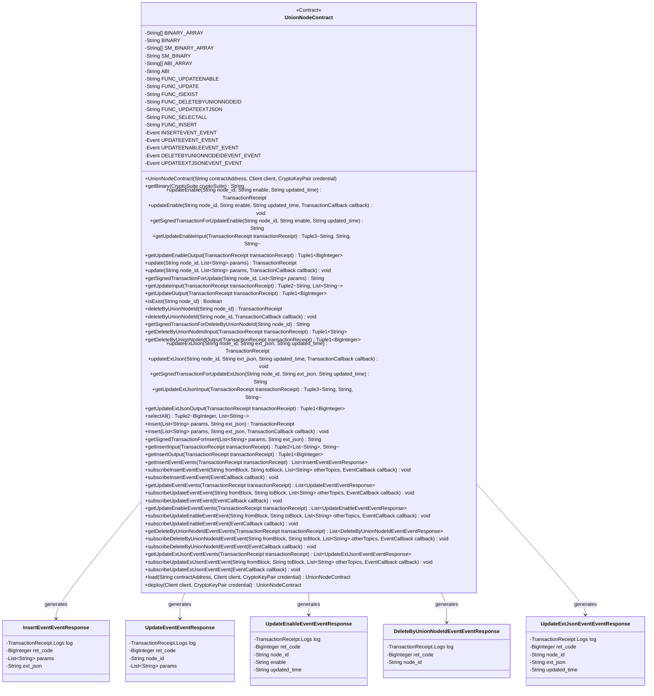
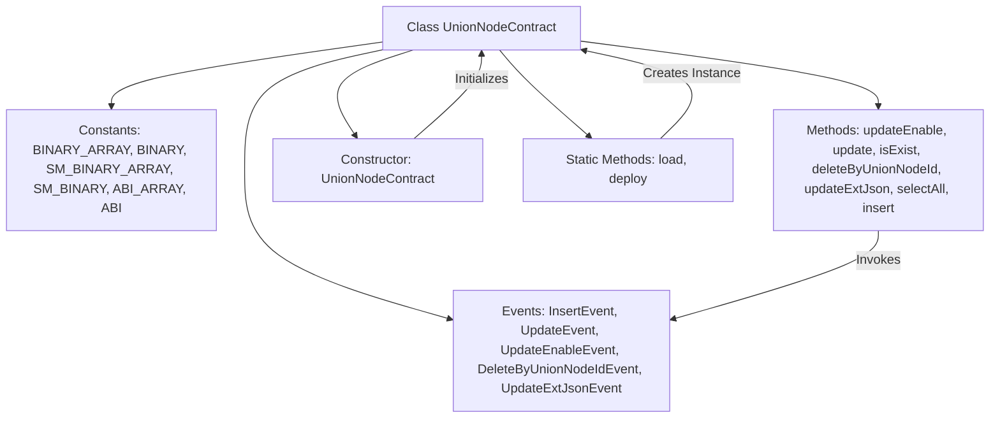

# Basic Information

|      |      |
|------|------|
| Name | UnionNodeContract |
| Language | .java |
| Code Path | WeFe/manager/manager-service/src/main/java/com/welab/wefe/manager/service/contract/UnionNodeContract.java |
| Package Name | com.welab.wefe.manager.service.contract |
| Dependencies | ['org.fisco.bcos.sdk.abi.FunctionReturnDecoder', 'org.fisco.bcos.sdk.abi.TypeReference', 'org.fisco.bcos.sdk.abi.datatypes', 'org.fisco.bcos.sdk.abi.datatypes.generated.Int256', 'org.fisco.bcos.sdk.abi.datatypes.generated.tuples.generated.Tuple1', 'org.fisco.bcos.sdk.abi.datatypes.generated.tuples.generated.Tuple2', 'org.fisco.bcos.sdk.abi.datatypes.generated.tuples.generated.Tuple3', 'org.fisco.bcos.sdk.client.Client', 'org.fisco.bcos.sdk.contract.Contract', 'org.fisco.bcos.sdk.crypto.CryptoSuite', 'org.fisco.bcos.sdk.crypto.keypair.CryptoKeyPair', 'org.fisco.bcos.sdk.eventsub.EventCallback', 'org.fisco.bcos.sdk.model.CryptoType', 'org.fisco.bcos.sdk.model.TransactionReceipt', 'org.fisco.bcos.sdk.model.callback.TransactionCallback', 'org.fisco.bcos.sdk.transaction.model.exception.ContractException', 'java.math.BigInteger', 'java.util.ArrayList', 'java.util.Arrays', 'java.util.Collections', 'java.util.List'] |
| Brief Description | UnionNodeContract is a smart contract class designed to manage consortium node information. Its primary functionalities include:1. Node CRUD Operations:   - Insert new nodes (insert)   - Update node information (update)   - Update node status (updateEnable)   - Update node extension JSON (updateExtJson)   - Delete nodes (deleteByUnionNodeId)   - Query all nodes (selectAll)   - Check node existence (isExist)2. Event Monitoring:   - Insert event (insertEvent)   - Update event (updateEvent)   - Status update event (updateEnableEvent)   - Delete event (deleteByUnionNodeIdEvent)   - Extension JSON update event (updateExtJsonEvent)3. Contract Features:   - Supports both ECDSA and SM2 encryption algorithms   - Provides synchronous and asynchronous invocation methods   - Supports event subscription functionalityThis contract is used to manage node information in consortium chains, including basic node details, statuses, and extended attributes. |

# Description

The UnionNodeContract is a smart contract class designed for managing operations related to consortium nodes. Below is a detailed description of this contract:

1. Contract Features:
- Provides basic CRUD operations for node management (Create, Read, Update, Delete)
- Supports enabling/disabling node status management
- Allows updating extended JSON properties of nodes
- Offers a comprehensive node query interface

2. Main Methods:
- updateEnable(): Updates node activation status  
- update(): Modifies basic node information
- isExist(): Checks node existence
- deleteByUnionNodeId(): Deletes specified node
- updateExtJson(): Updates extended JSON of node
- selectAll(): Queries all nodes
- insert(): Adds new node

3. Event Notifications:
- insertEvent: Node creation event
- updateEvent: Node update event
- updateEnableEvent: Node status change event  
- deleteByUnionNodeIdEvent: Node deletion event
- updateExtJsonEvent: Extended property update event

4. Technical Characteristics:
- Supports both standard and SM (Chinese National Encryption) cryptographic algorithms
- Provides synchronous and asynchronous invocation modes
- Includes complete input/output parameter parsing  
- Supports event subscription mechanism

5. Data Structures:
- Uses string arrays to store node attributes
- Return values include operation status codes and result data
- Event parameters contain operation results and related data  

This contract is designed for unified node information management in consortium blockchain environments, offering complete lifecycle management functionality and real-time operation result notifications through event mechanisms.

# Class Summary

| Name   | Type  | Description |
|-------|------|-------------|
| UnionNodeContract | class | This is a Java wrapper class named `UnionNodeContract` designed to interact with the `UnionNode` smart contract on the blockchain. Below is a summary of its key features:1. **Contract Functions**     - Provides node management capabilities, including inserting, updating, querying, and deleting nodes.     - Supports specific operations such as enabling/disabling nodes and updating extended JSON data.  2. **Core Methods**     - `updateEnable()`: Updates the node's enabled status     - `update()`: Updates node information     - `isExist()`: Checks if a node exists     - `deleteByUnionNodeId()`: Deletes a node     - `updateExtJson()`: Updates the node's extended data     - `selectAll()`: Queries all nodes     - `insert()`: Inserts a new node  3. **Event Listening**     - Provides 5 types of event listeners: node insertion, update, status change, deletion, and extended data update events.  4. **Technical Features**     - Supports both SM (Chinese cryptographic standard) and non-SM encryption algorithms     - Includes complete ABI and binary code     - Offers synchronous and asynchronous transaction execution     - Supports transaction receipt parsing  5. **Deployment Methods**     - New contracts can be deployed via the `deploy()` method     - Existing contracts can be loaded via the `load()` method  6. **Data Structures**     - Uses Tuple types to handle multiple return values     - Defines dedicated event response classes  This wrapper class simplifies the interaction between Java applications and blockchain smart contracts, providing type-safe method calls and event handling mechanisms. |

## Class UnionNodeContract

|      |      |
|------|------|
| Access Modifier | @SuppressWarnings("unchecked");public |
| Type | class |
| Name | UnionNodeContract |
| Description | This is a Java wrapper class named `UnionNodeContract` designed to interact with the `UnionNode` smart contract on the blockchain. Below is a summary of its key features:1. **Contract Functions**     - Provides node management capabilities, including inserting, updating, querying, and deleting nodes.     - Supports specific operations such as enabling/disabling nodes and updating extended JSON data.  2. **Core Methods**     - `updateEnable()`: Updates the node's enabled status     - `update()`: Updates node information     - `isExist()`: Checks if a node exists     - `deleteByUnionNodeId()`: Deletes a node     - `updateExtJson()`: Updates the node's extended data     - `selectAll()`: Queries all nodes     - `insert()`: Inserts a new node  3. **Event Listening**     - Provides 5 types of event listeners: node insertion, update, status change, deletion, and extended data update events.  4. **Technical Features**     - Supports both SM (Chinese cryptographic standard) and non-SM encryption algorithms     - Includes complete ABI and binary code     - Offers synchronous and asynchronous transaction execution     - Supports transaction receipt parsing  5. **Deployment Methods**     - New contracts can be deployed via the `deploy()` method     - Existing contracts can be loaded via the `load()` method  6. **Data Structures**     - Uses Tuple types to handle multiple return values     - Defines dedicated event response classes  This wrapper class simplifies the interaction between Java applications and blockchain smart contracts, providing type-safe method calls and event handling mechanisms. |

### UML Class Diagram

This code defines a smart contract class named `UnionNodeContract`, which includes the contract's binary code, ABI interface, various functional functions, and event response classes. The contract provides node management functionalities such as updating node status, querying node existence, deleting nodes, and returns operation results through an event mechanism. The class diagram illustrates the relationships between the contract and various event response classes, as well as the main methods and attribute structure of the contract.

### Internal Method Call Graph

This code represents a Java wrapper class for a smart contract, with main functionalities including:

1. Provides Java method encapsulation for interacting with blockchain smart contracts, including core business methods such as updateEnable, update, isExist, etc.
2. Defines contract event response classes for handling contract event callbacks
3. Includes contract ABI and binary code (both standard and SM versions)
4. Supports contract deployment (load/deploy) and instantiation
5. Provides transaction input/output encoding and decoding functionality
6. Implements event subscription mechanism

This contract is primarily used for node management, including operations such as node enable/disable, update, query, and deletion. It is a typical Java wrapper implementation for a blockchain node management contract.

### Field List

| Name  | Type  | Description |
|-------|-------|------|
| UPDATEEXTJSONEVENT_EVENT = new Event("updateExtJsonEvent",             Arrays.<TypeReference<?>>asList(new TypeReference<Int256>() {}, new TypeReference<Utf8String>() {}, new TypeReference<Utf8String>() {}, new TypeReference<Utf8String>() {})) | Event | Defined a public static constant event named UPDATEEXTJSONEVENT_EVENT, containing four parameter types: Int256 and three Utf8String. |
| BINARY = String.join("", BINARY_ARRAY) | String | Concatenate the BINARY_ARRAY into a string and assign it to the constant BINARY. |
| FUNC_UPDATE = "update" | String | Static constant string FUNC_UPDATE with the value "update". |
| UPDATEENABLEEVENT_EVENT = new Event("updateEnableEvent",             Arrays.<TypeReference<?>>asList(new TypeReference<Int256>() {}, new TypeReference<Utf8String>() {}, new TypeReference<Utf8String>() {}, new TypeReference<Utf8String>() {})) | Event | Define a static constant UPDATEENABLEEVENT_EVENT, of type Event, containing the event name "updateEnableEvent" and four parameter types: Int256 and three Utf8String. |
| SM_BINARY = String.join("", SM_BINARY_ARRAY) | String | The code concatenates the string array SM_BINARY_ARRAY into a single string SM_BINARY. |
| FUNC_INSERT = "insert" | String | Define the string constant FUNC_INSERT with the value "insert". |
| ABI_ARRAY = {"[{\"constant\":false,\"inputs\":[{\"name\":\"node_id\",\"type\":\"string\"},{\"name\":\"enable\",\"type\":\"string\"},{\"name\":\"updated_time\",\"type\":\"string\"}],\"name\":\"updateEnable\",\"outputs\":[{\"name\":\"\",\"type\":\"int256\"}],\"payable\":false,\"stateMutability\":\"nonpayable\",\"type\":\"function\"},{\"constant\":false,\"inputs\":[{\"name\":\"node_id\",\"type\":\"string\"},{\"name\":\"params\",\"type\":\"string[]\"}],\"name\":\"update\",\"outputs\":[{\"name\":\"\",\"type\":\"int256\"}],\"payable\":false,\"stateMutability\":\"nonpayable\",\"type\":\"function\"},{\"constant\":true,\"inputs\":[{\"name\":\"node_id\",\"type\":\"string\"}],\"name\":\"isExist\",\"outputs\":[{\"name\":\"\",\"type\":\"bool\"}],\"payable\":false,\"stateMutability\":\"view\",\"type\":\"function\"},{\"constant\":false,\"inputs\":[{\"name\":\"node_id\",\"type\":\"string\"}],\"name\":\"deleteByUnionNodeId\",\"outputs\":[{\"name\":\"\",\"type\":\"int256\"}],\"payable\":false,\"stateMutability\":\"nonpayable\",\"type\":\"function\"},{\"constant\":false,\"inputs\":[{\"name\":\"node_id\",\"type\":\"string\"},{\"name\":\"ext_json\",\"type\":\"string\"},{\"name\":\"updated_time\",\"type\":\"string\"}],\"name\":\"updateExtJson\",\"outputs\":[{\"name\":\"\",\"type\":\"int256\"}],\"payable\":false,\"stateMutability\":\"nonpayable\",\"type\":\"function\"},{\"constant\":true,\"inputs\":[],\"name\":\"selectAll\",\"outputs\":[{\"name\":\"\",\"type\":\"int256\"},{\"name\":\"\",\"type\":\"string[]\"}],\"payable\":false,\"stateMutability\":\"view\",\"type\":\"function\"},{\"constant\":false,\"inputs\":[{\"name\":\"params\",\"type\":\"string[]\"},{\"name\":\"ext_json\",\"type\":\"string\"}],\"name\":\"insert\",\"outputs\":[{\"name\":\"\",\"type\":\"int256\"}],\"payable\":false,\"stateMutability\":\"nonpayable\",\"type\":\"function\"},{\"inputs\":[],\"payable\":false,\"stateMutability\":\"nonpayable\",\"type\":\"constructor\"},{\"anonymous\":false,\"inputs\":[{\"indexed\":false,\"name\":\"ret_code\",\"type\":\"int256\"},{\"indexed\":false,\"name\":\"params\",\"type\":\"string[]\"},{\"indexed\":false,\"name\":\"ext_json\",\"type\":\"string\"}],\"name\":\"insertEvent\",\"type\":\"event\"},{\"anonymous\":false,\"inputs\":[{\"indexed\":false,\"name\":\"ret_code\",\"type\":\"int256\"},{\"indexed\":false,\"name\":\"node_id\",\"type\":\"string\"},{\"indexed\":false,\"name\":\"params\",\"type\":\"string[]\"}],\"name\":\"updateEvent\",\"type\":\"event\"},{\"anonymous\":false,\"inputs\":[{\"indexed\":false,\"name\":\"ret_code\",\"type\":\"int256\"},{\"indexed\":false,\"name\":\"node_id\",\"type\":\"string\"},{\"indexed\":false,\"name\":\"enable\",\"type\":\"string\"},{\"indexed\":false,\"name\":\"updated_time\",\"type\":\"string\"}],\"name\":\"updateEnableEvent\",\"type\":\"event\"},{\"anonymous\":false,\"inputs\":[{\"indexed\":false,\"name\":\"ret_code\",\"type\":\"int256\"},{\"indexed\":false,\"name\":\"node_id\",\"type\":\"string\"}],\"name\":\"deleteByUnionNodeIdEvent\",\"type\":\"event\"},{\"anonymous\":false,\"inputs\":[{\"indexed\":false,\"name\":\"ret_code\",\"type\":\"int256\"},{\"indexed\":false,\"name\":\"node_id\",\"type\":\"string\"},{\"indexed\":false,\"name\":\"ext_json\",\"type\":\"string\"},{\"indexed\":false,\"name\":\"updated_time\",\"type\":\"string\"}],\"name\":\"updateExtJsonEvent\",\"type\":\"event\"}]"} | String[] | The ABI_ARRAY defines the smart contract interface, including functions such as updating, querying, and deleting nodes, along with corresponding events. Parameters include node ID, status, time, etc. |
| DELETEBYUNIONNODEIDEVENT_EVENT = new Event("deleteByUnionNodeIdEvent",             Arrays.<TypeReference<?>>asList(new TypeReference<Int256>() {}, new TypeReference<Utf8String>() {})) | Event | Define a static constant DELETEBYUNIONNODEIDEVENT_EVENT of type Event, containing the event name "deleteByUnionNodeIdEvent" and two parameter types Int256 and Utf8String. |
| FUNC_UPDATEEXTJSON = "updateExtJson" | String | Define the static constant FUNC_UPDATEEXTJSON with the value "updateExtJson". |
| FUNC_SELECTALL = "selectAll" | String | Define a static constant FUNC_SELECTALL with the value "selectAll". |
| UPDATEEVENT_EVENT = new Event("updateEvent",             Arrays.<TypeReference<?>>asList(new TypeReference<Int256>() {}, new TypeReference<Utf8String>() {}, new TypeReference<DynamicArray<Utf8String>>() {})) | Event | Define a static constant UPDATEEVENT_EVENT, of type Event, containing three parameters: Int256, Utf8String, and DynamicArray<Utf8String>. |
| FUNC_UPDATEENABLE = "updateEnable" | String | Define the static constant FUNC_UPDATEENABLE with the value "updateEnable". |
| BINARY_ARRAY = {"60806040523480156200001157600080fd5b506110016000806101000a81548173ffffffffffffffffffffffffffffffffffffffff021916908373ffffffffffffffffffffffffffffffffffffffff1602179055506000809054906101000a900473ffffffffffffffffffffffffffffffffffffffff1673ffffffffffffffffffffffffffffffffffffffff166356004b6a6040805190810160405280600d81526020017f756e696f6e5f6e6f64655f7635000000000000000000000000000000000000008152506040518263ffffffff167c0100000000000000000000000000000000000000000000000000000000028152600401620001019190620002e2565b602060405180830381600087803b1580156200011c57600080fd5b505af115801562000131573d6000803e3d6000fd5b505050506040513d601f19601f8201168201806040525062000157919081019062000174565b506200038c565b60006200016c82516200033b565b905092915050565b6000602082840312156200018757600080fd5b600062000197848285016200015e565b91505092915050565b6000620001ad8262000330565b808452620001c381602086016020860162000345565b620001ce816200037b565b602085010191505092915050565b6000600682527f6669785f696400000000000000000000000000000000000000000000000000006020830152604082019050919050565b6000609182527f6e6f64655f69642c626c6f636b636861696e5f6e6f64655f69642c626173655f60208301527f75726c2c6f7267616e697a6174696f6e5f6e616d652c6c6f73745f636f6e746160408301527f63742c636f6e746163745f656d61696c2c7072696f726974795f6c6576656c2c60608301527f656e61626c652c76657273696f6e2c637265617465645f74696d652c7570646160808301527f7465645f74696d652c6578745f6a736f6e00000000000000000000000000000060a083015260c082019050919050565b60006060820190508181036000830152620002fe8184620001a0565b905081810360208301526200031381620001dc565b90508181036040830152620003288162000213565b905092915050565b600081519050919050565b6000819050919050565b60005b838110156200036557808201518184015260208101905062000348565b8381111562000375576000848401525b50505050565b6000601f19601f8301169050919050565b614dda806200039c6000396000f300608060405260043610610083576000357c0100000000000000000000000000000000000000000000000000000000900463ffffffff16806305a9bbe71461008857806311dad538146100c55780634d3d096b146101025780635c6d21861461013f57806363964aa31461017c578063857cb0eb146101b957806397291150146101e5575b600080fd5b34801561009457600080fd5b506100af60048036036100aa9190810190614002565b610222565b6040516100bc91906144cc565b60405180910390f35b3480156100d157600080fd5b506100ec60048036036100e79190810190613f96565b6107dc565b6040516100f991906144cc565b60405180910390f35b34801561010e57600080fd5b5061012960048036036101249190810190613f14565b610eff565b60405161013691906144b1565b60405180910390f35b34801561014b57600080fd5b5061016660048036036101619190810190613f14565b6112c3565b60405161017391906144cc565b60405180910390f35b34801561018857600080fd5b506101a3600480360361019e9190810190614002565b6116c2565b6040516101b091906144cc565b60405180910390f35b3480156101c557600080fd5b506101ce611c7c565b6040516101dc9291906144e7565b60405180910390f35b3480156101f157600080fd5b5061020c60048036036102079190810190613ddb565b612020565b60405161021991906144cc565b60405180910390f35b6000806000806000806000945061023889610eff565b15156102a6577ffffffffffffffffffffffffffffffffffffffffffffffffffffffffffffffffd94507f7d29950a0ae63eb067d4a746f4bfc4351fff7ffaa81e13a0c7f07a80aa4f529d858a8a8a60405161029694939291906145d1565b60405180910390a18495506107d0565b6000809054906101000a900473ffffffffffffffffffffffffffffffffffffffff1673ffffffffffffffffffffffffffffffffffffffff1663f23f63c96040805190810160405280600d81526020017f756e696f6e5f6e6f64655f7635000000000000000000000000000000000000008152506040518263ffffffff167c0100000000000000000000000000000000000000000000000000000000028152600401610351919061462b565b602060405180830381600087803b15801561036b57600080fd5b505af115801561037f573d6000803e3d6000fd5b505050506040513d601f19601f820116820180604052506103a39190810190613ec2565b93508373ffffffffffffffffffffffffffffffffffffffff16637857d7c96040518163ffffffff167c0100000000000000000000000000000000000000000000000000000000028152600401602060405180830381600087803b15801561040957600080fd5b505af115801561041d573d6000803e3d6000fd5b505050506040513d601f19601f820116820180604052506104419190810190613e47565b92508273ffffffffffffffffffffffffffffffffffffffff1663cd30a1d18a6040518263ffffffff167c010000000000000000000000000000000000000000000000000000000002815260040161049891906147ea565b600060405180830381600087803b1580156104b257600080fd5b505af11580156104c6573d6000803e3d6000fd5b505050508373ffffffffffffffffffffffffffffffffffffffff166313db93466040518163ffffffff167c0100000000000000000000000000000000000000000000000000000000028152600401602060405180830381600087803b15801561052e57600080fd5b505af1158015610542573d6000803e3d6000fd5b505050506040513d601f19601f820116820180604052506105669190810190613e99565b91508173ffffffffffffffffffffffffffffffffffffffff1663e942b516896040518263ffffffff167c01000000000000000000000000000000000000000000000000000000000281526004016105bd91906149fd565b600060405180830381600087803b1580156105d757600080fd5b505af11580156105eb573d6000803e3d6000fd5b505050508173ffffffffffffffffffffffffffffffffffffffff1663e942b516886040518263ffffffff167c010000000000000000000000000000000000000000000000000000000002815260040161064491906148fe565b600060405180830381600087803b15801561065e57600080fd5b505af1158015610672573d6000803e3d6000fd5b505050508373ffffffffffffffffffffffffffffffffffffffff1663bf2b70a16040805190810160405280600a81526020017f6669785f69645f3030350000000000000000000000000000000000000000000081525084866040518463ffffffff167c0100000000000000000000000000000000000000000000000000000000028152600401610704939291906146ad565b602060405180830381600087803b15801561071e57600080fd5b505af1158015610732573d6000803e3d6000fd5b505050506040513d601f19601f820116820180604052506107569190810190613eeb565b905060018112151561076b576000945061078f565b7ffffffffffffffffffffffffffffffffffffffffffffffffffffffffffffffffe94505b7f7d29950a0ae63eb067d4a746f4bfc4351fff7ffaa81e13a0c7f07a80aa4f529d858a8a8a6040516107c494939291906145d1565b60405180910390a18495505b50505050509392505050565b600080600080600080600094506107f288610eff565b151561085e577ffffffffffffffffffffffffffffffffffffffffffffffffffffffffffffffffd94507fef47f7042e8c83038d176a3f11687417b43c663a42baf9fdbf3c25061984ae9a85898960405161084e9392919061458c565b60405180910390a1849550610ef4565b6000809054906101000a900473ffffffffffffffffffffffffffffffffffffffff1673ffffffffffffffffffffffffffffffffffffffff1663f23f63c96040805190810160405280600d81526020017f756e696f6e5f6e6f64655f7635000000000000000000000000000000000000008152506040518263ffffffff167c0100000000000000000000000000000000000000000000000000000000028152600401610909919061462b565b602060405180830381600087803b15801561092357600080fd5b505af1158015610937573d6000803e3d6000fd5b505050506040513d601f19601f8201168201806040525061095b9190810190613ec2565b93508373ffffffffffffffffffffffffffffffffffffffff16637857d7c96040518163ffffffff167c0100000000000000000000000000000000000000000000000000000000028152600401602060405180830381600087803b1580156109c157600080fd5b505af11580156109d5573d6000803e3d6000fd5b505050506040513d601f19601f820116820180604052506109f99190810190613e47565b92508273ffffffffffffffffffffffffffffffffffffffff1663cd30a1d1896040518263ffffffff167c0100000000000000000000000000000000000000000000000000000000028152600401610a5091906147ea565b600060405180830381600087803b158015610a6a57600080fd5b505af1158015610a7e573d6000803e3d6000fd5b505050508373ffffffffffffffffffffffffffffffffffffffff166313db93466040518163ffffffff167c0100000000000000000000000000000000000000000000000000000000028152600401602060405180830381600087803b158015610ae657600080fd5b505af1158015610afa573d6000803e3d6000fd5b505050506040513d601f19601f82011682018060405250610b1e9190810190613e99565b91508173ffffffffffffffffffffffffffffffffffffffff1663e942b516886000815181101515610b4b57fe5b906020019060200201516040518263ffffffff167c0100000000000000000000000000000000000000000000000000000000028152600401610b8d91906149a8565b600060405180830381600087803b158015610ba757600080fd5b505af1158015610bbb573d6000803e3d6000fd5b505050508173ffffffffffffffffffffffffffffffffffffffff1663e942b516886001815181101515610bea57fe5b906020019060200201516040518263ffffffff167c0100000000000000000000000000000000000000000000000000000000028152600401610c2c9190614a85565b600060405180830381600087803b158015610c4657600080fd5b505af1158015610c5a573d6000803e3d6000fd5b505050508173ffffff", "ffffffffffffffffffffffffffffffffff1663e942b516886002815181101515610c8957fe5b906020019060200201516040518263ffffffff167c0100000000000000000000000000000000000000000000000000000000028152600401610ccb9190614874565b600060405180830381600087803b158015610ce557600080fd5b505af1158015610cf9573d6000803e3d6000fd5b505050508173ffffffffffffffffffffffffffffffffffffffff1663e942b516886003815181101515610d2857fe5b906020019060200201516040518263ffffffff167c0100000000000000000000000000000000000000000000000000000000028152600401610d6a91906148c9565b600060405180830381600087803b158015610d8457600080fd5b505af1158015610d98573d6000803e3d6000fd5b505050508373ffffffffffffffffffffffffffffffffffffffff1663bf2b70a16040805190810160405280600a81526020017f6669785f69645f3030350000000000000000000000000000000000000000000081525084866040518463ffffffff167c0100000000000000000000000000000000000000000000000000000000028152600401610e2a939291906146ad565b602060405180830381600087803b158015610e4457600080fd5b505af1158015610e58573d6000803e3d6000fd5b505050506040513d601f19601f82011682018060405250610e7c9190810190613eeb565b9050600181121515610e915760009450610eb5565b7ffffffffffffffffffffffffffffffffffffffffffffffffffffffffffffffffe94505b7fef47f7042e8c83038d176a3f11687417b43c663a42baf9fdbf3c25061984ae9a858989604051610ee89392919061458c565b60405180910390a18495505b505050505092915050565b6000806000806000809054906101000a900473ffffffffffffffffffffffffffffffffffffffff1673ffffffffffffffffffffffffffffffffffffffff1663f23f63c96040805190810160405280600d81526020017f756e696f6e5f6e6f64655f7635000000000000000000000000000000000000008152506040518263ffffffff167c0100000000000000000000000000000000000000000000000000000000028152600401610fb0919061462b565b602060405180830381600087803b158015610fca57600080fd5b505af1158015610fde573d6000803e3d6000fd5b505050506040513d601f19601f820116820180604052506110029190810190613ec2565b92508273ffffffffffffffffffffffffffffffffffffffff16637857d7c96040518163ffffffff167c0100000000000000000000000000000000000000000000000000000000028152600401602060405180830381600087803b15801561106857600080fd5b505af115801561107c573d6000803e3d6000fd5b505050506040513d601f19601f820116820180604052506110a09190810190613e47565b91508173ffffffffffffffffffffffffffffffffffffffff1663cd30a1d1866040518263ffffffff167c01000000000000000000000000000000000000000000000000000000000281526004016110f791906147ea565b600060405180830381600087803b15801561111157600080fd5b505af1158015611125573d6000803e3d6000fd5b505050508273ffffffffffffffffffffffffffffffffffffffff1663e8434e396040805190810160405280600a81526020017f6669785f69645f30303500000000000000000000000000000000000000000000815250846040518363ffffffff167c01000000000000000000000000000000000000000000000000000000000281526004016111b592919061464d565b602060405180830381600087803b1580156111cf57600080fd5b505af11580156111e3573d6000803e3d6000fd5b505050506040513d601f19601f820116820180604052506112079190810190613e70565b905060008173ffffffffffffffffffffffffffffffffffffffff1663949d225d6040518163ffffffff167c0100000000000000000000000000000000000000000000000000000000028152600401602060405180830381600087803b15801561126f57600080fd5b505af1158015611283573d6000803e3d6000fd5b505050506040513d601f19601f820116820180604052506112a79190810190613eeb565b11156112b657600193506112bb565b600093505b505050919050565b60008060008060008093506112d786610eff565b1515611341577ffffffffffffffffffffffffffffffffffffffffffffffffffffffffffffffffd93507f521d3afd9caf15cf70b25ebc2337882b442d473ad92dde97bd41550297b8a8f7848760405161133192919061455c565b60405180910390a18394506116b9565b6000809054906101000a900473ffffffffffffffffffffffffffffffffffffffff1673ffffffffffffffffffffffffffffffffffffffff1663f23f63c96040805190810160405280600d81526020017f756e696f6e5f6e6f64655f7635000000000000000000000000000000000000008152506040518263ffffffff167c01000000000000000000000000000000000000000000000000000000000281526004016113ec919061462b565b602060405180830381600087803b15801561140657600080fd5b505af115801561141a573d6000803e3d6000fd5b505050506040513d601f19601f8201168201806040525061143e9190810190613ec2565b92508273ffffffffffffffffffffffffffffffffffffffff16637857d7c96040518163ffffffff167c0100000000000000000000000000000000000000000000000000000000028152600401602060405180830381600087803b1580156114a457600080fd5b505af11580156114b8573d6000803e3d6000fd5b505050506040513d601f19601f820116820180604052506114dc9190810190613e47565b91508173ffffffffffffffffffffffffffffffffffffffff1663cd30a1d1876040518263ffffffff167c010000000000000000000000000000000000000000000000000000000002815260040161153391906147ea565b600060405180830381600087803b15801561154d57600080fd5b505af1158015611561573d6000803e3d6000fd5b505050508273ffffffffffffffffffffffffffffffffffffffff166328bb21176040805190810160405280600a81526020017f6669785f69645f30303500000000000000000000000000000000000000000000815250846040518363ffffffff167c01000000000000000000000000000000000000000000000000000000000281526004016115f192919061464d565b602060405180830381600087803b15801561160b57600080fd5b505af115801561161f573d6000803e3d6000fd5b505050506040513d601f19601f820116820180604052506116439190810190613eeb565b9050600181121515611658576000935061167c565b7ffffffffffffffffffffffffffffffffffffffffffffffffffffffffffffffffe93505b7f521d3afd9caf15cf70b25ebc2337882b442d473ad92dde97bd41550297b8a8f784876040516116ad92919061455c565b60405180910390a18394505b50505050919050565b600080600080600080600094506116d889610eff565b1515611746577ffffffffffffffffffffffffffffffffffffffffffffffffffffffffffffffffd94507f91fa9d6109b9b8b47733f98f4b6858346683ebdf73ba3c2f98b90c0d352f83e1858a8a8a60405161173694939291906145d1565b60405180910390a1849550611c70565b6000809054906101000a900473ffffffffffffffffffffffffffffffffffffffff1673ffffffffffffffffffffffffffffffffffffffff1663f23f63c96040805190810160405280600d81526020017f756e696f6e5f6e6f64655f7635000000000000000000000000000000000000008152506040518263ffffffff167c01000000000000000000000000000000000000000000000000000000000281526004016117f1919061462b565b602060405180830381600087803b15801561180b57600080fd5b505af115801561181f573d6000803e3d6000fd5b505050506040513d601f19601f820116820180604052506118439190810190613ec2565b93508373ffffffffffffffffffffffffffffffffffffffff16637857d7c96040518163ffffffff167c0100000000000000000000000000000000000000000000000000000000028152600401602060405180830381600087803b1580156118a957600080fd5b505af11580156118bd573d6000803e3d6000fd5b505050506040513d601f19601f820116820180604052506118e19190810190613e47565b92508273ffffffffffffffffffffffffffffffffffffffff1663cd30a1d18a6040518263ffffffff167c010000000000000000000000000000000000000000000000000000000002815260040161193891906147ea565b600060405180830381600087803b15801561195257600080fd5b505af1158015611966573d6000803e3d6000fd5b505050508373ffffffffffffffffffffffffffffffffffffffff166313db93466040518163ffffffff167c0100000000000000000000000000000000000000000000000000000000028152600401602060405180830381600087803b1580156119ce57600080fd5b505af11580156119e2573d6000803e3d6000fd5b505050506040513d601f19601f82011682018060405250611a069190810190613e99565b91508173ffffffffffffffffffffffffffffffffffffffff1663e942b516896040518263ffffffff167c0100000000000000000000000000000000000000000000000000000000028152600401611a5d919061470b565b600060405180830381600087803b158015611a7757600080fd5b505af1158015611a8b573d6000803e3d6000fd5b505050508173ffffffffffffffffffffffffffffffffffffffff1663e942b516886040518263ffffffff167c0100000000000000000000000000000000000000000000000000000000028152600401611ae491906148fe565b600060405180830381600087803b158015611afe57600080fd5b505af1158015611b12573d6000803e3d6000fd5b505050508373ffffffffffffffffffffffffffffffffffffffff1663bf2b70a16040805190810160405280600a81526020017f6669785f69645f3030350000000000000000000000000000000000000000000081525084866040518463ffffffff167c0100000000000000000000000000000000000000000000000000000000028152600401611ba4939291906146ad565b602060405180830381600087803b158015611bbe57600080fd5b505af1158015611bd2573d6000803e3d6000fd5b505050506040513d601f19601f82011682018060405250611bf69190810190613eeb565b9050600181121515611c0b5760009450611c2f565b7ffffffffffffffffffffffffffffffffffffffffffffffffffffffffffffffffe94505b7f91fa9d6109b9b8b47733f98f4b6858346683ebdf73ba3c2f98b90c0d352f83e1858a8a8a604051611c6494939291906145d156", "5b60405180910390a18495505b50505050509392505050565b600060606000806000809054906101000a900473ffffffffffffffffffffffffffffffffffffffff1673ffffffffffffffffffffffffffffffffffffffff1663f23f63c96040805190810160405280600d81526020017f756e696f6e5f6e6f64655f7635000000000000000000000000000000000000008152506040518263ffffffff167c0100000000000000000000000000000000000000000000000000000000028152600401611d2e919061462b565b602060405180830381600087803b158015611d4857600080fd5b505af1158015611d5c573d6000803e3d6000fd5b505050506040513d601f19601f82011682018060405250611d809190810190613ec2565b91508173ffffffffffffffffffffffffffffffffffffffff1663e8434e396040805190810160405280600a81526020017f6669785f69645f303035000000000000000000000000000000000000000000008152508473ffffffffffffffffffffffffffffffffffffffff16637857d7c96040518163ffffffff167c0100000000000000000000000000000000000000000000000000000000028152600401602060405180830381600087803b158015611e3857600080fd5b505af1158015611e4c573d6000803e3d6000fd5b505050506040513d601f19601f82011682018060405250611e709190810190613e47565b6040518363ffffffff167c0100000000000000000000000000000000000000000000000000000000028152600401611ea992919061464d565b602060405180830381600087803b158015611ec357600080fd5b505af1158015611ed7573d6000803e3d6000fd5b505050506040513d601f19601f82011682018060405250611efb9190810190613e70565b90508073ffffffffffffffffffffffffffffffffffffffff1663949d225d6040518163ffffffff167c0100000000000000000000000000000000000000000000000000000000028152600401602060405180830381600087803b158015611f6157600080fd5b505af1158015611f75573d6000803e3d6000fd5b505050506040513d601f19601f82011682018060405250611f999190810190613eeb565b60001415612007577ffffffffffffffffffffffffffffffffffffffffffffffffffffffffffffffffd6000604051908082528060200260200182016040528015611ff757816020015b6060815260200190600190039081611fe25790505b508191508090509350935061201a565b600061201282612bd1565b819150935093505b50509091565b600080600080600080935061204c87600081518110151561203d57fe5b90602001906020020151610eff565b156120d7577fffffffffffffffffffffffffffffffffffffffffffffffffffffffffffffffff93507f5157dc1ab0b55c7621be94a34b2ae4228f7d16e8271628060cc027b1a513b12f8488886040516120a793929190614517565b60405180910390a17fffffffffffffffffffffffffffffffffffffffffffffffffffffffffffffffff9450612bc7565b6000809054906101000a900473ffffffffffffffffffffffffffffffffffffffff1673ffffffffffffffffffffffffffffffffffffffff1663f23f63c96040805190810160405280600d81526020017f756e696f6e5f6e6f64655f7635000000000000000000000000000000000000008152506040518263ffffffff167c0100000000000000000000000000000000000000000000000000000000028152600401612182919061462b565b602060405180830381600087803b15801561219c57600080fd5b505af11580156121b0573d6000803e3d6000fd5b505050506040513d601f19601f820116820180604052506121d49190810190613ec2565b92508273ffffffffffffffffffffffffffffffffffffffff166313db93466040518163ffffffff167c0100000000000000000000000000000000000000000000000000000000028152600401602060405180830381600087803b15801561223a57600080fd5b505af115801561224e573d6000803e3d6000fd5b505050506040513d601f19601f820116820180604052506122729190810190613e99565b91508173ffffffffffffffffffffffffffffffffffffffff1663e942b5166040805190810160405280600a81526020017f6669785f69645f303035000000000000000000000000000000000000000000008152506040518263ffffffff167c01000000000000000000000000000000000000000000000000000000000281526004016122fe919061481f565b600060405180830381600087803b15801561231857600080fd5b505af115801561232c573d6000803e3d6000fd5b505050508173ffffffffffffffffffffffffffffffffffffffff1663e942b51688600081518110151561235b57fe5b906020019060200201516040518263ffffffff167c010000000000000000000000000000000000000000000000000000000002815260040161239d91906147b5565b600060405180830381600087803b1580156123b757600080fd5b505af11580156123cb573d6000803e3d6000fd5b505050508173ffffffffffffffffffffffffffffffffffffffff1663e942b5168860018151811015156123fa57fe5b906020019060200201516040518263ffffffff167c010000000000000000000000000000000000000000000000000000000002815260040161243c9190614953565b600060405180830381600087803b15801561245657600080fd5b505af115801561246a573d6000803e3d6000fd5b505050508173ffffffffffffffffffffffffffffffffffffffff1663e942b51688600281518110151561249957fe5b906020019060200201516040518263ffffffff167c01000000000000000000000000000000000000000000000000000000000281526004016124db91906149a8565b600060405180830381600087803b1580156124f557600080fd5b505af1158015612509573d6000803e3d6000fd5b505050508173ffffffffffffffffffffffffffffffffffffffff1663e942b51688600381518110151561253857fe5b906020019060200201516040518263ffffffff167c010000000000000000000000000000000000000000000000000000000002815260040161257a9190614a85565b600060405180830381600087803b15801561259457600080fd5b505af11580156125a8573d6000803e3d6000fd5b505050508173ffffffffffffffffffffffffffffffffffffffff1663e942b5168860048151811015156125d757fe5b906020019060200201516040518263ffffffff167c01000000000000000000000000000000000000000000000000000000000281526004016126199190614b84565b600060405180830381600087803b15801561263357600080fd5b505af1158015612647573d6000803e3d6000fd5b505050508173ffffffffffffffffffffffffffffffffffffffff1663e942b51688600581518110151561267657fe5b906020019060200201516040518263ffffffff167c01000000000000000000000000000000000000000000000000000000000281526004016126b89190614874565b600060405180830381600087803b1580156126d257600080fd5b505af11580156126e6573d6000803e3d6000fd5b505050508173ffffffffffffffffffffffffffffffffffffffff1663e942b51688600681518110151561271557fe5b906020019060200201516040518263ffffffff167c01000000000000000000000000000000000000000000000000000000000281526004016127579190614760565b600060405180830381600087803b15801561277157600080fd5b505af1158015612785573d6000803e3d6000fd5b505050508173ffffffffffffffffffffffffffffffffffffffff1663e942b5166040518163ffffffff167c01000000000000000000000000000000000000000000000000000000000281526004016127dc90614a32565b600060405180830381600087803b1580156127f657600080fd5b505af115801561280a573d6000803e3d6000fd5b505050508173ffffffffffffffffffffffffffffffffffffffff1663e942b51688600781518110151561283957fe5b906020019060200201516040518263ffffffff167c010000000000000000000000000000000000000000000000000000000002815260040161287b9190614ada565b600060405180830381600087803b15801561289557600080fd5b505af11580156128a9573d6000803e3d6000fd5b505050508173ffffffffffffffffffffffffffffffffffffffff1663e942b5168860088151811015156128d857fe5b906020019060200201516040518263ffffffff167c010000000000000000000000000000000000000000000000000000000002815260040161291a9190614b2f565b600060405180830381600087803b15801561293457600080fd5b505af1158015612948573d6000803e3d6000fd5b505050508173ffffffffffffffffffffffffffffffffffffffff1663e942b51688600981518110151561297757fe5b906020019060200201516040518263ffffffff167c01000000000000000000000000000000000000000000000000000000000281526004016129b991906148c9565b600060405180830381600087803b1580156129d357600080fd5b505af11580156129e7573d6000803e3d6000fd5b505050508173ffffffffffffffffffffffffffffffffffffffff1663e942b516876040518263ffffffff167c0100000000000000000000000000000000000000000000000000000000028152600401612a40919061470b565b600060405180830381600087803b158015612a5a57600080fd5b505af1158015612a6e573d6000803e3d6000fd5b505050508273ffffffffffffffffffffffffffffffffffffffff166331afac366040805190810160405280600a81526020017f6669785f69645f30303500000000000000000000000000000000000000000000815250846040518363ffffffff167c0100000000000000000000000000000000000000000000000000000000028152600401612afe92919061467d565b602060405180830381600087803b158015612b1857600080fd5b505af1158015612b2c573d6000803e3d6000fd5b505050506040513d601f19601f82011682018060405250612b509190810190613eeb565b90506001811415612b645760009350612b88565b7ffffffffffffffffffffffffffffffffffffffffffffffffffffffffffffffffe93505b7f5157dc1ab0b55c7621be94a34b2ae4228f7d16e8271628060cc027b1a513b12f848888604051612bbb93929190614517565b60405180910390a18394505b5050505092915050565b60608060008060608573ffffffffffffffffffffffffffffffffffffffff1663949d225d6040518163ffffffff167c0100000000000000000000000000000000000000000000000000000000028152600401602060405180830381600087803b158015612c3d57600080fd5b505af1158015612c51573d6000803e3d6000fd5b505050506040513d601f19601f8201168201", "8060405250612c759190810190613eeb565b604051908082528060200260200182016040528015612ca857816020015b6060815260200190600190039081612c935790505b509350600092505b8573ffffffffffffffffffffffffffffffffffffffff1663949d225d6040518163ffffffff167c0100000000000000000000000000000000000000000000000000000000028152600401602060405180830381600087803b158015612d1457600080fd5b505af1158015612d28573d6000803e3d6000fd5b505050506040513d601f19601f82011682018060405250612d4c9190810190613eeb565b8312156139be578573ffffffffffffffffffffffffffffffffffffffff1663846719e0846040518263ffffffff167c0100000000000000000000000000000000000000000000000000000000028152600401612da891906144cc565b602060405180830381600087803b158015612dc257600080fd5b505af1158015612dd6573d6000803e3d6000fd5b505050506040513d601f19601f82011682018060405250612dfa9190810190613e99565b9150612eec612eb18373ffffffffffffffffffffffffffffffffffffffff16639c981fcb6040518163ffffffff167c0100000000000000000000000000000000000000000000000000000000028152600401612e5590614795565b600060405180830381600087803b158015612e6f57600080fd5b505af1158015612e83573d6000803e3d6000fd5b505050506040513d6000823e3d601f19601f82011682018060405250612eac9190810190613f55565b6139ca565b6040805190810160405280600181526020017f7c00000000000000000000000000000000000000000000000000000000000000815250613a23565b9050612fa981612fa48473ffffffffffffffffffffffffffffffffffffffff16639c981fcb6040518163ffffffff167c0100000000000000000000000000000000000000000000000000000000028152600401612f4890614933565b600060405180830381600087803b158015612f6257600080fd5b505af1158015612f76573d6000803e3d6000fd5b505050506040513d6000823e3d601f19601f82011682018060405250612f9f9190810190613f55565b6139ca565b613a23565b9050612fea816040805190810160405280600181526020017f7c00000000000000000000000000000000000000000000000000000000000000815250613a23565b90506130a7816130a28473ffffffffffffffffffffffffffffffffffffffff16639c981fcb6040518163ffffffff167c010000000000000000000000000000000000000000000000000000000002815260040161304690614988565b600060405180830381600087803b15801561306057600080fd5b505af1158015613074573d6000803e3d6000fd5b505050506040513d6000823e3d601f19601f8201168201806040525061309d9190810190613f55565b6139ca565b613a23565b90506130e8816040805190810160405280600181526020017f7c00000000000000000000000000000000000000000000000000000000000000815250613a23565b90506131a5816131a08473ffffffffffffffffffffffffffffffffffffffff16639c981fcb6040518163ffffffff167c010000000000000000000000000000000000000000000000000000000002815260040161314490614a65565b600060405180830381600087803b15801561315e57600080fd5b505af1158015613172573d6000803e3d6000fd5b505050506040513d6000823e3d601f19601f8201168201806040525061319b9190810190613f55565b6139ca565b613a23565b90506131e6816040805190810160405280600181526020017f7c00000000000000000000000000000000000000000000000000000000000000815250613a23565b90506132a38161329e8473ffffffffffffffffffffffffffffffffffffffff16639c981fcb6040518163ffffffff167c010000000000000000000000000000000000000000000000000000000002815260040161324290614b64565b600060405180830381600087803b15801561325c57600080fd5b505af1158015613270573d6000803e3d6000fd5b505050506040513d6000823e3d601f19601f820116820180604052506132999190810190613f55565b6139ca565b613a23565b90506132e4816040805190810160405280600181526020017f7c00000000000000000000000000000000000000000000000000000000000000815250613a23565b90506133a18161339c8473ffffffffffffffffffffffffffffffffffffffff16639c981fcb6040518163ffffffff167c010000000000000000000000000000000000000000000000000000000002815260040161334090614854565b600060405180830381600087803b15801561335a57600080fd5b505af115801561336e573d6000803e3d6000fd5b505050506040513d6000823e3d601f19601f820116820180604052506133979190810190613f55565b6139ca565b613a23565b90506133e2816040805190810160405280600181526020017f7c00000000000000000000000000000000000000000000000000000000000000815250613a23565b905061349f8161349a8473ffffffffffffffffffffffffffffffffffffffff16639c981fcb6040518163ffffffff167c010000000000000000000000000000000000000000000000000000000002815260040161343e90614740565b600060405180830381600087803b15801561345857600080fd5b505af115801561346c573d6000803e3d6000fd5b505050506040513d6000823e3d601f19601f820116820180604052506134959190810190613f55565b6139ca565b613a23565b90506134e0816040805190810160405280600181526020017f7c00000000000000000000000000000000000000000000000000000000000000815250613a23565b905061359d816135988473ffffffffffffffffffffffffffffffffffffffff16639c981fcb6040518163ffffffff167c010000000000000000000000000000000000000000000000000000000002815260040161353c906149dd565b600060405180830381600087803b15801561355657600080fd5b505af115801561356a573d6000803e3d6000fd5b505050506040513d6000823e3d601f19601f820116820180604052506135939190810190613f55565b6139ca565b613a23565b90506135de816040805190810160405280600181526020017f7c00000000000000000000000000000000000000000000000000000000000000815250613a23565b905061369b816136968473ffffffffffffffffffffffffffffffffffffffff16639c981fcb6040518163ffffffff167c010000000000000000000000000000000000000000000000000000000002815260040161363a90614aba565b600060405180830381600087803b15801561365457600080fd5b505af1158015613668573d6000803e3d6000fd5b505050506040513d6000823e3d601f19601f820116820180604052506136919190810190613f55565b6139ca565b613a23565b90506136dc816040805190810160405280600181526020017f7c00000000000000000000000000000000000000000000000000000000000000815250613a23565b9050613799816137948473ffffffffffffffffffffffffffffffffffffffff16639c981fcb6040518163ffffffff167c010000000000000000000000000000000000000000000000000000000002815260040161373890614b0f565b600060405180830381600087803b15801561375257600080fd5b505af1158015613766573d6000803e3d6000fd5b505050506040513d6000823e3d601f19601f8201168201806040525061378f9190810190613f55565b6139ca565b613a23565b90506137da816040805190810160405280600181526020017f7c00000000000000000000000000000000000000000000000000000000000000815250613a23565b9050613897816138928473ffffffffffffffffffffffffffffffffffffffff16639c981fcb6040518163ffffffff167c0100000000000000000000000000000000000000000000000000000000028152600401613836906148a9565b600060405180830381600087803b15801561385057600080fd5b505af1158015613864573d6000803e3d6000fd5b505050506040513d6000823e3d601f19601f8201168201806040525061388d9190810190613f55565b6139ca565b613a23565b90506138d8816040805190810160405280600181526020017f7c00000000000000000000000000000000000000000000000000000000000000815250613a23565b9050613995816139908473ffffffffffffffffffffffffffffffffffffffff16639c981fcb6040518163ffffffff167c0100000000000000000000000000000000000000000000000000000000028152600401613934906146eb565b600060405180830381600087803b15801561394e57600080fd5b505af1158015613962573d6000803e3d6000fd5b505050506040513d6000823e3d601f19601f8201168201806040525061398b9190810190613f55565b6139ca565b613a23565b90508084848151811015156139a657fe5b90602001906020020181905250826001019250612cb0565b83945050505050919050565b606060006139d783613bf4565b1415613a1a576040805190810160405280600181526020017f20000000000000000000000000000000000000000000000000000000000000008152509050613a1e565b8190505b919050565b606080606080606060008088955087945084518651016040519080825280601f01601f191660200182016040528015613a6b5781602001602082028038833980820191505090505b50935083925060009150600090505b8551811015613b2d578581815181101515613a9157fe5b9060200101517f010000000000000000000000000000000000000000000000000000000000000090047f0100000000000000000000000000000000000000000000000000000000000000028383806001019450815181101515613af057fe5b9060200101907effffffffffffffffffffffffffffffffffffffffffffffffffffffffffffff1916908160001a9053508080600101915050613a7a565b600090505b8451811015613be5578481815181101515613b4957fe5b9060200101517f010000000000000000000000000000000000000000000000000000000000000090047f0100000000000000000000000000000000000000000000000000000000000000028383806001019450815181101515613ba857fe5b9060200101907effffffffffffffffffffffffffffffffffffffffffffffffffffffffffffff1916908160001a9053508080600101915050613b32565b83965050505050505092915050565b600081519050919050565b600082601f8301121515613c1257600080fd5b8135613c25613c2082614be6565b614bb9565b9150818183526020840193506020810190508360005b83811015613c6b5781358601613c518882613cd9565b845260208401935060208301925050600181", "019050613c3b565b5050505092915050565b6000613c818251614cd7565b905092915050565b6000613c958251614ce9565b905092915050565b6000613ca98251614cfb565b905092915050565b6000613cbd8251614d0d565b905092915050565b6000613cd18251614d1f565b905092915050565b600082601f8301121515613cec57600080fd5b8135613cff613cfa82614c0e565b614bb9565b91508082526020830160208301858383011115613d1b57600080fd5b613d26838284614d4d565b50505092915050565b600082601f8301121515613d4257600080fd5b8135613d55613d5082614c3a565b614bb9565b91508082526020830160208301858383011115613d7157600080fd5b613d7c838284614d4d565b50505092915050565b600082601f8301121515613d9857600080fd5b8151613dab613da682614c3a565b614bb9565b91508082526020830160208301858383011115613dc757600080fd5b613dd2838284614d5c565b50505092915050565b60008060408385031215613dee57600080fd5b600083013567ffffffffffffffff811115613e0857600080fd5b613e1485828601613bff565b925050602083013567ffffffffffffffff811115613e3157600080fd5b613e3d85828601613d2f565b9150509250929050565b600060208284031215613e5957600080fd5b6000613e6784828501613c75565b91505092915050565b600060208284031215613e8257600080fd5b6000613e9084828501613c89565b91505092915050565b600060208284031215613eab57600080fd5b6000613eb984828501613c9d565b91505092915050565b600060208284031215613ed457600080fd5b6000613ee284828501613cb1565b91505092915050565b600060208284031215613efd57600080fd5b6000613f0b84828501613cc5565b91505092915050565b600060208284031215613f2657600080fd5b600082013567ffffffffffffffff811115613f4057600080fd5b613f4c84828501613d2f565b91505092915050565b600060208284031215613f6757600080fd5b600082015167ffffffffffffffff811115613f8157600080fd5b613f8d84828501613d85565b91505092915050565b60008060408385031215613fa957600080fd5b600083013567ffffffffffffffff811115613fc357600080fd5b613fcf85828601613d2f565b925050602083013567ffffffffffffffff811115613fec57600080fd5b613ff885828601613bff565b9150509250929050565b60008060006060848603121561401757600080fd5b600084013567ffffffffffffffff81111561403157600080fd5b61403d86828701613d2f565b935050602084013567ffffffffffffffff81111561405a57600080fd5b61406686828701613d2f565b925050604084013567ffffffffffffffff81111561408357600080fd5b61408f86828701613d2f565b9150509250925092565b60006140a482614c73565b808452602084019350836020820285016140bd85614c66565b60005b848110156140f65783830388526140d8838351614179565b92506140e382614c94565b91506020880197506001810190506140c0565b508196508694505050505092915050565b61411081614cc1565b82525050565b61411f81614d29565b82525050565b61412e81614d3b565b82525050565b61413d81614ccd565b82525050565b600061414e82614c89565b808452614162816020860160208601614d5c565b61416b81614d8f565b602085010191505092915050565b600061418482614c7e565b808452614198816020860160208601614d5c565b6141a181614d8f565b602085010191505092915050565b6000600182527f30000000000000000000000000000000000000000000000000000000000000006020830152604082019050919050565b6000600882527f6578745f6a736f6e0000000000000000000000000000000000000000000000006020830152604082019050919050565b6000600e82527f7072696f726974795f6c6576656c0000000000000000000000000000000000006020830152604082019050919050565b6000600782527f6e6f64655f6964000000000000000000000000000000000000000000000000006020830152604082019050919050565b6000600682527f6669785f696400000000000000000000000000000000000000000000000000006020830152604082019050919050565b6000600d82527f636f6e746163745f656d61696c000000000000000000000000000000000000006020830152604082019050919050565b6000600c82527f757064617465645f74696d6500000000000000000000000000000000000000006020830152604082019050919050565b6000601282527f626c6f636b636861696e5f6e6f64655f696400000000000000000000000000006020830152604082019050919050565b6000600882527f626173655f75726c0000000000000000000000000000000000000000000000006020830152604082019050919050565b6000600682527f656e61626c6500000000000000000000000000000000000000000000000000006020830152604082019050919050565b6000601182527f6f7267616e697a6174696f6e5f6e616d650000000000000000000000000000006020830152604082019050919050565b6000600782527f76657273696f6e000000000000000000000000000000000000000000000000006020830152604082019050919050565b6000600c82527f637265617465645f74696d6500000000000000000000000000000000000000006020830152604082019050919050565b6000600c82527f6c6f73745f636f6e7461637400000000000000000000000000000000000000006020830152604082019050919050565b60006020820190506144c66000830184614107565b92915050565b60006020820190506144e16000830184614134565b92915050565b60006040820190506144fc6000830185614134565b818103602083015261450e8184614099565b90509392505050565b600060608201905061452c6000830186614134565b818103602083015261453e8185614099565b905081810360408301526145528184614143565b9050949350505050565b60006040820190506145716000830185614134565b81810360208301526145838184614143565b90509392505050565b60006060820190506145a16000830186614134565b81810360208301526145b38185614143565b905081810360408301526145c78184614099565b9050949350505050565b60006080820190506145e66000830187614134565b81810360208301526145f88186614143565b9050818103604083015261460c8185614143565b905081810360608301526146208184614143565b905095945050505050565b600060208201905081810360008301526146458184614179565b905092915050565b600060408201905081810360008301526146678185614179565b90506146766020830184614116565b9392505050565b600060408201905081810360008301526146978185614179565b90506146a66020830184614125565b9392505050565b600060608201905081810360008301526146c78186614179565b90506146d66020830185614125565b6146e36040830184614116565b949350505050565b60006020820190508181036000830152614704816141e6565b9050919050565b60006040820190508181036000830152614724816141e6565b905081810360208301526147388184614143565b905092915050565b600060208201905081810360008301526147598161421d565b9050919050565b600060408201905081810360008301526147798161421d565b9050818103602083015261478d8184614179565b905092915050565b600060208201905081810360008301526147ae81614254565b9050919050565b600060408201905081810360008301526147ce81614254565b905081810360208301526147e28184614179565b905092915050565b6000604082019050818103600083015261480381614254565b905081810360208301526148178184614143565b905092915050565b600060408201905081810360008301526148388161428b565b9050818103602083015261484c8184614179565b905092915050565b6000602082019050818103600083015261486d816142c2565b9050919050565b6000604082019050818103600083015261488d816142c2565b905081810360208301526148a18184614179565b905092915050565b600060208201905081810360008301526148c2816142f9565b9050919050565b600060408201905081810360008301526148e2816142f9565b905081810360208301526148f68184614179565b905092915050565b60006040820190508181036000830152614917816142f9565b9050818103602083015261492b8184614143565b905092915050565b6000602082019050818103600083015261494c81614330565b9050919050565b6000604082019050818103600083015261496c81614330565b905081810360208301526149808184614179565b905092915050565b600060208201905081810360008301526149a181614367565b9050919050565b600060408201905081810360008301526149c181614367565b905081810360208301526149d58184614179565b905092915050565b600060208201905081810360008301526149f68161439e565b9050919050565b60006040820190508181036000830152614a168161439e565b90508181036020830152614a2a8184614143565b905092915050565b60006040820190508181036000830152614a4b8161439e565b90508181036020830152614a5e816141af565b9050919050565b60006020820190508181036000830152614a7e816143d5565b9050919050565b60006040820190508181036000830152614a9e816143d5565b90508181036020830152614ab28184614179565b905092915050565b60006020820190508181036000830152614ad38161440c565b9050919050565b60006040820190508181036000830152614af38161440c565b90508181036020830152614b078184614179565b905092915050565b60006020820190508181036000830152614b2881614443565b9050919050565b60006040820190508181036000830152614b4881614443565b90508181036020830152614b5c8184614179565b905092915050565b60006020820190508181036000830152614b7d8161447a565b9050919050565b60006040820190508181036000830152614b9d8161447a565b90508181036020830152614bb18184614179565b905092915050565b6000604051905081810181811067ffffffffffffffff82111715614bdc57600080fd5b8060405250919050565b600067ffffffffffffffff821115614bfd57600080fd5b602082029050602081019050919050565b600067ffffffffffffffff821115614c2557600080fd5b601f19601f8301169050602081019050919050565b600067ffffffffffffffff821115614c5157600080fd5b601f19601f83011690506020810190509190", "50565b6000602082019050919050565b600081519050919050565b600081519050919050565b600081519050919050565b6000602082019050919050565b600073ffffffffffffffffffffffffffffffffffffffff82169050919050565b60008115159050919050565b6000819050919050565b6000614ce282614ca1565b9050919050565b6000614cf482614ca1565b9050919050565b6000614d0682614ca1565b9050919050565b6000614d1882614ca1565b9050919050565b6000819050919050565b6000614d3482614ca1565b9050919050565b6000614d4682614ca1565b9050919050565b82818337600083830152505050565b60005b83811015614d7a578082015181840152602081019050614d5f565b83811115614d89576000848401525b50505050565b6000601f19601f83011690509190505600a265627a7a72305820be01d72f47f64b7b68e998551b08767f655068ad3a4f4ac22d96899dff0239066c6578706572696d656e74616cf50037"} | String[] | This is a Java static constant array BINARY_ARRAY containing two long hexadecimal strings, likely used for blockchain smart contracts or encryption-related operations. |
| ABI = String.join("", ABI_ARRAY) | String | Merge the ABI_ARRAY array into an ABI string constant. |
| INSERTEVENT_EVENT = new Event("insertEvent",             Arrays.<TypeReference<?>>asList(new TypeReference<Int256>() {}, new TypeReference<DynamicArray<Utf8String>>() {}, new TypeReference<Utf8String>() {})) | Event | Define a static constant INSERTEVENT_EVENT, of type Event, containing the event name "insertEvent" and three parameter types: Int256, dynamic array Utf8String, and Utf8String. |
| SM_BINARY_ARRAY = {"60806040523480156200001157600080fd5b506110016000806101000a81548173ffffffffffffffffffffffffffffffffffffffff021916908373ffffffffffffffffffffffffffffffffffffffff1602179055506000809054906101000a900473ffffffffffffffffffffffffffffffffffffffff1673ffffffffffffffffffffffffffffffffffffffff1663c92a78016040805190810160405280600d81526020017f756e696f6e5f6e6f64655f7635000000000000000000000000000000000000008152506040518263ffffffff167c0100000000000000000000000000000000000000000000000000000000028152600401620001019190620002e2565b602060405180830381600087803b1580156200011c57600080fd5b505af115801562000131573d6000803e3d6000fd5b505050506040513d601f19601f8201168201806040525062000157919081019062000174565b506200038c565b60006200016c82516200033b565b905092915050565b6000602082840312156200018757600080fd5b600062000197848285016200015e565b91505092915050565b6000620001ad8262000330565b808452620001c381602086016020860162000345565b620001ce816200037b565b602085010191505092915050565b6000609182527f6e6f64655f69642c626c6f636b636861696e5f6e6f64655f69642c626173655f60208301527f75726c2c6f7267616e697a6174696f6e5f6e616d652c6c6f73745f636f6e746160408301527f63742c636f6e746163745f656d61696c2c7072696f726974795f6c6576656c2c60608301527f656e61626c652c76657273696f6e2c637265617465645f74696d652c7570646160808301527f7465645f74696d652c6578745f6a736f6e00000000000000000000000000000060a083015260c082019050919050565b6000600682527f6669785f696400000000000000000000000000000000000000000000000000006020830152604082019050919050565b60006060820190508181036000830152620002fe8184620001a0565b905081810360208301526200031381620002ab565b905081810360408301526200032881620001dc565b905092915050565b600081519050919050565b6000819050919050565b60005b838110156200036557808201518184015260208101905062000348565b8381111562000375576000848401525b50505050565b6000601f19601f8301169050919050565b614dda806200039c6000396000f300608060405260043610610083576000357c0100000000000000000000000000000000000000000000000000000000900463ffffffff16806315d0d62514610088578063568fe885146100c55780639eb03ade14610102578063b359ee071461013f578063c181ca361461017c578063d5fc5a53146101a8578063ed1cc08a146101e5575b600080fd5b34801561009457600080fd5b506100af60048036036100aa9190810190614002565b610222565b6040516100bc91906144cc565b60405180910390f35b3480156100d157600080fd5b506100ec60048036036100e79190810190613f14565b6107dc565b6040516100f991906144b1565b60405180910390f35b34801561010e57600080fd5b5061012960048036036101249190810190613ddb565b610ba0565b60405161013691906144cc565b60405180910390f35b34801561014b57600080fd5b5061016660048036036101619190810190613f14565b611751565b60405161017391906144cc565b60405180910390f35b34801561018857600080fd5b50610191611b50565b60405161019f9291906144e7565b60405180910390f35b3480156101b457600080fd5b506101cf60048036036101ca9190810190614002565b611ef4565b6040516101dc91906144cc565b60405180910390f35b3480156101f157600080fd5b5061020c60048036036102079190810190613f96565b6124ae565b60405161021991906144cc565b60405180910390f35b60008060008060008060009450610238896107dc565b15156102a6577ffffffffffffffffffffffffffffffffffffffffffffffffffffffffffffffffd94507fb36a4960db7128c065f905021bc6b7ab38c8106c359c6ac8dcd55ed9356c994c858a8a8a60405161029694939291906145d1565b60405180910390a18495506107d0565b6000809054906101000a900473ffffffffffffffffffffffffffffffffffffffff1673ffffffffffffffffffffffffffffffffffffffff166359a48b656040805190810160405280600d81526020017f756e696f6e5f6e6f64655f7635000000000000000000000000000000000000008152506040518263ffffffff167c0100000000000000000000000000000000000000000000000000000000028152600401610351919061462b565b602060405180830381600087803b15801561036b57600080fd5b505af115801561037f573d6000803e3d6000fd5b505050506040513d601f19601f820116820180604052506103a39190810190613ec2565b93508373ffffffffffffffffffffffffffffffffffffffff1663c74f8caf6040518163ffffffff167c0100000000000000000000000000000000000000000000000000000000028152600401602060405180830381600087803b15801561040957600080fd5b505af115801561041d573d6000803e3d6000fd5b505050506040513d601f19601f820116820180604052506104419190810190613e47565b92508273ffffffffffffffffffffffffffffffffffffffff1663ae763db58a6040518263ffffffff167c01000000000000000000000000000000000000000000000000000000000281526004016104989190614aa5565b600060405180830381600087803b1580156104b257600080fd5b505af11580156104c6573d6000803e3d6000fd5b505050508373ffffffffffffffffffffffffffffffffffffffff16635887ab246040518163ffffffff167c0100000000000000000000000000000000000000000000000000000000028152600401602060405180830381600087803b15801561052e57600080fd5b505af1158015610542573d6000803e3d6000fd5b505050506040513d601f19601f820116820180604052506105669190810190613e99565b91508173ffffffffffffffffffffffffffffffffffffffff16631a391cb4896040518263ffffffff167c01000000000000000000000000000000000000000000000000000000000281526004016105bd9190614b84565b600060405180830381600087803b1580156105d757600080fd5b505af11580156105eb573d6000803e3d6000fd5b505050508173ffffffffffffffffffffffffffffffffffffffff16631a391cb4886040518263ffffffff167c0100000000000000000000000000000000000000000000000000000000028152600401610644919061481d565b600060405180830381600087803b15801561065e57600080fd5b505af1158015610672573d6000803e3d6000fd5b505050508373ffffffffffffffffffffffffffffffffffffffff1663664b37d66040805190810160405280600a81526020017f6669785f69645f3030350000000000000000000000000000000000000000000081525084866040518463ffffffff167c0100000000000000000000000000000000000000000000000000000000028152600401610704939291906146ad565b602060405180830381600087803b15801561071e57600080fd5b505af1158015610732573d6000803e3d6000fd5b505050506040513d601f19601f820116820180604052506107569190810190613eeb565b905060018112151561076b576000945061078f565b7ffffffffffffffffffffffffffffffffffffffffffffffffffffffffffffffffe94505b7fb36a4960db7128c065f905021bc6b7ab38c8106c359c6ac8dcd55ed9356c994c858a8a8a6040516107c494939291906145d1565b60405180910390a18495505b50505050509392505050565b6000806000806000809054906101000a900473ffffffffffffffffffffffffffffffffffffffff1673ffffffffffffffffffffffffffffffffffffffff166359a48b656040805190810160405280600d81526020017f756e696f6e5f6e6f64655f7635000000000000000000000000000000000000008152506040518263ffffffff167c010000000000000000000000000000000000000000000000000000000002815260040161088d919061462b565b602060405180830381600087803b1580156108a757600080fd5b505af11580156108bb573d6000803e3d6000fd5b505050506040513d601f19601f820116820180604052506108df9190810190613ec2565b92508273ffffffffffffffffffffffffffffffffffffffff1663c74f8caf6040518163ffffffff167c0100000000000000000000000000000000000000000000000000000000028152600401602060405180830381600087803b15801561094557600080fd5b505af1158015610959573d6000803e3d6000fd5b505050506040513d601f19601f8201168201806040525061097d9190810190613e47565b91508173ffffffffffffffffffffffffffffffffffffffff1663ae763db5866040518263ffffffff167c01000000000000000000000000000000000000000000000000000000000281526004016109d49190614aa5565b600060405180830381600087803b1580156109ee57600080fd5b505af1158015610a02573d6000803e3d6000fd5b505050508273ffffffffffffffffffffffffffffffffffffffff1663d8ac59576040805190810160405280600a81526020017f6669785f69645f30303500000000000000000000000000000000000000000000815250846040518363ffffffff167c0100000000000000000000000000000000000000000000000000000000028152600401610a9292919061464d565b602060405180830381600087803b158015610aac57600080fd5b505af1158015610ac0573d6000803e3d6000fd5b505050506040513d601f19601f82011682018060405250610ae49190810190613e70565b905060008173ffffffffffffffffffffffffffffffffffffffff1663d3e9af5a6040518163ffffffff167c0100000000000000000000000000000000000000000000000000000000028152600401602060405180830381600087803b158015610b4c57600080fd5b505af1158015610b60573d6000803e3d6000fd5b505050506040513d601f19601f82011682018060405250610b849190810190613eeb565b1115610b935760019350610b98565b600093505b505050919050565b6000806000806000809350610bcc876000815181101515610bbd57fe5b906020019060200201516107dc565b15610c57577fffffffffffffffffffffffffffffffffffffffffffffffffffffffffffffffff93507fcb263a23d186eec891d55f1e0ba96ec8290af8c893d32d644c22dbff0953e51f848888604051610c2793929190614517565b60405180910390a17fffffffffffffffffffffffffffffffffffffffffffffffffffffffffffffffff9450611747565b6000809054906101000a9004", "73ffffffffffffffffffffffffffffffffffffffff1673ffffffffffffffffffffffffffffffffffffffff166359a48b656040805190810160405280600d81526020017f756e696f6e5f6e6f64655f7635000000000000000000000000000000000000008152506040518263ffffffff167c0100000000000000000000000000000000000000000000000000000000028152600401610d02919061462b565b602060405180830381600087803b158015610d1c57600080fd5b505af1158015610d30573d6000803e3d6000fd5b505050506040513d601f19601f82011682018060405250610d549190810190613ec2565b92508273ffffffffffffffffffffffffffffffffffffffff16635887ab246040518163ffffffff167c0100000000000000000000000000000000000000000000000000000000028152600401602060405180830381600087803b158015610dba57600080fd5b505af1158015610dce573d6000803e3d6000fd5b505050506040513d601f19601f82011682018060405250610df29190810190613e99565b91508173ffffffffffffffffffffffffffffffffffffffff16631a391cb46040805190810160405280600a81526020017f6669785f69645f303035000000000000000000000000000000000000000000008152506040518263ffffffff167c0100000000000000000000000000000000000000000000000000000000028152600401610e7e9190614b2f565b600060405180830381600087803b158015610e9857600080fd5b505af1158015610eac573d6000803e3d6000fd5b505050508173ffffffffffffffffffffffffffffffffffffffff16631a391cb4886000815181101515610edb57fe5b906020019060200201516040518263ffffffff167c0100000000000000000000000000000000000000000000000000000000028152600401610f1d9190614a70565b600060405180830381600087803b158015610f3757600080fd5b505af1158015610f4b573d6000803e3d6000fd5b505050508173ffffffffffffffffffffffffffffffffffffffff16631a391cb4886001815181101515610f7a57fe5b906020019060200201516040518263ffffffff167c0100000000000000000000000000000000000000000000000000000000028152600401610fbc919061470b565b600060405180830381600087803b158015610fd657600080fd5b505af1158015610fea573d6000803e3d6000fd5b505050508173ffffffffffffffffffffffffffffffffffffffff16631a391cb488600281518110151561101957fe5b906020019060200201516040518263ffffffff167c010000000000000000000000000000000000000000000000000000000002815260040161105b9190614971565b600060405180830381600087803b15801561107557600080fd5b505af1158015611089573d6000803e3d6000fd5b505050508173ffffffffffffffffffffffffffffffffffffffff16631a391cb48860038151811015156110b857fe5b906020019060200201516040518263ffffffff167c01000000000000000000000000000000000000000000000000000000000281526004016110fa91906149c6565b600060405180830381600087803b15801561111457600080fd5b505af1158015611128573d6000803e3d6000fd5b505050508173ffffffffffffffffffffffffffffffffffffffff16631a391cb488600481518110151561115757fe5b906020019060200201516040518263ffffffff167c01000000000000000000000000000000000000000000000000000000000281526004016111999190614a1b565b600060405180830381600087803b1580156111b357600080fd5b505af11580156111c7573d6000803e3d6000fd5b505050508173ffffffffffffffffffffffffffffffffffffffff16631a391cb48860058151811015156111f657fe5b906020019060200201516040518263ffffffff167c010000000000000000000000000000000000000000000000000000000002815260040161123891906148c7565b600060405180830381600087803b15801561125257600080fd5b505af1158015611266573d6000803e3d6000fd5b505050508173ffffffffffffffffffffffffffffffffffffffff16631a391cb488600681518110151561129557fe5b906020019060200201516040518263ffffffff167c01000000000000000000000000000000000000000000000000000000000281526004016112d79190614872565b600060405180830381600087803b1580156112f157600080fd5b505af1158015611305573d6000803e3d6000fd5b505050508173ffffffffffffffffffffffffffffffffffffffff16631a391cb46040518163ffffffff167c010000000000000000000000000000000000000000000000000000000002815260040161135c90614795565b600060405180830381600087803b15801561137657600080fd5b505af115801561138a573d6000803e3d6000fd5b505050508173ffffffffffffffffffffffffffffffffffffffff16631a391cb48860078151811015156113b957fe5b906020019060200201516040518263ffffffff167c01000000000000000000000000000000000000000000000000000000000281526004016113fb9190614afa565b600060405180830381600087803b15801561141557600080fd5b505af1158015611429573d6000803e3d6000fd5b505050508173ffffffffffffffffffffffffffffffffffffffff16631a391cb488600881518110151561145857fe5b906020019060200201516040518263ffffffff167c010000000000000000000000000000000000000000000000000000000002815260040161149a919061491c565b600060405180830381600087803b1580156114b457600080fd5b505af11580156114c8573d6000803e3d6000fd5b505050508173ffffffffffffffffffffffffffffffffffffffff16631a391cb48860098151811015156114f757fe5b906020019060200201516040518263ffffffff167c010000000000000000000000000000000000000000000000000000000002815260040161153991906147e8565b600060405180830381600087803b15801561155357600080fd5b505af1158015611567573d6000803e3d6000fd5b505050508173ffffffffffffffffffffffffffffffffffffffff16631a391cb4876040518263ffffffff167c01000000000000000000000000000000000000000000000000000000000281526004016115c09190614b84565b600060405180830381600087803b1580156115da57600080fd5b505af11580156115ee573d6000803e3d6000fd5b505050508273ffffffffffffffffffffffffffffffffffffffff16634c6f30c06040805190810160405280600a81526020017f6669785f69645f30303500000000000000000000000000000000000000000000815250846040518363ffffffff167c010000000000000000000000000000000000000000000000000000000002815260040161167e92919061467d565b602060405180830381600087803b15801561169857600080fd5b505af11580156116ac573d6000803e3d6000fd5b505050506040513d601f19601f820116820180604052506116d09190810190613eeb565b905060018114156116e45760009350611708565b7ffffffffffffffffffffffffffffffffffffffffffffffffffffffffffffffffe93505b7fcb263a23d186eec891d55f1e0ba96ec8290af8c893d32d644c22dbff0953e51f84888860405161173b93929190614517565b60405180910390a18394505b5050505092915050565b6000806000806000809350611765866107dc565b15156117cf577ffffffffffffffffffffffffffffffffffffffffffffffffffffffffffffffffd93507f79d370910f1e50a6a56f868b3da28b3749934e4660a9d48cb5e673bff3a01c3984876040516117bf92919061455c565b60405180910390a1839450611b47565b6000809054906101000a900473ffffffffffffffffffffffffffffffffffffffff1673ffffffffffffffffffffffffffffffffffffffff166359a48b656040805190810160405280600d81526020017f756e696f6e5f6e6f64655f7635000000000000000000000000000000000000008152506040518263ffffffff167c010000000000000000000000000000000000000000000000000000000002815260040161187a919061462b565b602060405180830381600087803b15801561189457600080fd5b505af11580156118a8573d6000803e3d6000fd5b505050506040513d601f19601f820116820180604052506118cc9190810190613ec2565b92508273ffffffffffffffffffffffffffffffffffffffff1663c74f8caf6040518163ffffffff167c0100000000000000000000000000000000000000000000000000000000028152600401602060405180830381600087803b15801561193257600080fd5b505af1158015611946573d6000803e3d6000fd5b505050506040513d601f19601f8201168201806040525061196a9190810190613e47565b91508173ffffffffffffffffffffffffffffffffffffffff1663ae763db5876040518263ffffffff167c01000000000000000000000000000000000000000000000000000000000281526004016119c19190614aa5565b600060405180830381600087803b1580156119db57600080fd5b505af11580156119ef573d6000803e3d6000fd5b505050508273ffffffffffffffffffffffffffffffffffffffff166309ff42f06040805190810160405280600a81526020017f6669785f69645f30303500000000000000000000000000000000000000000000815250846040518363ffffffff167c0100000000000000000000000000000000000000000000000000000000028152600401611a7f92919061464d565b602060405180830381600087803b158015611a9957600080fd5b505af1158015611aad573d6000803e3d6000fd5b505050506040513d601f19601f82011682018060405250611ad19190810190613eeb565b9050600181121515611ae65760009350611b0a565b7ffffffffffffffffffffffffffffffffffffffffffffffffffffffffffffffffe93505b7f79d370910f1e50a6a56f868b3da28b3749934e4660a9d48cb5e673bff3a01c398487604051611b3b92919061455c565b60405180910390a18394505b50505050919050565b600060606000806000809054906101000a900473ffffffffffffffffffffffffffffffffffffffff1673ffffffffffffffffffffffffffffffffffffffff166359a48b656040805190810160405280600d81526020017f756e696f6e5f6e6f64655f7635000000000000000000000000000000000000008152506040518263ffffffff167c0100000000000000000000000000000000000000000000000000000000028152600401611c02919061462b565b602060405180830381600087803b158015611c1c57600080fd5b505af1158015611c30573d6000803e3d6000fd5b505050506040513d601f19601f82011682018060405250611c549190810190613ec2565b91508173ffffffffffffffffffffff", "ffffffffffffffffff1663d8ac59576040805190810160405280600a81526020017f6669785f69645f303035000000000000000000000000000000000000000000008152508473ffffffffffffffffffffffffffffffffffffffff1663c74f8caf6040518163ffffffff167c0100000000000000000000000000000000000000000000000000000000028152600401602060405180830381600087803b158015611d0c57600080fd5b505af1158015611d20573d6000803e3d6000fd5b505050506040513d601f19601f82011682018060405250611d449190810190613e47565b6040518363ffffffff167c0100000000000000000000000000000000000000000000000000000000028152600401611d7d92919061464d565b602060405180830381600087803b158015611d9757600080fd5b505af1158015611dab573d6000803e3d6000fd5b505050506040513d601f19601f82011682018060405250611dcf9190810190613e70565b90508073ffffffffffffffffffffffffffffffffffffffff1663d3e9af5a6040518163ffffffff167c0100000000000000000000000000000000000000000000000000000000028152600401602060405180830381600087803b158015611e3557600080fd5b505af1158015611e49573d6000803e3d6000fd5b505050506040513d601f19601f82011682018060405250611e6d9190810190613eeb565b60001415611edb577ffffffffffffffffffffffffffffffffffffffffffffffffffffffffffffffffd6000604051908082528060200260200182016040528015611ecb57816020015b6060815260200190600190039081611eb65790505b5081915080905093509350611eee565b6000611ee682612bd1565b819150935093505b50509091565b60008060008060008060009450611f0a896107dc565b1515611f78577ffffffffffffffffffffffffffffffffffffffffffffffffffffffffffffffffd94507f6cbca64bfdd615f94babd25f1fed6a9d80607ed38c5e9cd592d1647e6de646a2858a8a8a604051611f6894939291906145d1565b60405180910390a18495506124a2565b6000809054906101000a900473ffffffffffffffffffffffffffffffffffffffff1673ffffffffffffffffffffffffffffffffffffffff166359a48b656040805190810160405280600d81526020017f756e696f6e5f6e6f64655f7635000000000000000000000000000000000000008152506040518263ffffffff167c0100000000000000000000000000000000000000000000000000000000028152600401612023919061462b565b602060405180830381600087803b15801561203d57600080fd5b505af1158015612051573d6000803e3d6000fd5b505050506040513d601f19601f820116820180604052506120759190810190613ec2565b93508373ffffffffffffffffffffffffffffffffffffffff1663c74f8caf6040518163ffffffff167c0100000000000000000000000000000000000000000000000000000000028152600401602060405180830381600087803b1580156120db57600080fd5b505af11580156120ef573d6000803e3d6000fd5b505050506040513d601f19601f820116820180604052506121139190810190613e47565b92508273ffffffffffffffffffffffffffffffffffffffff1663ae763db58a6040518263ffffffff167c010000000000000000000000000000000000000000000000000000000002815260040161216a9190614aa5565b600060405180830381600087803b15801561218457600080fd5b505af1158015612198573d6000803e3d6000fd5b505050508373ffffffffffffffffffffffffffffffffffffffff16635887ab246040518163ffffffff167c0100000000000000000000000000000000000000000000000000000000028152600401602060405180830381600087803b15801561220057600080fd5b505af1158015612214573d6000803e3d6000fd5b505050506040513d601f19601f820116820180604052506122389190810190613e99565b91508173ffffffffffffffffffffffffffffffffffffffff16631a391cb4896040518263ffffffff167c010000000000000000000000000000000000000000000000000000000002815260040161228f9190614760565b600060405180830381600087803b1580156122a957600080fd5b505af11580156122bd573d6000803e3d6000fd5b505050508173ffffffffffffffffffffffffffffffffffffffff16631a391cb4886040518263ffffffff167c0100000000000000000000000000000000000000000000000000000000028152600401612316919061481d565b600060405180830381600087803b15801561233057600080fd5b505af1158015612344573d6000803e3d6000fd5b505050508373ffffffffffffffffffffffffffffffffffffffff1663664b37d66040805190810160405280600a81526020017f6669785f69645f3030350000000000000000000000000000000000000000000081525084866040518463ffffffff167c01000000000000000000000000000000000000000000000000000000000281526004016123d6939291906146ad565b602060405180830381600087803b1580156123f057600080fd5b505af1158015612404573d6000803e3d6000fd5b505050506040513d601f19601f820116820180604052506124289190810190613eeb565b905060018112151561243d5760009450612461565b7ffffffffffffffffffffffffffffffffffffffffffffffffffffffffffffffffe94505b7f6cbca64bfdd615f94babd25f1fed6a9d80607ed38c5e9cd592d1647e6de646a2858a8a8a60405161249694939291906145d1565b60405180910390a18495505b50505050509392505050565b600080600080600080600094506124c4886107dc565b1515612530577ffffffffffffffffffffffffffffffffffffffffffffffffffffffffffffffffd94507f3de3e85fc76ad3887e4413d77e28e45a6384e5c445b2f041ae199c3f904a73048589896040516125209392919061458c565b60405180910390a1849550612bc6565b6000809054906101000a900473ffffffffffffffffffffffffffffffffffffffff1673ffffffffffffffffffffffffffffffffffffffff166359a48b656040805190810160405280600d81526020017f756e696f6e5f6e6f64655f7635000000000000000000000000000000000000008152506040518263ffffffff167c01000000000000000000000000000000000000000000000000000000000281526004016125db919061462b565b602060405180830381600087803b1580156125f557600080fd5b505af1158015612609573d6000803e3d6000fd5b505050506040513d601f19601f8201168201806040525061262d9190810190613ec2565b93508373ffffffffffffffffffffffffffffffffffffffff1663c74f8caf6040518163ffffffff167c0100000000000000000000000000000000000000000000000000000000028152600401602060405180830381600087803b15801561269357600080fd5b505af11580156126a7573d6000803e3d6000fd5b505050506040513d601f19601f820116820180604052506126cb9190810190613e47565b92508273ffffffffffffffffffffffffffffffffffffffff1663ae763db5896040518263ffffffff167c01000000000000000000000000000000000000000000000000000000000281526004016127229190614aa5565b600060405180830381600087803b15801561273c57600080fd5b505af1158015612750573d6000803e3d6000fd5b505050508373ffffffffffffffffffffffffffffffffffffffff16635887ab246040518163ffffffff167c0100000000000000000000000000000000000000000000000000000000028152600401602060405180830381600087803b1580156127b857600080fd5b505af11580156127cc573d6000803e3d6000fd5b505050506040513d601f19601f820116820180604052506127f09190810190613e99565b91508173ffffffffffffffffffffffffffffffffffffffff16631a391cb488600081518110151561281d57fe5b906020019060200201516040518263ffffffff167c010000000000000000000000000000000000000000000000000000000002815260040161285f9190614971565b600060405180830381600087803b15801561287957600080fd5b505af115801561288d573d6000803e3d6000fd5b505050508173ffffffffffffffffffffffffffffffffffffffff16631a391cb48860018151811015156128bc57fe5b906020019060200201516040518263ffffffff167c01000000000000000000000000000000000000000000000000000000000281526004016128fe91906149c6565b600060405180830381600087803b15801561291857600080fd5b505af115801561292c573d6000803e3d6000fd5b505050508173ffffffffffffffffffffffffffffffffffffffff16631a391cb488600281518110151561295b57fe5b906020019060200201516040518263ffffffff167c010000000000000000000000000000000000000000000000000000000002815260040161299d91906148c7565b600060405180830381600087803b1580156129b757600080fd5b505af11580156129cb573d6000803e3d6000fd5b505050508173ffffffffffffffffffffffffffffffffffffffff16631a391cb48860038151811015156129fa57fe5b906020019060200201516040518263ffffffff167c0100000000000000000000000000000000000000000000000000000000028152600401612a3c91906147e8565b600060405180830381600087803b158015612a5657600080fd5b505af1158015612a6a573d6000803e3d6000fd5b505050508373ffffffffffffffffffffffffffffffffffffffff1663664b37d66040805190810160405280600a81526020017f6669785f69645f3030350000000000000000000000000000000000000000000081525084866040518463ffffffff167c0100000000000000000000000000000000000000000000000000000000028152600401612afc939291906146ad565b602060405180830381600087803b158015612b1657600080fd5b505af1158015612b2a573d6000803e3d6000fd5b505050506040513d601f19601f82011682018060405250612b4e9190810190613eeb565b9050600181121515612b635760009450612b87565b7ffffffffffffffffffffffffffffffffffffffffffffffffffffffffffffffffe94505b7f3de3e85fc76ad3887e4413d77e28e45a6384e5c445b2f041ae199c3f904a7304858989604051612bba9392919061458c565b60405180910390a18495505b505050505092915050565b60608060008060608573ffffffffffffffffffffffffffffffffffffffff1663d3e9af5a6040518163ffffffff167c0100000000000000000000000000000000000000000000000000000000028152600401602060405180830381600087803b158015612c3d57600080fd5b505af1158015612c51573d6000803e3d6000fd5b505050506040513d601f19601f8201168201", "8060405250612c759190810190613eeb565b604051908082528060200260200182016040528015612ca857816020015b6060815260200190600190039081612c935790505b509350600092505b8573ffffffffffffffffffffffffffffffffffffffff1663d3e9af5a6040518163ffffffff167c0100000000000000000000000000000000000000000000000000000000028152600401602060405180830381600087803b158015612d1457600080fd5b505af1158015612d28573d6000803e3d6000fd5b505050506040513d601f19601f82011682018060405250612d4c9190810190613eeb565b8312156139be578573ffffffffffffffffffffffffffffffffffffffff16633dd2b614846040518263ffffffff167c0100000000000000000000000000000000000000000000000000000000028152600401612da891906144cc565b602060405180830381600087803b158015612dc257600080fd5b505af1158015612dd6573d6000803e3d6000fd5b505050506040513d601f19601f82011682018060405250612dfa9190810190613e99565b9150612eec612eb18373ffffffffffffffffffffffffffffffffffffffff16639bca41e86040518163ffffffff167c0100000000000000000000000000000000000000000000000000000000028152600401612e5590614a50565b600060405180830381600087803b158015612e6f57600080fd5b505af1158015612e83573d6000803e3d6000fd5b505050506040513d6000823e3d601f19601f82011682018060405250612eac9190810190613f55565b6139ca565b6040805190810160405280600181526020017f7c00000000000000000000000000000000000000000000000000000000000000815250613a23565b9050612fa981612fa48473ffffffffffffffffffffffffffffffffffffffff16639bca41e86040518163ffffffff167c0100000000000000000000000000000000000000000000000000000000028152600401612f48906146eb565b600060405180830381600087803b158015612f6257600080fd5b505af1158015612f76573d6000803e3d6000fd5b505050506040513d6000823e3d601f19601f82011682018060405250612f9f9190810190613f55565b6139ca565b613a23565b9050612fea816040805190810160405280600181526020017f7c00000000000000000000000000000000000000000000000000000000000000815250613a23565b90506130a7816130a28473ffffffffffffffffffffffffffffffffffffffff16639bca41e86040518163ffffffff167c010000000000000000000000000000000000000000000000000000000002815260040161304690614951565b600060405180830381600087803b15801561306057600080fd5b505af1158015613074573d6000803e3d6000fd5b505050506040513d6000823e3d601f19601f8201168201806040525061309d9190810190613f55565b6139ca565b613a23565b90506130e8816040805190810160405280600181526020017f7c00000000000000000000000000000000000000000000000000000000000000815250613a23565b90506131a5816131a08473ffffffffffffffffffffffffffffffffffffffff16639bca41e86040518163ffffffff167c0100000000000000000000000000000000000000000000000000000000028152600401613144906149a6565b600060405180830381600087803b15801561315e57600080fd5b505af1158015613172573d6000803e3d6000fd5b505050506040513d6000823e3d601f19601f8201168201806040525061319b9190810190613f55565b6139ca565b613a23565b90506131e6816040805190810160405280600181526020017f7c00000000000000000000000000000000000000000000000000000000000000815250613a23565b90506132a38161329e8473ffffffffffffffffffffffffffffffffffffffff16639bca41e86040518163ffffffff167c0100000000000000000000000000000000000000000000000000000000028152600401613242906149fb565b600060405180830381600087803b15801561325c57600080fd5b505af1158015613270573d6000803e3d6000fd5b505050506040513d6000823e3d601f19601f820116820180604052506132999190810190613f55565b6139ca565b613a23565b90506132e4816040805190810160405280600181526020017f7c00000000000000000000000000000000000000000000000000000000000000815250613a23565b90506133a18161339c8473ffffffffffffffffffffffffffffffffffffffff16639bca41e86040518163ffffffff167c0100000000000000000000000000000000000000000000000000000000028152600401613340906148a7565b600060405180830381600087803b15801561335a57600080fd5b505af115801561336e573d6000803e3d6000fd5b505050506040513d6000823e3d601f19601f820116820180604052506133979190810190613f55565b6139ca565b613a23565b90506133e2816040805190810160405280600181526020017f7c00000000000000000000000000000000000000000000000000000000000000815250613a23565b905061349f8161349a8473ffffffffffffffffffffffffffffffffffffffff16639bca41e86040518163ffffffff167c010000000000000000000000000000000000000000000000000000000002815260040161343e90614852565b600060405180830381600087803b15801561345857600080fd5b505af115801561346c573d6000803e3d6000fd5b505050506040513d6000823e3d601f19601f820116820180604052506134959190810190613f55565b6139ca565b613a23565b90506134e0816040805190810160405280600181526020017f7c00000000000000000000000000000000000000000000000000000000000000815250613a23565b905061359d816135988473ffffffffffffffffffffffffffffffffffffffff16639bca41e86040518163ffffffff167c010000000000000000000000000000000000000000000000000000000002815260040161353c90614740565b600060405180830381600087803b15801561355657600080fd5b505af115801561356a573d6000803e3d6000fd5b505050506040513d6000823e3d601f19601f820116820180604052506135939190810190613f55565b6139ca565b613a23565b90506135de816040805190810160405280600181526020017f7c00000000000000000000000000000000000000000000000000000000000000815250613a23565b905061369b816136968473ffffffffffffffffffffffffffffffffffffffff16639bca41e86040518163ffffffff167c010000000000000000000000000000000000000000000000000000000002815260040161363a90614ada565b600060405180830381600087803b15801561365457600080fd5b505af1158015613668573d6000803e3d6000fd5b505050506040513d6000823e3d601f19601f820116820180604052506136919190810190613f55565b6139ca565b613a23565b90506136dc816040805190810160405280600181526020017f7c00000000000000000000000000000000000000000000000000000000000000815250613a23565b9050613799816137948473ffffffffffffffffffffffffffffffffffffffff16639bca41e86040518163ffffffff167c0100000000000000000000000000000000000000000000000000000000028152600401613738906148fc565b600060405180830381600087803b15801561375257600080fd5b505af1158015613766573d6000803e3d6000fd5b505050506040513d6000823e3d601f19601f8201168201806040525061378f9190810190613f55565b6139ca565b613a23565b90506137da816040805190810160405280600181526020017f7c00000000000000000000000000000000000000000000000000000000000000815250613a23565b9050613897816138928473ffffffffffffffffffffffffffffffffffffffff16639bca41e86040518163ffffffff167c0100000000000000000000000000000000000000000000000000000000028152600401613836906147c8565b600060405180830381600087803b15801561385057600080fd5b505af1158015613864573d6000803e3d6000fd5b505050506040513d6000823e3d601f19601f8201168201806040525061388d9190810190613f55565b6139ca565b613a23565b90506138d8816040805190810160405280600181526020017f7c00000000000000000000000000000000000000000000000000000000000000815250613a23565b9050613995816139908473ffffffffffffffffffffffffffffffffffffffff16639bca41e86040518163ffffffff167c010000000000000000000000000000000000000000000000000000000002815260040161393490614b64565b600060405180830381600087803b15801561394e57600080fd5b505af1158015613962573d6000803e3d6000fd5b505050506040513d6000823e3d601f19601f8201168201806040525061398b9190810190613f55565b6139ca565b613a23565b90508084848151811015156139a657fe5b90602001906020020181905250826001019250612cb0565b83945050505050919050565b606060006139d783613bf4565b1415613a1a576040805190810160405280600181526020017f20000000000000000000000000000000000000000000000000000000000000008152509050613a1e565b8190505b919050565b606080606080606060008088955087945084518651016040519080825280601f01601f191660200182016040528015613a6b5781602001602082028038833980820191505090505b50935083925060009150600090505b8551811015613b2d578581815181101515613a9157fe5b9060200101517f010000000000000000000000000000000000000000000000000000000000000090047f0100000000000000000000000000000000000000000000000000000000000000028383806001019450815181101515613af057fe5b9060200101907effffffffffffffffffffffffffffffffffffffffffffffffffffffffffffff1916908160001a9053508080600101915050613a7a565b600090505b8451811015613be5578481815181101515613b4957fe5b9060200101517f010000000000000000000000000000000000000000000000000000000000000090047f0100000000000000000000000000000000000000000000000000000000000000028383806001019450815181101515613ba857fe5b9060200101907effffffffffffffffffffffffffffffffffffffffffffffffffffffffffffff1916908160001a9053508080600101915050613b32565b83965050505050505092915050565b600081519050919050565b600082601f8301121515613c1257600080fd5b8135613c25613c2082614be6565b614bb9565b9150818183526020840193506020810190508360005b83811015613c6b5781358601613c518882613cd9565b845260208401935060208301925050600181", "019050613c3b565b5050505092915050565b6000613c818251614cd7565b905092915050565b6000613c958251614ce9565b905092915050565b6000613ca98251614cfb565b905092915050565b6000613cbd8251614d0d565b905092915050565b6000613cd18251614d1f565b905092915050565b600082601f8301121515613cec57600080fd5b8135613cff613cfa82614c0e565b614bb9565b91508082526020830160208301858383011115613d1b57600080fd5b613d26838284614d4d565b50505092915050565b600082601f8301121515613d4257600080fd5b8135613d55613d5082614c3a565b614bb9565b91508082526020830160208301858383011115613d7157600080fd5b613d7c838284614d4d565b50505092915050565b600082601f8301121515613d9857600080fd5b8151613dab613da682614c3a565b614bb9565b91508082526020830160208301858383011115613dc757600080fd5b613dd2838284614d5c565b50505092915050565b60008060408385031215613dee57600080fd5b600083013567ffffffffffffffff811115613e0857600080fd5b613e1485828601613bff565b925050602083013567ffffffffffffffff811115613e3157600080fd5b613e3d85828601613d2f565b9150509250929050565b600060208284031215613e5957600080fd5b6000613e6784828501613c75565b91505092915050565b600060208284031215613e8257600080fd5b6000613e9084828501613c89565b91505092915050565b600060208284031215613eab57600080fd5b6000613eb984828501613c9d565b91505092915050565b600060208284031215613ed457600080fd5b6000613ee284828501613cb1565b91505092915050565b600060208284031215613efd57600080fd5b6000613f0b84828501613cc5565b91505092915050565b600060208284031215613f2657600080fd5b600082013567ffffffffffffffff811115613f4057600080fd5b613f4c84828501613d2f565b91505092915050565b600060208284031215613f6757600080fd5b600082015167ffffffffffffffff811115613f8157600080fd5b613f8d84828501613d85565b91505092915050565b60008060408385031215613fa957600080fd5b600083013567ffffffffffffffff811115613fc357600080fd5b613fcf85828601613d2f565b925050602083013567ffffffffffffffff811115613fec57600080fd5b613ff885828601613bff565b9150509250929050565b60008060006060848603121561401757600080fd5b600084013567ffffffffffffffff81111561403157600080fd5b61403d86828701613d2f565b935050602084013567ffffffffffffffff81111561405a57600080fd5b61406686828701613d2f565b925050604084013567ffffffffffffffff81111561408357600080fd5b61408f86828701613d2f565b9150509250925092565b60006140a482614c73565b808452602084019350836020820285016140bd85614c66565b60005b848110156140f65783830388526140d8838351614179565b92506140e382614c94565b91506020880197506001810190506140c0565b508196508694505050505092915050565b61411081614cc1565b82525050565b61411f81614d29565b82525050565b61412e81614d3b565b82525050565b61413d81614ccd565b82525050565b600061414e82614c89565b808452614162816020860160208601614d5c565b61416b81614d8f565b602085010191505092915050565b600061418482614c7e565b808452614198816020860160208601614d5c565b6141a181614d8f565b602085010191505092915050565b6000600182527f30000000000000000000000000000000000000000000000000000000000000006020830152604082019050919050565b6000601282527f626c6f636b636861696e5f6e6f64655f696400000000000000000000000000006020830152604082019050919050565b6000600682527f656e61626c6500000000000000000000000000000000000000000000000000006020830152604082019050919050565b6000600c82527f757064617465645f74696d6500000000000000000000000000000000000000006020830152604082019050919050565b6000600e82527f7072696f726974795f6c6576656c0000000000000000000000000000000000006020830152604082019050919050565b6000600d82527f636f6e746163745f656d61696c000000000000000000000000000000000000006020830152604082019050919050565b6000600c82527f637265617465645f74696d6500000000000000000000000000000000000000006020830152604082019050919050565b6000600882527f626173655f75726c0000000000000000000000000000000000000000000000006020830152604082019050919050565b6000601182527f6f7267616e697a6174696f6e5f6e616d650000000000000000000000000000006020830152604082019050919050565b6000600c82527f6c6f73745f636f6e7461637400000000000000000000000000000000000000006020830152604082019050919050565b6000600782527f6e6f64655f6964000000000000000000000000000000000000000000000000006020830152604082019050919050565b6000600782527f76657273696f6e000000000000000000000000000000000000000000000000006020830152604082019050919050565b6000600682527f6669785f696400000000000000000000000000000000000000000000000000006020830152604082019050919050565b6000600882527f6578745f6a736f6e0000000000000000000000000000000000000000000000006020830152604082019050919050565b60006020820190506144c66000830184614107565b92915050565b60006020820190506144e16000830184614134565b92915050565b60006040820190506144fc6000830185614134565b818103602083015261450e8184614099565b90509392505050565b600060608201905061452c6000830186614134565b818103602083015261453e8185614099565b905081810360408301526145528184614143565b9050949350505050565b60006040820190506145716000830185614134565b81810360208301526145838184614143565b90509392505050565b60006060820190506145a16000830186614134565b81810360208301526145b38185614143565b905081810360408301526145c78184614099565b9050949350505050565b60006080820190506145e66000830187614134565b81810360208301526145f88186614143565b9050818103604083015261460c8185614143565b905081810360608301526146208184614143565b905095945050505050565b600060208201905081810360008301526146458184614179565b905092915050565b600060408201905081810360008301526146678185614179565b90506146766020830184614116565b9392505050565b600060408201905081810360008301526146978185614179565b90506146a66020830184614125565b9392505050565b600060608201905081810360008301526146c78186614179565b90506146d66020830185614125565b6146e36040830184614116565b949350505050565b60006020820190508181036000830152614704816141e6565b9050919050565b60006040820190508181036000830152614724816141e6565b905081810360208301526147388184614179565b905092915050565b600060208201905081810360008301526147598161421d565b9050919050565b600060408201905081810360008301526147798161421d565b9050818103602083015261478d8184614143565b905092915050565b600060408201905081810360008301526147ae8161421d565b905081810360208301526147c1816141af565b9050919050565b600060208201905081810360008301526147e181614254565b9050919050565b6000604082019050818103600083015261480181614254565b905081810360208301526148158184614179565b905092915050565b6000604082019050818103600083015261483681614254565b9050818103602083015261484a8184614143565b905092915050565b6000602082019050818103600083015261486b8161428b565b9050919050565b6000604082019050818103600083015261488b8161428b565b9050818103602083015261489f8184614179565b905092915050565b600060208201905081810360008301526148c0816142c2565b9050919050565b600060408201905081810360008301526148e0816142c2565b905081810360208301526148f48184614179565b905092915050565b60006020820190508181036000830152614915816142f9565b9050919050565b60006040820190508181036000830152614935816142f9565b905081810360208301526149498184614179565b905092915050565b6000602082019050818103600083015261496a81614330565b9050919050565b6000604082019050818103600083015261498a81614330565b9050818103602083015261499e8184614179565b905092915050565b600060208201905081810360008301526149bf81614367565b9050919050565b600060408201905081810360008301526149df81614367565b905081810360208301526149f38184614179565b905092915050565b60006020820190508181036000830152614a148161439e565b9050919050565b60006040820190508181036000830152614a348161439e565b90508181036020830152614a488184614179565b905092915050565b60006020820190508181036000830152614a69816143d5565b9050919050565b60006040820190508181036000830152614a89816143d5565b90508181036020830152614a9d8184614179565b905092915050565b60006040820190508181036000830152614abe816143d5565b90508181036020830152614ad28184614143565b905092915050565b60006020820190508181036000830152614af38161440c565b9050919050565b60006040820190508181036000830152614b138161440c565b90508181036020830152614b278184614179565b905092915050565b60006040820190508181036000830152614b4881614443565b90508181036020830152614b5c8184614179565b905092915050565b60006020820190508181036000830152614b7d8161447a565b9050919050565b60006040820190508181036000830152614b9d8161447a565b90508181036020830152614bb18184614143565b905092915050565b6000604051905081810181811067ffffffffffffffff82111715614bdc57600080fd5b8060405250919050565b600067ffffffffffffffff821115614bfd57600080fd5b602082029050602081019050919050565b600067ffffffffffffffff821115614c2557600080fd5b601f19601f8301169050602081019050919050565b600067ffffffffffffffff821115614c5157600080fd5b601f19601f83011690506020810190509190", "50565b6000602082019050919050565b600081519050919050565b600081519050919050565b600081519050919050565b6000602082019050919050565b600073ffffffffffffffffffffffffffffffffffffffff82169050919050565b60008115159050919050565b6000819050919050565b6000614ce282614ca1565b9050919050565b6000614cf482614ca1565b9050919050565b6000614d0682614ca1565b9050919050565b6000614d1882614ca1565b9050919050565b6000819050919050565b6000614d3482614ca1565b9050919050565b6000614d4682614ca1565b9050919050565b82818337600083830152505050565b60005b83811015614d7a578082015181840152602081019050614d5f565b83811115614d89576000848401525b50505050565b6000601f19601f83011690509190505600a265627a7a72305820521a5af457edd6b3582b99628b6bc4f63f59ad3dc1495b47629633beb2c68b2f6c6578706572696d656e74616cf50037"} | String[] | This is a public static string array named SM_BINARY_ARRAY, containing multiple hexadecimal-encoded smart contract bytecode segments for blockchain development. |
| FUNC_ISEXIST = "isExist" | String | The static constant string FUNC_ISEXIST has a value of "isExist". |
| FUNC_DELETEBYUNIONNODEID = "deleteByUnionNodeId" | String | Define a static constant string FUNC_DELETEBYUNIONNODEID with the value "deleteByUnionNodeId". |

### Method List

| Name  | Type  | Description |
|-------|-------|------|
| subscribeUpdateEventEvent | void | Methods for subscribing to update events, with parameters including the start block, end block, a list of other topics, and a callback function, which internally invokes the event subscription functionality. |
| getBinary | String | This method returns the corresponding binary string based on the encryption suite type: if configured as ECDSA type, it returns BINARY; otherwise, it returns SM_BINARY. |
| isExist | Boolean | Check if the node exists, input the node ID, return a boolean value, may throw a contract exception. |
| insert | TransactionReceipt | This method defines an insert transaction function that accepts a list of strings and JSON parameters, constructs a smart contract call, and returns the transaction receipt. |
| getSignedTransactionForDeleteByUnionNodeId | String | This method generates and returns a signed transaction for deleting data via federated node IDs, accepting a node ID as a parameter and invoking an internal function to create the signed transaction. |
| deleteByUnionNodeId | TransactionReceipt | This method deletes associated transaction records by node ID, calls the function, and executes the transaction. |
| getSignedTransactionForUpdateExtJson | String | This method generates a signed transaction for updating an external JSON, taking the node ID, JSON content, and update time as parameters, and creates and returns the signed transaction through a function object. |
| updateExtJson | TransactionReceipt | The method `updateExtJson` constructs and executes a transaction function by passing in the node ID, extended JSON, and update time, then returns the transaction receipt. |
| getSignedTransactionForUpdate | String | This method generates a signed transaction for updates, accepting a node ID and a parameter list, constructs a function object, and then invokes the signed transaction creation method. |
| getUpdateExtJsonOutput | Tuple1<BigInteger> | Parse the transaction receipt output, decode it, and return the result as a BigInteger type. |
| getUpdateInput | Tuple2<String, List<String>> | The method `getUpdateInput` parses the transaction receipt, decodes the input data, and returns a tuple consisting of a string and a list of strings. |
| updateEnable | void | The Java method `updateEnable` asynchronously updates the node enable status via a transaction, with parameters including the node ID, enable flag, update time, and callback function. |
| getDeleteByUnionNodeIdOutput | Tuple1<BigInteger> | Method parses the transaction receipt output, decodes it, and returns the result with the federated node ID removed, of type BigInteger. |
| subscribeUpdateEnableEventEvent | void | The method for subscribing to update-enabled events, with parameters including the start block, end block, additional topics, and a callback function, calls the internal event subscription functionality. |
| subscribeUpdateEventEvent | void | Methods for subscribing to update events involve encoding the topic, calling the subscription event function, and passing in the ABI, binary data, topic, and callback function. |
| subscribeInsertEventEvent | void | The method for subscribing to insertion events, which enables event listening by encoding topics and callback functions. |
| getUpdateExtJsonInput | Tuple3<String, String, String> | This method decodes input data from transaction receipts and returns a tuple containing three strings. It utilizes the FunctionReturnDecoder for decoding, extracts three Utf8String-type results, and encapsulates them into a Tuple3 for return. |
| getUpdateEnableOutput | Tuple1<BigInteger> | Parse the transaction receipt output, decode and return the update enable result as a BigInteger type. |
| insert | void | The method defines an insertion function that accepts a parameter list, extended JSON, and a callback function, constructs a dynamic array, and then asynchronously executes the transaction. |
| getUpdateEnableEventEvents | List<UpdateEnableEventEventResponse> | Extract the UPDATEENABLEEVENT event from the transaction receipt and generate an event response list containing the return code, node ID, enable status, and update time. |
| deleteByUnionNodeId | void | Delete the federated node data with the specified node ID and execute the callback function through an asynchronous transaction. |
| getInsertOutput | Tuple1<BigInteger> | This method decodes the output data from the transaction receipt and returns a tuple containing BigInteger values. It uses the FunctionReturnDecoder to decode the data, extracting the first result as the return value. |
| selectAll | Tuple2<BigInteger, List<String>> | The method defines a function named selectAll, which returns a tuple containing a BigInteger and a list of strings. It obtains the result by invoking the smart contract function FUNC_SELECTALL and converts the returned data into native types. |
| getSignedTransactionForInsert | String | The method generates a signed insertion transaction, accepts a parameter list and JSON string, constructs a function object, and then invokes the signing method to return the result. |
| update | void | The Java method `update` asynchronously updates node data by receiving a node ID, a parameter list, and a callback function, then constructs a `Function` object to execute the asynchronous transaction. |
| getInsertEventEvents | List<InsertEventEventResponse> | This method extracts event parameters from transaction receipts and generates a list of response objects containing return codes, parameter lists, and extended JSON. |
| subscribeInsertEventEvent | void | Subscribe to the insertion event method, with parameters including the start block, end block, a list of other topics, and a callback function, which calls the internal subscription event method. |
| getDeleteByUnionNodeIdInput | Tuple1<String> | This method extracts input data from the transaction receipt, decodes it, and returns a tuple containing strings. The input parameter is the transaction receipt, and the output is the decoded string result. |
| getUpdateOutput | Tuple1<BigInteger> | This method decodes the transaction receipt output data, extracts and returns the updated result as a BigInteger type. |
| getInsertInput | Tuple2<List<String>, String> | The method `getInsertInput` parses transaction input data and returns a tuple of string lists and strings after decoding. The input parameter is `TransactionReceipt`, and the processing includes data truncation, function decoding, and type conversion. |
| updateExtJson | void | The method `updateExtJson` updates the node's extended JSON data through an asynchronous transaction, with parameters including the node ID, extended JSON, and update time, using a callback to handle the result. |
| getUpdateEventEvents | List<UpdateEventEventResponse> | The method extracts event parameters from transaction receipts and generates a list of response objects containing return codes, node IDs, and parameter lists. |
| updateEnable | TransactionReceipt | This method is used to update the node activation status. It takes the node ID, activation flag, and update time parameters as input, constructs and executes a transaction function, and returns the transaction receipt. |
| update | TransactionReceipt | The Java method `update` constructs a `Function` object by passing in a node ID and a parameter list, executes the transaction, and returns the transaction receipt. |
| getUpdateEnableInput | Tuple3<String, String, String> | The method `getUpdateEnableInput` parses the transaction receipt input data and returns a tuple containing three strings after decoding. |
| getSignedTransactionForUpdateEnable | String | Java Method: Generate a signed transaction for updating the node enablement status, with parameters including node ID, enable flag, and update time. It invokes the smart contract function UPDATEENABLE and returns the signed transaction. |
| subscribeUpdateEnableEventEvent | void | Methods for subscribing to update enable events, by encoding topics and invoking the subscription event function to achieve callbacks. |
| getDeleteByUnionNodeIdEventEvents | List<DeleteByUnionNodeIdEventEventResponse> | This method extracts specific event parameters from transaction receipts and generates a response list containing return codes and node IDs. |
| subscribeDeleteByUnionNodeIdEventEvent | void | Method to subscribe to node deletion events, with parameters including block range, other topics, and callback function, invoking the internal event subscription functionality. |
| subscribeDeleteByUnionNodeIdEventEvent | void | Subscribe to node deletion events and invoke callback functions via encoded topics. |
| getUpdateExtJsonEventEvents | List<UpdateExtJsonEventEventResponse> | The method extracts event parameters from transaction receipts and generates an event response list containing logs, return codes, node IDs, extended JSON, and update timestamps. |
| subscribeUpdateExtJsonEventEvent | void | Method to subscribe to JSON extension events for updates, with parameters including the starting block, ending block, a list of additional topics, and a callback function. It calls the internal event subscription method, passing parameters such as ABI, binary data, topic 0, etc. |
| subscribeUpdateExtJsonEventEvent | void | Methods for subscribing to extended JSON event updates, achieved by encoding event topics and invoking the subscription event function. |
| load | UnionNodeContract | To load the UnionNodeContract, you need to provide the contract address, client instance, and key credentials. |
| deploy | UnionNodeContract | The static method for deploying the UnionNodeContract contract requires passing in the client and key credentials, calls the internal deployment method, and returns the contract instance. |

