# Basic Information

|      |      |
|------|------|
| Name | contract |
| Language | .java |
| Code Path | WeFe/manager/manager-service/src/main/java/com/welab/wefe/manager/service/contract |
| Package Name | docs.manager.manager-service.src.main.java.com.welab.wefe.manager.service.contract |
| Brief Description | The MemberAuthTypeContract manages member authentication types, providing CRUD functionality with support for ECDSA/SM2 encryption and event listening. The DataSetContract handles dataset operations, supporting CRUD and two encryption algorithms. The TrustCertsContract manages trusted certificates, enabling insert, query, and delete operations. The MemberContract manages member information, offering CRUD and event subscription capabilities. The DataSetDefaultTagContract manages dataset tags, supporting CRUD and event listening. The DataResourceContract manages data resources, providing CRUD and event subscription. The RealnameAuthAgreementTemplateContract manages real-name authentication templates, supporting CRUD and status updates. The UnionNodeContract manages consortium nodes, offering CRUD and event listening. The DataResourceDefaultTagContract manages data resource tags, enabling CRUD and event subscription. The DataSetMemberPermissionContract manages dataset member permissions, providing CRUD functionality. The MemberFileInfoContract manages member file information, supporting CRUD and event listening. |

# Description

## Overview  
This module is a set of Java wrapper classes for smart contracts based on FISCO BCOS, with its core responsibility being the management of entities such as members, datasets, certificates, and their permission relationships within a consortium blockchain, akin to an enterprise-level RBAC system. The interface specifications uniformly provide CRUD operations, event subscriptions, and state queries, supporting synchronous/asynchronous transactions and dual algorithms (ECDSA/SM2). Key data structures include event response classes (e.g., InsertEventResponse), Tuple multi-return values, and extended JSON fields. External dependencies primarily include the FISCO BCOS Java SDK and the national cryptographic algorithm library. For example, MemberContract manages member public keys/activity timestamps, while DataSetContract handles dataset pagination queries.  

## Key Business Scenarios  
The module supports the full lifecycle management of consortium blockchain members, with typical workflows including: member registration (MemberContract.insert) → data upload (DataSetContract.update) → permission configuration (DataSetMemberPermissionContract.update). The interaction model is event-driven, such as file uploads triggering MemberFileInfoContract.insertEvent notifications. Functional completeness is reflected in the state management (e.g., updateEnable), extended attributes (updateExtJson), and off-chain monitoring capabilities for all entities (members/data/certificates). Typical applications include multi-party data collaboration, such as verifying data permissions via DataResourceContract.selectById before synchronizing node states through UnionNodeContract. API types encompass transactional (e.g., deleteByTagId) and query-based (isExist) operations.

### Package Internal Structure View

```mermaid
graph TD
    contract --> MemberAuthTypeContract.java
    contract --> DataSetContract.java
    contract --> TrustCertsContract.java
    contract --> MemberContract.java
    contract --> DataSetDefaultTagContract.java
    contract --> DataResourceContract.java
    contract --> RealnameAuthAgreementTemplateContract.java
    contract --> UnionNodeContract.java
    contract --> DataResourceDefaultTagContract.java
    contract --> DataSetMemberPermissionContract.java
    contract --> MemberFileInfoContract.java
```

This flowchart illustrates the hierarchical relationships of 11 contract files under the contract directory in the manager-service module. All Java files directly belong to the contract node, encompassing various business contract types such as member authorization, dataset, and certificate management, reflecting the core contractual interfaces provided by the service layer. Each leaf node corresponds to a specific contract implementation class, presenting a clear and non-nested structure.

# File List

| Name   | Type  | Description |
|-------|------|-------------|
| [MemberAuthTypeContract.java](MemberAuthTypeContract.md) | file | MemberAuthTypeContract is a smart contract class designed for managing member authentication types. Its primary functionalities include:1. Core Contract Features:- Update authentication type information (update)- Check type existence (isExist)- Update extended JSON data (updateExtJson)- Query all types (selectAll)- Add new types (insert)- Delete types (deleteByTypeId)2. Event Monitoring:- Insert event (InsertEvent)- Update event (UpdateEvent)- Delete event (DeleteByTypeIdEvent)- Update JSON event (UpdateExtJsonEvent)3. Technical Characteristics:- Supports ECDSA and SM2 encryption algorithms- Provides synchronous/asynchronous transaction methods- Supports event subscription functionality- Includes complete ABI and binary code4. Data Structures:- Uses strings to store type IDs, names, and timestamps- Supports dynamic arrays and JSON extended dataThis contract is suitable for blockchain application scenarios requiring management of multiple authentication types. |
| [DataSetContract.java](DataSetContract.md) | file | DataSetContract is a smart contract class that inherits from Contract, designed to handle dataset-related operations. It includes the following key functionalities:  1. Provides CRUD operations for datasets, such as `insert`, `update`, `deleteByDataSetId`, `selectById`, etc.  2. Supports paginated queries `selectByPage` and full-data queries `selectAll`.  3. Includes extended JSON update functionality `updateExtJson`.  4. Defines multiple events for operation result notifications, such as `insertEvent`, `updateEvent`, etc.  5. Supports both standard and national cryptographic algorithms.  6. Offers complete ABI interface definitions and event subscription mechanisms.  This class encapsulates the core business logic for dataset management and can be deployed and invoked via blockchain clients. |
| [TrustCertsContract.java](TrustCertsContract.md) | file | TrustCertsContract is a smart contract class that provides certificate management functionalities, including inserting, querying, and deleting certificates. It supports ECDSA and SM encryption, and incorporates event listening and transaction callbacks. Key methods: insert, isExistBySerialNumber, deleteBySerialNumber. |
| [MemberContract.java](MemberContract.md) | file | MemberContract is a smart contract class that inherits from the Contract class, providing member management functionalities. Key features include updating member information, querying members, deleting members, and other related operations. It supports event listening, such as callbacks for insert, update, and delete operations. The contract includes ABI and binary code, supporting both ECDSA and SM encryption algorithms. Critical methods include updateExtJson, selectById, deleteById, etc., which are used to manage member data and trigger events. |
| [DataSetDefaultTagContract.java](DataSetDefaultTagContract.md) | file | DataSetDefaultTagContract is a smart contract class designed for managing default dataset tags. Its primary functionalities include: checking tag existence, updating tag extension JSON, deleting tags, querying all tags, inserting new tags, and updating tag information. The contract supports event listening, such as triggering responses for operations like insertion, update, and deletion. It is suitable for blockchain environments and utilizes ECDSA or SM encryption algorithms. |
| [DataResourceContract.java](DataResourceContract.md) | file | DataResourceContract is a smart contract class that provides functionalities for data resource management, including operations such as addition, deletion, modification, and query. Key features include: 1. Support for creating, updating, deleting, and querying data resources; 2. Provision of enabling/disabling data resources; 3. Support for updating extended JSON fields; 4. Inclusion of multiple event monitoring capabilities; 5. Simultaneous support for ECDSA and SM encryption algorithms. |
| [RealnameAuthAgreementTemplateContract.java](RealnameAuthAgreementTemplateContract.md) | file | This is a Java wrapper class for a smart contract named `RealnameAuthAgreementTemplateContract`, with the following key functionalities:1. **Basic Contract Information**:   - Includes the contract's binary code (BINARY/SM_BINARY) and ABI interface definition   - Defines 5 contract functions and 4 events2. **Core Features**:   - `updateEnable()`: Updates template activation status   - `isExist()`: Checks whether a template exists   - `updateExtJson()`: Updates template extension JSON   - `selectAll()`: Queries all templates   - `insert()`: Inserts a new template3. **Event Monitoring**:   - Provides subscription and response handling methods for 4 events   - Includes insertion, update, activation status change, and extension JSON change events4. **Auxiliary Functions**:   - Supports both regular and asynchronous transactions   - Provides transaction input/output parsing methods   - Supports ECDSA and national cryptographic standards (SM) encryption methods5. **Deployment Methods**:   - Offers static methods for contract loading (load) and deployment (deploy)This wrapper class is primarily used for Java applications to interact with the real-name authentication agreement template smart contract on the blockchain, simplifying contract invocation and event handling processes. |
| [UnionNodeContract.java](UnionNodeContract.md) | file | UnionNodeContract is a smart contract class designed for managing consortium node information. Its primary functionalities include:1. Node CRUD Operations:   - Insert new node (insert)   - Update node information (update)   - Update node status (updateEnable)   - Update node extension JSON (updateExtJson)   - Delete node (deleteByUnionNodeId)   - Query all nodes (selectAll)   - Check node existence (isExist)2. Event Monitoring:   - Insert event (insertEvent)   - Update event (updateEvent)   - Status update event (updateEnableEvent)   - Delete event (deleteByUnionNodeIdEvent)   - Extension JSON update event (updateExtJsonEvent)3. Contract Features:   - Supports both ECDSA and SM2 encryption algorithms   - Provides synchronous and asynchronous invocation methods   - Supports event subscription functionalityThis contract is used to manage node information in consortium chains, including basic node details, status, and extended attributes. |
| [DataResourceDefaultTagContract.java](DataResourceDefaultTagContract.md) | file | DataResourceDefaultTagContract is a smart contract class that provides management functionalities for default tags of data resources, including operations such as addition, deletion, modification, and query. Its main features include checking tag existence, updating tag extension JSON, deleting tags, querying all tags, inserting new tags, etc. The contract supports event listening, such as callbacks for operations like insertion, update, and deletion. It is suitable for scenarios requiring the management of data resource tags. |
| [DataSetMemberPermissionContract.java](DataSetMemberPermissionContract.md) | file | DataSetMemberPermissionContract is a smart contract class designed for managing dataset member permissions. Its primary functionalities include: querying member permissions, updating extended JSON, checking permission existence, paginated queries, inserting and updating permission records, and deleting dataset permissions. The contract incorporates multiple events such as insert, update, and delete events, supporting CRUD operations on permission records. It defines contract interfaces through ABI and binary code, while providing Java-encapsulated methods for invocation. |
| [MemberFileInfoContract.java](MemberFileInfoContract.md) | file | MemberFileInfoContract is a smart contract class that inherits from the Contract base class, providing member file information management functionality. Its main features include:1. Contract constants: Includes bytecode constants such as BINARY_ARRAY, BINARY, SM_BINARY_ARRAY, SM_BINARY, as well as the ABI_ARRAY contract interface definition.2. Contract methods:   - updateEnable: Updates file activation status   - isExist: Checks whether a file exists   - updateExtJson: Updates file extension JSON   - insert: Inserts a new file record   - selectByFileId: Queries by file ID3. Event definitions:   - insertEvent: Insert event   - updateEvent: Update event   - updateEnableEvent: Activation status update event   - updateExtJsonEvent: Extension JSON update event4. Utility methods: Provides functionalities such as deployment, contract loading, and event subscription.This contract is used to manage member file information, supporting file CRUD operations and notifying status changes through events. |

