# Basic Information

|      |      |
|------|------|
| Name | dto |
| Language | .java |
| Code Path | WeFe/manager/manager-service/src/main/java/com/welab/wefe/manager/service/dto |
| Package Name | docs.manager.manager-service.src.main.java.com.welab.wefe.manager.service.dto |
| Brief Description | 1. Trust Certificate Management Module: Responsible for certificate lifecycle management, supporting CRUD operations, including basic certificate information and hierarchical relationships.  2. Account Management Module: Handles registration, login, password reset, and other operations, adopting the standard DTO pattern with support for permission control.  3. Member Authentication Type Module: Manages the addition, deletion, modification, and querying of authentication types, validating mandatory fields through DTO.  4. Data Resource Module: Uniformly manages multiple data types, supporting paginated queries and detail retrieval.  5. Tag Management Module: Handles CRUD operations for tags, supporting paginated queries and statistics.  6. File Management Module: Manages file uploads and queries, encapsulating input parameters via POJO.  7. Dataset Module: Manages dataset metadata, supporting paginated queries and extended attribute updates.  8. Blockchain Node Module: Manages node information, supporting queries, enable/disable operations, and more.  9. Operation Log Module: Provides log query functionality, supporting pagination and conditional filtering.  10. Real-name Authentication Agreement Module: Manages template activation and output data, supporting status changes.  11. Member Information Module: Manages member information, supporting updates, queries, and real-name authentication.  12. Basic Input Module: Provides member ID management, status queries, and pagination control. |

# Description

## Overview  
This module serves as the core service layer of the integrated management platform, with primary responsibilities including trust certificate lifecycle management, account control, and data resource/tag operations, functioning similarly to an enterprise-level backend system service aggregator. The interface specification uniformly adopts the DTO pattern, inheriting the BaseInput/PageInput base classes, and implements mandatory validation through the @Check annotation. For example, TrustCertsAddInput enforces non-null certContent, while RegisterInput validates mobile number formats. Key data structures encompass certificate attributes (issuerOrg), account information (AccountId), and data resource metadata (ExtraData). External dependencies include Java core libraries, CAPTCHA services, and Welab framework components. Implementation examples are abundant, such as MemberQueryOutput extending gateway URIs and ApiImageDataSetQueryOutput storing image annotation statuses.  

## Key Business Scenarios  
The module supports multi-domain business flows: 1) Certificate chain maintenance (building hierarchies via pCertId), 2) Full-cycle account management (registration → permission updates), and 3) Data resource tagging (similar to Git's tag system). All interaction modes are DTO-driven, such as LoginOutput returning tokens and role information, and UnionNodeEnableInput toggling node states. Typical applications include CA certificate tree management, administrator paginated query logs (inheriting PageInput), and dataset extended attribute updates. API types cover CRUD operations and composite queries, such as paginated queries (ApiDataSetQueryInput) chained with detail retrieval (DataSetDetailInput) to form complete business loops.

### Package Internal Structure View

```mermaid
graph TD
    dto --> cert
    dto --> account
    dto --> authtype
    dto --> dataresource
    dto --> tag
    dto --> common
    dto --> dataset
    dto --> union
    dto --> operation
    dto --> agreement
    dto --> member
    dto --> base
    cert --> TrustCertsQueryOutput.java
    cert --> TrustCertsAddInput.java
    account --> ResetPasswordInput.java
    account --> AccountEnableInput.java
    account --> UpdatePasswordInput.java
    account --> LoginOutput.java
    account --> LoginInput.java
    account --> AccountRoleChangeInput.java
    account --> QueryAccountInput.java
    account --> QueryAccountOutput.java
    account --> RegisterInput.java
    account --> UpdateInput.java
    authtype --> MemberAuthTypeDeleteInput.java
    authtype --> MemberAuthTypeAddInput.java
    authtype --> MemberAuthTypeUpdateInput.java
    dataresource --> ApiTableDataSetQueryOutput.java
    dataresource --> ApiBloomFilterQueryOutput.java
    dataresource --> ApiDataResourceQueryOutput.java
    dataresource --> ApiDataResourceDetailInput.java
    dataresource --> ApiImageDataSetQueryOutput.java
    dataresource --> ApiDataResourceQueryInput.java
    tag --> DataSetTagsQueryInput.java
    tag --> DataResourceDefaultTagUpdateInput.java
    tag --> ApiDataResourceDefaultTagQueryOutput.java
    tag --> DataResourceDefaultTagAddInput.java
    tag --> DataResourceDefaultTagDeleteInput.java
    tag --> ApiDataSetTagsQueryOutput.java
    tag --> TagsDTO.java
    common --> UploadFileInput.java
    common --> QueryFileInput.java
    dataset --> ApiDataSetQueryOutput.java
    dataset --> DataSetDetailInput.java
    dataset --> DataSetUpdateExtJsonInput.java
    dataset --> ApiDataSetQueryInput.java
    union --> UnionNodeQueryOutput.java
    union --> UnionNodeEnableInput.java
    union --> UnionNodeAddInput.java
    union --> UnionNodeUpdateInput.java
    union --> UnionNodeDeleteInput.java
    operation --> OperationLogQueryOutput.java
    operation --> OperationLogQueryInput.java
    agreement --> RealnameAuthAgreementTemplateEnableInput.java
    agreement --> RealnameAuthAgreementTemplateOutput.java
    member --> MemberUpdateInput.java
    member --> RealNameAuthInfoQueryInput.java
    member --> MemberQueryInput.java
    member --> MemberQueryOutput.java
    member --> RealNameAuthInput.java
    base --> BaseInput.java
    base --> BaseQueryInput.java
    base --> PageInput.java
```

This flowchart illustrates the complete DTO layer structure of the WeFe management service, with `dto` as the root node branching into 12 submodules (e.g., `cert`, `account`, etc.). Each submodule contains specific DTO class files. The hierarchical relationships clearly reflect the classification of business functions, such as input/output objects for account management, authentication types, and data resources. It comprises 46 file nodes, comprehensively covering all data transfer object definitions in the management service.

# File List

| Name   | Type  | Description |
|-------|------|-------------|
| [dataset](dataset/_module.md) | package | The `ApiDataSetQueryOutput` class represents the dataset query result, containing attributes such as ID, name, row count, and column count. The `DataSetDetailInput` class encapsulates the input for dataset detail queries, where the `id` is mandatory. The `DataSetUpdateExtJsonInput` class is used to update the dataset's extended JSON, including the `id` and `extJson` attributes. The `ApiDataSetQueryInput` class encapsulates the input parameters for dataset queries, supporting pagination. |
| [base](base/_module.md) | package | The BaseInput class inherits from AbstractApiInput and contains a string variable curMemberId, which requires non-null validation. BaseQueryInput inherits from PageInput and contains a boolean status variable, defaulting to false. PageInput inherits from AbstractApiInput and contains integer variables pageIndex and pageSize, defaulting to 0 and 20 respectively. |
| [member](member/_module.md) | package | The MemberUpdateInput class inherits from BaseInput and includes fields such as id, freezed, and lostContact, with id being mandatory. The RealNameAuthInfoQueryInput class inherits from BaseInput and contains only the mandatory id field. The MemberQueryInput class inherits from PageInput and includes fields such as id and name, supporting paginated queries. The MemberQueryOutput class inherits from AbstractTimedApiOutput and contains fields such as basic member information and status. The RealNameAuthInput class inherits from BaseInput and includes fields such as id and realNameAuthStatus. |
| [agreement](agreement/_module.md) | package | The `RealnameAuthAgreementTemplateEnableInput` class inherits from `BaseInput` and includes the required property `templateFileId` along with corresponding methods. The `RealnameAuthAgreementTemplateOutput` class contains fields such as template ID, signature, status, and their accessor methods. |
| [operation](operation/_module.md) | package | The OperationLogQueryOutput class inherits from AbstractApiOutput, recording API operation log query outputs, including fields such as interface name, caller, request parameters, and response information. The OperationLogQueryInput class inherits from PageInput and is used to query operation logs, containing fields like interface name, caller name, and time range. |
| [union](union/_module.md) | package | UnionNodeQueryOutput encapsulates the node query results, including attributes such as ID and URL. UnionNodeEnableInput handles the node activation status, containing the nodeId and enable fields. UnionNodeAddInput is used to add a node, with mandatory ID and URL fields. UnionNodeUpdateInput updates node information, requiring nodeId. UnionNodeDeleteInput processes node deletion, requiring nodeId. |
| [common](common/_module.md) | package | The UploadFileInput class inherits from AbstractWithFilesApiInput, containing a required filename attribute and get/set methods, used for file upload input. The QueryFileInput class inherits from AbstractApiInput, containing a required fileId attribute and get/set methods, used for file query input. |
| [tag](tag/_module.md) | package | The DataSetTagsQueryInput class includes memberId and tagName attributes. The DataResourceDefaultTagUpdateInput class contains required tagId, tagName, and optional extJson. The ApiDataResourceDefaultTagQueryOutput class includes attributes such as id and tagName. The DataResourceDefaultTagAddInput class contains required tagName and dataResourceType. The DataResourceDefaultTagDeleteInput class includes required tagId. The ApiDataSetTagsQueryOutput class contains the tagList attribute. The TagsDTO class stores tagName and count information. |
| [dataresource](dataresource/_module.md) | package | ApiTableDataSetQueryOutput inherits from ApiDataResourceQueryOutput, with the ExtraData class recording column and feature information. ApiBloomFilterQueryOutput inherits from the same class, with ExtraData storing hash functions. ApiDataResourceQueryOutput contains basic resource information. ApiDataResourceDetailInput requires a resource ID and type. ApiImageDataSetQueryOutput inherits from the same class, with ExtraData storing image dataset information. ApiDataResourceQueryInput inherits from PageInput and includes multiple query conditions. |
| [authtype](authtype/_module.md) | package | The MemberAuthTypeDeleteInput class inherits from BaseInput and includes a required typeId field along with its getter/setter methods. The MemberAuthTypeAddInput class inherits from BaseInput and includes a required typeName field along with its getter/setter methods. The MemberAuthTypeUpdateInput class inherits from BaseInput and includes required typeId and typeName fields along with their getter/setter methods. |
| [account](account/_module.md) | package | ResetPasswordInput handles password reset input, including accountId and operatorPassword. AccountEnableInput manages account activation status, containing accountId and enable fields. UpdatePasswordInput processes password updates, including old and new password fields. LoginOutput encapsulates login response data, containing account information and permission identifiers. LoginInput handles login input, including phone number, password, and verification code. AccountRoleChangeInput manages role changes, including accountId and adminRole. QueryAccountInput encapsulates query parameters, including phone number and nickname. QueryAccountOutput returns account information, with sensitive data masked. RegisterInput handles registration, including phone number and password verification. UpdateInput manages updates, including nickname and email fields. |
| [cert](cert/_module.md) | package | The TrustCertsQueryOutput class inherits from AbstractTimedApiOutput and includes fields such as certificate ID, serial number, content, along with their getter/setter methods. The TrustCertsAddInput class inherits from BaseInput and contains both required and optional fields, designed for certificate addition operations. |

