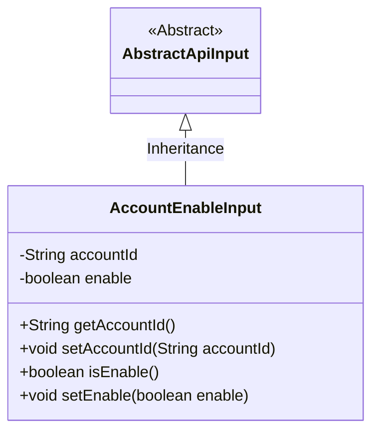
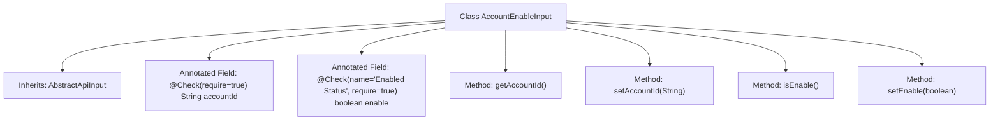

# Basic Information

|      |      |
|------|------|
| Name | AccountEnableInput |
| Language | .java |
| Code Path | WeFe/manager/manager-service/src/main/java/com/welab/wefe/manager/service/dto/account/AccountEnableInput.java |
| Package Name | com.welab.wefe.manager.service.dto.account |
| Dependencies | ['com.welab.wefe.common.fieldvalidate.annotation.Check', 'com.welab.wefe.common.web.dto.AbstractApiInput'] |
| Brief Description | The `AccountEnableInput` class extends `AbstractApiInput`, containing the required fields `accountId` and `enable`, and provides getter and setter methods. |

# Description

This is a Java class named AccountEnableInput, which extends AbstractApiInput. The class contains two key fields: accountId and enable, representing the account ID and the enabled status, respectively. The accountId field is marked as mandatory, and the enable field is also mandatory and annotated with the Chinese name "是否可用" (whether it is available). The class provides standard getter and setter methods for these two fields to retrieve and set their corresponding values. The entire class is used to handle input parameters for enabling or disabling an account.

# Class Summary

| Name   | Type  | Description |
|-------|------|-------------|
| AccountEnableInput | class | The AccountEnableInput class inherits from AbstractApiInput, containing the required fields accountId and enable, and provides getter and setter methods. |

## Class AccountEnableInput

|      |      |
|------|------|
| Access Modifier | public |
| Type | class |
| Name | AccountEnableInput |
| Description | The AccountEnableInput class inherits from AbstractApiInput, containing the required fields accountId and enable, and provides getter and setter methods. |

### UML Class Diagram

This class diagram illustrates that the AccountEnableInput class inherits from the AbstractApiInput abstract class. AccountEnableInput contains two private fields, accountId and enable, which store the account ID and activation status respectively, along with corresponding getter and setter methods. The fields are validated via the @Check annotation, indicating that accountId is a required field, while the enable field must be validated and provided. This design handles the input parameters for account activation/deactivation, inheriting the characteristics of the base API input class.

### Internal Method Call Graph

This flowchart illustrates the structure of the AccountEnableInput class, which inherits from AbstractApiInput class. It contains two private fields with validation annotations (accountId and enable), along with corresponding getter and setter methods. The @Check annotation marks field validation constraints, with the enable field including custom prompt text. The class structure clearly demonstrates Java Bean encapsulation characteristics, controlling access to sensitive properties through methods.

### Field List

| Name  | Type  | Description |
|-------|-------|------|
| enable | boolean | Class member variable `enable`, boolean type, annotated with `@Check` to verify its availability, and it is a required field. |
| accountId | String | Required field accountId |

### Method List

| Name  | Type  | Description |
|-------|-------|------|
| setAccountId | void | The method to set the account ID assigns the parameter accountId to the accountId property of the current object. |
| getAccountId | String | This is a Java method that returns the value of the accountId member variable of type String. |
| isEnable | boolean | The method isEnable returns the state of the boolean value enable. |
| setEnable | void | The method setEnable sets a boolean value enable to control the enabled or disabled state. |

