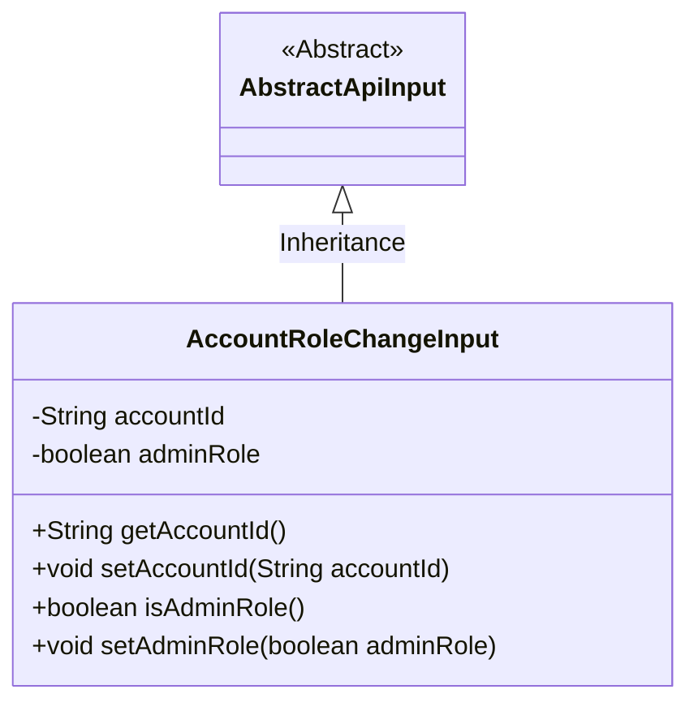
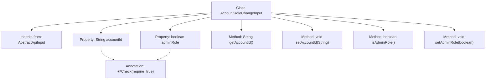

# Basic Information

|      |      |
|------|------|
| Name | AccountRoleChangeInput |
| Language | .java |
| Code Path | WeFe/manager/manager-service/src/main/java/com/welab/wefe/manager/service/dto/account/AccountRoleChangeInput.java |
| Package Name | com.welab.wefe.manager.service.dto.account |
| Dependencies | ['com.welab.wefe.common.fieldvalidate.annotation.Check', 'com.welab.wefe.common.web.dto.AbstractApiInput'] |
| Brief Description | Define the account role change input class, including mandatory account ID and administrator role identifier, with getter and setter methods provided. |

# Description

The `AccountRoleChangeInput` class inherits from `AbstractApiInput` and includes two required fields: `accountId` (string type) and `adminRole` (boolean type). It provides getter and setter methods for accessing and modifying the values of these two fields. The `accountId` is used to identify the account, while `adminRole` indicates the administrator role status of the account.

# Class Summary

| Name   | Type  | Description |
|-------|------|-------------|
| AccountRoleChangeInput | class | The `AccountRoleChangeInput` class extends `AbstractApiInput`, containing the required fields `accountId` and `adminRole`, and provides getter and setter methods. |

## Class AccountRoleChangeInput

|      |      |
|------|------|
| Access Modifier | public |
| Type | class |
| Name | AccountRoleChangeInput |
| Description | The `AccountRoleChangeInput` class extends `AbstractApiInput`, containing the required fields `accountId` and `adminRole`, and provides getter and setter methods. |

### UML Class Diagram

This code demonstrates an account role change input class `AccountRoleChangeInput`, which inherits from the abstract base class `AbstractApiInput`. The class contains two private fields: `accountId` (account ID) and `adminRole` (admin role flag), along with their corresponding getter and setter methods. The `@Check` annotation marks these fields as required, reflecting the input parameter validation mechanism. The class diagram clearly shows the inheritance relationship and class member structure, making it suitable for handling API request data for account role changes.

### Internal Method Call Graph

This flowchart illustrates the structure of the AccountRoleChangeInput class, including its inheritance relationship, properties, and methods. The class inherits from AbstractApiInput and contains two properties (accountId and adminRole) annotated with @Check, along with corresponding getter and setter methods. The properties implement mandatory validation through annotations, while the methods are used to access and modify property values, collectively forming a typical Java Bean structure.

### Field List

| Name  | Type  | Description |
|-------|-------|------|
| adminRole | boolean | The code defines a private boolean variable adminRole and marks it as a required field with the @Check annotation. |
| accountId | String | The code snippet defines a private String variable accountId, marked as requiring validation (@Check(require = true)). |

### Method List

| Name  | Type  | Description |
|-------|-------|------|
| setAccountId | void | Methods for setting the account ID: Assign the parameter accountId to the accountId property of the current object. |
| isAdminRole | boolean | Check if it is an administrator role, return a boolean value adminRole. |
| getAccountId | String | This is a Java method that returns the value of the string-type member variable accountId. |
| setAdminRole | void | Method for setting administrator role, controlling role status via boolean parameters. |

