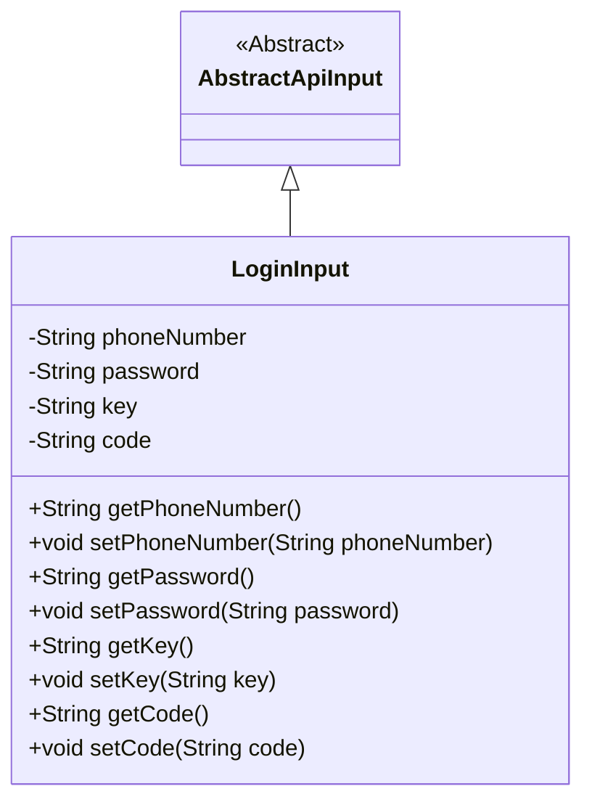

# Basic Information

|      |      |
|------|------|
| Name | LoginInput |
| Language | .java |
| Code Path | WeFe/manager/manager-service/src/main/java/com/welab/wefe/manager/service/dto/account/LoginInput.java |
| Package Name | com.welab.wefe.manager.service.dto.account |
| Dependencies | ['com.welab.wefe.common.fieldvalidate.annotation.Check', 'com.welab.wefe.common.web.dto.AbstractApiInput'] |
| Brief Description | Login input class, including required fields for phone number, password, verification code identifier, and verification code, with getter and setter methods provided for each attribute. |

# Description

This is a Java class named LoginInput, which extends AbstractApiInput and is used to handle login input data. The class contains four mandatory fields: phoneNumber represents the phone number, password represents the password, key serves as the verification code identifier, and code represents the verification code. Each field has corresponding getter and setter methods and is marked as a required field with the @Check annotation. Additionally, the key and code fields include descriptive information.

# Class Summary

| Name   | Type  | Description |
|-------|------|-------------|
| LoginInput | class | Login input class, including mandatory fields for phone number, password, verification code identifier, and verification code, with getter and setter methods provided. |

## Class LoginInput

|      |      |
|------|------|
| Access Modifier | public |
| Type | class |
| Name | LoginInput |
| Description | Login input class, including mandatory fields for phone number, password, verification code identifier, and verification code, with getter and setter methods provided. |

### UML Class Diagram

This code demonstrates a login input class `LoginInput` inheriting from the abstract class `AbstractApiInput`. `LoginInput` contains four private fields: `phoneNumber`, `password`, `key`, and `code`, each with corresponding getter and setter methods. The fields in the class are marked with the `@Check` annotation for validation, indicating that these fields are mandatory during login. This design is used to encapsulate the verification information required for user login, reflecting the encapsulation and inheritance characteristics of object-oriented programming.

### Internal Method Call Graph

```mermaid
graph TD
    A["Class LoginInput"]
    B["Inherits: AbstractApiInput"]
    C["Field: @Check String phoneNumber"]
    D["Field: @Check String password"]
    E["Field: @Check String key"]
    F["Field: @Check String code"]
    G["Method: getPhoneNumber()"]
    H["Method: setPhoneNumber(String)"]
    I["Method: getPassword()"]
    J["Method: setPassword(String)"]
    K["Method: getKey()"]
    L["Method: setKey(String)"]
    M["Method: getCode()"]
    N["Method: setCode(String)"]

    A --> B
    A --> C
    A --> D
    A --> E
    A --> F
    A --> G
    A --> H
    A --> I
    A --> J
    A --> K
    A --> L
    A --> M
    A --> N
```

This flowchart illustrates the complete structure of the LoginInput class, which inherits from the base class AbstractApiInput. The class contains four mandatory fields annotated with @Check: phoneNumber, password, key (verification code identifier), and code (verification code). Each private field is accompanied by standard getter and setter methods for read/write operations. The require=true attribute in the annotation indicates these fields are mandatory during validation, while the desc attribute provides descriptive text for the fields. The overall class structure clearly adheres to JavaBean design specifications, making it suitable for encapsulating API input parameters.

### Field List

| Name  | Type  | Description |
|-------|-------|------|
| password | String | The code snippet defines a private string variable named password and marks it as a required field using the @Check annotation. |
| phoneNumber | String | The code snippet defines a private string variable named phoneNumber and uses the @Check(require=true) annotation, indicating that this field must be validated and is mandatory. |
| code | String | Verification code field, required. |
| key | String | Verification code identifier field key, mandatory field. |

### Method List

| Name  | Type  | Description |
|-------|-------|------|
| getKey | String | Public method to retrieve the key value, returns the member variable key. |
| setPassword | void | This is a Java method used to set the value of a password field. The method accepts a string parameter `password` and assigns it to the class's member variable `password`. |
| setPhoneNumber | void | This is a Java method used to set the value of the class's phoneNumber property. The method takes a string parameter phoneNumber and assigns it to the class's member variable of the same name. |
| getPassword | String | This is a Java method that returns the value of a string-type password variable. |
| getPhoneNumber | String | Methods to obtain the phone number, returns a string phoneNumber. |
| setCode | void | This is a Java method used to set the value of the code property in a class. The method takes a string parameter code and assigns it to the member variable this.code of the class. |
| setKey | void | Set the key-value method to assign the input string to the member variable `key`. |
| getCode | String | Common methods for obtaining code values. |

