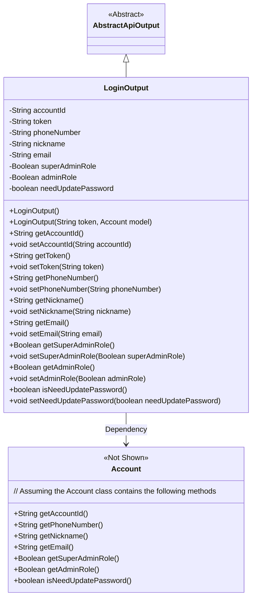

# Basic Information

|      |      |
|------|------|
| Name | LoginOutput |
| Language | .java |
| Code Path | WeFe/manager/manager-service/src/main/java/com/welab/wefe/manager/service/dto/account/LoginOutput.java |
| Package Name | com.welab.wefe.manager.service.dto.account |
| Dependencies | ['com.welab.wefe.common.data.mongodb.entity.manager.Account', 'com.welab.wefe.common.web.dto.AbstractApiOutput'] |
| Brief Description | The `LoginOutput` class extends `AbstractApiOutput` and includes fields such as account ID, token, phone number, nickname, email, administrator role identifier, and a flag indicating whether a password update is required. It provides constructors and getter/setter methods. |

# Description

The LoginOutput class inherits from AbstractApiOutput and is used to encapsulate the returned data after login. It includes basic information such as account ID, token, phone number, nickname, email, as well as a super administrator role flag, administrator role flag, and a boolean value indicating whether a password update is required. It provides a no-argument constructor and a constructor that initializes data based on the Account model, while also generating getter and setter methods for all fields to enable data access and modification.

# Class Summary

| Name   | Type  | Description |
|-------|------|-------------|
| LoginOutput | class | The LoginOutput class inherits from AbstractApiOutput and includes fields for account ID, token, phone number, nickname, email, administrator role identifier, and password update identifier, providing constructor methods and getter/setter methods. |

## Class LoginOutput

|      |      |
|------|------|
| Access Modifier | public |
| Type | class |
| Name | LoginOutput |
| Description | The LoginOutput class inherits from AbstractApiOutput and includes fields for account ID, token, phone number, nickname, email, administrator role identifier, and password update identifier, providing constructor methods and getter/setter methods. |

### UML Class Diagram

This code demonstrates a login output class `LoginOutput`, which inherits from the abstract class `AbstractApiOutput` and includes fields such as user account information, token, and role identifiers. The class initializes data from an `Account` model object through its constructor and provides complete getter/setter methods. The class diagram clearly illustrates the inheritance relationship and the dependency with the `Account` class, reflecting the data structure returned after a successful user login.

### Internal Method Call Graph

```mermaid
graph TD
    A["Class LoginOutput extends AbstractApiOutput"]
    B["Property: String accountId"]
    C["Property: String token"]
    D["Property: String phoneNumber"]
    E["Property: String nickname"]
    F["Property: String email"]
    G["Property: Boolean superAdminRole"]
    H["Property: Boolean adminRole"]
    I["Property: boolean needUpdatePassword"]
    J["Constructor: LoginOutput()"]
    K["Constructor: LoginOutput(String token, Account model)"]
    L["Method: getAccountId/setAccountId"]
    M["Method: getToken/setToken"]
    N["Method: getPhoneNumber/setPhoneNumber"]
    O["Method: getNickname/setNickname"]
    P["Method: getEmail/setEmail"]
    Q["Method: getSuperAdminRole/setSuperAdminRole"]
    R["Method: getAdminRole/setAdminRole"]
    S["Method: isNeedUpdatePassword/setNeedUpdatePassword"]

    A --> B
    A --> C
    A --> D
    A --> E
    A --> F
    A --> G
    A --> H
    A --> I
    A --> J
    A --> K
    A --> L
    A --> M
    A --> N
    A --> O
    A --> P
    A --> Q
    A --> R
    A --> S
    K -->|invokes| B
    K -->|invokes| C
    K -->|invokes| D
    K -->|invokes| E
    K -->|invokes| F
    K -->|invokes| G
    K -->|invokes| H
    K -->|invokes| I
```

This flowchart illustrates the complete structure of the LoginOutput class, which inherits from AbstractApiOutput and contains 8 private properties and 12 methods. It highlights the assignment relationships between two constructors (no-arg constructor and parameterized constructor) and the properties, where the parameterized constructor initializes all properties through an Account model object. All properties are equipped with corresponding getter/setter methods, encapsulating login-related information such as account ID, token, contact details, and role identifiers. The flowchart clearly presents the hierarchical relationships between class members and the initialization paths of properties by constructors.

### Field List

| Name  | Type  | Description |
|-------|-------|------|
| needUpdatePassword | boolean | The boolean variable needUpdatePassword indicates whether a password update is required. |
| superAdminRole | Boolean | Private boolean variable indicating whether it is a super administrator role. |
| token | String | Private string type variable token. |
| phoneNumber | String | Define a private string variable phoneNumber. |
| adminRole | Boolean | Boolean type field, indicating whether it is an administrator role. |
| email | String | Declare a private string variable email. |
| nickname | String | The private string-type variable nickname is used to store nickname information. |
| accountId | String | Declare a private string variable accountId. |

### Method List

| Name  | Type  | Description |
|-------|-------|------|
| setSuperAdminRole | void | The method to set the super administrator role, which takes a boolean parameter to update the member variable `superAdminRole`. |
| setAccountId | void | This is a Java method used to set the value of the class's accountId property. The method takes a string parameter accountId and assigns it to the class's member variable this.accountId. |
| getToken | String | This method returns a token value of string type. |
| setToken | void | Methods for setting token string values. |
| setNickname | void | The method `setNickname` is used to set the value of the member variable `nickname`, and the parameter is of string type. |
| getNickname | String | This is a Java method that returns the string-type nickname variable. |
| getAdminRole | Boolean | Methods to obtain administrator role status, returning a boolean value indicating whether the user is an administrator. |
| setAdminRole | void | The method to set the administrator role, with the parameter being a boolean value adminRole, is used to update the adminRole property of the object. |
| isNeedUpdatePassword | boolean | The method returns a boolean value indicating whether a password update is required. |
| setNeedUpdatePassword | void | This method is used to set whether the password needs to be updated, with the parameter being a boolean value that is directly assigned to the class member variable needUpdatePassword. |
| setPhoneNumber | void | Method for setting a phone number, which assigns the input parameter to the phoneNumber variable of the class. |
| setEmail | void | This is a Java method used to set the email property of an object. The method takes a string parameter email and assigns it to the email field of the current object. |
| getSuperAdminRole | Boolean | Methods to obtain the super administrator role status, returning a boolean value indicating whether it is a super administrator. |
| getPhoneNumber | String | Methods to obtain a phone number, returning a string-type phoneNumber. |
| getAccountId | String | This is a Java method that returns the value of the accountId member variable of type String. |
| getEmail | String | Methods to obtain the email string. |

