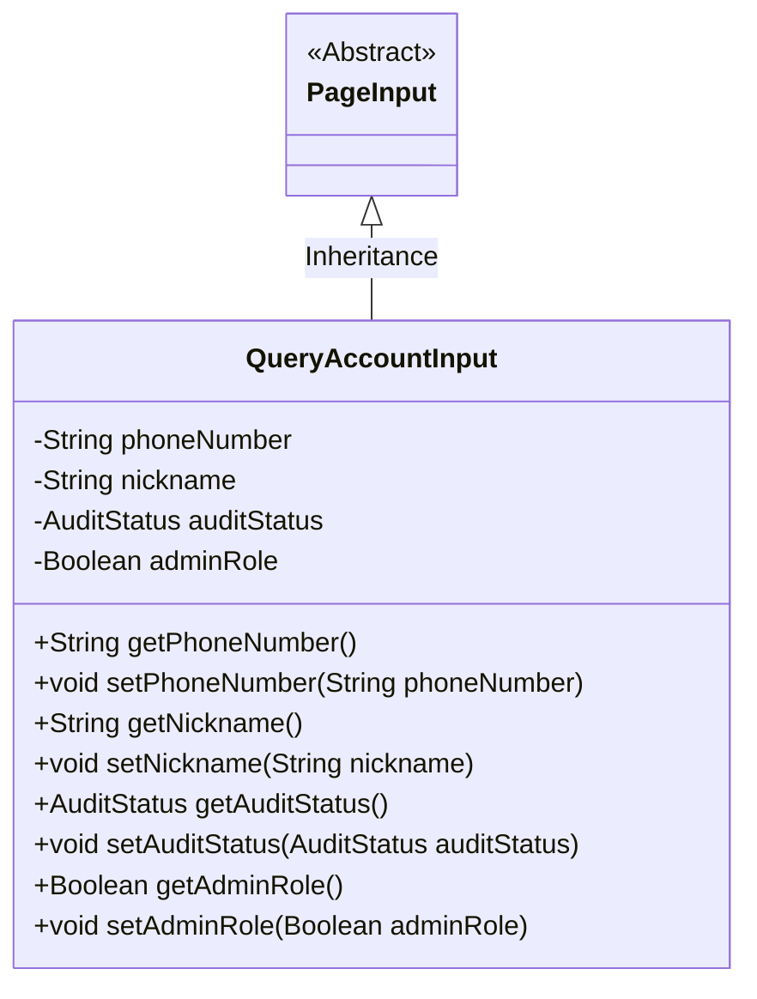

# Basic Information

|      |      |
|------|------|
| Name | QueryAccountInput |
| Language | .java |
| Code Path | WeFe/manager/manager-service/src/main/java/com/welab/wefe/manager/service/dto/account/QueryAccountInput.java |
| Package Name | com.welab.wefe.manager.service.dto.account |
| Dependencies | ['com.welab.wefe.common.wefe.enums.AuditStatus', 'com.welab.wefe.manager.service.dto.base.PageInput'] |
| Brief Description | The QueryAccountInput class extends PageInput, containing fields for phone number, nickname, approval status, and administrator role, along with their corresponding getter and setter methods. |

# Description

The `QueryAccountInput` class inherits from `PageInput` and is used to encapsulate the input parameters for querying accounts. It includes four attributes: `phoneNumber` represents the phone number, `nickname` represents the nickname, `auditStatus` represents the audit status enumeration, and `adminRole` indicates whether it is an administrator role. Each attribute has corresponding getter and setter methods for accessing and modifying the attribute values.

# Class Summary

| Name   | Type  | Description |
|-------|------|-------------|
| QueryAccountInput | class | The QueryAccountInput class inherits from PageInput and includes fields for phone number, nickname, review status, and administrator role, along with their corresponding getter and setter methods. |

## Class QueryAccountInput

|      |      |
|------|------|
| Access Modifier | public |
| Type | class |
| Name | QueryAccountInput |
| Description | The QueryAccountInput class inherits from PageInput and includes fields for phone number, nickname, review status, and administrator role, along with their corresponding getter and setter methods. |

### UML Class Diagram

This class diagram illustrates the structure where the QueryAccountInput class inherits from the abstract class PageInput. QueryAccountInput contains four private fields: phoneNumber, nickname, auditStatus, and adminRole, each with corresponding getter and setter methods. AuditStatus is an enumeration type representing the audit status. This class is primarily used to encapsulate input parameters for account queries, inheriting the basic pagination functionality from PageInput. The class diagram clearly presents the inheritance relationship between classes and the access permissions of member methods.

### Internal Method Call Graph

```mermaid
graph TD
    A["Class QueryAccountInput"]
    B["Inherits from: PageInput"]
    C["Property: String phoneNumber"]
    D["Property: String nickname"]
    E["Property: AuditStatus auditStatus"]
    F["Property: Boolean adminRole"]
    G["Method: getPhoneNumber()"]
    H["Method: setPhoneNumber(String)"]
    I["Method: getNickname()"]
    J["Method: setNickname(String)"]
    K["Method: getAuditStatus()"]
    L["Method: setAuditStatus(AuditStatus)"]
    M["Method: getAdminRole()"]
    N["Method: setAdminRole(Boolean)"]

    A --> B
    A --> C
    A --> D
    A --> E
    A --> F
    A --> G
    A --> H
    A --> I
    A --> J
    A --> K
    A --> L
    A --> M
    A --> N
```

This code defines a class named QueryAccountInput, which inherits from PageInput. It contains four private properties: phoneNumber (phone number), nickname (nickname), auditStatus (audit status), and adminRole (administrator role). Each property has corresponding getter and setter methods for retrieving and setting the property values. This class is primarily used to encapsulate input parameters for account queries, facilitating the transfer and processing of account-related query data within the system.

### Field List

| Name  | Type  | Description |
|-------|-------|------|
| phoneNumber | String | Define a private string variable phoneNumber. |
| auditStatus | AuditStatus | The private audit state variable `auditStatus`. |
| nickname | String | The private string variable `nickname` is used to store nickname information. |
| adminRole | Boolean | Private boolean variable indicating administrator role. |

### Method List

| Name  | Type  | Description |
|-------|-------|------|
| getNickname | String | Methods to obtain the nickname, returns a string-type variable nickname. |
| setNickname | void | Methods for setting a user nickname, assigning the input parameter to the member variable `nickname`. |
| setPhoneNumber | void | This is a Java method used to set the value of the class's phoneNumber property. The method takes a string parameter phoneNumber and assigns it to the member variable of the same name in the class. |
| getPhoneNumber | String | Methods to obtain the phone number, returns a string phoneNumber. |
| getAuditStatus | AuditStatus | Methods to obtain the audit status, returns the auditStatus value. |
| setAuditStatus | void | The method to set the audit status assigns the incoming `auditStatus` to the `auditStatus` property of the current object. |
| getAdminRole | Boolean | Methods to obtain administrator role status, returning a boolean value indicating whether it is an administrator. |
| setAdminRole | void | Define the method setAdminRole to set the boolean property adminRole. |

