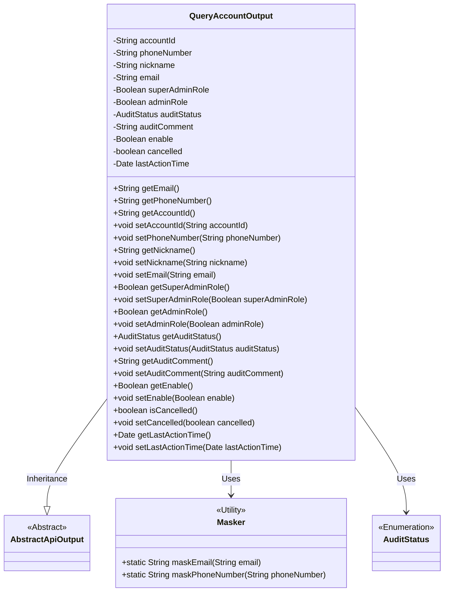

# Basic Information

|      |      |
|------|------|
| Name | QueryAccountOutput |
| Language | .java |
| Code Path | WeFe/manager/manager-service/src/main/java/com/welab/wefe/manager/service/dto/account/QueryAccountOutput.java |
| Package Name | com.welab.wefe.manager.service.dto.account |
| Dependencies | ['com.welab.wefe.common.fieldvalidate.annotation.Check', 'com.welab.wefe.common.util.Masker', 'com.welab.wefe.common.web.dto.AbstractApiOutput', 'com.welab.wefe.common.wefe.enums.AuditStatus', 'java.util.Date'] |
| Brief Description | The QueryAccountOutput class contains account information such as ID, mobile number, nickname, email, administrator role, review status and comments, availability, deregistration status, and last activity time. It provides getter/setter methods, with some sensitive information being masked. |

# Description

The QueryAccountOutput class inherits from AbstractApiOutput and includes account-related attributes: accountId, masked phoneNumber and email, nickname, superAdminRole indicating super administrator status, adminRole indicating administrator permissions, auditStatus recording review status, auditComment storing review comments, enable controlling account availability, cancelled marking deactivation status, and lastActionTime recording the last activity time. All fields are accessed via getter/setter methods, with sensitive information masked using the Masker tool.

# Class Summary

| Name   | Type  | Description |
|-------|------|-------------|
| QueryAccountOutput | class | The QueryAccountOutput class includes attributes such as account ID, phone number, nickname, email, administrator role, review status, and availability, and provides getter/setter methods. Some sensitive information is desensitized through the Masker class. |

## Class QueryAccountOutput

|      |      |
|------|------|
| Access Modifier | public |
| Type | class |
| Name | QueryAccountOutput |
| Description | The QueryAccountOutput class includes attributes such as account ID, phone number, nickname, email, administrator role, review status, and availability, and provides getter/setter methods. Some sensitive information is desensitized through the Masker class. |

### UML Class Diagram

This code demonstrates a `QueryAccountOutput` class that inherits from `AbstractApiOutput`, designed to encapsulate account query output information. The class contains attributes such as account ID, phone number, nickname, and email, with validation markers via `@Check` annotations. Phone numbers and emails are desensitized using the `Masker` utility class. It also defines business-related fields like administrator roles, audit status, and account status, providing complete getter/setter methods. The overall design reflects the encapsulation of account information and security processing.

### Internal Method Call Graph

```mermaid
graph TD
    A["Class QueryAccountOutput"]
    B["Inherits: AbstractApiOutput"]
    C["Property: String accountId"]
    D["Property: @Check String phoneNumber"]
    E["Property: @Check String nickname"]
    F["Property: @Check String email"]
    G["Property: @Check Boolean superAdminRole"]
    H["Property: @Check Boolean adminRole"]
    I["Property: @Check AuditStatus auditStatus"]
    J["Property: @Check String auditComment"]
    K["Property: @Check Boolean enable"]
    L["Property: boolean cancelled"]
    M["Property: Date lastActionTime"]
    N["Method: getEmail() invokes Masker.maskEmail"]
    O["Method: getPhoneNumber() invokes Masker.maskPhoneNumber"]
    P["Getter/Setter method group"]

    A --> B
    A --> C
    A --> D
    A --> E
    A --> F
    A --> G
    A --> H
    A --> I
    A --> J
    A --> K
    A --> L
    A --> M
    A --> N
    A --> O
    A --> P
```

This code demonstrates an account query output class QueryAccountOutput, which inherits from AbstractApiOutput. The class contains multiple properties annotated with @Check for account information storage and validation, such as phone number, email, administrator roles, etc. It specifically provides sensitive information masking methods (getEmail/getPhoneNumber) and a complete set of Getter/Setter methods. The class design reflects considerations for data encapsulation, security processing, and extensibility, making it suitable as an API response data structure.

### Field List

| Name  | Type  | Description |
|-------|-------|------|
| adminRole | Boolean | The field adminRole indicates whether the user is an administrator, who has additional permissions such as setting member visibility to external parties. |
| superAdminRole | Boolean | Check if it is the super administrator, i.e., the initial creator of the system. |
| auditStatus | AuditStatus | The private field auditStatus, labeled as audit status, is of type AuditStatus. |
| nickname | String | The code defines a private string variable named nickname and applies the @Check annotation for nickname validation. |
| email | String | Define a private String variable email, and validate the email format using the @Check annotation. |
| accountId | String | Declare a private string variable accountId. |
| phoneNumber | String | The field phoneNumber uses the @Check annotation to validate the phone number format. |
| auditComment | String | Entity class field: Review Comments, of type String, used to store remarks related to the review process. |
| enable | Boolean | The private boolean variable `enable` is annotated with `@Check` as "whether it is enabled". |
| lastActionTime | Date | Last operation time record field. |
| cancelled | boolean | The boolean variable `cancelled` indicates the cancellation status. |

### Method List

| Name  | Type  | Description |
|-------|-------|------|
| setAdminRole | void | Defined a public method setAdminRole for setting the boolean value of the adminRole property. |
| setNickname | void | The method to set the user nickname assigns the input parameter to the member variable `nickname`. |
| setSuperAdminRole | void | The method to set the super administrator role, with a boolean parameter. |
| setCancelled | void | The method `setCancelled` is used to set the state of the boolean value `cancelled`, with the parameter being `cancelled`. |
| setLastActionTime | void | Method to set the last operation time of an object, with the parameter being of type Date. |
| getLastActionTime | Date | Get the date object of the last operation time. |
| setAuditStatus | void | The method to set the audit status assigns the incoming auditStatus to the auditStatus property of the current object. |
| setAccountId | void | Methods for setting the account ID: Assign the parameter accountId to the class member variable with the same name. |
| getAdminRole | Boolean | The method getAdminRole returns a boolean value adminRole, indicating the status of the administrator role. |
| setAuditComment | void | The method setAuditComment is used to set the value of the auditComment property. |
| getNickname | String | Methods to obtain the nickname, returns a string-type nickname. |
| setPhoneNumber | void | Method for setting the phone number, assigning the input parameter to the class member variable phoneNumber. |
| getAccountId | String | The method returns the account ID of string type. |
| setEmail | void | This is a Java method used to set the email property of an object. The method takes a string parameter email and assigns it to the email field of the current object. |
| getSuperAdminRole | Boolean | This is a Java method that returns a boolean value of superAdminRole, indicating whether it is a super administrator role. |
| getAuditComment | String | Methods to obtain audit comments, returning the auditComment string. |
| getEmail | String | This method returns a masked email string to protect user privacy. |
| getAuditStatus | AuditStatus | The method returns the value of the audit status auditStatus. |
| getPhoneNumber | String | This method returns a masked phone number string, concealing partial information to protect privacy. |
| getEnable | Boolean | This is a Java method that returns the boolean value of the enable variable. |
| setEnable | void | This is a Java method used to set the boolean value of the enable property. The method accepts a Boolean parameter and assigns it to the class's member variable enable. |
| isCancelled | boolean | Check if the task has been canceled, return the boolean state of `cancelled`. |

