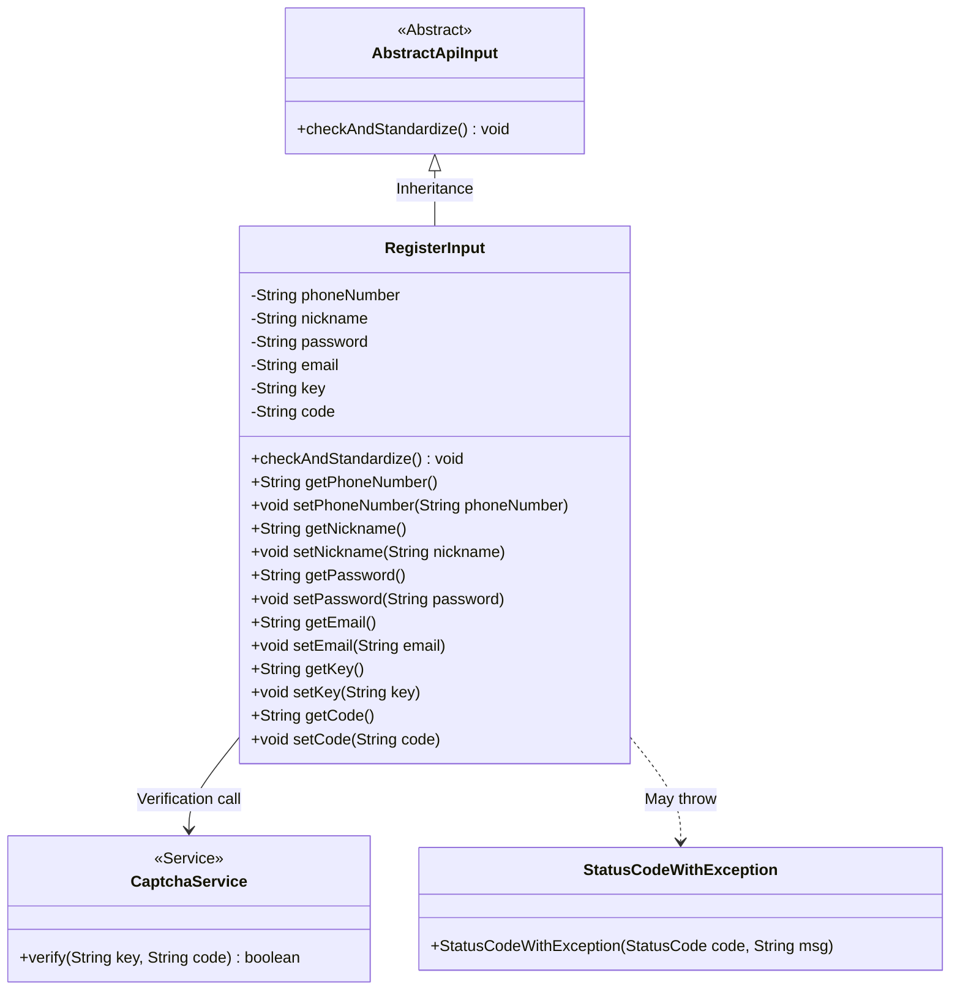

# Basic Information

|      |      |
|------|------|
| Name | RegisterInput |
| Language | .java |
| Code Path | WeFe/manager/manager-service/src/main/java/com/welab/wefe/manager/service/dto/account/RegisterInput.java |
| Package Name | com.welab.wefe.manager.service.dto.account |
| Dependencies | ['com.welab.wefe.common.StatusCode', 'com.welab.wefe.common.exception.StatusCodeWithException', 'com.welab.wefe.common.fieldvalidate.StandardFieldType', 'com.welab.wefe.common.fieldvalidate.annotation.Check', 'com.welab.wefe.common.web.dto.AbstractApiInput', 'com.welab.wefe.common.web.service.CaptchaService'] |
| Brief Description | Registration input class, including fields for phone number, nickname, password, email, verification code identifier, and verification code, performing format validation and verification code verification. |

# Description

The `RegisterInput` class inherits from `AbstractApiInput` and includes fields for mobile number, nickname, password, email, verification code identifier, and verification code. Each field requires validation: the mobile number must conform to the standard format, the nickname must be 2-15 characters long, the password must be 6-128 characters long, the email must follow the standard format, and the verification code identifier and verification code are mandatory. When overriding the `checkAndStandardize` method, it additionally verifies the validity of the verification code, throwing an exception if invalid. Getter and setter methods are provided for each field.

# Class Summary

| Name   | Type  | Description |
|-------|------|-------------|
| RegisterInput | class | Register input class, including fields for phone number, nickname, password, email, verification code identifier, and verification code, performing format validation and verification code verification. |

## Class RegisterInput

|      |      |
|------|------|
| Access Modifier | public |
| Type | class |
| Name | RegisterInput |
| Description | Register input class, including fields for phone number, nickname, password, email, verification code identifier, and verification code, performing format validation and verification code verification. |

### UML Class Diagram

This class diagram illustrates the structure and relationships of the registration input data model. RegisterInput inherits from the abstract class AbstractApiInput, containing six private fields with annotation validations and their corresponding getter/setter methods. The core method checkAndStandardize() invokes parent class validation logic and verifies captcha validity through CaptchaService, throwing StatusCodeWithException upon failure. The diagram clearly presents class inheritance, service dependencies, and exception handling relationships, demonstrating the complete process control for registration parameter validation.

### Internal Method Call Graph

```mermaid
graph TD
    A["Class RegisterInput"]
    B["Inherits: AbstractApiInput"]
    C["Property: String phoneNumber"]
    D["Property: String nickname"]
    E["Property: String password"]
    F["Property: String email"]
    G["Property: String key"]
    H["Property: String code"]
    I["Method: checkAndStandardize()"]
    J["Method: getPhoneNumber()"]
    K["Method: setPhoneNumber()"]
    L["Method: getNickname()"]
    M["Method: setNickname()"]
    N["Method: getPassword()"]
    O["Method: setPassword()"]
    P["Method: getEmail()"]
    Q["Method: setEmail()"]
    R["Method: getKey()"]
    S["Method: setKey()"]
    T["Method: getCode()"]
    U["Method: setCode()"]
    V["Calls: super.checkAndStandardize()"]
    W["Calls: CaptchaService.verify()"]
    X["Throws: StatusCodeWithException"]

    A --> B
    A --> C
    A --> D
    A --> E
    A --> F
    A --> G
    A --> H
    A --> I
    A --> J
    A --> K
    A --> L
    A --> M
    A --> N
    A --> O
    A --> P
    A --> Q
    A --> R
    A --> S
    A --> T
    A --> U
    I --> V
    I --> W
    W -->|false| X
```

Flowchart description: This flowchart illustrates the structure of the RegisterInput class, which inherits from the AbstractApiInput class. It contains multiple private properties with validation annotations (such as phone number, nickname, password, etc.) and their corresponding getter and setter methods. The core method is checkAndStandardize(), which first invokes the parent class's validation logic and then verifies the captcha's validity through CaptchaService. If verification fails, it throws a StatusCodeWithException. The entire process clearly reflects the data validation and standardization workflow.

### Field List

| Name  | Type  | Description |
|-------|-------|------|
| email | String | The code defines a private string variable named email, and uses the @Check annotation to enforce that this field is mandatory and must conform to the standard email format. |
| code | String | CAPTCHA field, mandatory validation. |
| password | String | The code defines a private string variable named password, which is required to be non-empty and have a length between 6 and 128 characters. |
| phoneNumber | String | The code defines a private string variable phoneNumber, annotated with @Check to mark it as a required field, and specifies the validation type as standard phone number format. |
| key | String | CAPTCHA identification field, mandatory. |
| nickname | String | Java field validation: Nickname is required, length must be between 2-15 characters. |

### Method List

| Name  | Type  | Description |
|-------|-------|------|
| setPassword | void | Method for setting password, assigns the input string to the class member variable password. |
| getNickname | String | The method returns the user's nickname string. |
| checkAndStandardize | void | This method checks and standardizes the input, first invoking the parent class method, then validating the verification code. If the verification code is invalid, it throws an invalid parameter exception and prompts an error. |
| getPassword | String | Methods to obtain the password, returns the password value as a string type. |
| getEmail | String | Methods to obtain the email string. |
| setPhoneNumber | void | This is a Java method used to set the value of the class's phoneNumber property. The method takes a string parameter phoneNumber and assigns it to the member variable of the same name in the class. |
| getPhoneNumber | String | Methods to obtain a phone number, returning a string-type phoneNumber. |
| setNickname | void | The method to set the user nickname assigns the input parameter to the member variable `nickname`. |
| setEmail | void | The method to set the email attribute assigns the parameter value to the email field of the current object. |
| getKey | String | This is a Java method that returns the value of the member variable key of type String. |
| setKey | void | Set the key-value method to assign the input string to the member variable key. |
| getCode | String | Public method to obtain the code value. |
| setCode | void | Set the string-type code value. |

