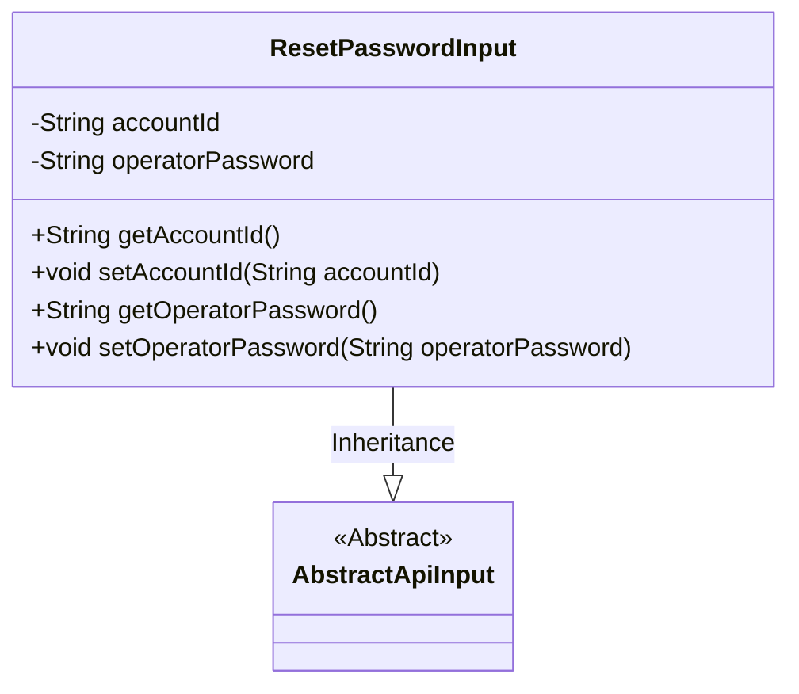
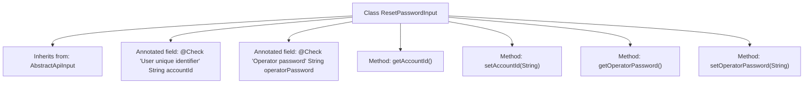

# Basic Information

|      |      |
|------|------|
| Name | ResetPasswordInput |
| Language | .java |
| Code Path | WeFe/manager/manager-service/src/main/java/com/welab/wefe/manager/service/dto/account/ResetPasswordInput.java |
| Package Name | com.welab.wefe.manager.service.dto.account |
| Dependencies | ['com.welab.wefe.common.fieldvalidate.annotation.Check', 'com.welab.wefe.common.web.dto.AbstractApiInput'] |
| Brief Description | Reset password input class, containing two mandatory fields: user ID and operator password, with getter and setter methods provided. |

# Description

The `ResetPasswordInput` class inherits from `AbstractApiInput` and is used to handle input data for password reset. It includes two mandatory fields: `accountId` represents the unique identifier of the user, and `operatorPassword` denotes the password of the operator. Both fields have getter and setter methods and are validated for non-null values through annotations.

# Class Summary

| Name   | Type  | Description |
|-------|------|-------------|
| ResetPasswordInput | class | Reset password input class, containing two mandatory fields: user ID and operator password, with getter and setter methods provided. |

## Class ResetPasswordInput

|      |      |
|------|------|
| Access Modifier | public |
| Type | class |
| Name | ResetPasswordInput |
| Description | Reset password input class, containing two mandatory fields: user ID and operator password, with getter and setter methods provided. |

### UML Class Diagram

Class Diagram Description: The ResetPasswordInput class inherits from the abstract class AbstractApiInput and contains two private string-type attributes, accountId and operatorPassword, representing the user's unique identifier and the operator's password, respectively. It provides getter and setter methods for these four attributes to access and modify them. This class is primarily used to handle input data for password reset, inheriting the basic API input characteristics of AbstractApiInput.

### Internal Method Call Graph

This code describes a ResetPasswordInput class for password reset functionality, which inherits from the base class AbstractApiInput. The class contains two mandatory fields annotated with @Check: accountId representing the user's unique identifier, and operatorPassword representing the operator's password. Standard getter and setter methods are provided for these four fields. The flowchart clearly illustrates the class inheritance, property definitions, and method structure, reflecting the design intent of data validation and encapsulation.

### Field List

| Name  | Type  | Description |
|-------|-------|------|
| accountId | String | The field accountId must meet the user unique identifier validation and is mandatory. |
| operatorPassword | String | Check operator password, mandatory field. |

### Method List

| Name  | Type  | Description |
|-------|-------|------|
| getAccountId | String | The method returns an accountId string. |
| setAccountId | void | Methods for setting the account ID: Assign the parameter accountId to the accountId property of the current object. |
| getOperatorPassword | String | Methods to obtain the operator password, returns a string type operatorPassword. |
| setOperatorPassword | void | The method to set the operator password assigns the input parameter to the class member variable operatorPassword. |

