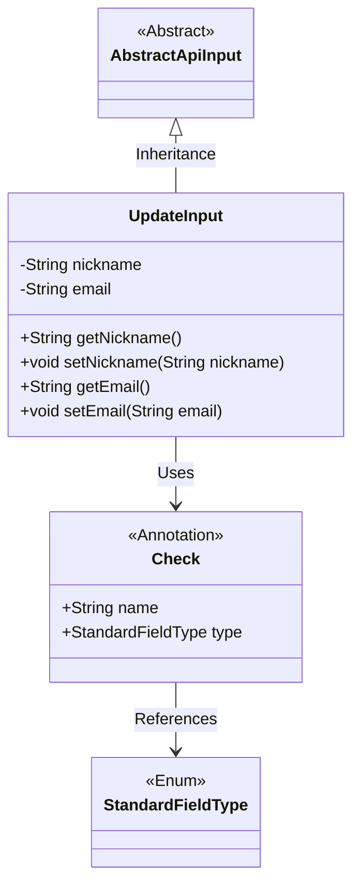
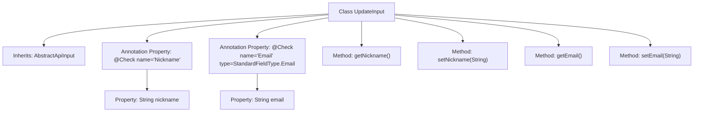

# Basic Information

|      |      |
|------|------|
| Name | UpdateInput |
| Language | .java |
| Code Path | WeFe/manager/manager-service/src/main/java/com/welab/wefe/manager/service/dto/account/UpdateInput.java |
| Package Name | com.welab.wefe.manager.service.dto.account |
| Dependencies | ['com.welab.wefe.common.fieldvalidate.StandardFieldType', 'com.welab.wefe.common.fieldvalidate.annotation.Check', 'com.welab.wefe.common.web.dto.AbstractApiInput'] |
| Brief Description | The UpdateInput class extends AbstractApiInput, containing nickname and email fields, with email format validation, and provides getter and setter methods. |

# Description

This is a Java class named UpdateInput, which extends AbstractApiInput. The class contains two private fields: nickname and email, representing nickname and email respectively. The nickname field is annotated with @Check with the name "nickname", while the email field is also annotated with @Check with the name "email" and specifies the field type as StandardFieldType.Email. The class provides getter and setter methods for these two fields to retrieve and set their values.

# Class Summary

| Name   | Type  | Description |
|-------|------|-------------|
| UpdateInput | class | The UpdateInput class inherits from AbstractApiInput, containing nickname and email fields. The email must comply with standard format requirements, with getter and setter methods provided. |

## Class UpdateInput

|      |      |
|------|------|
| Access Modifier | public |
| Type | class |
| Name | UpdateInput |
| Description | The UpdateInput class inherits from AbstractApiInput, containing nickname and email fields. The email must comply with standard format requirements, with getter and setter methods provided. |

### UML Class Diagram

This class diagram illustrates that the UpdateInput class inherits from the abstract class AbstractApiInput and contains two private fields, nickname and email, along with their corresponding getter and setter methods. The UpdateInput class utilizes the Check annotation for field validation. The Check annotation includes name and type attributes, where the type attribute references the StandardFieldType enumeration. This structure is primarily used to implement API input parameter validation functionality, enabling standardized field validation through annotations.

### Internal Method Call Graph

This code defines an UpdateInput class that inherits from AbstractApiInput, containing two properties (nickname and email) annotated with @Check and their corresponding getter and setter methods. The flowchart clearly illustrates the class inheritance, property annotation configurations, and method structure, where the nickname field uses basic validation while the email field additionally specifies Email-type standard field validation. The entire class is designed to handle update input data with validation logic.

### Field List

| Name  | Type  | Description |
|-------|-------|------|
| email | String | Define a private string field email, and use the @Check annotation to validate its format as an email type. |
| nickname | String | Java Field Annotation: Checking string variables for nicknames. |

### Method List

| Name  | Type  | Description |
|-------|-------|------|
| getEmail | String | Methods for obtaining email strings. |
| getNickname | String | Methods to obtain the nickname, returns a string-type nickname. |
| setNickname | void | The method to set a user nickname assigns the input parameter to the `nickname` property of the object. |
| setEmail | void | This is a Java method used to set the email property of an object. The method takes a string parameter email and assigns it to the email field of the current object. |

