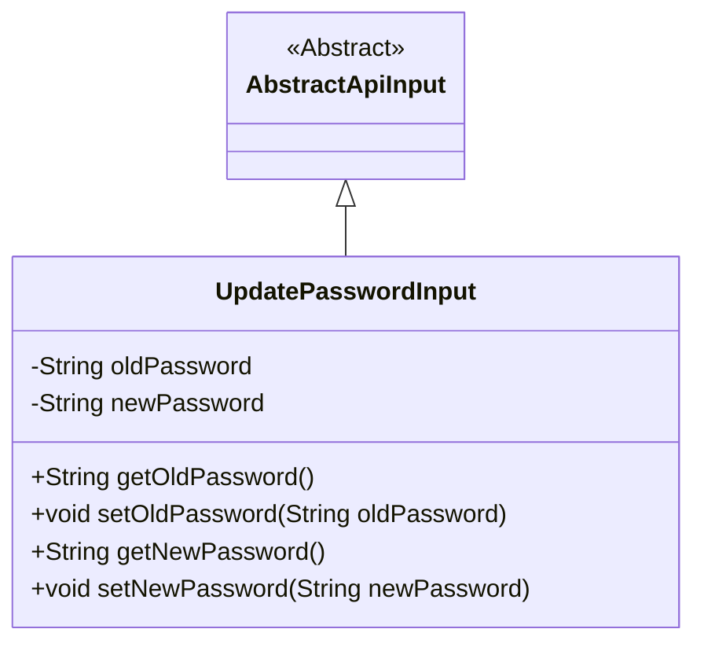
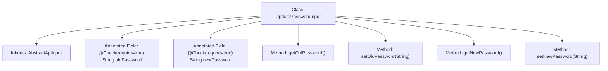

# Basic Information

|      |      |
|------|------|
| Name | UpdatePasswordInput |
| Language | .java |
| Code Path | WeFe/manager/manager-service/src/main/java/com/welab/wefe/manager/service/dto/account/UpdatePasswordInput.java |
| Package Name | com.welab.wefe.manager.service.dto.account |
| Dependencies | ['com.welab.wefe.common.fieldvalidate.annotation.Check', 'com.welab.wefe.common.web.dto.AbstractApiInput'] |
| Brief Description | Update the password input class to include the required old password and new password fields along with their getter and setter methods. |

# Description

This is an input class for updating passwords, inheriting from an abstract API input base class. The class contains two required fields: the old password and the new password, each marked as mandatory through annotations. The class provides methods for getting and setting these two password fields, ensuring data encapsulation and access control.

# Class Summary

| Name   | Type  | Description |
|-------|------|-------------|
| UpdatePasswordInput | class | Update the password input class to include mandatory fields for old password and new password, along with their corresponding getter and setter methods. |

## Class UpdatePasswordInput

|      |      |
|------|------|
| Access Modifier | public |
| Type | class |
| Name | UpdatePasswordInput |
| Description | Update the password input class to include mandatory fields for old password and new password, along with their corresponding getter and setter methods. |

### UML Class Diagram

This class diagram illustrates the structure where UpdatePasswordInput inherits from the abstract class AbstractApiInput. UpdatePasswordInput contains two private string attributes, oldPassword and newPassword, each with corresponding getter and setter methods. The class marks these fields as mandatory through the @Check annotation, reflecting the input validation requirements for password updates. The inheritance relationship indicates that UpdatePasswordInput adheres to the foundational API input specifications defined by the parent class.

### Internal Method Call Graph

This code defines an input class UpdatePasswordInput for password updates, which inherits from the base class AbstractApiInput. The class contains two mandatory fields annotated with @Check: oldPassword and newPassword, representing the old and new passwords respectively. Standard getter and setter methods are provided for these four properties. The flowchart clearly illustrates the class inheritance relationship, field declarations, and method structure, reflecting the standard design pattern of a Java Bean.

### Field List

| Name  | Type  | Description |
|-------|-------|------|
| newPassword | String | The code snippet defines a private string variable named newPassword, which is marked as requiring validation (@Check(require = true)). |
| oldPassword | String | Mandatory validation field oldPassword, cannot be empty. |

### Method List

| Name  | Type  | Description |
|-------|-------|------|
| setOldPassword | void | The method to set the old password assigns the input parameter to the `oldPassword` member variable of the class. |
| getOldPassword | String | Methods to obtain the old password, returns a string-type value oldPassword. |
| getNewPassword | String | Methods to obtain a new password, returns a new password value of string type. |
| setNewPassword | void | The method `setNewPassword` is used to set a new password, with the parameter being the string `newPassword`. |

