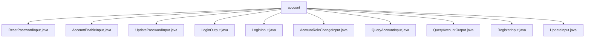

# Basic Information

|      |      |
|------|------|
| Name | account |
| Language | .java |
| Code Path | WeFe/manager/manager-service/src/main/java/com/welab/wefe/manager/service/dto/account |
| Package Name | docs.manager.manager-service.src.main.java.com.welab.wefe.manager.service.dto.account |
| Brief Description | ResetPasswordInput handles password reset input, including accountId and operatorPassword. AccountEnableInput manages account activation status, containing accountId and enable fields. UpdatePasswordInput processes password updates, including old and new password fields. LoginOutput encapsulates login response data, containing account information and permission identifiers. LoginInput handles login input, including phone number, password, and verification code. AccountRoleChangeInput manages role changes, including accountId and adminRole. QueryAccountInput encapsulates query parameters, including phone number and nickname. QueryAccountOutput returns account information, with sensitive data masked. RegisterInput handles registration, including phone number and password verification. UpdateInput manages updates, including nickname and email fields. |

# Description

## Overview  
The core responsibility of this module is to manage account lifecycle operations, including registration, login, password reset, role changes, etc., functioning as an account control center. The interface specifications uniformly inherit the AbstractApiInput/Output base classes, with mandatory fields validated via the @Check annotation. Key data structures include AccountId, password fields, role identifiers, etc. For example, ResetPasswordInput handles password resets, while LoginOutput encapsulates login responses. External dependencies include services like CAPTCHA and tools such as Masker. Implementation examples are abundant, such as RegisterInput strictly validating phone number formats and QueryAccountOutput masking sensitive information.  

## Key Business Scenarios  
The module supports a complete account management workflow: registration (RegisterInput) → login (LoginInput) → information update (UpdateInput) → permission changes (AccountRoleChangeInput). The interaction model resembles CRUD operations, such as QueryAccountInput for paginated account queries and AccountEnableInput for controlling account status. Typical applications include administrators adjusting permissions via AccountRoleChangeInput and users modifying passwords via UpdatePasswordInput. API types cover input/output DTOs, with integration examples like LoginOutput returning tokens and role information to support frontend permission control.

### Package Internal Structure View

This flowchart illustrates the DTO class structure under the account directory in the manager-service module. All 11 input/output classes are directly subordinate to the account node, including data transfer objects related to core functionalities such as password reset (ResetPasswordInput), account activation (AccountEnableInput), password update (UpdatePasswordInput), etc. It clearly reflects the data interaction architecture of the account management module.

# File List

| Name   | Type  | Description |
|-------|------|-------------|
| [ResetPasswordInput.java](ResetPasswordInput.md) | file | Password reset input class, containing two mandatory fields: user ID and operator password, with getter and setter methods provided. |
| [AccountEnableInput.java](AccountEnableInput.md) | file | The AccountEnableInput class extends AbstractApiInput, containing the required fields accountId and enable, and provides getter and setter methods. |
| [UpdatePasswordInput.java](UpdatePasswordInput.md) | file | Update the password input class to include required fields for old password and new password, along with their getter and setter methods. |
| [LoginOutput.java](LoginOutput.md) | file | The LoginOutput class inherits from AbstractApiOutput and includes fields such as account ID, token, phone number, nickname, email, administrator role identifier, and password update requirement flag. It provides constructors and getter/setter methods. |
| [LoginInput.java](LoginInput.md) | file | Login input class, including mandatory fields for phone number, password, verification code identifier, and verification code, with getter and setter methods provided for each attribute. |
| [AccountRoleChangeInput.java](AccountRoleChangeInput.md) | file | Define the account role change input class, including mandatory account ID and administrator role identifier, providing getter and setter methods. |
| [QueryAccountInput.java](QueryAccountInput.md) | file | The QueryAccountInput class extends PageInput, containing fields for phone number, nickname, approval status, and administrator role, along with their corresponding getter and setter methods. |
| [QueryAccountOutput.java](QueryAccountOutput.md) | file | The QueryAccountOutput class contains account information such as ID, phone number, nickname, email, administrator role, review status and comments, availability, deactivation status, and last activity time. It provides getter/setter methods, with some sensitive information being masked. |
| [RegisterInput.java](RegisterInput.md) | file | Register input class, including mobile number, nickname, password, email, verification code identifier, and verification code fields, performing format validation and verification code verification. |
| [UpdateInput.java](UpdateInput.md) | file | The UpdateInput class extends AbstractApiInput, containing nickname and email fields, with format validation for the email field, and provides getter and setter methods. |

