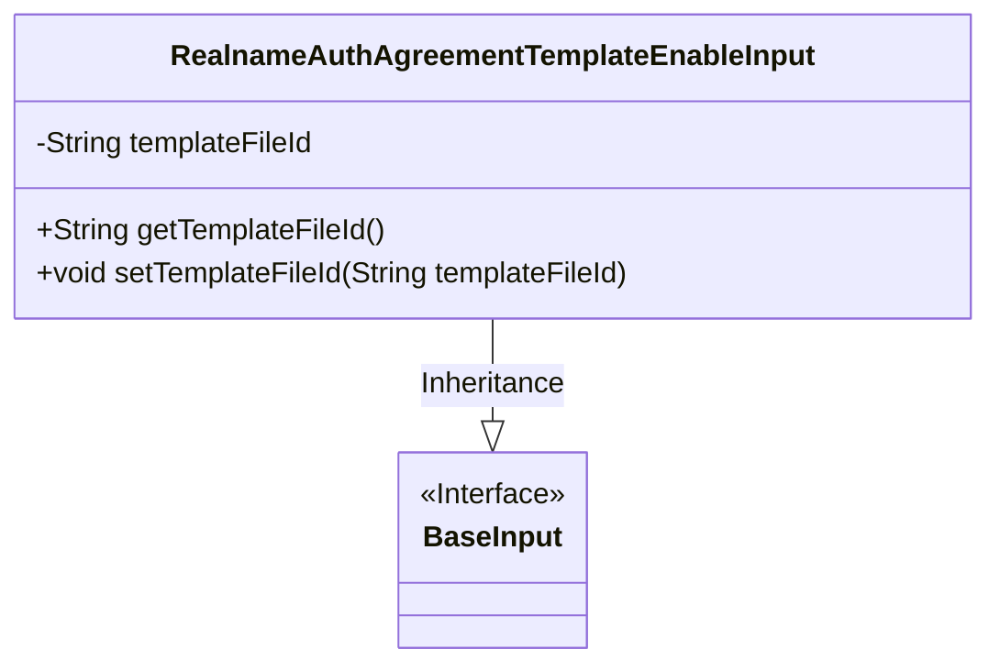
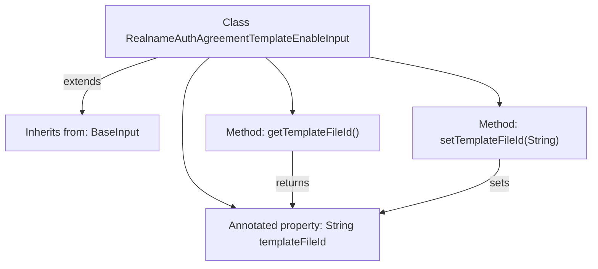

# Basic Information

|      |      |
|------|------|
| Name | RealnameAuthAgreementTemplateEnableInput |
| Language | .java |
| Code Path | WeFe/manager/manager-service/src/main/java/com/welab/wefe/manager/service/dto/agreement/RealnameAuthAgreementTemplateEnableInput.java |
| Package Name | com.welab.wefe.manager.service.dto.agreement |
| Dependencies | ['com.welab.wefe.common.fieldvalidate.annotation.Check', 'com.welab.wefe.manager.service.dto.base.BaseInput'] |
| Brief Description | The Java class `RealnameAuthAgreementTemplateEnableInput` extends `BaseInput` and includes a required field `templateFileId` along with its getter and setter methods. |

# Description

The content defines a Java class named RealnameAuthAgreementTemplateEnableInput, which inherits from the BaseInput class. This class includes a private string property templateFileId, marked as a required field through the @Check annotation. It provides public methods getTemplateFileId and setTemplateFileId to retrieve and set this property. The overall structure is designed to handle input data when enabling a real-name authentication agreement template.

# Class Summary

| Name   | Type  | Description |
|-------|------|-------------|
| RealnameAuthAgreementTemplateEnableInput | class | Define the real-name authentication protocol template activation input class, including the required template file ID and its getter/setter methods. |

## Class RealnameAuthAgreementTemplateEnableInput

|      |      |
|------|------|
| Access Modifier | public |
| Type | class |
| Name | RealnameAuthAgreementTemplateEnableInput |
| Description | Define the real-name authentication protocol template activation input class, including the required template file ID and its getter/setter methods. |

### UML Class Diagram

This class diagram illustrates the structure where the RealnameAuthAgreementTemplateEnableInput class inherits from the BaseInput interface. The class contains a private String attribute templateFileId, along with corresponding getter and setter methods. The @Check annotation marks this field as mandatory, reflecting the design intent of data validation. The diagram clearly depicts the hierarchical relationship between the entity and interface, conforming to the typical design pattern of Java Beans.

### Internal Method Call Graph

This code describes a real-name authentication agreement template enable input class, which inherits from the base input class BaseInput. The core element is a template file ID property with validation annotations, accessed via getter/setter methods. The flowchart clearly illustrates the class inheritance relationship, property validation annotations, and method operations on the property, presenting a concise yet complete structure that covers key aspects of data encapsulation.

### Field List

| Name  | Type  | Description |
|-------|-------|------|
| templateFileId | String | Required field: templateFileId |

### Method List

| Name  | Type  | Description |
|-------|-------|------|
| getTemplateFileId | String | Methods to obtain the template file ID, returns a string-type templateFileId. |
| setTemplateFileId | void | The method to set the template file ID assigns the input parameter to the class member variable templateFileId. |

