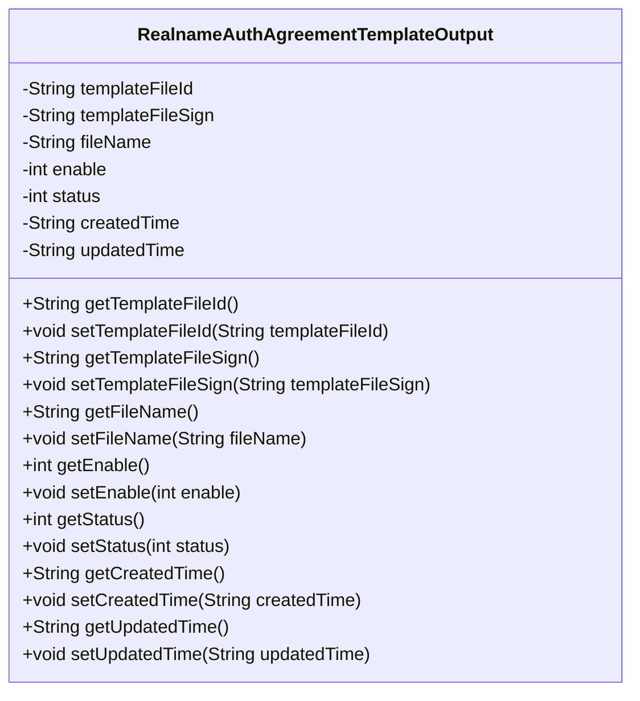

# Basic Information

|      |      |
|------|------|
| Name | RealnameAuthAgreementTemplateOutput |
| Language | .java |
| Code Path | WeFe/manager/manager-service/src/main/java/com/welab/wefe/manager/service/dto/agreement/RealnameAuthAgreementTemplateOutput.java |
| Package Name | com.welab.wefe.manager.service.dto.agreement |
| Dependencies | [] |
| Brief Description | Real-name Authentication Protocol Template Output Class, including fields such as file ID, signature, name, activation status, status, creation and update time, and their corresponding getter/setter methods. |

# Description

The Java class RealnameAuthAgreementTemplateOutput defines the output data structure for the real-name authentication agreement template, including fields such as template file ID, file signature, file name, enabled status, status flag, creation time, and update time. It also provides corresponding getter and setter methods for accessing and modifying these attributes.

# Class Summary

| Name   | Type  | Description |
|-------|------|-------------|
| RealnameAuthAgreementTemplateOutput | class | Real-name authentication protocol template class, including file ID, signature, name, activation status, status code, and creation/update time, providing getter and setter methods for each field. |

## Class RealnameAuthAgreementTemplateOutput

|      |      |
|------|------|
| Access Modifier | public |
| Type | class |
| Name | RealnameAuthAgreementTemplateOutput |
| Description | Real-name authentication protocol template class, including file ID, signature, name, activation status, status code, and creation/update time, providing getter and setter methods for each field. |

### UML Class Diagram

This code defines a class named RealnameAuthAgreementTemplateOutput, primarily used for storing and managing real-name authentication agreement template information. The class contains seven private fields representing template file ID, file signature, file name, enable status, status code, creation time, and update time, with corresponding getter and setter methods provided for each field. It is a typical Data Transfer Object (DTO) designed to encapsulate and transmit metadata of agreement templates, suitable for template management scenarios in real-name authentication systems.

### Internal Method Call Graph

```mermaid
graph TD
    A["Class RealnameAuthAgreementTemplateOutput"]
    B["Attribute: String templateFileId"]
    C["Attribute: String templateFileSign"]
    D["Attribute: String fileName"]
    E["Attribute: int enable"]
    F["Attribute: int status"]
    G["Attribute: String createdTime"]
    H["Attribute: String updatedTime"]
    I["Method: getTemplateFileId()"]
    J["Method: setTemplateFileId(String)"]
    K["Method: getTemplateFileSign()"]
    L["Method: setTemplateFileSign(String)"]
    M["Method: getFileName()"]
    N["Method: setFileName(String)"]
    O["Method: getEnable()"]
    P["Method: setEnable(int)"]
    Q["Method: getStatus()"]
    R["Method: setStatus(int)"]
    S["Method: getCreatedTime()"]
    T["Method: setCreatedTime(String)"]
    U["Method: getUpdatedTime()"]
    V["Method: setUpdatedTime(String)"]

    A --> B
    A --> C
    A --> D
    A --> E
    A --> F
    A --> G
    A --> H
    A --> I
    A --> J
    A --> K
    A --> L
    A --> M
    A --> N
    A --> O
    A --> P
    A --> Q
    A --> R
    A --> S
    A --> T
    A --> U
    A --> V
```

This code defines a class named RealnameAuthAgreementTemplateOutput, primarily used for storing and managing information related to real-name authentication agreement templates. The class contains 8 private attributes, representing template file ID, template file signature, file name, enable status, status code, creation time, and update time. Corresponding getter and setter methods are provided for each attribute to retrieve and modify their values. This is a typical Data Transfer Object (DTO) design, intended for encapsulating and transmitting data related to real-name authentication agreement templates.

### Field List

| Name  | Type  | Description |
|-------|-------|------|
| templateFileSign | String | The private string variable templateFileSign is used to store the template file signature. |
| createdTime | String | Define a string-type variable named createdTime to record the creation time. |
| templateFileId | String | The private string variable templateFileId is used to store the template file ID. |
| status | int | The private integer variable `status` is used to store state information. |
| enable | int | The private integer variable `enable` is used to control the enabled state. |
| fileName | String | The private string variable fileName is used to store the file name. |
| updatedTime | String | Private string variable, recording the update time. |

### Method List

| Name  | Type  | Description |
|-------|-------|------|
| getCreatedTime | String | Method to get the creation time, returns the value of the createdTime variable as a string type. |
| getEnable | int | The method getEnable returns the value of the integer variable enable. |
| setCreatedTime | void | This is a Java method used to set the creation time property of an object. The method takes a string parameter named createdTime and assigns it to the member variable of the same name in the object. |
| setEnable | void | Function to set the enabled state, with an integer parameter 'enable' assigned to the member variable enable. |
| getFileName | String | Common method to obtain the file name, returns the value of the fileName variable as a string. |
| getUpdatedTime | String | Public method to obtain the updatedTime value. |
| setStatus | void | This is a Java method used to set the value of the object's status property. The method accepts an integer parameter status and assigns it to the status field of the current object. |
| getTemplateFileId | String | Methods to obtain the template file ID, where the return value is `templateFileId`. |
| setTemplateFileId | void | The method to set the template file ID assigns the passed `templateFileId` to the property of the same name in the current object. |
| setFileName | void | The method to set the file name assigns the input parameter `fileName` to the class member variable `fileName`. |
| getStatus | int | Methods to obtain the current status value, returns an integer variable status. |
| getTemplateFileSign | String | This is a Java method that returns the value of the string-type member variable `templateFileSign`. |
| setTemplateFileSign | void | Common method for setting template file signature, with the parameter being of string type. |
| setUpdatedTime | void | The method to set the update time involves assigning the input string to the object's updatedTime property. |

