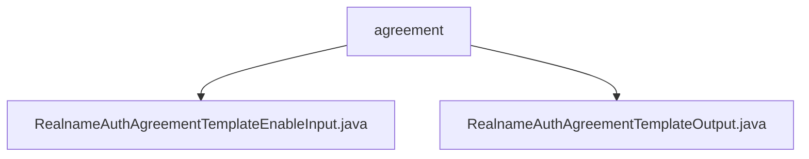

# Basic Information

|      |      |
|------|------|
| Name | agreement |
| Language | .java |
| Code Path | WeFe/manager/manager-service/src/main/java/com/welab/wefe/manager/service/dto/agreement |
| Package Name | docs.manager.manager-service.src.main.java.com.welab.wefe.manager.service.dto.agreement |
| Brief Description | The `RealnameAuthAgreementTemplateEnableInput` class inherits from `BaseInput` and includes the required property `templateFileId` along with corresponding methods. The `RealnameAuthAgreementTemplateOutput` class contains fields such as template ID, signature, status, and their accessor methods. |

# Description

## Overview  
The core responsibility of this module is to handle the activation and output data management of real-name authentication agreement templates, including input parameter validation and output data structure encapsulation. The interface specifications involve mandatory field validation (e.g., the `@Check` annotation for `templateFileId`) and standard Getter/Setter methods. Key data structures include metadata such as template file ID, signature, status flags, etc. External dependencies are limited to the Java basic annotation library. For example, `RealnameAuthAgreementTemplateEnableInput` implements input validation, while `RealnameAuthAgreementTemplateOutput` encapsulates seven template attributes.  

## Key Business Scenarios  
The business process revolves around the lifecycle management of agreement templates, similar to a configuration center model. The interaction mode adopts standard DTO object transmission, such as activating a specified template via `templateFileID`. Functional completeness is reflected in covering management dimensions such as template status (enabled/disabled) and metadata (signature/timestamp). Typical applications include console operations triggering template status changes. The API type involves pure Java object interaction, exemplified by the decoupled design of input validation and output data.

### Package Internal Structure View

This flowchart illustrates two Java files under the agreement directory: RealnameAuthAgreementTemplateEnableInput.java and RealnameAuthAgreementTemplateOutput.java. Both files are directly subordinate to the agreement directory without any deeper nesting structure. The diagram clearly presents the hierarchical relationship between agreement as the parent node and the two template class files, conforming to the given path information requirements.

# File List

| Name   | Type  | Description |
|-------|------|-------------|
| [RealnameAuthAgreementTemplateEnableInput.java](RealnameAuthAgreementTemplateEnableInput.md) | file | The Java class RealnameAuthAgreementTemplateEnableInput extends BaseInput and includes the required field templateFileId along with its getter/setter methods. |
| [RealnameAuthAgreementTemplateOutput.java](RealnameAuthAgreementTemplateOutput.md) | file | Real-name Authentication Protocol Template Output Class, containing fields such as file ID, signature, name, activation status, status, creation and update time, along with their getter/setter methods. |

