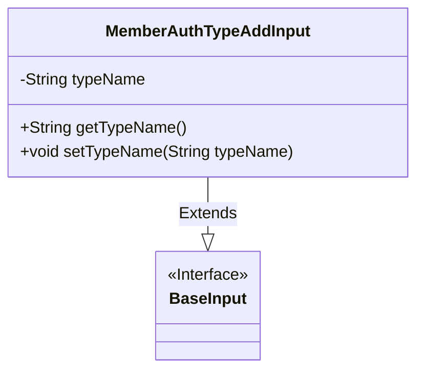
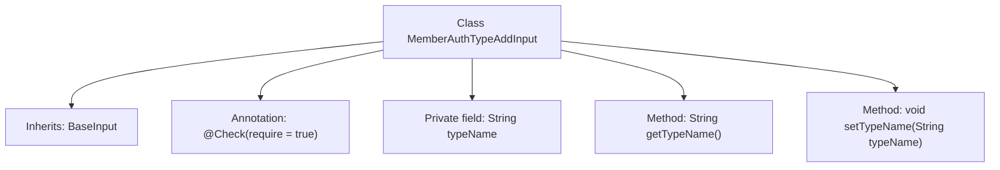

# Basic Information

|      |      |
|------|------|
| Name | MemberAuthTypeAddInput |
| Language | .java |
| Code Path | WeFe/manager/manager-service/src/main/java/com/welab/wefe/manager/service/dto/authtype/MemberAuthTypeAddInput.java |
| Package Name | com.welab.wefe.manager.service.dto.authtype |
| Dependencies | ['com.welab.wefe.common.data.mongodb.entity.union.ext.MemberAuthTypeExtJSON', 'com.welab.wefe.common.fieldvalidate.annotation.Check', 'com.welab.wefe.manager.service.dto.base.BaseInput'] |
| Brief Description | The `MemberAuthTypeAddInput` class extends `BaseInput` and includes the required field `typeName` along with its getter and setter methods. |

# Description

This is a Java class named MemberAuthTypeAddInput, which inherits from the BaseInput class. The class contains a private String field typeName, marked as a required field by the @Check annotation. It provides two public methods, getTypeName and setTypeName, for retrieving and setting the value of the typeName field. This class is primarily used to handle input data for adding member authentication types.

# Class Summary

| Name   | Type  | Description |
|-------|------|-------------|
| MemberAuthTypeAddInput | class | Add an input class for member authentication type, including the required field typeName and its getter/setter methods. |

## Class MemberAuthTypeAddInput

|      |      |
|------|------|
| Access Modifier | public |
| Type | class |
| Name | MemberAuthTypeAddInput |
| Description | Add an input class for member authentication type, including the required field typeName and its getter/setter methods. |

### UML Class Diagram

This class diagram illustrates the inheritance structure where the `MemberAuthTypeAddInput` class extends the `BaseInput` interface. The `MemberAuthTypeAddInput` contains a private field `typeName` and corresponding getter/setter methods, with the `@Check` annotation marking this field as mandatory. The `BaseInput`, annotated as an interface (denoted by `<<Interface>>`), serves as the parent class of `MemberAuthTypeAddInput`, demonstrating a base class design pattern for input parameters. The entire structure clearly presents the inheritance relationship between classes and the encapsulation characteristics of member attributes.

### Internal Method Call Graph

This flowchart illustrates the structure of the MemberAuthTypeAddInput class, a Java class that inherits from BaseInput. The class contains a private field typeName annotated with @Check, along with corresponding getter and setter methods. The annotation indicates this field is mandatory. The flowchart clearly presents the class's inheritance relationship and member structure, highlighting data validation and encapsulation features, conforming to the design pattern of JavaBean specifications.

### Field List

| Name  | Type  | Description |
|-------|-------|------|
| typeName | String | The code snippet defines a private string variable named typeName and marks this field as mandatory using the @Check annotation. |

### Method List

| Name  | Type  | Description |
|-------|-------|------|
| getTypeName | String | The method returns a string type name. |
| setTypeName | void | This is a Java method used to set the value of the class member variable `typeName`. The method takes a string parameter `typeName` and assigns it to the `typeName` property of the current object. |

