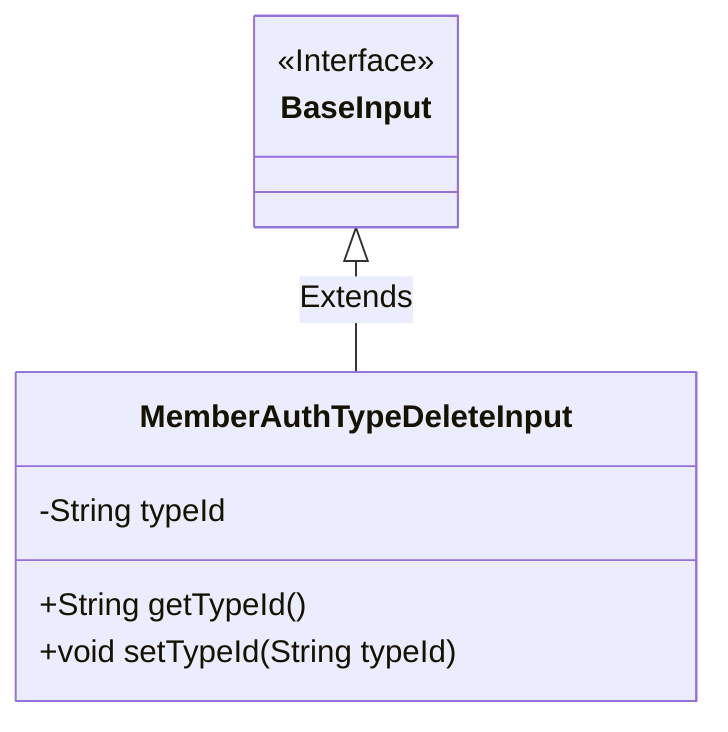
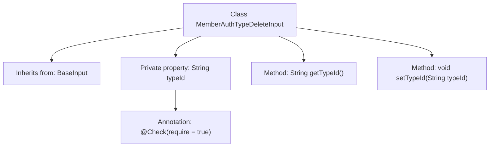

# Basic Information

|      |      |
|------|------|
| Name | MemberAuthTypeDeleteInput |
| Language | .java |
| Code Path | WeFe/manager/manager-service/src/main/java/com/welab/wefe/manager/service/dto/authtype/MemberAuthTypeDeleteInput.java |
| Package Name | com.welab.wefe.manager.service.dto.authtype |
| Dependencies | ['com.welab.wefe.common.fieldvalidate.annotation.Check', 'com.welab.wefe.manager.service.dto.base.BaseInput'] |
| Brief Description | The class MemberAuthTypeDeleteInput extends BaseInput and includes the required field typeId along with its getter/setter methods. |

# Description

The content describes a Java class named MemberAuthTypeDeleteInput, which inherits from the BaseInput class. This class includes a private string property called typeId, marked as a required field via the @Check annotation. It provides getTypeId and setTypeId methods for retrieving and setting the value of this property. This class is primarily used to handle input data for member authentication type deletion operations.

# Class Summary

| Name   | Type  | Description |
|-------|------|-------------|
| MemberAuthTypeDeleteInput | class | The MemberAuthTypeDeleteInput class inherits from BaseInput and includes the required field typeId along with its getter/setter methods. |

## Class MemberAuthTypeDeleteInput

|      |      |
|------|------|
| Access Modifier | public |
| Type | class |
| Name | MemberAuthTypeDeleteInput |
| Description | The MemberAuthTypeDeleteInput class inherits from BaseInput and includes the required field typeId along with its getter/setter methods. |

### UML Class Diagram

This class diagram illustrates the inheritance structure where `MemberAuthTypeDeleteInput` extends the `BaseInput` interface. The `MemberAuthTypeDeleteInput` class contains a private field `typeId` with its public accessor methods, and implements parameter validation via the `@Check` annotation. The diagram clearly depicts the hierarchical relationship between the interface and its implementing class, adhering to Java inheritance conventions. The field encapsulation is well-maintained, and key constraints are annotated appropriately.

### Internal Method Call Graph

This flowchart illustrates the structure of the `MemberAuthTypeDeleteInput` class, which inherits from `BaseInput`. It contains a private property `typeId` annotated with `@Check`, along with corresponding getter and setter methods. The class diagram demonstrates the hierarchical relationships between properties and methods, clearly showing the association between annotations and properties. The overall structure effectively reflects the encapsulation characteristics of a Java class.

### Field List

| Name  | Type  | Description |
|-------|-------|------|
| typeId | String | Required field typeId, of type String. |

### Method List

| Name  | Type  | Description |
|-------|-------|------|
| getTypeId | String | Public method to get the typeId, returns the typeId value as a string. |
| setTypeId | void | This is a Java method used to set the value of the typeId property of an object. The method takes a string parameter typeId and assigns it to the member variable of the same name in the current object. |

