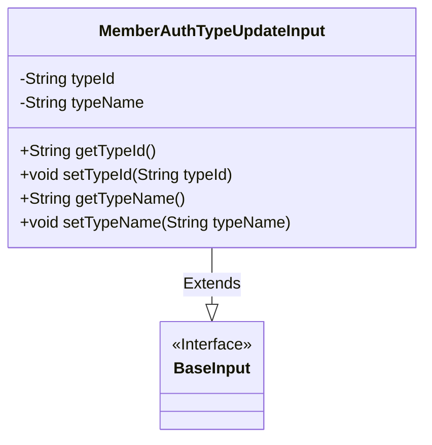
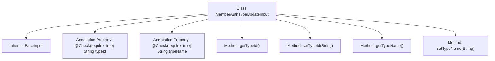

# Basic Information

|      |      |
|------|------|
| Name | MemberAuthTypeUpdateInput |
| Language | .java |
| Code Path | WeFe/manager/manager-service/src/main/java/com/welab/wefe/manager/service/dto/authtype/MemberAuthTypeUpdateInput.java |
| Package Name | com.welab.wefe.manager.service.dto.authtype |
| Dependencies | ['com.welab.wefe.common.fieldvalidate.annotation.Check', 'com.welab.wefe.manager.service.dto.base.BaseInput'] |
| Brief Description | The `MemberAuthTypeUpdateInput` class inherits from `BaseInput` and includes the required fields `typeId` and `typeName` along with their getter/setter methods. |

# Description

The code defines a class named `MemberAuthTypeUpdateInput`, which inherits from the `BaseInput` class. This class includes two mandatory fields: `typeId` and `typeName`, used to store the type ID and type name, respectively. Each field is equipped with getter and setter methods for retrieving and setting the field values. The fields in the class are marked as mandatory using the `@Check` annotation.

# Class Summary

| Name   | Type  | Description |
|-------|------|-------------|
| MemberAuthTypeUpdateInput | class | The MemberAuthTypeUpdateInput class extends BaseInput, containing required fields typeId and typeName along with their getter and setter methods. |

## Class MemberAuthTypeUpdateInput

|      |      |
|------|------|
| Access Modifier | public |
| Type | class |
| Name | MemberAuthTypeUpdateInput |
| Description | The MemberAuthTypeUpdateInput class extends BaseInput, containing required fields typeId and typeName along with their getter and setter methods. |

### UML Class Diagram

Class diagram description: The MemberAuthTypeUpdateInput class extends the BaseInput interface, containing two private attributes typeId and typeName, each with corresponding getter and setter methods. This class is used to handle input data for member authentication type updates, with mandatory fields marked by the @Check annotation to ensure data integrity. BaseInput serves as a fundamental input interface, potentially defining common input validation specifications.

### Internal Method Call Graph

This flowchart illustrates the structure of the MemberAuthTypeUpdateInput class, which is an input parameter class inheriting from BaseInput. It contains two mandatory fields (typeId and typeName) with validation annotations, along with corresponding getter and setter methods. Designed to encapsulate input parameters for identity authentication type update operations, the class implements basic validation through annotations, conforming to the JavaBean specification's data encapsulation pattern.

### Field List

| Name  | Type  | Description |
|-------|-------|------|
| typeName | String | Required field typeName type checking. |
| typeId | String | Required field typeId, type is String. |

### Method List

| Name  | Type  | Description |
|-------|-------|------|
| getTypeName | String | Method returns the type name string. |
| getTypeId | String | Methods to obtain the type ID, returning a string typeId. |
| setTypeId | void | The method for setting the type ID assigns the parameter typeId to the typeId property of the current object. |
| setTypeName | void | This is a Java method used to set the value of the class member variable `typeName`. The method takes a string parameter `typeName` and assigns it to the property of the same name in the current object. |

