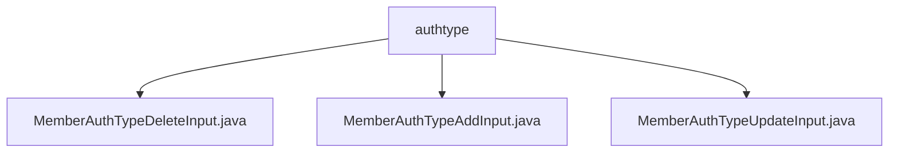

# Basic Information

|      |      |
|------|------|
| Name | authtype |
| Language | .java |
| Code Path | WeFe/manager/manager-service/src/main/java/com/welab/wefe/manager/service/dto/authtype |
| Package Name | docs.manager.manager-service.src.main.java.com.welab.wefe.manager.service.dto.authtype |
| Brief Description | The MemberAuthTypeDeleteInput class inherits from BaseInput and includes a required typeId field along with its getter/setter methods. The MemberAuthTypeAddInput class inherits from BaseInput and includes a required typeName field along with its getter/setter methods. The MemberAuthTypeUpdateInput class inherits from BaseInput and includes required typeId and typeName fields along with their getter/setter methods. |

# Description

## Overview  
The core responsibility of this module is to handle the addition, deletion, and modification operations of member authentication types. It encapsulates input data through DTO classes and validates mandatory fields. The interface specifications uniformly adopt Java classes that inherit from BaseInput, including mandatory fields marked with the @Check annotation and corresponding getter/setter methods. The key data structures are typeId (identifying the type) and typeName (type name). There are no external dependencies. For example, MemberAuthTypeAddInput handles addition operations, while MemberAuthTypeUpdateInput requires both typeId and typeName.  

## Main Business Scenarios  
The module supports the full lifecycle management of member authentication types, similar to the CRUD pattern. Business processes include: addition (requires typeName), deletion (requires typeId), and update (requires typeId + typeName). The interaction mode involves receiving parameters through standard DTOs and validating mandatory fields. For instance, deletion operations locate the target via typeId in MemberAuthTypeDeleteInput, while update operations synchronously modify the ID and name through MemberAuthTypeUpdateInput.

### Package Internal Structure View

This flowchart illustrates the hierarchical structure of the authtype directory under the manager-service module in the WeFe project, containing three DTO class files: MemberAuthTypeDeleteInput, MemberAuthTypeAddInput, and MemberAuthTypeUpdateInput. These files are directly subordinate to the authtype directory and are used for handling addition, deletion, and modification operations of member authentication types.

# File List

| Name   | Type  | Description |
|-------|------|-------------|
| [MemberAuthTypeDeleteInput.java](MemberAuthTypeDeleteInput.md) | file | The class MemberAuthTypeDeleteInput extends BaseInput and includes the required field typeId along with its getter and setter methods. |
| [MemberAuthTypeAddInput.java](MemberAuthTypeAddInput.md) | file | The MemberAuthTypeAddInput class extends BaseInput and includes the required field typeName along with its getter and setter methods. |
| [MemberAuthTypeUpdateInput.java](MemberAuthTypeUpdateInput.md) | file | The MemberAuthTypeUpdateInput class extends BaseInput and includes the required fields typeId and typeName along with their getter/setter methods. |

