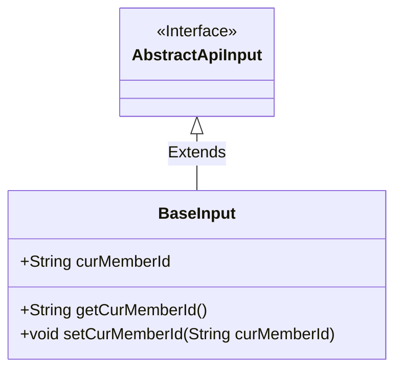
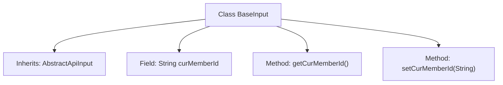

# Basic Information

|      |      |
|------|------|
| Name | BaseInput |
| Language | .java |
| Code Path | WeFe/manager/manager-service/src/main/java/com/welab/wefe/manager/service/dto/base/BaseInput.java |
| Package Name | com.welab.wefe.manager.service.dto.base |
| Dependencies | ['com.welab.wefe.common.web.dto.AbstractApiInput'] |
| Brief Description | The BaseInput class inherits from AbstractApiInput and includes the required field curMemberId along with its getter and setter methods. |

# Description

The BaseInput class inherits from AbstractApiInput and contains a member variable curMemberId of string type. This class provides getCurMemberId and setCurMemberId methods to retrieve and set the value of this variable. The comments indicate that this variable may require non-null validation.

# Class Summary

| Name   | Type  | Description |
|-------|------|-------------|
| BaseInput | class | The BaseInput class inherits from AbstractApiInput and includes the required field curMemberId along with its getter and setter methods. |

## Class BaseInput

|      |      |
|------|------|
| Access Modifier | public |
| Type | class |
| Name | BaseInput |
| Description | The BaseInput class inherits from AbstractApiInput and includes the required field curMemberId along with its getter and setter methods. |

### UML Class Diagram

This class diagram illustrates the structure where the BaseInput class extends the AbstractApiInput interface. BaseInput contains a public String field curMemberId along with corresponding getter and setter methods. Through inheritance, BaseInput implements the specifications defined by the AbstractApiInput interface for handling basic input data, where the curMemberId field is likely used to store current member identification information.

### Internal Method Call Graph

This flowchart illustrates the structure of the BaseInput class, which inherits from the AbstractApiInput class and contains a String-type field curMemberId, along with corresponding getter and setter methods. The class diagram clearly presents the inheritance relationship and member methods, where getCurMemberId() is used to retrieve the current member ID, and setCurMemberId(String) is used to set the value. This structure is a typical Java Bean pattern, suitable for data encapsulation and property access control.

### Field List

| Name  | Type  | Description |
|-------|-------|------|
| curMemberId | String | Declare a public string variable curMemberId to store the current member ID. |

### Method List

| Name  | Type  | Description |
|-------|-------|------|
| getCurMemberId | String | Methods to obtain the current member ID, returns the member ID string. |
| setCurMemberId | void | The method to set the current member ID, with the parameter being of string type. |

