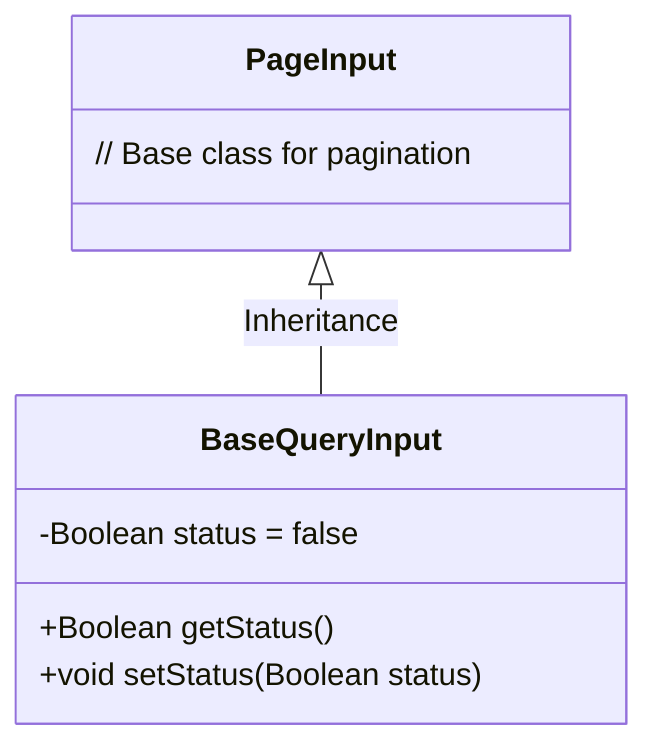
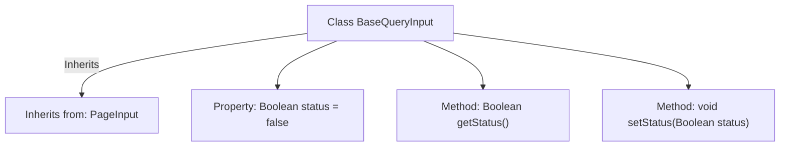

# Basic Information

|      |      |
|------|------|
| Name | BaseQueryInput |
| Language | .java |
| Code Path | WeFe/manager/manager-service/src/main/java/com/welab/wefe/manager/service/dto/base/BaseQueryInput.java |
| Package Name | com.welab.wefe.manager.service.dto.base |
| Dependencies | [] |
| Brief Description | BaseQueryInput extends PageInput, containing a Boolean status property along with its getter and setter methods. |

# Description

The BaseQueryInput class inherits from the PageInput class and includes a private boolean property named status, with a default value of false. It provides the getStatus method to retrieve the status value and the setStatus method to set the status value.

# Class Summary

| Name   | Type  | Description |
|-------|------|-------------|
| BaseQueryInput | class | BaseQueryInput extends PageInput, containing a Boolean status property along with its getter and setter methods. |

## Class BaseQueryInput

|      |      |
|------|------|
| Access Modifier | public |
| Type | class |
| Name | BaseQueryInput |
| Description | BaseQueryInput extends PageInput, containing a Boolean status property along with its getter and setter methods. |

### UML Class Diagram

This class diagram illustrates the inheritance relationship where BaseQueryInput extends PageInput. As the child class, BaseQueryInput adds a private Boolean field `status` (default value: false) along with corresponding public getter and setter methods. PageInput, as the parent class, is represented here merely to indicate the base class's existence without expanding its specific members. This design extends the basic pagination query functionality, allowing additional status filtering conditions via the `status` field.

### Internal Method Call Graph

This flowchart illustrates the structure of the BaseQueryInput class, which inherits from the PageInput class. It contains a Boolean-type status property and two methods: getStatus() for retrieving the status value and setStatus() for setting the status value. The property is initialized to false by default, reflecting the basic data encapsulation characteristics of the class.

### Field List

| Name  | Type  | Description |
|-------|-------|------|
| status = false | Boolean | The private boolean variable status has an initial value of false. |

### Method List

| Name  | Type  | Description |
|-------|-------|------|
| getStatus | Boolean | This is a Java method that returns the boolean value of the status variable. |
| setStatus | void | Methods for setting boolean state values, assigning input parameters to the state properties of the object. |

