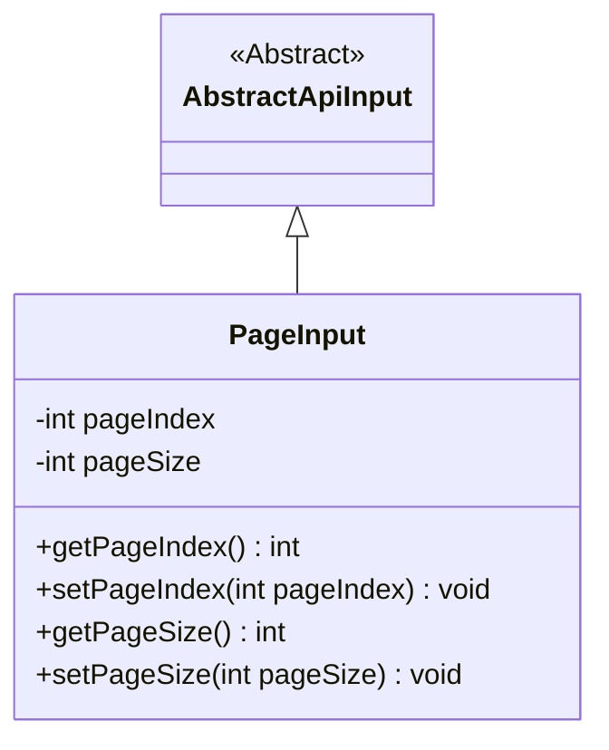
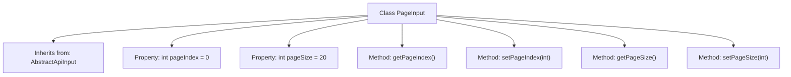

# Basic Information

|      |      |
|------|------|
| Name | PageInput |
| Language | .java |
| Code Path | WeFe/manager/manager-service/src/main/java/com/welab/wefe/manager/service/dto/base/PageInput.java |
| Package Name | com.welab.wefe.manager.service.dto.base |
| Dependencies | ['com.welab.wefe.common.web.dto.AbstractApiInput'] |
| Brief Description | Pagination input class, containing page number and page size attributes along with their corresponding getter/setter methods. |

# Description

The PageInput class inherits from AbstractApiInput and is used to encapsulate pagination query parameters. This class includes two private integer fields: pageIndex represents the current page number with a default value of 0, and pageSize represents the number of records per page with a default value of 20. It provides the getPageIndex and setPageIndex methods for retrieving and setting the page number, as well as the getPageSize and setPageSize methods for retrieving and setting the number of records per page.

# Class Summary

| Name   | Type  | Description |
|-------|------|-------------|
| PageInput | class | Pagination input class, containing page number and page size attributes along with their corresponding getter/setter methods. |

## Class PageInput

|      |      |
|------|------|
| Access Modifier | public |
| Type | class |
| Name | PageInput |
| Description | Pagination input class, containing page number and page size attributes along with their corresponding getter/setter methods. |

### UML Class Diagram

This code demonstrates the structure of a pagination input class `PageInput` inheriting from the abstract class `AbstractApiInput`. `PageInput` contains two private fields, `pageIndex` and `pageSize`, representing the page number and page size, with default values of 0 and 20, respectively. The class provides four public methods for getting and setting these two fields. The class diagram clearly illustrates the inheritance relationship, showing `PageInput` as a subclass of `AbstractApiInput`, along with its encapsulated pagination-related properties and access methods.

### Internal Method Call Graph

This code defines a `PageInput` class that inherits from `AbstractApiInput`, designed to handle pagination parameters. The class includes two private properties, `pageIndex` and `pageSize`, representing the current page number and items per page, with default values of 0 and 20 respectively. It provides four public methods for getting and setting these properties. The class features a clean design, primarily used to encapsulate input parameters for paginated queries.

### Field List

| Name  | Type  | Description |
|-------|-------|------|
| pageIndex = 0 | int | The private integer variable pageIndex is initialized to 0. |
| pageSize = 20 | int | Define a private integer variable pageSize with an initial value of 20. |

### Method List

| Name  | Type  | Description |
|-------|-------|------|
| setPageIndex | void | Set the current page number to the specified value. |
| getPageSize | int | Methods to obtain the current page size, returning an integer value pageSize. |
| setPageSize | void | The method to set the number of items displayed per page, with the parameter being pageSize. |
| getPageIndex | int | Methods to obtain the current page number value, returning the integer variable pageIndex. |

