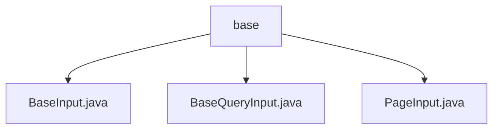

# Basic Information

|      |      |
|------|------|
| Name | base |
| Language | .java |
| Code Path | WeFe/manager/manager-service/src/main/java/com/welab/wefe/manager/service/dto/base |
| Package Name | docs.manager.manager-service.src.main.java.com.welab.wefe.manager.service.dto.base |
| Brief Description | The BaseInput class inherits from AbstractApiInput and contains a string variable curMemberId, which requires non-null validation. BaseQueryInput inherits from PageInput and contains a boolean status variable, defaulting to false. PageInput inherits from AbstractApiInput and contains integer variables pageIndex and pageSize, defaulting to 0 and 20 respectively. |

# Description

## Overview  
The core responsibility of this module is to provide encapsulated basic input parameters, supporting member ID management, status queries, and pagination control. The interface specifications include three types: BaseInput provides member ID access (with non-null validation required), BaseQueryInput manages boolean status fields (defaulting to false), and PageInput standardizes pagination parameters (defaulting to pageIndex=0/pageSize=20). Key data structures include the string curMemberId, boolean status, and integer pageIndex/pageSize. There are no external dependencies. For example, PageInput implements default value delegation for pagination parameters through an inheritance chain.

## Primary Business Scenarios  
The module is suitable for combined scenarios involving paginated queries and member data processing, similar to the DTO factory pattern. A typical workflow involves: setting pagination parameters via PageInput, adding status filtering conditions with BaseQueryInput, and carrying member identity identifiers with BaseInput. For instance, when querying paginated data for a member, the three can collaboratively construct complete query parameters. All APIs expose fields through Getter/Setter methods, adhering to POJO specifications.

### Package Internal Structure View

This flowchart illustrates the structure of the base package within the manager-service module of the WeFe project. The base package contains three DTO classes: BaseInput.java, BaseQueryInput.java, and PageInput.java, all of which are implementations of foundational input classes. This structure reflects the organization of basic data transfer objects in the project, providing a unified input specification for other business modules.

# File List

| Name   | Type  | Description |
|-------|------|-------------|
| [BaseInput.java](BaseInput.md) | file | The BaseInput class inherits from AbstractApiInput and includes the required field curMemberId along with its getter and setter methods. |
| [BaseQueryInput.java](BaseQueryInput.md) | file | BaseQueryInput extends PageInput, containing a boolean status property along with its getter and setter methods. |
| [PageInput.java](PageInput.md) | file | Pagination input class, containing page number and page size attributes along with their corresponding getter/setter methods. |

