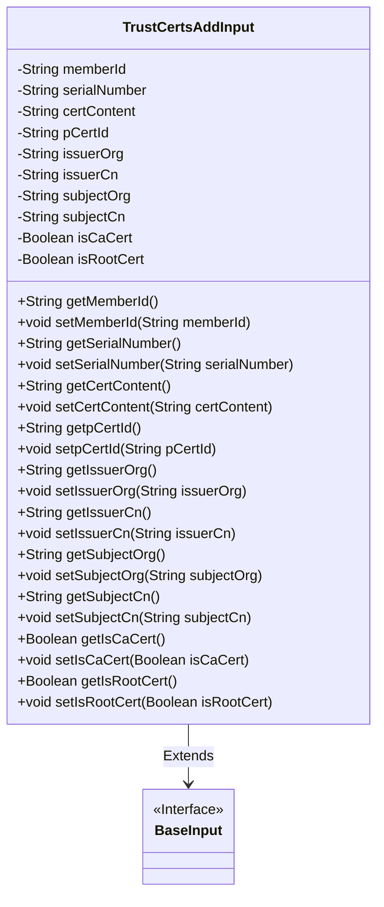
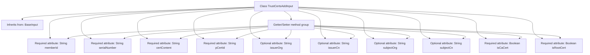

# Basic Information

|      |      |
|------|------|
| Name | TrustCertsAddInput |
| Language | .java |
| Code Path | WeFe/manager/manager-service/src/main/java/com/welab/wefe/manager/service/dto/cert/TrustCertsAddInput.java |
| Package Name | com.welab.wefe.manager.service.dto.cert |
| Dependencies | ['com.welab.wefe.common.fieldvalidate.annotation.Check', 'com.welab.wefe.manager.service.dto.base.BaseInput'] |
| Brief Description | The TrustCertsAddInput class inherits from BaseInput and includes required fields memberId, serialNumber, certContent, pCertId, isCaCert, isRootCert, as well as optional fields issuerOrg, issuerCn, subjectOrg, subjectCn. |

# Description

The `TrustCertsAddInput` class inherits from `BaseInput` and includes multiple member variables along with their corresponding getter/setter methods. Required fields, marked by the `@Check` annotation, consist of `memberId`, `serialNumber`, `certContent`, `pCertId`, `isCaCert`, and `isRootCert`. Optional fields include `issuerOrg`, `issuerCn`, `subjectOrg`, and `subjectCn`. This class is designed to handle trust certificate addition operations, encompassing attributes such as certificate content, serial number, issuer, and subject information.

# Class Summary

| Name   | Type  | Description |
|-------|------|-------------|
| TrustCertsAddInput | class | The TrustCertsAddInput class includes mandatory fields such as member ID, serial number, and certificate content, as well as optional fields like issuer and subject, used for adding trusted certificates. |

## Class TrustCertsAddInput

|      |      |
|------|------|
| Access Modifier | public |
| Type | class |
| Name | TrustCertsAddInput |
| Description | The TrustCertsAddInput class includes mandatory fields such as member ID, serial number, and certificate content, as well as optional fields like issuer and subject, used for adding trusted certificates. |

### UML Class Diagram

Class Diagram Description:
The TrustCertsAddInput class extends the BaseInput interface and is primarily used for managing trusted certificate addition operations. It contains multiple private fields such as memberId, serialNumber, certContent, etc., with public getter and setter methods for access and modification. Certain fields are marked as mandatory through @Check annotations, including memberId and serialNumber. This class is designed to handle certificate-related data input and validation.

### Internal Method Call Graph

This code defines a class named TrustCertsAddInput, which inherits from the BaseInput class. The class is primarily used for handling trust certificate addition operations and includes multiple attributes. Among them, memberId, serialNumber, certContent, pCertId, isCaCert, and isRootCert are required fields, while others such as issuerOrg and issuerCn are optional. Each attribute has corresponding getter and setter methods for accessing and modifying the properties. The class has a clear structure, with required fields marked via annotations, making it suitable for form data validation and certificate management scenarios.

### Field List

| Name  | Type  | Description |
|-------|-------|------|
| issuerOrg | String | Declare a private string variable issuerOrg to store issuer organization information. |
| isCaCert | Boolean | The code snippet defines a private boolean variable named isCaCert, annotated with a mandatory check requirement. |
| serialNumber | String | Required field: serialNumber. |
| certContent | String | The code snippet defines a private string variable certContent and marks this field as required using the @Check annotation. |
| subjectCn | String | The private string variable subjectCn is used to store Chinese subject information. |
| memberId | String | The code snippet defines a private string variable memberId and marks this field as required using the @Check annotation. |
| pCertId | String | The code defines a private string variable named pCertId and marks it as requiring validation. |
| issuerCn | String | Declare a private string variable issuerCn to store the common name of the certificate issuer. |
| isRootCert | Boolean | The code snippet defines a private boolean variable named isRootCert and marks it as a required field using the @Check annotation. |
| subjectOrg | String | The private string variable subjectOrg is used to store organization subject information. |

### Method List

| Name  | Type  | Description |
|-------|-------|------|
| getCertContent | String | The method getCertContent returns the value of the string certContent. |
| getMemberId | String | This is a Java method that returns a member ID string. The method is named getMemberId, takes no parameters, and directly returns the value of the member variable memberId. |
| getSubjectOrg | String | Methods to obtain the subjectOrg string. |
| setSerialNumber | void | This is a Java method used to set the serial number property of an object. The method takes a string parameter serialNumber and assigns it to the serialNumber field of the object. |
| getSerialNumber | String | Methods to obtain the serial number, returns a string-type serialNumber. |
| getSubjectCn | String | Methods to obtain the Chinese topic name, returning the value of the variable subjectCn. |
| getIsCaCert | Boolean | This is a Java method that returns a boolean value isCaCert, indicating whether it is a CA certificate. |
| setSubjectCn | void | This is a Java method used to set the Chinese subject property of an object. The method is named setSubjectCn, which takes a String parameter subjectCn and assigns it to the subjectCn member variable of the object. |
| setSubjectOrg | void | Methods for organizing strings by setting themes. |
| setpCertId | void | This is a Java method used to set the value of the pCertId property of an object. The method takes a string parameter pCertId and assigns it to the property of the same name in the current object. |
| getpCertId | String | The method returns the pCertId field value of string type. |
| getIssuerOrg | String | Get the string method of the publisher organization. |
| setCertContent | void | The method to set the certificate content assigns the input string to the class member variable certContent. |
| setIssuerOrg | void | Method for setting the string value of the issuing authority. |
| setMemberId | void | Methods for setting member ID, which assigns the passed string parameter to the class's member variable memberId. |
| setIssuerCn | void | Java Method: Set the string value of the certificate issuer common name (issuerCn). |
| getIssuerCn | String | Method to obtain the issuer's common name, returns a string issuerCn. |
| setIsCaCert | void | Method to set whether the certificate is a CA certificate, with a boolean parameter. |
| getIsRootCert | Boolean | A boolean method to obtain the root certificate status. |
| setIsRootCert | void | Method to set the root certificate status, with a boolean parameter. |

