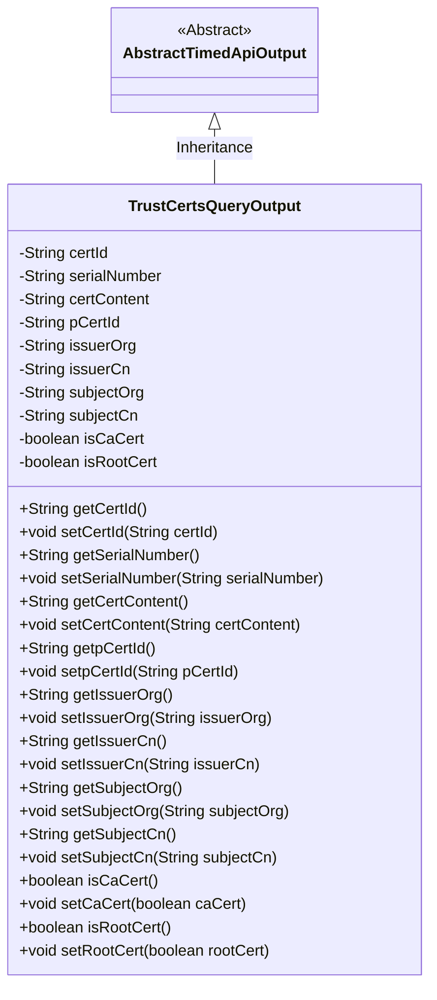

# Basic Information

|      |      |
|------|------|
| Name | TrustCertsQueryOutput |
| Language | .java |
| Code Path | WeFe/manager/manager-service/src/main/java/com/welab/wefe/manager/service/dto/cert/TrustCertsQueryOutput.java |
| Package Name | com.welab.wefe.manager.service.dto.cert |
| Dependencies | ['com.welab.wefe.common.web.dto.AbstractTimedApiOutput'] |
| Brief Description | The TrustCertsQueryOutput class inherits from AbstractTimedApiOutput and includes certificate ID, serial number, content, parent certificate ID, issuer and subject information, as well as CA/root certificate identifiers. |

# Description

The `TrustCertsQueryOutput` class inherits from `AbstractTimedApiOutput` and is used to represent the output of a trust certificate query. This class includes multiple fields, such as certificate ID, serial number, certificate content, parent certificate ID, issuer organization, issuer common name, subject organization, and subject common name. Additionally, it contains two boolean-type fields to indicate whether it is a CA certificate and a root certificate. Each field has corresponding getter and setter methods for retrieving and setting the field values.

# Class Summary

| Name   | Type  | Description |
|-------|------|-------------|
| TrustCertsQueryOutput | class | The TrustCertsQueryOutput class extends AbstractTimedApiOutput, containing fields such as certificate ID, serial number, content, issuer, subject, and CA/root identification flags, along with their corresponding getter/setter methods. |

## Class TrustCertsQueryOutput

|      |      |
|------|------|
| Access Modifier | public |
| Type | class |
| Name | TrustCertsQueryOutput |
| Description | The TrustCertsQueryOutput class extends AbstractTimedApiOutput, containing fields such as certificate ID, serial number, content, issuer, subject, and CA/root identification flags, along with their corresponding getter/setter methods. |

### UML Class Diagram

### Internal Method Call Graph

```mermaid
graph TD
    A["Class TrustCertsQueryOutput"]
    B["Inherits from: AbstractTimedApiOutput"]
    C["Property: String certId"]
    D["Property: String serialNumber"]
    E["Property: String certContent"]
    F["Property: String pCertId"]
    G["Property: String issuerOrg"]
    H["Property: String issuerCn"]
    I["Property: String subjectOrg"]
    J["Property: String subjectCn"]
    K["Property: boolean isCaCert"]
    L["Property: boolean isRootCert"]
    M["Method: getCertId/setCertId"]
    N["Method: getSerialNumber/setSerialNumber"]
    O["Method: getCertContent/setCertContent"]
    P["Method: getpCertId/setpCertId"]
    Q["Method: getIssuerOrg/setIssuerOrg"]
    R["Method: getIssuerCn/setIssuerCn"]
    S["Method: getSubjectOrg/setSubjectOrg"]
    T["Method: getSubjectCn/setSubjectCn"]
    U["Method: isCaCert/setCaCert"]
    V["Method: isRootCert/setRootCert"]

    A --> B
    A --> C
    A --> D
    A --> E
    A --> F
    A --> G
    A --> H
    A --> I
    A --> J
    A --> K
    A --> L
    A --> M
    A --> N
    A --> O
    A --> P
    A --> Q
    A --> R
    A --> S
    A --> T
    A --> U
    A --> V
```

This code defines a class named TrustCertsQueryOutput, which inherits from AbstractTimedApiOutput and is primarily used for storing and querying digital certificate-related information. The class contains 10 private properties, representing certificate ID, serial number, certificate content, parent certificate ID, issuer organization, issuer common name, subject organization, subject common name, whether it is a CA certificate, and whether it is a root certificate. Corresponding getter and setter methods are provided for each property to enable property reading and modification. This class is a typical Data Transfer Object (DTO) used for transmitting certificate query results between systems.

### Field List

| Name  | Type  | Description |
|-------|-------|------|
| subjectCn | String | The private string-type variable subjectCn is used to store Chinese subject information. |
| pCertId | String | The private string variable pCertId is used to store the certificate ID. |
| serialNumber | String | The private string type variable serialNumber. |
| issuerCn | String | Declare a private string variable issuerCn to store the common name of the certificate issuer. |
| issuerOrg | String | Declare a private string variable issuerOrg to store issuer organization information. |
| certContent | String | The private string variable certContent is used to store certificate content. |
| certId | String | The private string variable certId is used to store the certificate ID. |
| isRootCert | boolean | The field isRootCert indicates whether it is a root certificate. |
| isCaCert | boolean | Declare a boolean variable isCaCert to indicate whether it is a CA certificate. |
| subjectOrg | String | Declare a private string variable subjectOrg. |

### Method List

| Name  | Type  | Description |
|-------|-------|------|
| isRootCert | boolean | This method returns a boolean value indicating whether the current certificate is a root certificate. |
| setCertContent | void | The method to set certificate content assigns the input string to the class's certContent member variable. |
| setSubjectOrg | void | This is a Java method used to set the subjectOrg property value of an object. The method takes a string parameter and assigns it to the subjectOrg member variable of the object. |
| setpCertId | void | This is a Java method used to set the value of the class member variable pCertId. The method takes a string parameter pCertId and assigns it to the member variable of the same name in the current object. |
| getSerialNumber | String | Methods to obtain the serial number, returns the value of the serialNumber variable as a string type. |
| setCertId | void | The method to set the certificate ID assigns the parameter certId to the certId property of the current object. |
| getpCertId | String | This is a Java method that returns the value of the private variable pCertId. The method is named getpCertId, takes no parameters, and has a return type of String. |
| setRootCert | void | The method to set the root certificate status, where the parameter `rootCert` determines whether it is a root certificate. |
| getCertContent | String | Public method to obtain certificate content, returns a string-type variable certContent. |
| setSubjectCn | void | This is a Java method used to set the Chinese subject property of an object. The method is named setSubjectCn, which takes a String parameter subjectCn and assigns it to the member variable of the same name in the object. |
| setIssuerCn | void | The method setIssuerCn is used to set the value of the issuerCn field, with the parameter being of type String. |
| isCaCert | boolean | This is a Java method that returns a boolean value indicating whether it is a CA certificate. |
| setSerialNumber | void | This is a Java method used to set the serial number property of an object. The method takes a string parameter serialNumber and assigns it to the serialNumber member variable of the object. |
| getCertId | String | The method getCertId returns the certId string. |
| getSubjectOrg | String | Methods to obtain the value of the subjectOrg string. |
| getIssuerCn | String | Method to obtain the issuer's common name, returns the issuerCn string. |
| setIssuerOrg | void | Method for setting the certificate authority name, which assigns the input string to the class member variable issuerOrg. |
| getIssuerOrg | String | The method returns the issuerOrg string with no parameters. |
| getSubjectCn | String | This method returns the value of a string variable named subjectCn. |
| setCaCert | void | Method to set whether the certificate is a CA certificate, where the parameter caCert determines the status. |

