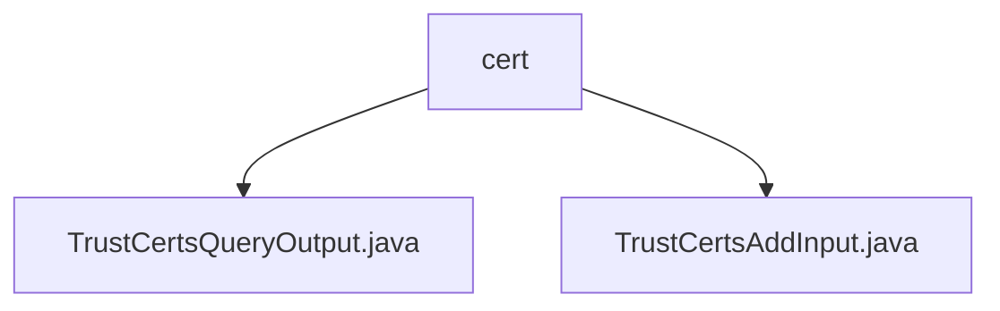

# Basic Information

|      |      |
|------|------|
| Name | cert |
| Language | .java |
| Code Path | WeFe/manager/manager-service/src/main/java/com/welab/wefe/manager/service/dto/cert |
| Package Name | docs.manager.manager-service.src.main.java.com.welab.wefe.manager.service.dto.cert |
| Brief Description | The TrustCertsQueryOutput class inherits from AbstractTimedApiOutput and includes fields such as certificate ID, serial number, content, along with their getter/setter methods. The TrustCertsAddInput class inherits from BaseInput and contains both required and optional fields, designed for certificate addition operations. |

# Description

## Overview  
The core responsibility of this module is to manage the lifecycle of trust certificates, including certificate query and addition operations. The interface specification follows the standard DTO pattern, providing read-write capabilities for basic certificate information (such as ID, serial number, content) and hierarchical relationships (parent certificate ID, CA/root flag). Key data structures include certificate entity attributes (e.g., issuerOrg/subjectOrg) and validation flags (isCaCert/isRootCert). External dependencies are limited to Java basic annotations (e.g., @Check). For example, TrustCertsQueryOutput supports timestamp inheritance, while TrustCertsAddInput implements mandatory field validation.

## Key Business Scenarios  
The module supports end-to-end certificate management, resembling a lightweight implementation of a PKI system. Business processes cover certificate registration (mandatory field validation) and query (hierarchical relationship parsing). The interaction model adopts standard input-output DTOs, such as enforcing validation of memberId and certContent during addition. Typical applications include CA certificate chain maintenance, where the pCertId field constructs a tree structure. API types focus on CRUD operations, with TrustCertsAddInput corresponding to creation scenarios.

### Package Internal Structure View

This flowchart illustrates two DTO files under the cert directory in the manager-service project: TrustCertsQueryOutput.java and TrustCertsAddInput.java. Both files reside at the same level within the cert directory and are used for handling certificate-related data transfer operations. The diagram clearly depicts the hierarchical relationship between the files and directory, conforming to standard Java project directory structure.

# File List

| Name   | Type  | Description |
|-------|------|-------------|
| [TrustCertsQueryOutput.java](TrustCertsQueryOutput.md) | file | The `TrustCertsQueryOutput` class inherits from `AbstractTimedApiOutput` and contains certificate ID, serial number, content, parent certificate ID, issuer and subject information, as well as CA/root certificate identifiers. |
| [TrustCertsAddInput.java](TrustCertsAddInput.md) | file | The TrustCertsAddInput class inherits from BaseInput and includes required fields memberId, serialNumber, certContent, pCertId, isCaCert, isRootCert, as well as optional fields issuerOrg, issuerCn, subjectOrg, subjectCn. |

