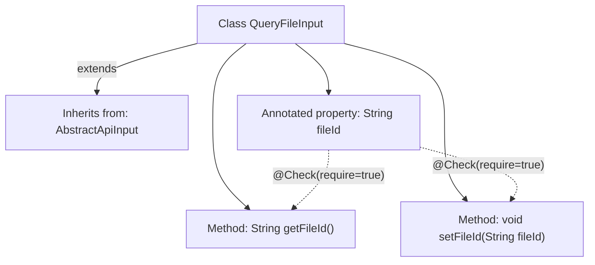

# Basic Information

|      |      |
|------|------|
| Name | QueryFileInput |
| Language | .java |
| Code Path | WeFe/manager/manager-service/src/main/java/com/welab/wefe/manager/service/dto/common/QueryFileInput.java |
| Package Name | com.welab.wefe.manager.service.dto.common |
| Dependencies | ['com.welab.wefe.common.fieldvalidate.annotation.Check', 'com.welab.wefe.common.web.dto.AbstractApiInput'] |
| Brief Description | The QueryFileInput class inherits from AbstractApiInput and includes the mandatory fileId field along with its getter and setter methods. |

# Description

This code defines a Java class named `QueryFileInput`, which extends the `AbstractApiInput` class. The class contains a private string property `fileId`, marked as a required field via the `@Check` annotation. It provides two public methods, `getFileId` and `setFileId`, for retrieving and setting the value of the `fileId` property. This class is primarily used to handle input parameters for file queries.

# Class Summary

| Name   | Type  | Description |
|-------|------|-------------|
| QueryFileInput | class | The QueryFileInput class inherits from AbstractApiInput and includes the mandatory fileId field along with its getter and setter methods. |


## Class QueryFileInput

|      |      |
|------|------|
| Access Modifier | public |
| Type | class |
| Name | QueryFileInput |
| Description | The QueryFileInput class inherits from AbstractApiInput and includes the mandatory fileId field along with its getter and setter methods. |


### UML Class Diagram

```mermaid
classDiagram
    class AbstractApiInput {
        <<Abstract>>
    }
    class QueryFileInput {
        -String fileId
        +String getFileId()
        +void setFileId(String fileId)
    }
    AbstractApiInput <|-- QueryFileInput // Inheritance relationship
```

This class diagram illustrates the structure where the QueryFileInput class inherits from the abstract class AbstractApiInput. QueryFileInput contains a private string attribute fileId (with @Check validation annotation) and corresponding public getter/setter methods. The <|-- arrow explicitly denotes the inheritance relationship, adhering to the object-oriented design pattern where a subclass extends a parent class. The diagram clearly reflects the core data structures and hierarchical relationships defined in the code.


### Internal Method Call Graph



This code demonstrates a QueryFileInput class that inherits from AbstractApiInput, with its core functionality being the management of a validated file ID property. The class contains a non-null fileId field (enforced by @Check annotation) along with standard getter/setter methods. The flowchart clearly presents the inheritance relationship, the association between property validation and method calls, reflecting a typical Java Bean design pattern.

### Field List

| Name  | Type  | Description |
|-------|-------|------|
| fileId | String | The code snippet defines a private string variable named `fileId`, annotated with a mandatory validation annotation `@Check(require = true)`. |

### Method List

| Name  | Type  | Description |
|-------|-------|------|
| getFileId | String | This is a Java method that returns the value of the string-type variable fileId. |
| setFileId | void | The method `setFileId` is used to set the file ID, assigning the passed `fileId` to the `fileId` property of the current object. |


