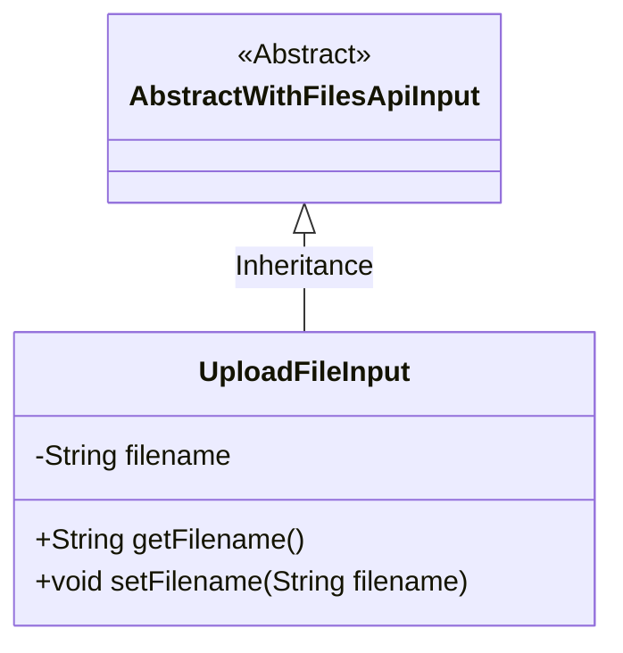
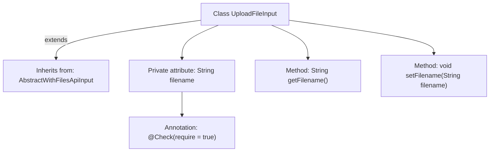

# Basic Information

|      |      |
|------|------|
| Name | UploadFileInput |
| Language | .java |
| Code Path | WeFe/manager/manager-service/src/main/java/com/welab/wefe/manager/service/dto/common/UploadFileInput.java |
| Package Name | com.welab.wefe.manager.service.dto.common |
| Dependencies | ['com.welab.wefe.common.fieldvalidate.annotation.Check', 'com.welab.wefe.common.web.dto.AbstractWithFilesApiInput'] |
| Brief Description | File upload input class, inherits from the built-in file API abstract class, includes mandatory filename property and its getter and setter methods. |

# Description

This is a Java class named UploadFileInput, which extends AbstractWithFilesApiInput. The class contains a private string property called filename, marked as a required field by the @Check annotation. It provides two public methods, getFilename and setFilename, for retrieving and setting the value of the filename property. This class is primarily used to handle input parameters for file uploads.

# Class Summary

| Name   | Type  | Description |
|-------|------|-------------|
| UploadFileInput | class | File upload input class, inherits from the built-in file API input base class, includes mandatory filename attribute and corresponding getter and setter methods. |

## Class UploadFileInput

|      |      |
|------|------|
| Access Modifier | public |
| Type | class |
| Name | UploadFileInput |
| Description | File upload input class, inherits from the built-in file API input base class, includes mandatory filename attribute and corresponding getter and setter methods. |

### UML Class Diagram

This class diagram illustrates the inheritance relationship where UploadFileInput extends the abstract class AbstractWithFilesApiInput. UploadFileInput contains a private field `filename` and corresponding getter/setter methods. The `<|--` arrow explicitly denotes the inheritance, with AbstractWithFilesApiInput marked as an abstract class. The diagram clearly presents the class hierarchy and member methods, conforming to the fundamental characteristics of inheritance in object-oriented design.

### Internal Method Call Graph

This flowchart illustrates the structure of the UploadFileInput class, which inherits from AbstractWithFilesApiInput. It contains a private attribute 'filename' annotated with @Check, along with corresponding getter and setter methods. The class diagram clearly presents the inheritance relationship, attribute modifiers, and method definitions, where the annotation marks a mandatory constraint, and the methods implement access control for the private attribute. The entire design complies with JavaBean specifications and is suitable for parameter encapsulation in file upload scenarios.

### Field List

| Name  | Type  | Description |
|-------|-------|------|
| filename | String | The code snippet defines a private string variable named filename and marks it as a required field using the @Check annotation. |

### Method List

| Name  | Type  | Description |
|-------|-------|------|
| getFilename | String | Public method to get the filename, returns the value of the filename variable as a string. |
| setFilename | void | A public method to set the filename, which assigns the input string to the filename property of the class. |

