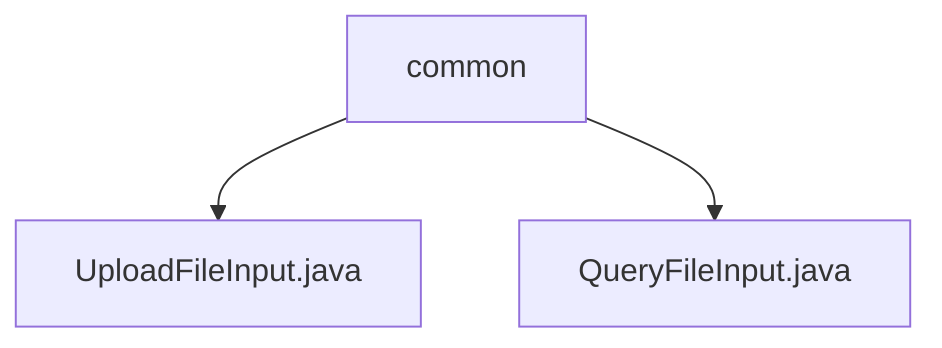

# Basic Information

|      |      |
|------|------|
| Name | common |
| Language | .java |
| Code Path | WeFe/manager/manager-service/src/main/java/com/welab/wefe/manager/service/dto/common |
| Package Name | docs.manager.manager-service.src.main.java.com.welab.wefe.manager.service.dto.common |
| Brief Description | The UploadFileInput class inherits from AbstractWithFilesApiInput, containing a required filename attribute and get/set methods, used for file upload input. The QueryFileInput class inherits from AbstractApiInput, containing a required fileId attribute and get/set methods, used for file query input. |

# Description

## Overview  
The core responsibility of this module is to handle input parameters for file-related operations, including file upload and query functionalities. The interface specification uniformly adopts Java class encapsulation for input parameters, marks mandatory fields with the @Check annotation, and provides standard Getter/Setter methods. Key data structures include two string attributes: filename (file name) and fileId (file unique identifier). The only external dependencies are the Java standard library and the custom annotation @Check. For example, UploadFileInput handles the upload file name, while QueryFileInput manages file ID queries.  

## Primary Business Scenarios  
The module supports two typical scenarios: file upload and query, resembling the entry layer of a resource management system. In the business process, clients upload files by setting the filename or query file metadata using the fileId. The interaction pattern employs POJO parameter encapsulation in both cases. For instance, uploads require validation of a non-empty filename, while queries necessitate verification of fileId validity. The overall functionality comprehensively covers input validation requirements for basic file operations, with the API type adhering to standard DTO layer design.

### Package Internal Structure View

This flowchart illustrates the structure of two DTO files under the common directory in the manager-service project. The top-level node represents the common directory, which contains two Java files: UploadFileInput.java and QueryFileInput.java. Both files are directly under the common directory level without any deeper nesting relationship.

# File List

| Name   | Type  | Description |
|-------|------|-------------|
| [UploadFileInput.java](UploadFileInput.md) | file | File upload input class, inherits from the built-in file API abstract class, includes mandatory filename property and its getter and setter methods. |
| [QueryFileInput.java](QueryFileInput.md) | file | The QueryFileInput class inherits from AbstractApiInput and includes the mandatory fileId field along with its getter and setter methods. |

