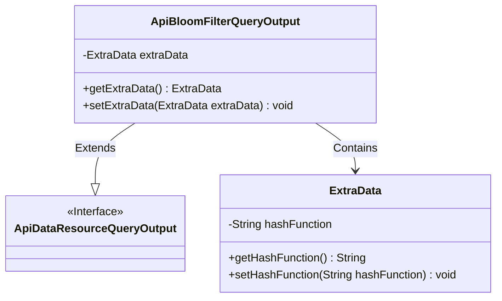
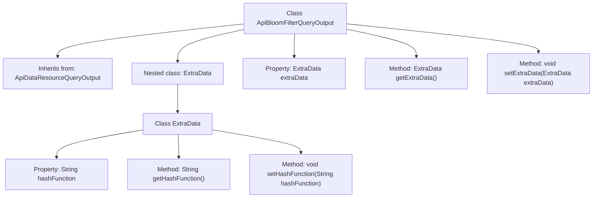

# Basic Information

|      |      |
|------|------|
| Name | ApiBloomFilterQueryOutput |
| Language | .java |
| Code Path | WeFe/manager/manager-service/src/main/java/com/welab/wefe/manager/service/dto/dataresource/ApiBloomFilterQueryOutput.java |
| Package Name | com.welab.wefe.manager.service.dto.dataresource |
| Dependencies | [] |
| Brief Description | ApiBloomFilterQueryOutput extends ApiDataResourceQueryOutput, containing the ExtraData inner class, and provides getter/setter methods for hashFunction. |

# Description

The `ApiBloomFilterQueryOutput` class inherits from `ApiDataResourceQueryOutput` and includes a private member variable named `extraData`, which is of the nested class type `ExtraData`. The `ExtraData` class has a string-type property `hashFunction` along with corresponding getter and setter methods. The `ApiBloomFilterQueryOutput` class also provides getter and setter methods for `extraData`.

# Class Summary

| Name   | Type  | Description |
|-------|------|-------------|
| ApiBloomFilterQueryOutput | class | ApiBloomFilterQueryOutput extends ApiDataResourceQueryOutput, includes the ExtraData inner class, and provides getter and setter methods for hashFunction. |

## Class ApiBloomFilterQueryOutput

|      |      |
|------|------|
| Access Modifier | public |
| Type | class |
| Name | ApiBloomFilterQueryOutput |
| Description | ApiBloomFilterQueryOutput extends ApiDataResourceQueryOutput, includes the ExtraData inner class, and provides getter and setter methods for hashFunction. |

### UML Class Diagram

This class diagram illustrates that ApiBloomFilterQueryOutput extends the interface ApiDataResourceQueryOutput and contains a nested class ExtraData. The ExtraData class encapsulates the hashFunction property with its accessor methods, while the main class manages the ExtraData instance through getters/setters. This design implements extended data storage functionality for Bloom filter query results, demonstrating the principle of favoring composition over inheritance.

### Internal Method Call Graph

This code defines an ApiBloomFilterQueryOutput class that inherits from ApiDataResourceQueryOutput and contains a nested ExtraData class. The main class provides accessor methods for the ExtraData object, while the nested class encapsulates the hashFunction property and its corresponding getter/setter methods. The flowchart clearly illustrates the class inheritance relationship, nested structure, and method invocation hierarchy, making it suitable for extending data encapsulation scenarios in Bloom filter query results.

### Field List

| Name  | Type  | Description |
|-------|-------|------|
| extraData | ExtraData | The private member variable `extraData`, of type `ExtraData`. |

### Method List

| Name  | Type  | Description |
|-------|-------|------|
| getExtraData | ExtraData | Methods to obtain additional data, returns the extraData object. |
| setExtraData | void | The method `setExtraData` is used to set the `extraData` property, with the parameter being an object of type `ExtraData`. |

