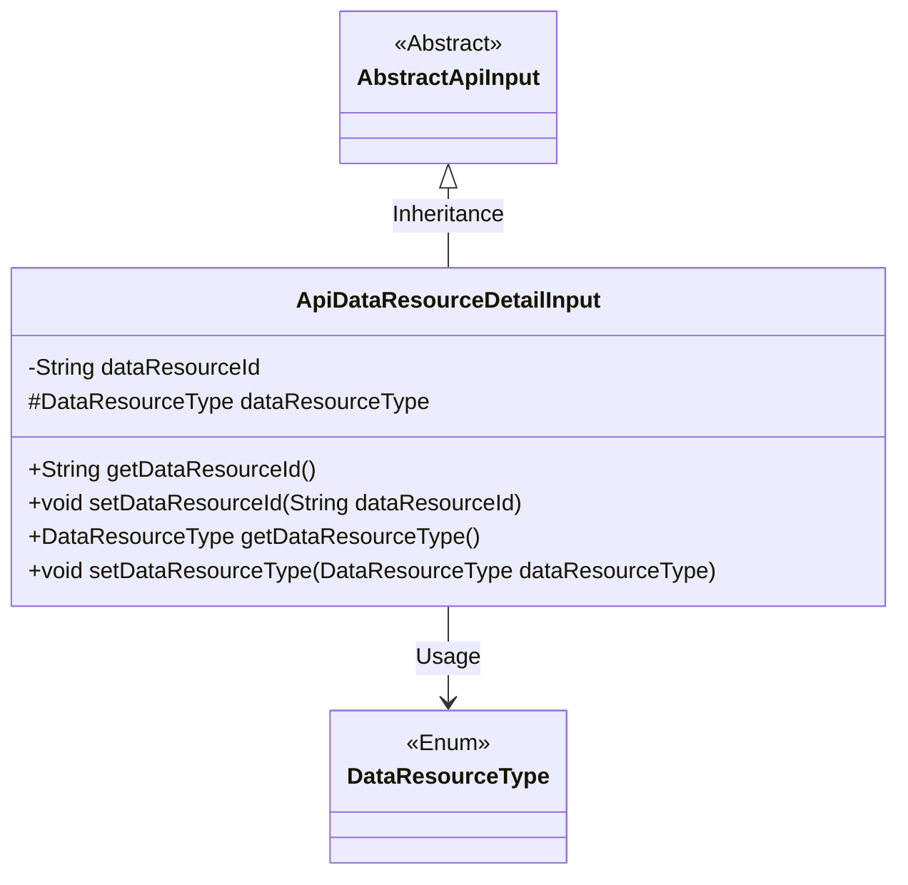
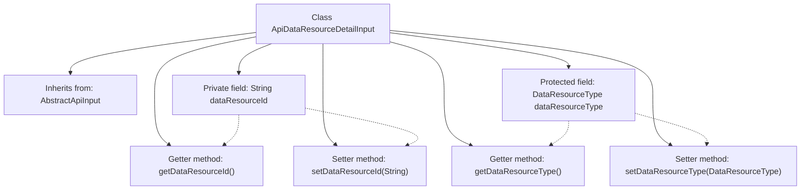

# Basic Information

|      |      |
|------|------|
| Name | ApiDataResourceDetailInput |
| Language | .java |
| Code Path | WeFe/manager/manager-service/src/main/java/com/welab/wefe/manager/service/dto/dataresource/ApiDataResourceDetailInput.java |
| Package Name | com.welab.wefe.manager.service.dto.dataresource |
| Dependencies | ['com.welab.wefe.common.fieldvalidate.annotation.Check', 'com.welab.wefe.common.web.dto.AbstractApiInput', 'com.welab.wefe.common.wefe.enums.DataResourceType'] |
| Brief Description | The ApiDataResourceDetailInput class extends AbstractApiInput, containing the required fields dataResourceId and dataResourceType, and provides getter and setter methods. |

# Description

The `ApiDataResourceDetailInput` class inherits from `AbstractApiInput` and includes two mandatory fields: `dataResourceId` (of type String) and `dataResourceType` (of type `DataResourceType`). The class provides getter and setter methods for these fields to retrieve and assign their values. The `dataResourceId` field is marked as mandatory with the `@Check` annotation, while the `dataResourceType` field is also marked as mandatory and has protected access permissions.

# Class Summary

| Name   | Type  | Description |
|-------|------|-------------|
| ApiDataResourceDetailInput | class | The ApiDataResourceDetailInput class extends AbstractApiInput, containing the required fields dataResourceId and dataResourceType, and provides getter and setter methods. |

## Class ApiDataResourceDetailInput

|      |      |
|------|------|
| Access Modifier | public |
| Type | class |
| Name | ApiDataResourceDetailInput |
| Description | The ApiDataResourceDetailInput class extends AbstractApiInput, containing the required fields dataResourceId and dataResourceType, and provides getter and setter methods. |

### UML Class Diagram

This code demonstrates an API data resource detail input class `ApiDataResourceDetailInput`, which inherits from the abstract class `AbstractApiInput`. The class contains two main attributes: `dataResourceId` (private String type) and `dataResourceType` (protected enum type), along with corresponding getter and setter methods. The `@Check` annotation marks these fields as mandatory. The class diagram clearly illustrates the inheritance and usage relationships, where `DataResourceType` is an enum type.

### Internal Method Call Graph

This code defines a class named ApiDataResourceDetailInput, which inherits from AbstractApiInput. The class contains two main fields: dataResourceId (String type) and dataResourceType (DataResourceType type), both marked as required fields with @Check annotations. Standard getter and setter methods are provided to access and modify these fields. The flowchart clearly illustrates the class inheritance, field definitions, and method associations, demonstrating the standard Java Bean design pattern.

### Field List

| Name  | Type  | Description |
|-------|-------|------|
| dataResourceType | DataResourceType | The code snippet defines a protected variable `dataResourceType` of type `DataResourceType`, and marks this field as a required item using the `@Check` annotation. |
| dataResourceId | String | Required field dataResourceId must pass validation. |

### Method List

| Name  | Type  | Description |
|-------|-------|------|
| getDataResourceId | String | Methods to obtain the data resource ID, returning a string-type value dataResourceId. |
| getDataResourceType | DataResourceType | This is a Java method that returns a member variable named dataResourceType, of type DataResourceType. |
| setDataResourceId | void | The method to set the data resource ID assigns the input parameter to the class member variable `dataResourceId`. |
| setDataResourceType | void | The method for setting the data resource type, with the parameter of type DataResourceType, assigns the value to the dataResourceType property of the current object. |

