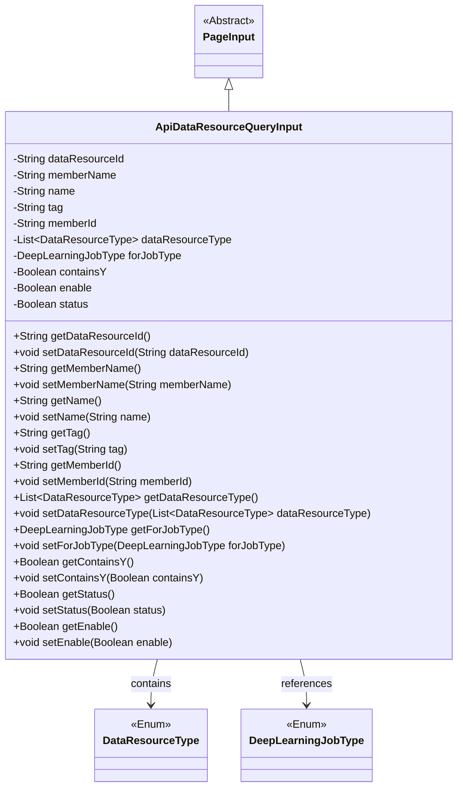
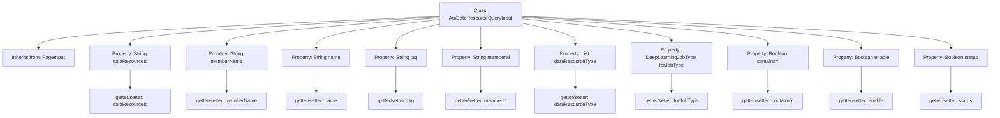

# Basic Information

|      |      |
|------|------|
| Name | ApiDataResourceQueryInput |
| Language | .java |
| Code Path | WeFe/manager/manager-service/src/main/java/com/welab/wefe/manager/service/dto/dataresource/ApiDataResourceQueryInput.java |
| Package Name | com.welab.wefe.manager.service.dto.dataresource |
| Dependencies | ['com.welab.wefe.common.wefe.enums.DataResourceType', 'com.welab.wefe.common.wefe.enums.DeepLearningJobType', 'com.welab.wefe.manager.service.dto.base.PageInput', 'java.util.List'] |
| Brief Description | The `ApiDataResourceQueryInput` class inherits from `PageInput` and includes fields such as data resource ID, member name, name, label, and member ID. It supports data type lists, deep learning task types, and status control. |

# Description

The ApiDataResourceQueryInput class inherits from PageInput and includes multiple query parameter fields: dataResourceId, memberName, name, tag, and memberId for identifying and filtering data resources; the dataResourceType list and forJobType enum specify the resource type and associated task type; the three boolean values containsY, enable, and status control the query conditions. All fields are accessed and modified via getter and setter methods.

# Class Summary

| Name   | Type  | Description |
|-------|------|-------------|
| ApiDataResourceQueryInput | class | The `ApiDataResourceQueryInput` class inherits from `PageInput` and includes fields such as data resource ID, member name, name, label, member ID, resource type list, job type, whether it contains Y, enabled status, and status, along with their corresponding getter and setter methods. |

## Class ApiDataResourceQueryInput

|      |      |
|------|------|
| Access Modifier | public |
| Type | class |
| Name | ApiDataResourceQueryInput |
| Description | The `ApiDataResourceQueryInput` class inherits from `PageInput` and includes fields such as data resource ID, member name, name, label, member ID, resource type list, job type, whether it contains Y, enabled status, and status, along with their corresponding getter and setter methods. |

### UML Class Diagram

This code demonstrates an API data resource query input class `ApiDataResourceQueryInput`, which inherits from the abstract class `PageInput`. The class includes multiple fields for storing query conditions such as resource ID, member name, tags, etc., along with corresponding getter and setter methods. The `dataResourceType` and `forJobType` fields reference the `DataResourceType` enum and `DeepLearningJobType` enum types respectively. This class is primarily used to encapsulate various filtering condition parameters for data resource queries.

### Internal Method Call Graph

This code illustrates a Java class named `ApiDataResourceQueryInput`, which inherits from the `PageInput` class. It includes multiple properties such as `dataResourceId`, `memberName`, `name`, etc., along with their corresponding getter and setter methods. These properties encompass string types, list types, and enum types, among others, designed to store and manipulate input parameters for API data resource queries. Each property is equipped with accessor methods to ensure data encapsulation and maintainability.

### Field List

| Name  | Type  | Description |
|-------|-------|------|
| dataResourceType | List<DataResourceType> | List of private data resource type variables. |
| enable | Boolean | The private boolean variable `enable` is used to control the state of the feature switch. |
| memberName | String | Declare a protected string-type member variable named memberName. |
| name | String | Declare a protected string-type variable name. |
| containsY | Boolean | Boolean variable indicating whether Y is included. |
| dataResourceId | String | Declare a protected string-type variable dataResourceId. |
| memberId | String | Member ID String Protection Field |
| tag | String | Declare a protected string variable tag. |
| status | Boolean | Boolean type state variables |
| forJobType | DeepLearningJobType | Private deep learning task type variable forJobType. |

### Method List

| Name  | Type  | Description |
|-------|-------|------|
| setMemberName | void | Methods for setting member names, which assign input parameters to the member variables of the class. |
| getForJobType | DeepLearningJobType | Methods to obtain the current deep learning task type, with the return value being a DeepLearningJobType object. |
| setDataResourceId | void | The method for setting the data resource ID assigns the input parameter to the class member variable `dataResourceId`. |
| setMemberId | void | The method to set the member ID assigns the input parameter to the class's member variable `memberId`. |
| setContainsY | void | This is a Java method used to set the value of the boolean member variable containsY. |
| getName | String | This is a Java method that returns the value of the string variable named "name". |
| getDataResourceId | String | Methods to obtain the data resource ID, which returns a string-type value `dataResourceId`. |
| getMemberId | String | The method to obtain the member ID, which returns a string-type memberId. |
| getStatus | Boolean | This is a Java method that returns a boolean type status value `status`. |
| getTag | String | Methods to obtain the tag string, returning the value of the member variable `tag`. |
| setForJobType | void | The method for setting the type of deep learning task involves assigning the parameter `forJobType` to the corresponding member variable of the class. |
| getMemberName | String | This is a Java method that returns the value of the member variable memberName. |
| getContainsY | Boolean | Java method: Returns a boolean value containsY. |
| setStatus | void | This is a Java method used to set the boolean value of the status property. The method takes a boolean parameter and assigns it to the class's member variable status. |
| getEnable | Boolean | Public method to obtain the boolean value of enable. |
| setEnable | void | This is a Java method used to set the boolean value of the enable property. The method accepts a Boolean parameter and assigns it to the class's member variable enable. |
| getDataResourceType | List<DataResourceType> | Methods to obtain the list of data resource types, returning the value of the `dataResourceType` field. |
| setTag | void | Methods for setting object tags, assigning the input string to the member variable tag. |
| setName | void | This is a Java method used to set the name property of an object, assigning the passed string parameter to the name field of the current object. |
| setDataResourceType | void | The method for setting the data resource type accepts a DataResourceType list parameter and assigns it to the dataResourceType property of the current object. |

