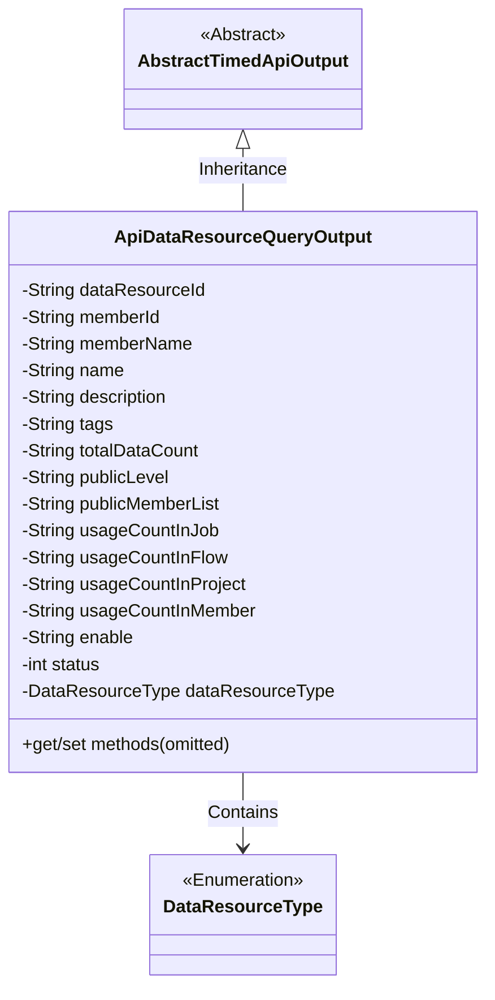

# Basic Information

|      |      |
|------|------|
| Name | ApiDataResourceQueryOutput |
| Language | .java |
| Code Path | WeFe/manager/manager-service/src/main/java/com/welab/wefe/manager/service/dto/dataresource/ApiDataResourceQueryOutput.java |
| Package Name | com.welab.wefe.manager.service.dto.dataresource |
| Dependencies | ['com.welab.wefe.common.web.dto.AbstractTimedApiOutput', 'com.welab.wefe.common.wefe.enums.DataResourceType'] |
| Brief Description | The ApiDataResourceQueryOutput class inherits from AbstractTimedApiOutput and includes attributes such as data resource ID, member information, name, description, tags, data volume, public level, usage statistics, and status. |

# Description

The `ApiDataResourceQueryOutput` class inherits from `AbstractTimedApiOutput` and includes attributes such as data resource ID, member ID, member name, name, description, tags, total data volume, public level, list of public members, usage count in jobs/flows/projects/members, enabled status, status code, and data resource type. All attributes are provided with corresponding getter and setter methods.

# Class Summary

| Name   | Type  | Description |
|-------|------|-------------|
| ApiDataResourceQueryOutput | class | The ApiDataResourceQueryOutput class inherits from AbstractTimedApiOutput and includes attributes such as data resource ID, member information, name, description, tags, data volume, public level, usage statistics, and their corresponding getter/setter methods. |

## Class ApiDataResourceQueryOutput

|      |      |
|------|------|
| Access Modifier | public |
| Type | class |
| Name | ApiDataResourceQueryOutput |
| Description | The ApiDataResourceQueryOutput class inherits from AbstractTimedApiOutput and includes attributes such as data resource ID, member information, name, description, tags, data volume, public level, usage statistics, and their corresponding getter/setter methods. |

### UML Class Diagram

This class diagram illustrates that the ApiDataResourceQueryOutput class inherits from the AbstractTimedApiOutput abstract class and contains a DataResourceType enumeration. The class primarily encapsulates various attributes for data resource query output, including basic properties like resource ID, member information, name and description, as well as business attributes such as usage statistics and public level. All fields are private and accessed through public getter/setter methods, complying with JavaBean specifications. The class structure clearly reflects the complete information model for data resource query results.

### Internal Method Call Graph

```mermaid
graph TD
    A["Class ApiDataResourceQueryOutput"]
    B["Inherits from: AbstractTimedApiOutput"]
    C["Property: String dataResourceId"]
    D["Property: String memberId"]
    E["Property: String memberName"]
    F["Property: String name"]
    G["Property: String description"]
    H["Property: String tags"]
    I["Property: String totalDataCount"]
    J["Property: String publicLevel"]
    K["Property: String publicMemberList"]
    L["Property: String usageCountInJob"]
    M["Property: String usageCountInFlow"]
    N["Property: String usageCountInProject"]
    O["Property: String usageCountInMember"]
    P["Property: String enable"]
    Q["Property: int status"]
    R["Property: DataResourceType dataResourceType"]
    S["Getter/Setter Methods Group"]

    A --> B
    A --> C
    A --> D
    A --> E
    A --> F
    A --> G
    A --> H
    A --> I
    A --> J
    A --> K
    A --> L
    A --> M
    A --> N
    A --> O
    A --> P
    A --> Q
    A --> R
    A -.-> S
    S -->|Corresponds to| C
    S -->|Corresponds to| D
    S -->|Corresponds to| E
    S -->|Corresponds to| F
    S -->|Corresponds to| G
    S -->|Corresponds to| H
    S -->|Corresponds to| I
    S -->|Corresponds to| J
    S -->|Corresponds to| K
    S -->|Corresponds to| L
    S -->|Corresponds to| M
    S -->|Corresponds to| N
    S -->|Corresponds to| O
    S -->|Corresponds to| P
    S -->|Corresponds to| Q
    S -->|Corresponds to| R
```

This flowchart illustrates the complete structure of the ApiDataResourceQueryOutput class, including its inheritance relationship, 16 property fields, and corresponding Getter/Setter methods group. As a data encapsulation class, it inherits basic functionality from AbstractTimedApiOutput and stores various metadata of data resource query results through multiple String-type properties, including identifiers, member information, usage statistics, and status. All properties are exposed through standard accessor methods.

### Field List

| Name  | Type  | Description |
|-------|-------|------|
| dataResourceType | DataResourceType | The variable for private data resource type is dataResourceType. |
| memberName | String | Declare a private string variable memberName. |
| description | String | Private string type variable description. |
| enable | String | Define a private string variable enable. |
| memberId | String | Member ID string variable |
| usageCountInProject | String | Usage count statistics field within the project |
| publicLevel | String | The private string variable publicLevel is used to store public level information. |
| totalDataCount | String | The private string variable totalDataCount is used to store the total data count. |
| dataResourceId | String | Declare a private string variable dataResourceId. |
| usageCountInJob | String | Private string variable, recording the usage count in the job. |
| usageCountInFlow | String | Private string variable used to record the number of usage times in the process. |
| publicMemberList | String | Private string variable publicMemberList. |
| status | int | The private integer variable `status` is used to store status information. |
| tags | String | The private string variable `tags` is used to store tag information. |
| name | String | Declare a private string variable named name. |
| usageCountInMember | String | Member usage count string variable |

### Method List

| Name  | Type  | Description |
|-------|-------|------|
| setName | void | The method for setting the object name assigns the input parameter `name` to the `name` property of the current object. |
| setMemberId | void | The method to set the member ID assigns the input string to the class's member variable `memberId`. |
| setUsageCountInFlow | void | Java Method: Set the usage count in the flow, with the parameter being of string type, assigned to the class variable usageCountInFlow. |
| setDataResourceType | void | The method for setting the data resource type assigns the input parameter to the class member variable `dataResourceType`. |
| getTotalDataCount | String | Methods to obtain the total data count, returning the totalDataCount value as a string type. |
| setUsageCountInProject | void | Set the public method for the number of uses within the project, with the parameter being of string type. |
| setTags | void | This is a Java method used to set the tags property value of an object. The method accepts a string parameter tags and assigns it to the tags field of the current object. |
| getDataResourceType | DataResourceType | Methods for obtaining data resource types, returns dataResourceType. |
| setUsageCountInMember | void | Set the public method for member usage count, with the parameter being of string type. |
| setUsageCountInJob | void | This is a Java method used to set the value of the usage count property in a job. The method accepts a string parameter and assigns it to the class's member variable `usageCountInJob`. |
| getPublicLevel | String | Public method to obtain the publicLevel value. |
| setPublicLevel | void | Method for setting the public level, which assigns the input string to the class's publicLevel variable. |
| getDataResourceId | String | Methods to obtain the data resource ID, returning the data resource ID as a string type. |
| getPublicMemberList | String | Method to obtain the public member list, returns the publicMemberList variable. |
| getEnable | String | The method returns the string value of the enable variable. |
| getUsageCountInProject | String | Get the string method for counting usage within a project. |
| getUsageCountInJob | String | Get the usage count string in the job. |
| getDescription | String | Methods to obtain descriptive information, returning a string-type description. |
| getMemberId | String | Methods to obtain member ID, returns a memberId of string type. |
| setPublicMemberList | void | The method to set the public member list assigns the input string to the class's publicMemberList variable. |
| setEnable | void | This is a Java method used to set the value of the member variable `enable`. The method takes a string parameter `enable` and assigns it to the `enable` property of the current object. |
| getUsageCountInFlow | String | Usage count in the acquisition process. |
| setDescription | void | The method for setting the object description assigns the input string to the object's description property. |
| setDataResourceId | void | The method to set the data resource ID assigns the parameter value to the class member variable `dataResourceId`. |
| getTags | String | The method returns the value of the tags variable, which is of type string. |
| getName | String | This is a Java method that returns the value of the string variable named `name`. |
| getUsageCountInMember | String | Get the member usage count string method. |
| setTotalDataCount | void | This is a Java method used to set the value of the totalDataCount variable. The method takes a string parameter totalDataCount and assigns it to the member variable of the same name in the class. |
| getMemberName | String | The method to obtain the member name directly returns the value of the member variable memberName. |
| setMemberName | void | Set the value of the member variable memberName. |
| getStatus | int | The method returns an integer status value, status. |
| setStatus | void | Methods for setting status values, assigning the input parameter `status` to the class's member variable `status`. |

